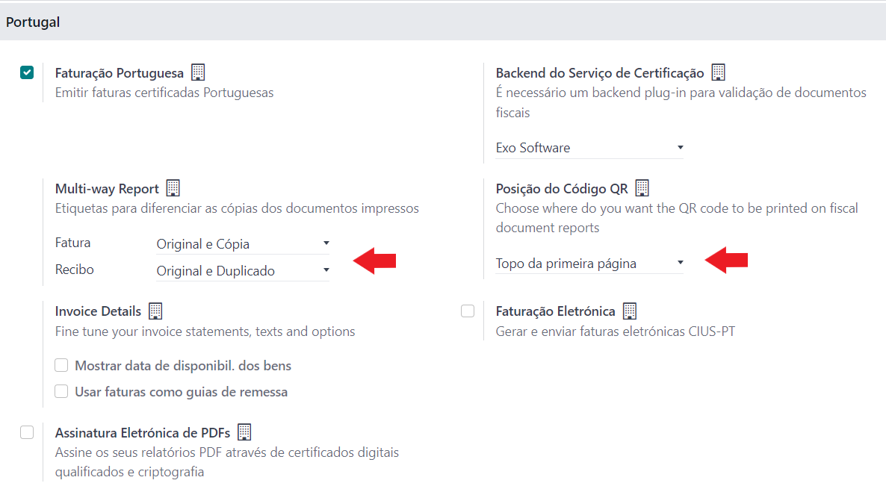
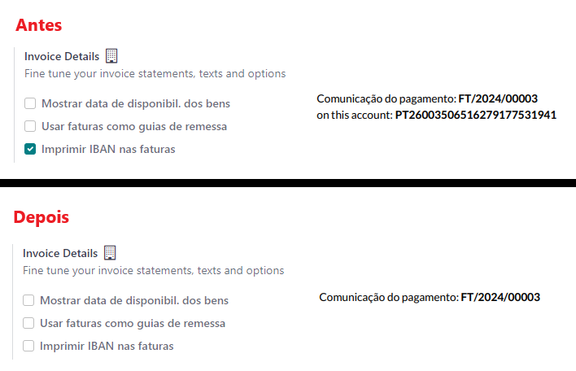

:show-content:

====================
Configuração inicial
====================

Estas configurações serão a base da sua utilização Odoo, é importante que estejam devidamente configuradas para que não
surjam problemas mais tarde.

Também poderá ver como ativar a Localização PT+ da Exo Software e algumas configurações rápidas das principais
ferramentas para que possa começar a trabalhar com o Odoo em Portugal.

.. raw:: html

    

        ─── ✦ ───
    

Informações da Empresa
======================

É importante que sejam inseridos os dados corretos na informação da empresa como:

- Nome
- Logo
- Morada completa
- NIF
- Moeda em que opera

.. danger::
    É fundamental que a moeda esteja corretamente selecionada antes da emissão dos primeiros documentos, depois de
    estarem emitidos não pode ser alterada

.. image:: initial_configuration/v17_companyDetails.png
   :align: center

.. note::
    Não é obrigatório que o nome da empresa seja o nome legal completo que vai aparecer nos documentos

    Terá a possibilidade de ter um cabeçalho personalizado, onde pode inserir esse nome completo

    Este nome é o nome pelo qual vai ficar identificado no seu sistema Odoo, é como se fosse um nome Odoo do contacto, e
    se eventualmente usar um sistema multi-empresa poder identificar a organização

Configuração de Cabeçalho e Rodapé dos documentos
-------------------------------------------------

.. important::
    Por defeito se o cabeçalho não for preenchido, o Odoo preenche o mesmo com o Logo, Nome e Morada da empresa

    Se o rodapé não for preenchido, por defeito o Odoo deixa em branco e só exibe o nº da página

Para alterar os valores pré-definidos, pode aceder à app **Configurações** e na secção **Empresas** selecione **Configure o layout do Documento**

Na janela que se abre pode fazer as alterações que achar convenientes em relação aos valores por defeito e guardar.

.. tip::
    Para ter espaçamento menor entre as linhas pode carregar em **Shift+Enter** em vez de só **Enter**

Como ativar a Localização PT+
=============================
A nossa localização está dividida em vários módulos para que seja o mais conveniente possível de utilizar, pelo que nos
deve indicar quais os conteúdos da mesma que pretende ter ao seu dispor.

Para ativar a nossa localização deve ir à app **Faturação / Contabilidade** (dependendo respetivamente se tem versão
Community ou Enterprise do Odoo), vá ao menu de **Configuração**, no separador Faturação / Contabilidade Deve procurar a
secção **Portugal**, ativar a opção **Faturação Portuguesa** e guardar.

.. image:: ../../applications/invoicing/fiscal_documents/v17_appInvoicingAccounting.png
   :align: center

A partir deste momento a Localização está ativa e vai começar a aplicar as restrições e verificações exigidas pela
Autoridade Tributária.

No entanto, ainda tem algumas verificações que deve fazer para que tudo fique a funcionar corretamente.

Dependendo do tipo de base de dados que está a usar (Testes ou Produção) deve ter atenção à opção **Backend do Serviço de Certificação**.
Se estiver numa base de dados de teste deve ter selecionada a opção **Testes**, se estiver numa base de dados de
**Produção** deve selecionar a opção **Exo Software**.

Em seguida deve selecionar a quantidade de documentos que deve ser emitida tanto a nível de faturas como de recibos, e a
nomenclatura que vai ser utilizada, as opções são as seguintes:

 - Original e Cópia
 - Original e Duplicado
 - Original, Duplicado e Triplicado

Nesta fase também pode já escolher se quer que o código QR fique no cabeçalho da primeira página ou no final do conteúdo da última página

Se utilizar a fatura como Guia de Remessa deve selecionar as opções que o permitem em **Detalhes da Fatura**.
Uma das opções disponibiliza a data em que os bens foram disponibilizados ao cliente (mesmo que não use Guia de Remessa
pode usar esta opção), a outra opção coloca os campos **Carga** e **Descarga**.

No caso de usar a fatura como guia de remessa pode ainda definir o local de carga padrão. Em seguida guardar novamente as alterações.

Uma última opção que tem para esta configuração de **Detalhes da Fatura** é escolher se quer ou não que o IBAN esteja
inserido na fatura.

.. note::
    Para que exista uma **Conta Bancária** em Odoo, é obrigatório esta ter um **Titular da Conta** associado.

    .. image:: initial_configuration/v17_bankAccount1.png
        :align: center

    Se a empresa em que está a trabalhar for titular de pelo menos uma conta, o Odoo vai de forma automática preencher
    todas as faturas a clientes com essa conta. Caso tenha várias vai predefinir a primeira conta da listagem que cumpra
    o requisito, mas pode documento a documento mudar essa conta no campo **Banco beneficiário** do separador **Outra Informação**

    .. image:: initial_configuration/v17_bankAccount2.png
        :align: center

    Caso este campo esteja preenchido a informação vão aparecer na fatura

    .. image:: initial_configuration/v17_bankAccount3.png
        :align: center

Alguns clientes não querem que esta informação apareça nas suas faturas (de todo ou nesta posição) pelo que
desenvolvemos uma solução que lhe permite (para cada empresa da sua base de dados) ocultar a linha com o IBAN, mesmo que
o campo **Banco beneficiário** esteja preenchido.

Em **Detalhes da Fatura**, por defeito a opção **Imprimir IBAN nas faturas** vai estar ativa para que apareça a mensagem
como é comportamento nativo do Odoo. No entanto, se retirar o visto da opção essa linha vai ser ocultada.

.. seealso::
    :doc:`Consulte as nossas FAQs sobre configuração <../../applications/faq/configuration>`

    :doc:`Consulte as nossas FAQs sobre a secção Detalhes da Fatura <../../applications/faq/invoice>`

Plano de Contas
===============

Atualmente a Localização PT+ disponibiliza 2 tipos de planos de contas:

- **Base**, que é o plano normal do SNC
- **Microentidades**, plano simplificado para microempresas

.. note::
    Pode personalizar o seu plano de contas depois de selecionar um dos planos disponíveis para melhor se adaptar ao seu caso específico

.. danger::
    É fundamental escolher corretamente o plano de contas correto a aplicar à empresa em específico antes da emissão dos primeiros documentos

.. seealso::
    :doc:`Veja em detalhe os planos de contas que estão disponíveis com a Localização PT+ <../../applications/accounting/coa>`

Configuração do utilizador
==========================

Para poder comunicar com a AT através de Odoo tem de inserir as credênciais de acesso. Para tal terá de aceder ao seu
utilizador Odoo e inserir os dados na aba **Portugal**

.. image:: ../../applications/invoicing/series_registration/v17_ATcredentials.png
   :align: center

Deve garantir que em Odoo o utilizador tem permissões para fazer as comunicações desejadas, mas também o login de acesso
na AT está atutorizado a fazer essas mesmas comunicações.

.. seealso::
    :ref:`Consulte as nossas FAQs sobre utilizadores na AT <faq_invoice_ATusers>`
