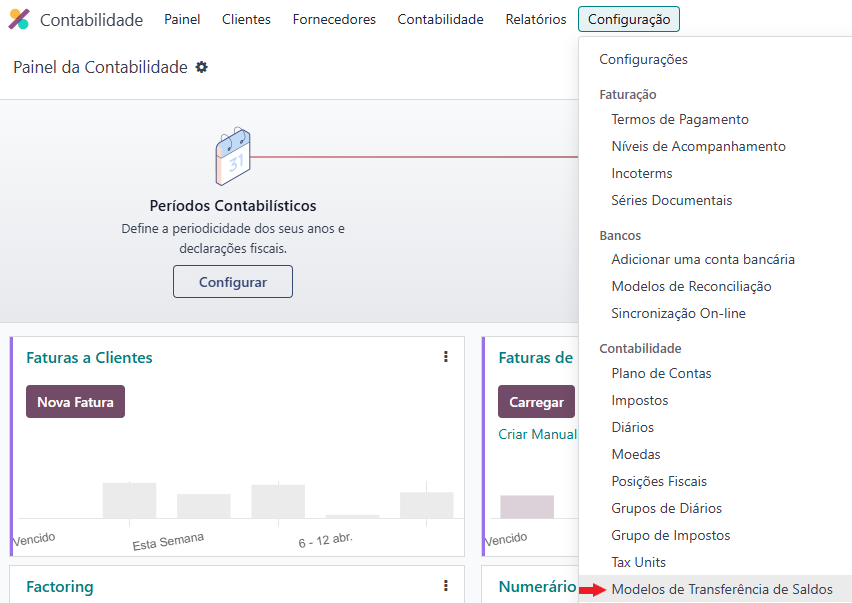
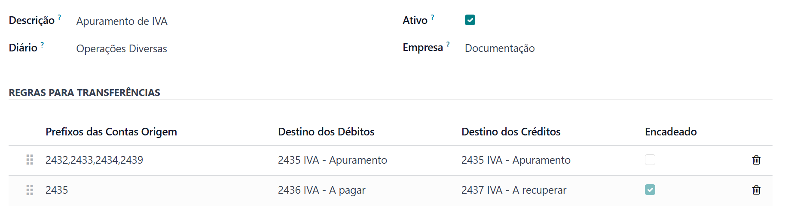
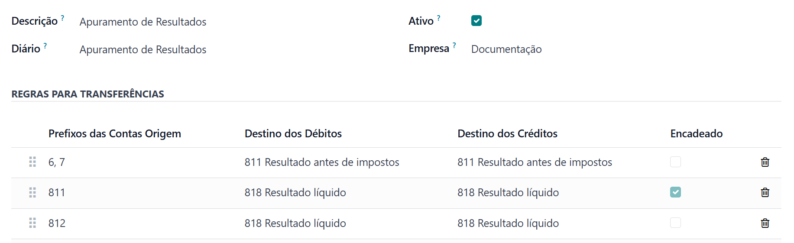
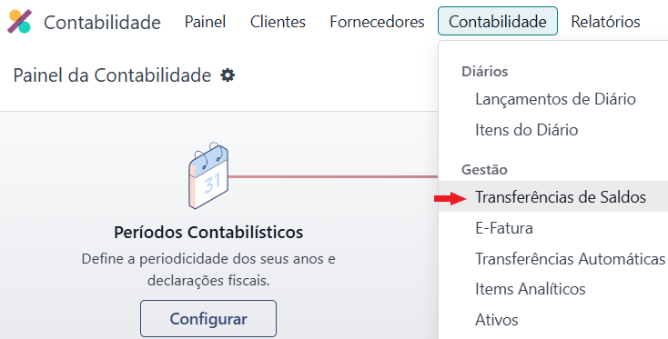
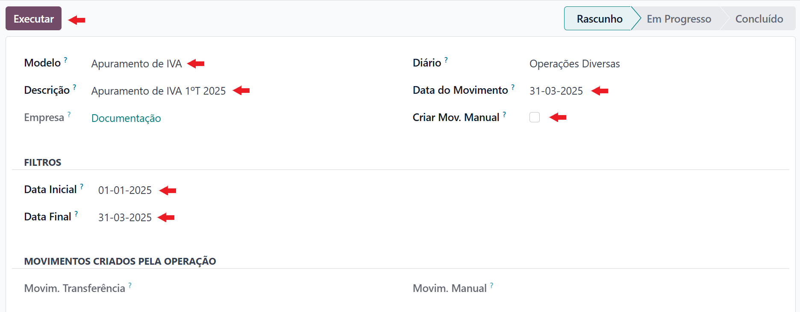
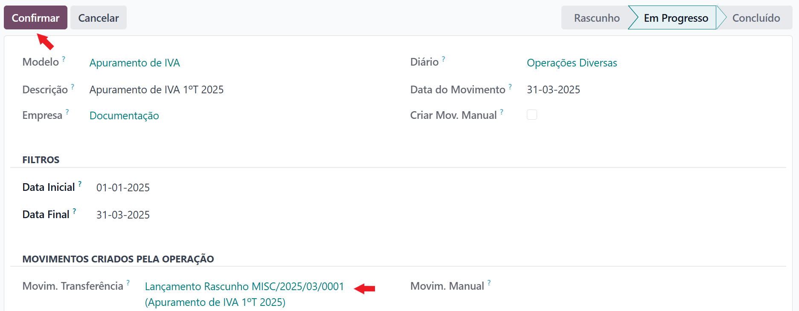

:show-content:

========================
Transferências de Saldos
========================
A **Exo Software** tem como parte da sua oferta de Localização uma ferramenta de Transferência de Saldos que complementa
a sua oferta de declarações

No entanto a mesma pode também ser usada para criar os seus próprios modelos para outros fins, desde que devidamente
configurada

A ferramenta está dividida em duas partes:

- Modelos de Transferência de Saldos
- Utilização dos Modelos

.. raw:: html

    

        ─── ✦ ───
    

Modelos de Transferência de Saldos
==================================
Como parte da sua oferta a **Exo Software** oferece dois tipos de modelos para utilização, para ter acesso aos mesmos
aceda à app de **Faturação / Contabilidade** (dependendo respetivamente se tem versão Community ou Enterprise do Odoo),
vá ao menu :menuselection:`Configuração --> Contabilidade --> Modelos de Transferência de Saldos`

.. image:: ../invoicing/fiscal_documents/v17_appInvoicingAccounting.png
   :align: center

Apuramento de IVA
-----------------
Depois de fazer as suas declarações de IVA, pode usar este modelo para fazer os movimentos de transferências dos saldos
das diversas contas de IVA para as contas de **IVA - A pagar** ou **IVA - A recuperar**

.. note::
    A conta **2437** não faz parte dos **Prefixos das Contas Origem**, porque apenas está movimentar saldos de um
    determinado período e não dos períodos anteriores

    Se pretender movimentar essa conta, pode fazer um movimento manual quando necessário, ou acrescentar os seus
    próprios modelos posteriores a este

.. tip::
    Pode utilizar um diário específico para este tipo de movimentos e os manter separados de outros, ou pode usar o seu
    diário geral de Operações diversas

    Configurações recomendadas:

    - Tipo de Diário: **Diversos**
    - Tipo de Transações: **Normal**
    - Código Curto: o que desejar mas está limitado a 5 caracteres

    .. image:: balance_transfer/v17_configTransferModels03.png
       :align: center

Apuramento de Resultados
------------------------
No fecho de ano, pode usar este modelo para fazer a transferência de saldos das contas de Proveitos e Custos para as
contas de Resultados

.. tip::
    Deve utilizar um diário específico para este tipo de movimentos com as seguintes configurações:

    - Tipo de Diário: **Diversos**
    - Tipo de Transações: **Apuramento de Resultados**
    - Código Curto: o que desejar mas está limitado a 5 caracteres

    .. image:: balance_transfer/v17_configTransferModels05.png
       :align: center

Modelos Personalizados
----------------------
Além da oferta **Exo Software** pode usar esta ferramenta para criar os seus próprios modelos de transferências de
saldos, mas para uma correta utilização tenha em atenção às configurações

**Prefixos das Contas Origem**, todas as contas que se iniciem por estes dígitos serão contabilizadas, no caso de serem
vários prefixos os mesmos devem ser separados por vírgula

**Destino dos Débitos** e **Destino dos Créditos**, em cada linha é calculado o saldo de cada conta para o período em
questão, esse saldo dependendo da natureza é depois levado à conta que aqui ficar definida. É seguida a seguinte lógica:

- cada conta abrangida pelos prefixos, vai ter o seu saldo do período analisado e gerar uma linha no movimento
- será criada uma linha de contrapartida pelo valor agregado de débitos e créditos na conta de destino correta pelo saldo de todas as contas analisadas

**Encadeado**, quando esta opção estiver selecionada, em vez de utilizar os valores efetivamente registados nas contas
para o período em questão, serão utilizados os saldos calculados nas linhas anteriores. Se a opção não estiver
selecionada serão novamente calculados os valores com base nos movimentos do período

Como Utilizar
=============
Para utilizar os modelos existentes ou os que tenha criado, deve aceder à app de **Faturação / Contabilidade**
(dependendo respetivamente se tem versão Community ou Enterprise do Odoo), vá ao menu :menuselection:`Contabilidade --> Gestão --> Transferência de Saldos`
e carregar no botão **Novo**

.. image:: ../invoicing/fiscal_documents/v17_appInvoicingAccounting.png
   :align: center

- Selecione o **Modelo** que pretende usar
- No campo **Descrição** é recomendado que acrescente o período da transferência
- **Data do Movimento** será a data em que este movimento vai ser registado na contabilidade
- **Criar Mov. Manual**, apenas deve selecionar esta opção se quiser que um movimento vazio seja criado para poder fazer o lançamento manual que pretender
- **Data Inicial** e **Data Final**, todos os movimentos registados nas contas dentro deste período serão contabilizados para o efeito

Carregue no botão **Executar** para ser criado um lançamento em rascunho com os movimentos configurados no modelo para o
período escolhido

Se pretender verificar os dados do lançamento, siga mesmo
Se pretender apenas publicar carregue no botão confirmar

.. note::
    Caso detete algum erro, pode cancelar o movimento, reverter o mesmo a rascunho e reiniciar o processo
