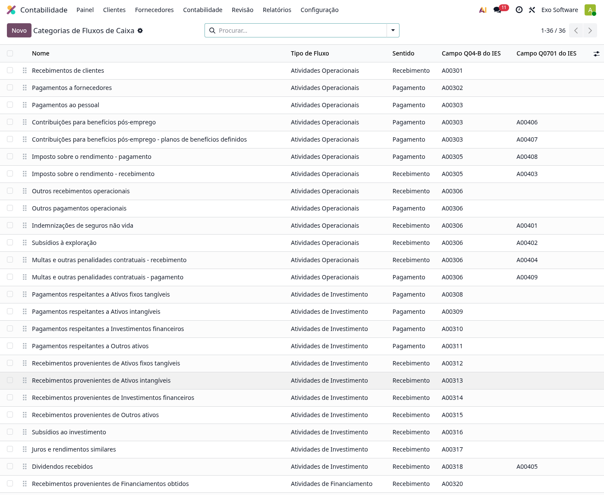
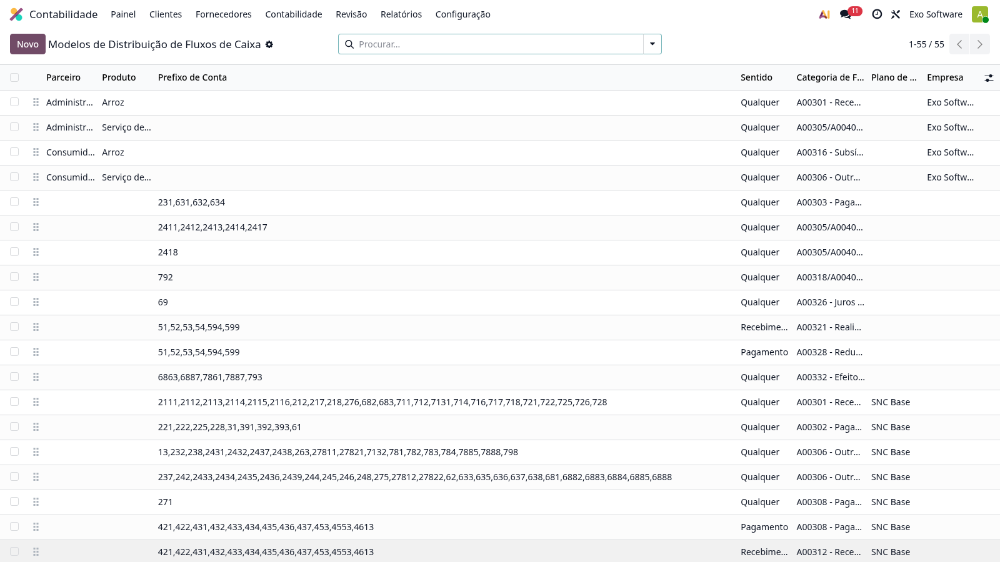
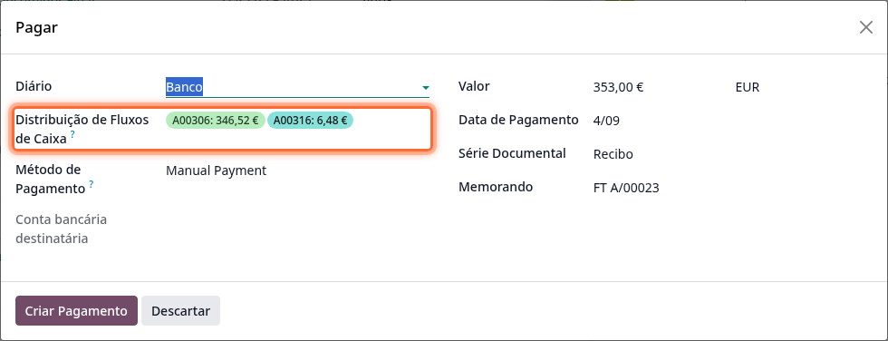
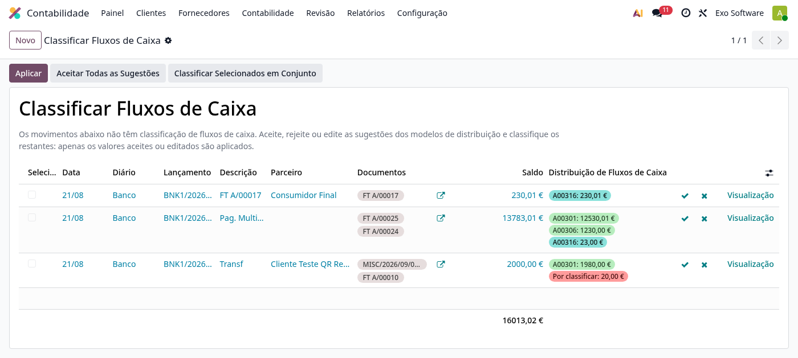
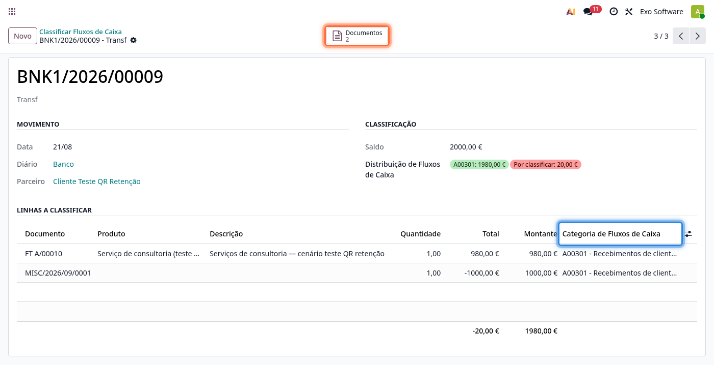
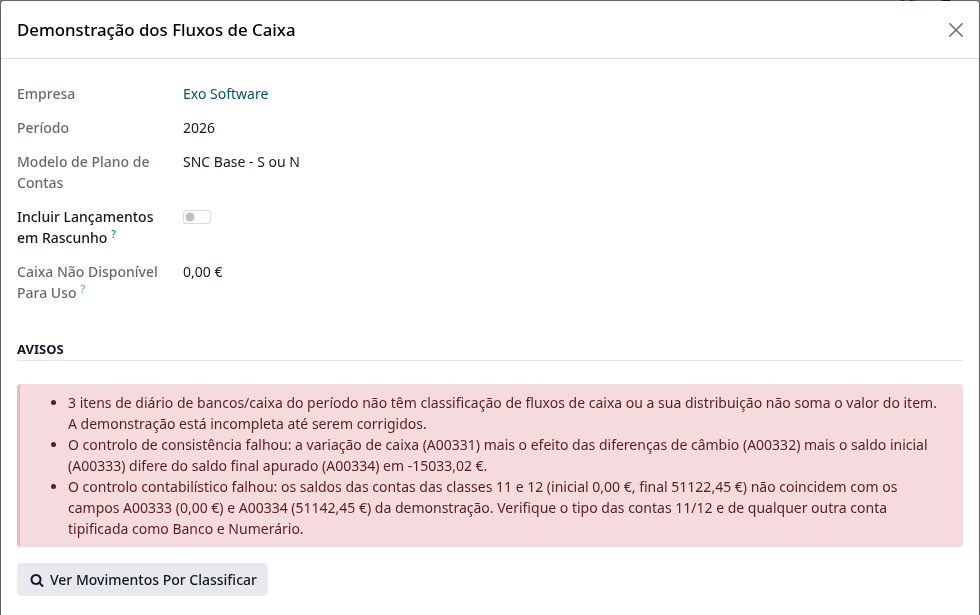
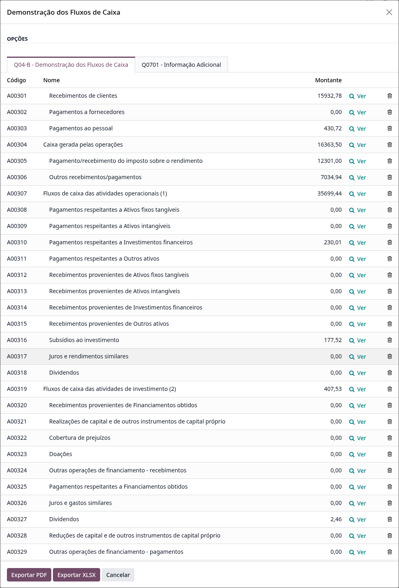
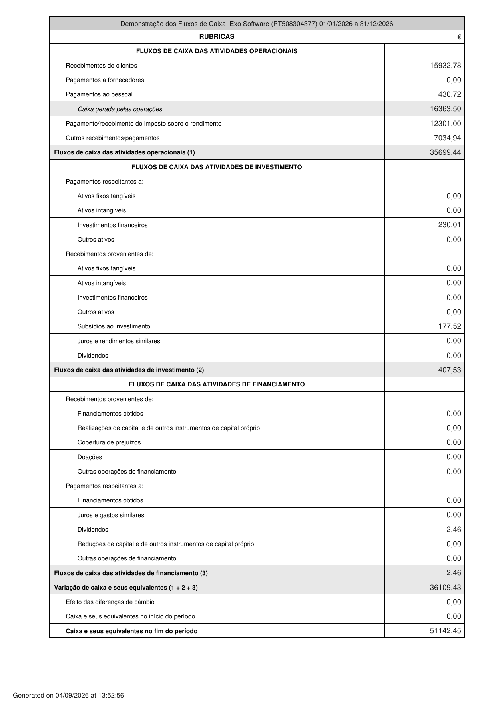

:show-content:

===============
Fluxos de Caixa
===============
A localização da **Exo Software** permite classificar os movimentos de bancos e caixa pelas categorias de
fluxos de caixa e obter a **Demonstração dos Fluxos de Caixa** (os quadros **04-B** e **07-01** do Anexo A
da IES), com exportação em PDF e XLSX

A classificação é feita com valores exatos, pelo que um único movimento bancário pode ser repartido por
várias categorias, e é sugerida automaticamente por modelos de distribuição configuráveis

.. raw:: html

    

        ─── ✦ ───
    

Configuração
============

Permissões
----------
Os ecrãs de classificação são visíveis aos utilizadores do grupo **Classificação de Fluxos de Caixa**. O
grupo é atribuído automaticamente a quem tem o acesso contabilístico de base (no Odoo Enterprise, o nível
**Faturação e Bancos**); a qualquer outro utilizador pode ser atribuído manualmente na ficha de utilizador,
no separador **Permissões de Acesso**

Categorias de Fluxos de Caixa
-----------------------------
As categorias correspondem às rubricas dos quadros 04-B e 07-01 do Anexo A da IES e vêm pré-configuradas
com o módulo. Para as consultar, aceda à app de **Faturação / Contabilidade** (dependendo respetivamente se
tem versão Community ou Enterprise do Odoo) e vá ao menu
:menuselection:`Configuração --> Contabilidade --> Categorias de Fluxos de Caixa`

Cada categoria tem um tipo de fluxo (atividades operacionais, de investimento ou de financiamento), um
sentido (recebimento ou pagamento) e os campos do Anexo A que alimenta

Modelos de Distribuição de Fluxos de Caixa
------------------------------------------
Os modelos de distribuição sugerem a categoria de cada movimento, à semelhança dos modelos de distribuição
analítica: uma regra aplica-se por parceiro, produto e/ou prefixo de conta, opcionalmente restrita a um
sentido (recebimento ou pagamento), e a regra mais específica ganha. Encontra-os no menu
:menuselection:`Configuração --> Contabilidade --> Modelos de Distribuição de Fluxos de Caixa`

O módulo traz um conjunto de regras de raiz por plano de contas (um para o SNC Base e outro para o SNC
Microentidades, com as regras comuns partilhadas), validado pelo departamento de contabilidade; cada
conjunto só se aplica às empresas no respetivo plano

.. tip::
    As regras criadas pelo utilizador têm precedência sobre as regras de raiz, e entre regras de contas
    ganha o prefixo de conta mais específico (uma regra sobre a conta 2418 ganha a uma regra sobre a 24).
    As regras de raiz podem ser editadas ou arquivadas

Utilização
==========

Classificar os movimentos
-------------------------
A classificação acompanha o dia a dia, sem passos adicionais:

- **Ao registar um pagamento**, o campo :guilabel:`Distribuição de Fluxos de Caixa` vem pré-preenchido com
  a sugestão dos modelos, calculada a partir das linhas das faturas a pagar; pode ser ajustado antes de
  criar o pagamento

- **Ao reconciliar uma transação bancária** com faturas, pagamentos ou outros lançamentos, a classificação
  é aplicada automaticamente quando os modelos mapeiam as linhas dos documentos liquidados: cada documento
  pesa pelo valor que a reconciliação lhe atribuiu

- **Ao lançar diretamente numa conta mapeada** (comissões bancárias, impostos, movimentos de empréstimos),
  o movimento é classificado na publicação do lançamento

.. note::
    A sugestão comporta-se como um valor por defeito: um valor introduzido pelo utilizador nunca é
    substituído automaticamente

Os movimentos de bancos e caixa por classificar são assinalados nos próprios documentos e podem ser
consultados a qualquer momento a partir dos avisos da demonstração (ver abaixo)

Classificar movimentos do passado
---------------------------------
Para classificar em bloco os movimentos do passado (por exemplo, logo após a instalação do módulo), use o
menu :menuselection:`Revisão --> Controlar --> Classificar Fluxos de Caixa`: o assistente abre com todos os
movimentos por classificar, sugere a distribuição dos modelos onde algo mapeia e mostra os documentos por
detrás de cada movimento

As sugestões têm de ser aceites (movimento a movimento, com o visto, ou todas de uma vez com
:guilabel:`Aceitar Todas as Sugestões`), podem ser rejeitadas com a cruz, e qualquer distribuição pode ser
editada diretamente. :guilabel:`Aplicar` escreve apenas os valores aceites ou editados, deixando os
restantes por classificar

No detalhe de cada movimento, cada linha dos documentos liquidados (ou a contrapartida direta do próprio
lançamento, quando o movimento foi lançado diretamente numa conta) pode ser classificada individualmente:
a distribuição do movimento passa a ser a soma por categoria das linhas classificadas. O botão
:guilabel:`Documentos` abre os documentos por detrás do movimento

.. tip::
    Para classificar vários movimentos em conjunto, selecione-os na lista e use
    :guilabel:`Classificar Selecionados em Conjunto`: os movimentos fundem-se numa única linha, classificada
    linha a linha no detalhe, e ao aplicar cada movimento recebe a soma das suas próprias linhas

O mesmo assistente pode ser aberto para um único movimento a partir dos itens de diário por classificar

Demonstração dos Fluxos de Caixa
================================
A demonstração está disponível no menu
:menuselection:`Relatórios --> Portugal --> Financeiros --> Demonstração dos Fluxos de Caixa`: escolha o
período e clique em :guilabel:`Calcular`

Antes de exportar, reveja os avisos:

- movimentos de bancos/caixa do período ainda **por classificar** (o botão
  :guilabel:`Ver Movimentos Por Classificar` abre-os diretamente);
- o **controlo de consistência**, que confronta a variação de caixa apurada com os saldos inicial e final da
  demonstração;
- o **controlo contabilístico**, que confronta os saldos das contas das classes 11 e 12 com os campos de
  caixa da demonstração

Os valores calculados podem ser analisados linha a linha nos separadores **Q04-B** e **Q0701**, com
navegação direta para os itens de diário que compõem cada rubrica através do botão :guilabel:`Ver`

.. note::
    As linhas do quadro Q0701 (informação adicional) são editáveis no ecrã de análise, para corrigir
    diretamente qualquer valor antes de exportar

Por fim, exporte com :guilabel:`Exportar PDF` ou :guilabel:`Exportar XLSX`. O PDF preenche o modelo oficial
dos quadros 04-B e 07-01, com a data de criação no rodapé

