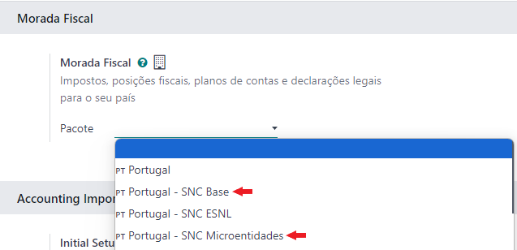
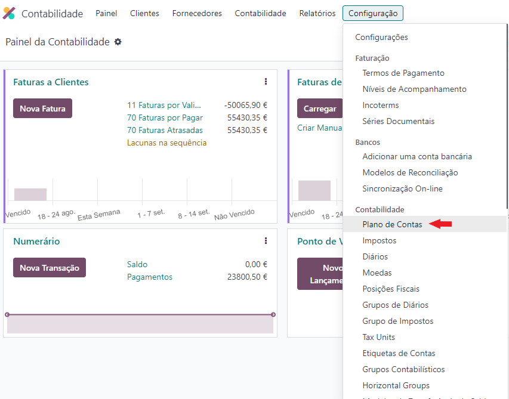
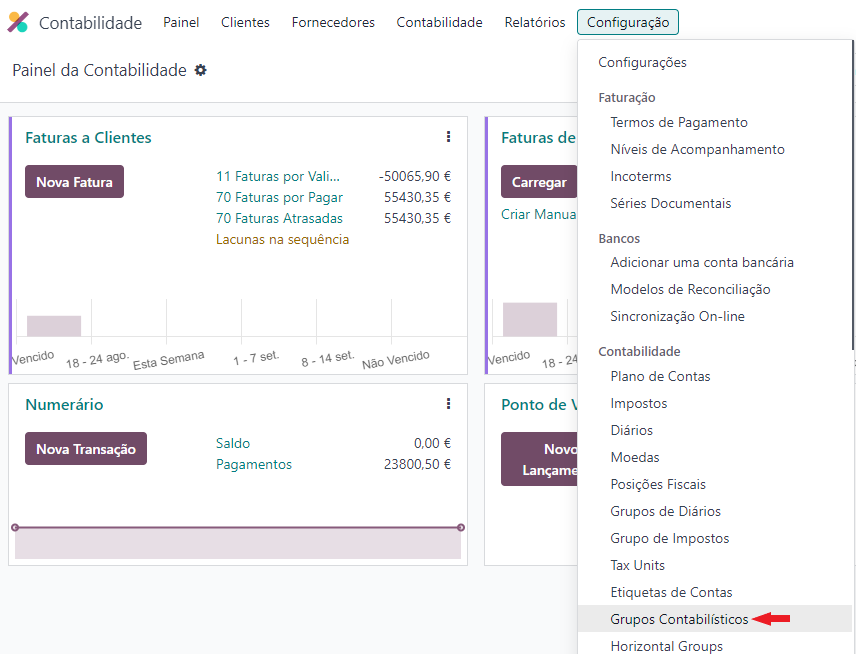

:nosearch:

====================
Planos de Contas SNC
====================
O plano de localização fiscal insere no Odoo dados fundamentais para o seu funcionamento com as regras em vigor no país
nomeadamente:

- Impostos
- Posições fiscais
- Plano de contas
- Relatórios legais

De entre os tópicos acima o que mais varia é o Plano de Contas, fique a conhecer os planos que a Exo Software tem para
oferecer

.. raw:: html

    

        ─── ✦ ───
    

.. danger::
    Depois de selecionar um pacote de localização fiscal e gravar a configuração, não vai poder alterar.

    É fundamental escolher corretamente o plano de contas correto a aplicar à empresa antes da emissão dos primeiros
    documentos fiscais e contabilísticos.

Para selecionar o pacote de **Localização Fiscal** que pretende utilizar aceda à app **Faturação / Contabilidade**
(dependendo respetivamente se tem versão Community ou Enterprise do Odoo), vá ao menu de **Configuração** e selecione a
opção **Configurações**.

.. image:: ../invoicing/fiscal_documents/v17_appInvoicingAccounting.png
   :align: center

Na secção **Localização Fiscal** vai poder selecionar qual é o pacote de localização contabilística que pretende usar.

Atualmente a Localização PT+ disponibiliza 2 tipos de planos de contas:

- **Base**, que é o plano normal do SNC
- **Microentidades**, plano simplificado para microempresas

.. seealso::
    `Legislação do SNC <https://www.cnc.min-financas.pt/snc.html>`_

    `Definição de Micro empresa <https://diariodarepublica.pt/dr/lexionario/termo/micro-empresa>`_

    `Legislação do NCM <https://www.cnc.min-financas.pt/ncm.html>`_

Se depois quiser fazer altereções ao plano de contas pode na app **Faturação / Contabilidade**(dependendo respetivamente
se tem versão Community ou Enterprise do Odoo) aceder ao menu :menuselection:`Configuração --> Contabilidade --> Plano de Contas`
ou ao menu :menuselection:`Configuração --> Contabilidade --> Grupos Contabilísticos`

.. tip::
    Em Odoo é feita a distinção entre **Grupo Contabilístico** e **Conta contabilística**

    A **Conta contabilística** é o local onde os movimentos vão ser efetivamente registados

    O **Grupo Contabilístico** é apenas um agregador que permite uma melhor visualização e filtragem de contas em
    diversos mapas

.. seealso::
    `Saiba mais sobre Planos de Contas em Odoo <https://www.odoo.com/documentation/17.0/pt_BR/applications/finance/accounting/get_started/chart_of_accounts.html>`_
