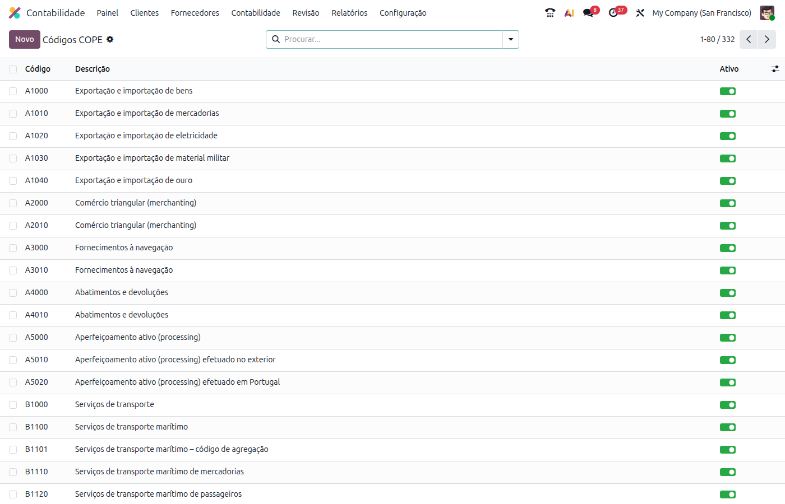
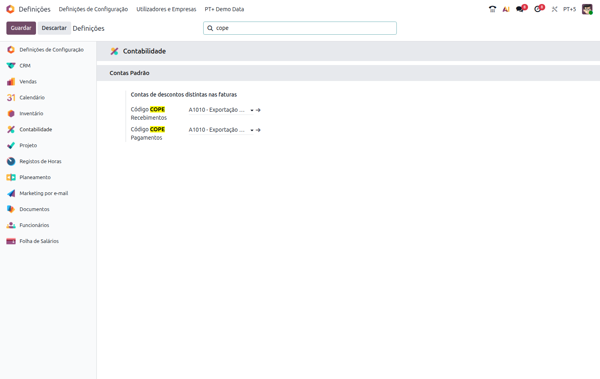
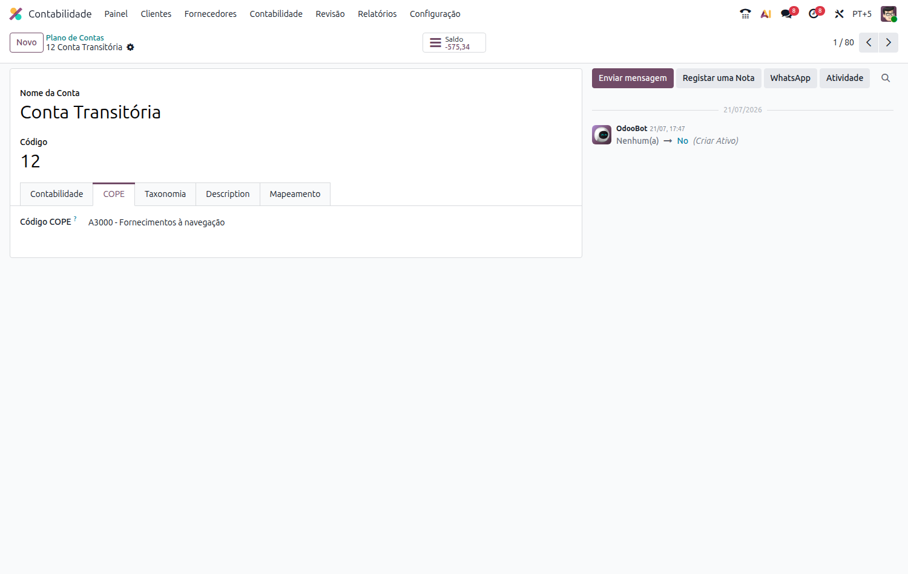
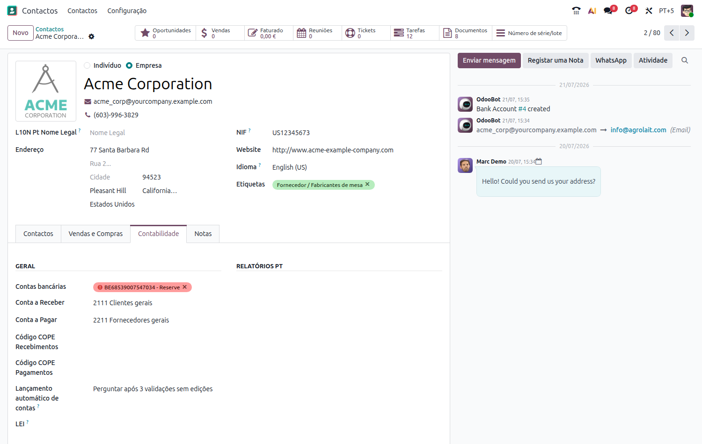
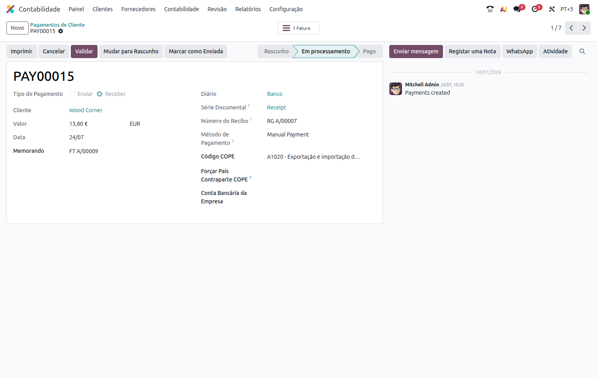
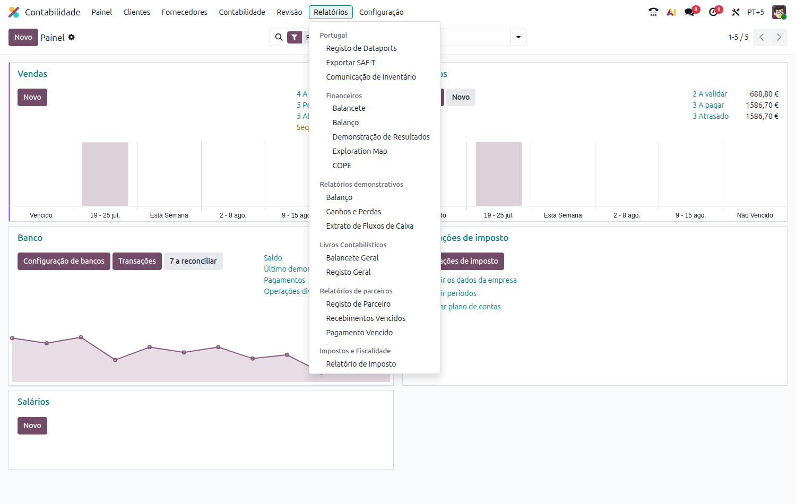
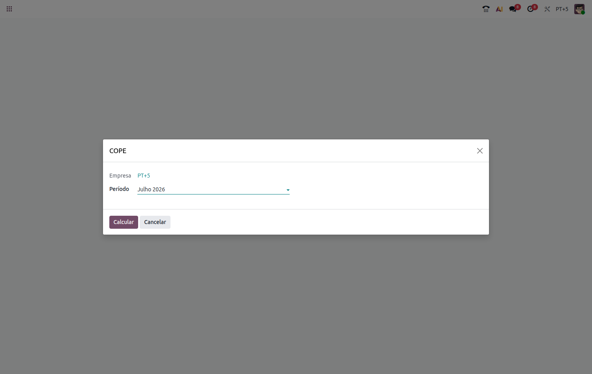
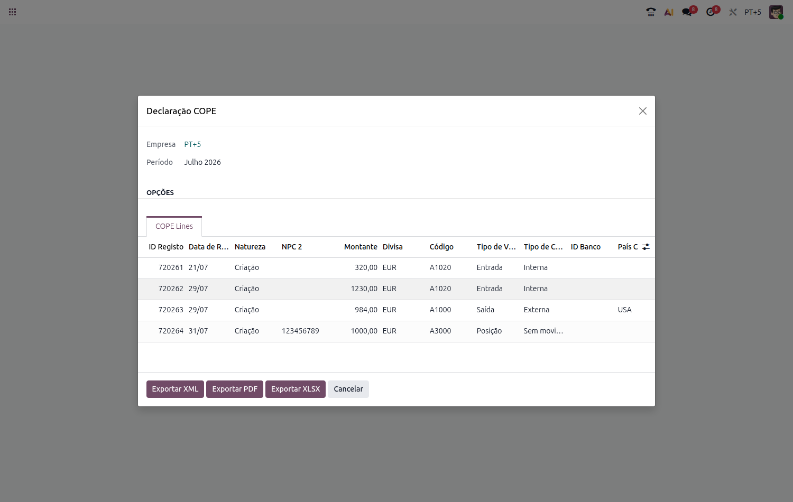
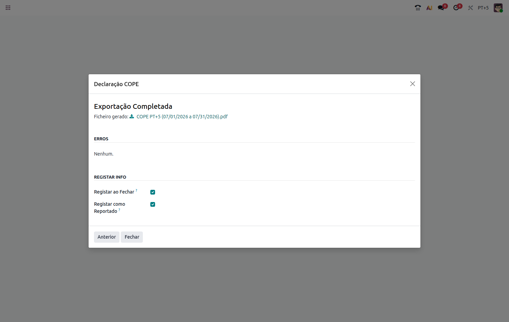

:nosearch:

==============
Relatório COPE
==============
O COPE (Comunicação de Operações com o Exterior) é a declaração estatística que reporta ao Banco de
Portugal os movimentos financeiros e comerciais realizados com o exterior. Veja como configurar e gerar
esta declaração diretamente a partir do Odoo com a **Localização PT+**.

.. raw:: html

    

        ─── ✦ ───
    

.. important::
    Esta funcionalidade não está disponível na loja Odoo. Para ter acesso à mesma,
    terá de solicitar a sua instalação e ativação à **Exo Software**.

.. important::
    O Relatório COPE só está disponível quando a empresa ativa é uma empresa portuguesa. Se tentar
    aceder a esta funcionalidade com uma empresa de outro país ativa, vai ver o aviso **"Tem que estar
    a operar uma empresa portuguesa para usar esta funcionalidade"**.

Configuração
============
Instale o módulo dedicado **Portugal - COPE Report**. Depois de instalado, vai ter acesso a vários pontos
de configuração espalhados pela ficha da empresa, das contas, dos parceiros e dos pagamentos.

Códigos COPE
------------
O módulo já vem com a tabela oficial de códigos estatísticos do Banco de Portugal pré-carregada. Pode
consultá-la e, se necessário, criar novos códigos em :menuselection:`Contabilidade --> Configuração -->
Contabilidade --> Códigos COPE`

Código COPE por defeito da empresa
-----------------------------------
Nas **Definições** de Contabilidade pode definir um Código COPE por defeito para os recebimentos e para
os pagamentos da empresa, que é usado sempre que não exista um código mais específico definido no
parceiro ou no pagamento

Código COPE nas contas
-----------------------
Contas do plano de contas que representem posições (saldos) a reportar no COPE — por exemplo contas de
ativos ou passivos financeiros no estrangeiro — podem ter um **Código COPE** associado, no separador
**COPE** da própria conta. Sempre que essa conta tiver um saldo diferente de zero na data de referência,
é gerada automaticamente uma linha de posição ("P") na declaração

Código COPE nos parceiros
---------------------------
Na ficha de um parceiro, no separador **Contabilidade**, pode definir um **Código COPE Recebimentos** e
um **Código COPE Pagamentos** específicos para esse parceiro, que têm prioridade sobre os códigos por
defeito da empresa

Código COPE nos pagamentos
-----------------------------
Em cada pagamento é possível ajustar o **Código COPE** para essa operação em concreto, bem como
**Forçar País Contraparte COPE** quando o país a reportar não deva ser deduzido automaticamente a partir
do parceiro ou do banco associado ao pagamento. Para operações cujo código estatístico o exija (por
exemplo títulos, imóveis, factoring, viagens ou transporte aéreo), fica ainda disponível o campo
**País Ativo COPE**

Utilização
==========
Para gerar a declaração, aceda à app **Faturação / Contabilidade** (dependendo respetivamente se tem
versão Community ou Enterprise do Odoo) e vá ao menu :menuselection:`Relatórios --> Portugal -->
Financeiros --> COPE`

No assistente que se abre, confirme a **Empresa** e selecione o **Período** pretendido — um dos últimos
meses sugeridos ou **Personalizado** para definir manualmente a **Data Inicial** e a **Data Final**

Selecione **Calcular** para que sejam apuradas as linhas da declaração relativas a esse período: operações
de pagamentos e recebimentos com parceiros não residentes, saldos de parceiros não residentes e saldos de
contas com Código COPE associado

.. tip::
    Pode usar o botão **View** de cada linha para consultar o movimento contabilístico de onde a mesma
    é originada

Validados os valores, escolha o formato de saída pretendido: **Exportar XML** para submissão junto do
Banco de Portugal, **Exportar PDF** para um resumo em formato de documento, ou **Exportar XLSX** para uma
folha de cálculo com todas as linhas

Terminada a exportação, tem acesso ao ficheiro gerado e pode ainda optar por **Registar ao Fechar** e
**Registar como Reportado**, para que a declaração fique associada ao Dataport da empresa e marcada como
já comunicada ao Banco de Portugal
