:show-content:

========
e-Fatura
========
O e-Fatura é uma funcionalidade da Autoridade Tributária Portuguesa usada por todos os negócios, no entanto sendo o Odoo
um ERP, o controlo de gestão não pode ser esquecido.

Com essa abordagem em mente, a **Exo Software** desenvolveu uma ferramenta que o ajuda no controlo das suas faturas de
fornecedores, para que não se esqueça de fazer o devido registo em Odoo e garantir que o Odoo reflete a sua realidade, o
ajuda no controlo de fluxos financeiros e tomada de decisões.

.. raw:: html

    

        ─── ✦ ───
    

.. note::
    Esta ferramenta permite-lhe importar ou sincronizar no seu Odoo os dados que os seus fornecedores declaram à AT,
    dessa forma se for declarado algo que não registou no Odoo, fica logo a saber.

.. important::
    Esta funcionalidade do **e-Fatura** não está disponível na loja Odoo, para ter acesso terá de pedir aos nossos
    serviços que façam a sua instalação e ativação na sua base de dados

    Depois pode começar a seguir os passos que se seguem para proceder à configuração e utilização

Configuração do Utilizador
==========================
Para poder comunicar com a AT através de Odoo tem de inserir as credênciais de acesso. Para tal terá de aceder ao seu
utilizador Odoo e inserir os dados na aba **Portugal**

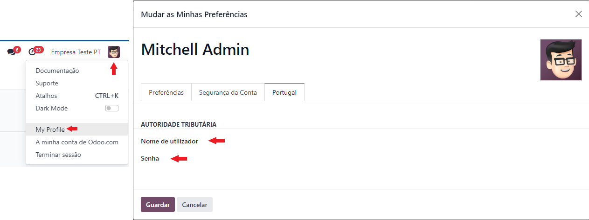

Configurações
=============
Tenha já criado um **diário** do tipo **Compras** bem como **todos os impostos base** necessários através da escolha de
um plano de contas

Aceda à app **Faturação / Contabilidade** (dependendo respetivamente se tem versão Community ou Enterprise do Odoo), vá
ao menu :menuselection:`Configuração --> Configurações`

.. image:: ../invoicing/fiscal_documents/v17_appInvoicingAccounting.png
   :align: center

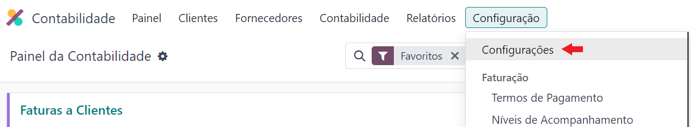

Procure a secção **Portugal** e configure os campos relativos ao E-Fatura:

- O :guilabel:`Diário` de compras que criou
- Ative a opção :guilabel:`Leitura E-Fatura`, que lhe vai permitir fazer scan dos códigos QR das faturas e criar as
  mesmas
- Use o botão :guilabel:`Configurar Mapeamentos` para definir que imposto e que artigo o Odoo aplica a cada imposto que
  a AT reporta — ver :ref:`efatura-mapeamento-impostos`

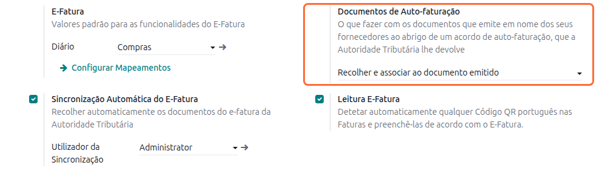

.. important::
    Verifique que configurações tem para o OCR Odoo, o nosso leitor de código QR **Ler QR** é gratuíto, no entanto o OCR
    do Odoo **Digitalizar Documento** não o é e cobra um créditos por utilização

    Na eventualidade de ter os 2 ativos, primeiro é usado o OCR do Odoo e só em seguida o leitor de código QR da Exo
    Software.

.. _efatura-mapeamento-impostos:

Mapeamento de impostos do E-Fatura
----------------------------------
A AT não reporta o imposto do seu plano de contas — reporta as características do imposto que o seu fornecedor
declarou. A tabela de **Mapeamento de Impostos E-Fatura** é onde diz ao Odoo, uma vez só, o que fazer com cada
combinação dessas características: que **imposto** aplicar e com que **artigo** criar a linha da fatura de fornecedor.

Chega lá pelo botão :guilabel:`Configurar Mapeamentos` das configurações, ou pelo menu
:menuselection:`Configuração --> Mapeamento de Impostos E-Fatura`

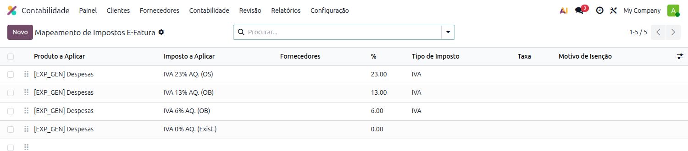

Cada linha da tabela tem duas metades: os **valores a aplicar** e os **critérios** pelos quais é escolhida

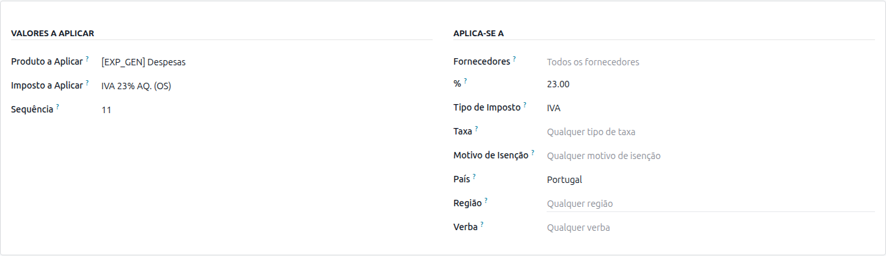

.. list-table::
   :header-rows: 1
   :widths: 30 70

   * - Critério
     - O que a AT reporta
   * - **%**
     - A taxa do imposto. Escreva-a como número — ``23``, ``23.0`` ou ``23,00`` são equivalentes
   * - **Tipo de Imposto**
     - Se a linha é de IVA, de Imposto do Selo ou Não Sujeita
   * - **Taxa**
     - O tipo de taxa: isenta, reduzida, intermédia ou normal
   * - **Motivo de Isenção**
     - O código da isenção, de M01 a M99, quando existe
   * - **País** e **Região**
     - O espaço fiscal do imposto: Continente, Açores ou Madeira
   * - **Verba**
     - Para o IVA repete o tipo de taxa; para o Imposto do Selo é a verba, por exemplo ``17.3.4``

.. important::
    **Um critério deixado em branco corresponde a qualquer valor.** É isto que lhe permite ter um mapeamento genérico:
    por exemplo, deixar a :guilabel:`%` vazia faz o mapeamento servir todas as taxas do tipo de imposto indicado.

    Quanto menos critérios preencher, mais situações o mapeamento cobre.

Se mais do que um mapeamento corresponder à mesma linha, **aplica-se o primeiro a contar do topo da tabela**. Use o
manípulo à esquerda para arrastar um mapeamento para cima e lhe dar prioridade.

.. tip::
    Pode restringir um mapeamento a **fornecedores** específicos no campo :guilabel:`Fornecedores`. Um mapeamento assim
    nasce no topo da tabela, para que se aplique antes dos genéricos, mas continua a ser a ordem da tabela a decidir —
    se o arrastar para baixo de um genérico, passa a ser o genérico a aplicar-se.

    Na ficha do fornecedor tem um botão :guilabel:`Configurar Mapeamentos` que abre a tabela já filtrada por esse
    fornecedor.

O :guilabel:`Produto a Aplicar` e o :guilabel:`Imposto a Aplicar` são ambos opcionais. Se os deixar vazios, a linha da
fatura de fornecedor é criada sem artigo e sem imposto, com o **valor total** que a AT reportou para essa linha — assim
o total da fatura continua igual ao do documento do E-Fatura e completa depois a informação que faltar.

Numa empresa portuguesa a tabela já vem preenchida com quatro mapeamentos para as taxas de IVA do Continente — 23%, 13%,
6% e 0% — assentes no artigo genérico de despesas. Acrescente os que a sua atividade justificar.

Mapeamento genérico para tudo o resto
"""""""""""""""""""""""""""""""""""""
Se não quiser configurar caso a caso, pode deixar **uma linha totalmente vazia no fundo da tabela**: sem critérios
preenchidos corresponde a qualquer imposto, e sem artigo nem imposto a aplicar serve de rede para tudo o que os
mapeamentos acima não apanharem.

.. warning::
    É a opção menos precisa e tem duas consequências que deve conhecer antes de a adotar:

    - As faturas criadas a partir dessas linhas ficam **sem artigo e sem imposto**, com o valor total na base. Os
      totais batem com o E-Fatura, mas a classificação contabilística e o IVA dedutível ficam por fazer à mão em cada
      documento;
    - Como nunca fica nada sem mapeamento, **o aviso de mapeamento em falta deixa de aparecer**. Perde o alerta que lhe
      indicaria precisamente quais os impostos que ainda lhe faltam configurar (ver
      :ref:`efatura-mapeamento-em-falta`).

    Mantenha-a sempre em **último lugar** na tabela, para que os mapeamentos preenchidos acima continuem a ter
    prioridade.

.. note::
    O plano de contas não traz impostos de **Imposto do Selo** criados. Se recebe faturas com selo — apólices de seguro
    e operações de crédito, por exemplo — crie o imposto de compra respetivo e mapeie-o pela taxa e pela verba que a AT
    reporta.

Insersão da informação do e-Fatura
==================================
Para poder iniciar a utilização, aceda à app **Faturação / Contabilidade** (dependendo respetivamente se tem versão
Community ou Enterprise do Odoo), vá ao menu de **Contabilidade** e no separador Gestão selecione a opção **E-Fatura**.

.. image:: ../invoicing/fiscal_documents/v17_appInvoicingAccounting.png
   :align: center

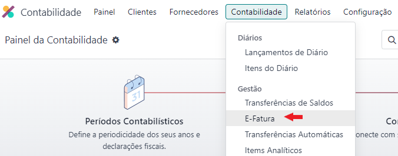

Selecione o botão Importar e na janela que se vai abrir pode definir se vai querer importar ou sincronizar

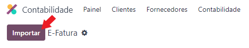

.. important::
    O site do eFatura da AT tem uma limitação de 300 movimentos, atualmente não podemos fazer nada quanto a esta
    situação, pelo que deve restringir as datas dos movimentos para garantir que não ultrapassa os 300 registos de uma
    só vez.

Sincronizar
-----------
Para sincronizar deve:

- Preencher o **Diário** do tipo compras, onde estão registados os movimentos
- **Data Inicial** e **Data Final**, se escolher um **Período** as datas são ajustadas, ou se preferir pode ter datas personalizadas
- O pisco **Criar/Atualizar Faturas**

    - Se estiver ativo e conseguir encontrar equivalência associa às faturas já existentes
    - Se estiver ativo e não conseguir cria um documento em rascunho
    - Se não estiver ativo apenas cria documentos em rascunho

- Carregue no botão **Sincronizar**

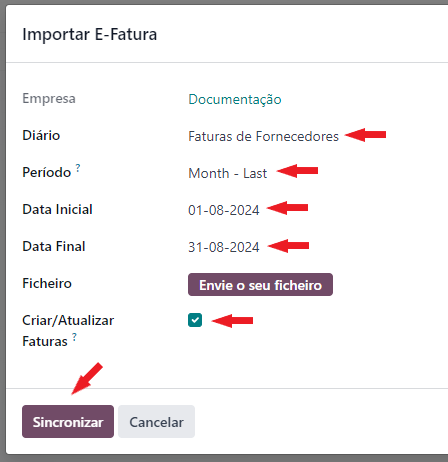

Ao concluir vai ver um relatório de erros se existir algum, ou um resumo dos movimentos sincronizados, pode selecionar a
opção **Registar ao Fechar** que vai guardar no seu Odoo uma cópia dos movimentos importados para histórico.

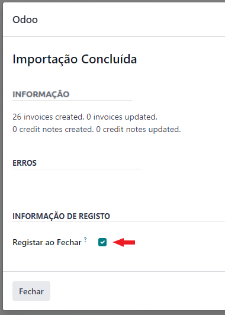

.. tip::
    Esta é a metodologia que aconselhámos para utilização, porque ao sincronizar são inseridas no Odoo linhas diferentes
    por cada imposto utilizado na fatura original

Importar
--------
Para importar deve:

- Fazer o download do ficheiro .csv do portal do e-Fatura para o período respetivo

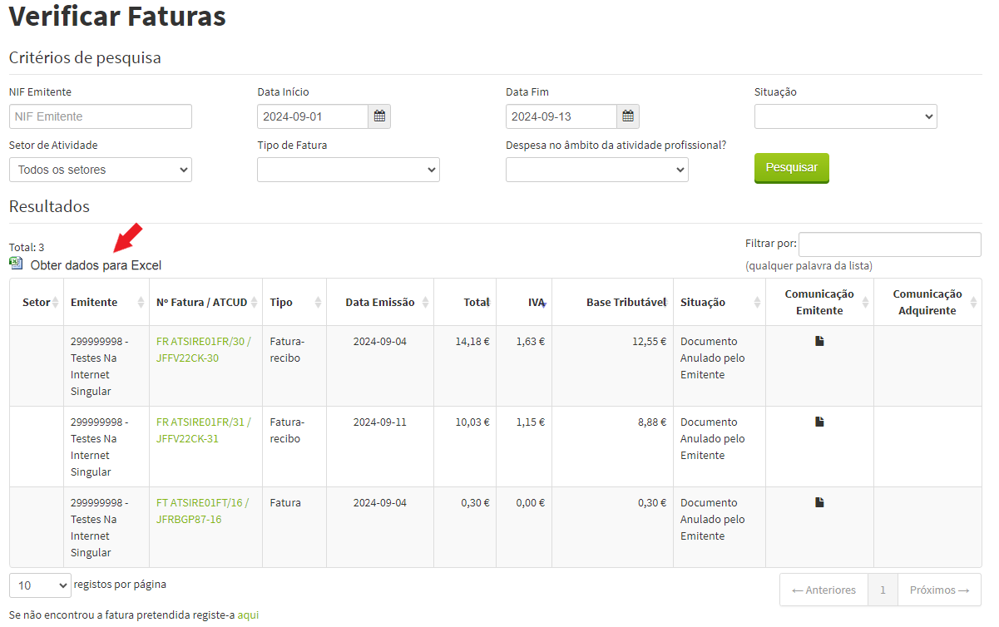

- Preencher o **Diário** do tipo compras, onde estão registados os movimentos
- Inserir o **Ficheiro** que descarregou do portal do e-Fatura
- O pisco **Criar/Atualizar Faturas**

    - Se estiver ativo e conseguir encontrar equivalência associa às faturas já existentes
    - Se estiver ativo e não conseguir cria um documento em rascunho
    - Se não estiver ativo apenas cria documentos em rascunho

- O botão Sincronizar, muda para **Importar**, carregue nele

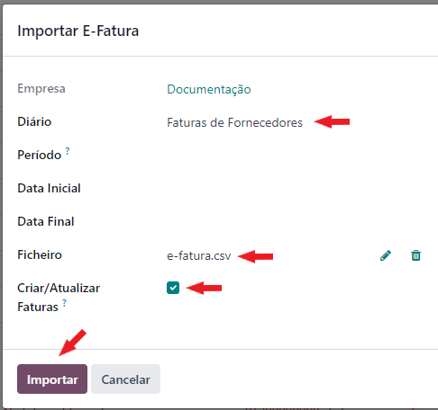

Ao concluir vai ver um relatório de erros se existir algum, ou um resumo dos movimentos sincronizados, pode selecionar a
opção **Registar ao Fechar** que vai guardar no seu Odoo uma cópia dos movimentos importados para histórico.

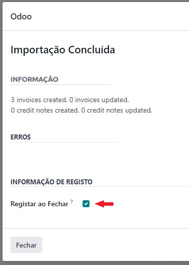

.. tip::
    Este método é menos recomendado porque não traz as diferentes linhas por imposto e o valor de impostos pode não
    bater certo com uma das taxas de impostos que utiliza, pelo que conseguir a equivalência pode ser mais difícil

.. _efatura-mapeamento-em-falta:

Impostos sem mapeamento
-----------------------
Um documento só dá origem a fatura de fornecedor quando **todos** os impostos que a AT reportou têm mapeamento. Se
faltar algum, o Odoo não cria a fatura: uma fatura construída só com parte das linhas teria um total diferente do
documento do E-Fatura e passaria por completa.

O documento fica sinalizado, com um aviso no topo a dizer que impostos faltam e um triângulo amarelo nas linhas em
causa.

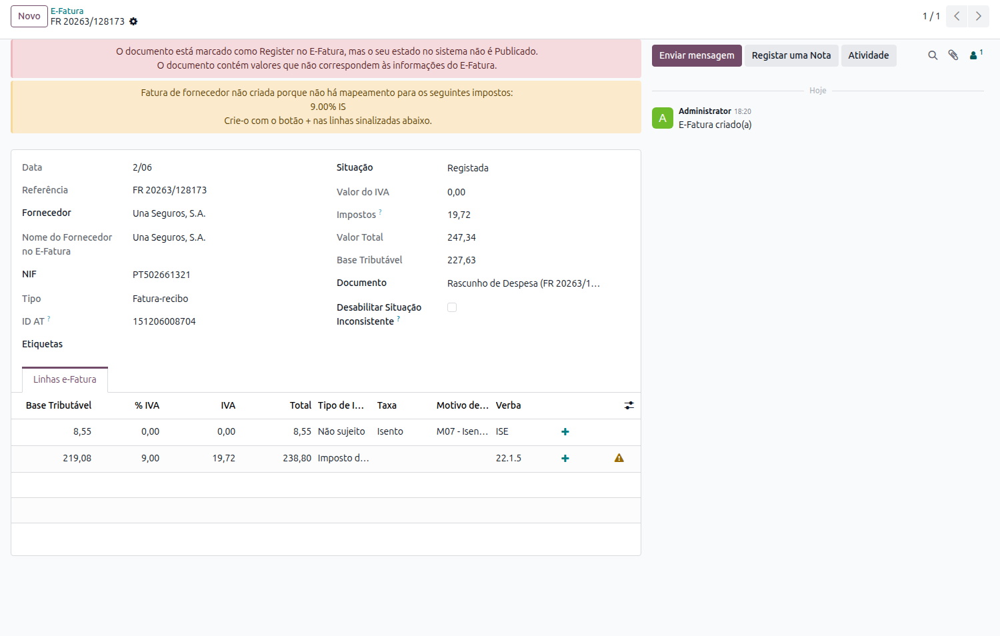

Para resolver, carregue no botão :guilabel:`+` da linha assinalada: abre um mapeamento novo já preenchido com o que a AT
reportou nessa linha, ficando-lhe apenas por escolher o imposto e o artigo a aplicar. Depois de gravar, corra
**Criar/Atualizar Faturas** sobre o documento.

.. tip::
    No assistente de sincronização o resumo final indica quantos documentos ficaram à espera de mapeamento e dá-lhe dois
    atalhos: um para a lista desses documentos e outro para a tabela de mapeamentos.

    Na lista do E-Fatura tem também o filtro :guilabel:`Mapeamento de Imposto em Falta` para os encontrar a qualquer
    momento.

.. important::
    Se pedir **Criar/Atualizar Faturas** sobre documentos a que falta mapeamento, o Odoo avisa e não cria nada,
    indicando que impostos tem de configurar primeiro e oferecendo um botão que abre a tabela de mapeamentos. Aqui o
    processo foi pedido por si de forma explícita, por isso nada é feito a meio.

Fusão de documentos
-------------------
Devido à possibilidade de serem criadas faturas em duplicado porque não conseguiu fazer uma equivalência automática na
insersão dos dados provenientes do e-Fatura, adicionamos a possibilidade de fundir uma fatura de rascunho com outra que
já exista em sistema.

Para o fazer basta selecionar as duas faturas que quer fundir, ir ao menu **Ação** e selecionar a opção
**Fundir Faturas do E-Fatura**

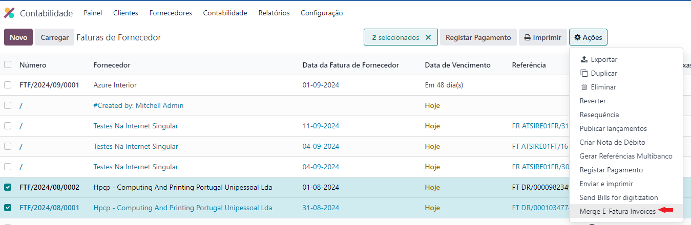

Trabalhar a informação em Odoo
==============================
Depois dos dados estarem no seu Odoo, chega a hora de os trabahar para que consiga tirar partido da funcionalidade ao
máximo.

Na vista de lista as diferentes faturas vão estar codificadas por cores:

- **Verde**, se os dados que constam no seu Odoo estiverem corretos
- **Vermelho**, se os dados que constam no seu Odoo apresentarem uma **Situação Inconsistente**
- **Amarelo**, se algum dos impostos que a AT reportou não tiver mapeamento — ver
  :ref:`efatura-mapeamento-em-falta`

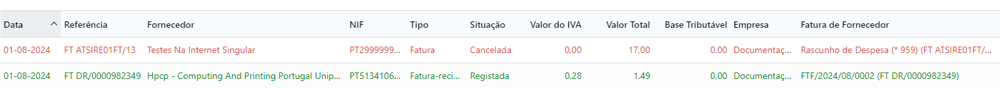

Se abrir o documento com **Situação Inconsistente**, no topo da página vai poder ver o(s) motivo(s) que está(ão) a criar
essa inconsistência. Corrija esses motivos e a cor muda de vermelho para verde.

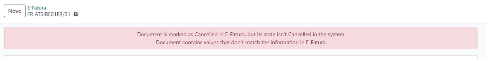

Caso verifique que a inconsistência não é válida e que o documento em Odoo está correto, e podem existir vários motivos
para tal, pode desligar o aviso para esse documento. Por motivos de responsabilização, fica gravado no Chatter do Odoo
a informação de quem desligar o aviso.

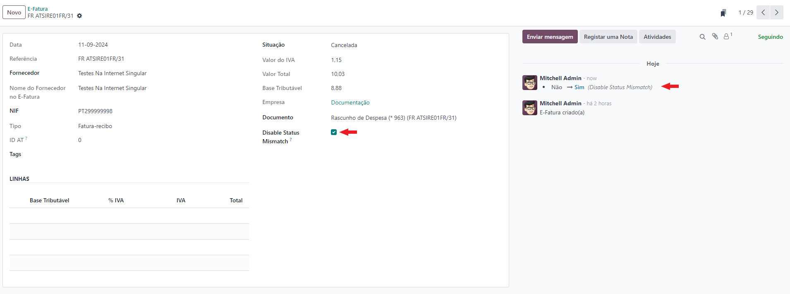

.. example::
    Alguns motivos que podem levar a que exista uma diferença entre o declarado no e-Fatura e o que regista em Odoo
    podem ser:

    - Valores de impostos diferentes, por causa de valores sem direito a dedução, ou com dedução apenas parcial
    - Já declarou essa despesa noutra app que não Faturação, por exemplo despesas declaradas pelos funcionários
    - Diferenças de cêntimos, porque a forma de arredondamento que usa pode ser diferente da do seu fornecedor
    - Fatura está num estado diferente, por exemplo o fornecedor vai cancelar o documento, mas ainda não o declarou à AT, no entanto você já a cancelou em Odoo

O campo que é utilizado para fazer a ligação entre a informação que vem do e-Fatura e a informação que está em Odoo
é o **Documento**

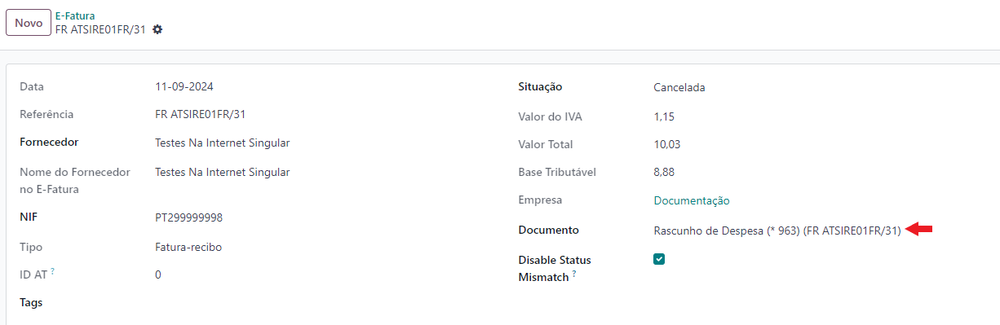

Do lado do documento Odoo a ligação é feita na aba **Outra Informação** no campo **E-Fatura**

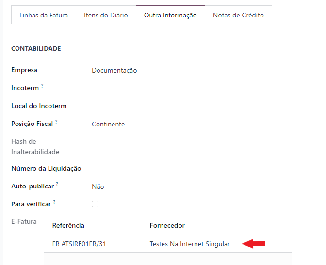

.. important::
    Cada documento de fatura Odoo apenas pode ser ligado a um documento do e-Fatura

    Se existiu um equívoco e depois precisa de mudar a ligação a outro documento, deve primeiro retirar a ligação
    existente e em seguida ligar ao documento correto

    Esta ligação só pode ser alterada do lado do documento e-Fatura, mas o link do documento Odoo liga diretamente a
    esse documento

Outra funcionalidade que também o ajuda a gerir a sua vista de documentos é a utilização de formatação condicional
que pode ver tanto na vista de lista, como no próprio documento.

Esta formatação muda para **Vermelho** os valores que apareçam diferentes em Odoo do que vem no E-Fatura e deixa a
**Verde** os que estiverem corretos

Se as situações inconsistentes forem desativadas no e-Fatura, a formatação condicional fica a verde no Odoo

.. note::
    O campo :guilabel:`Impostos do E-Fatura` da fatura de fornecedor compara **todos** os impostos que a AT reportou
    para o documento, não apenas o IVA. A AT envia o IVA no total do documento e o Imposto do Selo apenas nas linhas,
    por isso uma fatura com selo corretamente mapeado aparecia antes como divergente sem o ser.

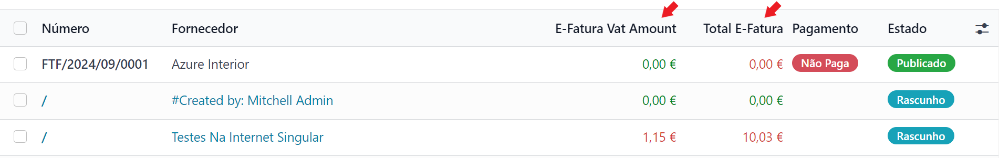

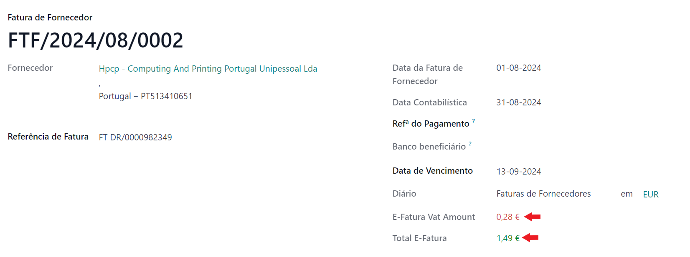

.. tip::
    Nos documentos do e-Fatura pode ainda inserir etiquetas para ajudar a agrupar pesquisas, por exemplo nos casos em
    que uma fatura de fornecedor, foi feita através da app de Despesas para reembolso a um funcionário

    .. image:: efatura/v17_efatura08.png
       :align: center

    .. image:: efatura/v17_efatura09.png
       :align: center

.. note::
    O mesmo documento pode chegar ao Odoo pelo e-Fatura e pela app de **Despesas**, quando é um recibo que o
    funcionário pagou do próprio bolso. Lendo o código QR do recibo, o Odoo liga a despesa ao documento do
    e-Fatura e aproveita a fatura de fornecedor que já exista, em vez de criar uma segunda, seja o e-Fatura ou a
    despesa a chegar primeiro.

    Consulte :ref:`expenseEfaturaQR` para o processo completo: o que é lido do recibo, o que acontece quando não
    é possível ler o código QR, e como as duas origens do mesmo documento são conciliadas.

Scan Código QR
==============
Para aqueles que não querem esperar pelo report do eFatura, podem ir inserindo as faturas em Odoo, com base no scan do
código QR que as mesmas são obrigadas a ter em Portugal.

Pode fazê-lo de duas formas:

- Na lista das Faturas de Fornecedor, carregue no botão **Carregar**, selecione o ficheiro e aguarde o preenchimento

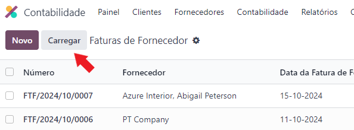

- Numa nova fatura, faça o **Upload do ficheiro**, e carregue no botão **Ler QR**

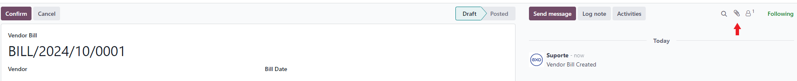

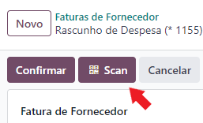

O mesmo leitor está disponível na app de **Despesas**, para os recibos que o funcionário paga do próprio bolso e
fotografa. Ver :ref:`expenseEfaturaQR`

.. note::
    Qualquer um dos processos cria uma **Fatura de Fornecedor** em **Rascunho**, mas também cria uma **Linha na tabela do eFatura**
    no estado **Pendente**. Isto porque fica a aguardar validação com o portal através de sincronização ou importação.

    .. image:: efatura/v17_efaturaScan04.png
      :align: center

    Quando essa validação é feita, o estado passa de **Pendente** para **Registada**

    .. image:: efatura/v17_efaturaScan05.png
      :align: center

Uma mensagem no canto superior direito diz-lhe sempre o que saiu do código QR: qual o documento que foi lido, ou,
quando não foi possível ler nada, o que quer fazer com o ficheiro que enviou.

Quando não é possível ler o código QR
-------------------------------------
Se o ficheiro enviado não der nada ao Odoo, é-lhe perguntado o que fazer com ele:

- :guilabel:`Aceitar` mantém o documento como está, para o preencher à mão
- :guilabel:`Rejeitar` apaga o documento e o ficheiro
- :guilabel:`Tentar Novamente` apaga o documento e abre outra vez o seletor de ficheiros (a câmara, no
  telemóvel), para enviar de imediato uma nova fotografia

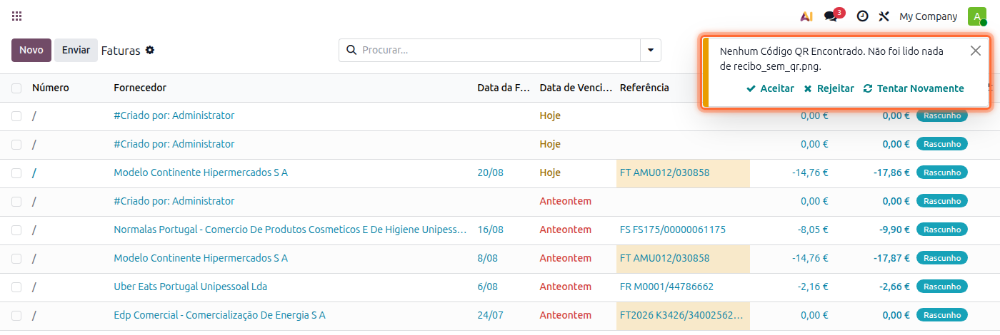

A pergunta é feita em três situações: o ficheiro não tem código QR nenhum, tem-no mas não está legível (tremido,
cortado, ou não é o código QR de uma fatura portuguesa), ou é um documento emitido a outra empresa, do qual nada
é aproveitado. Se enviar vários ficheiros de uma vez, é perguntado um a um, indicando o nome do ficheiro e
quantos faltam decidir.

.. note::
    Fechar a mensagem sem escolher nada tem o mesmo efeito que :guilabel:`Aceitar`: o documento fica registado.

    Um documento já publicado nunca é apagado por este processo.
