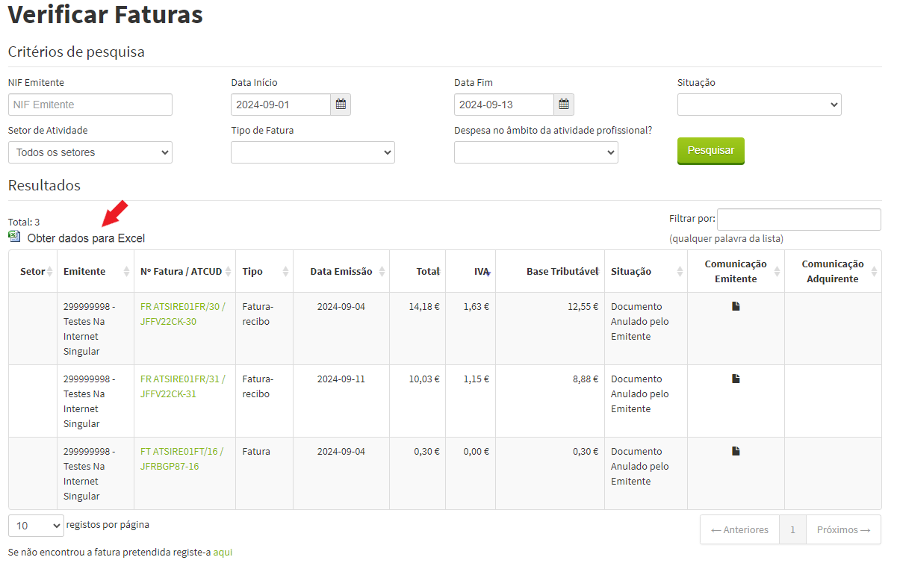
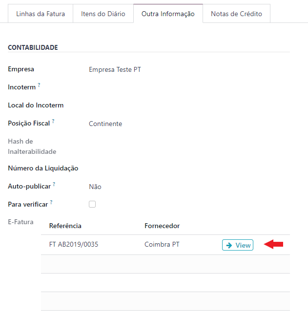

:show-content:

========
e-Fatura
========
O e-Fatura é uma funcionalidade da Autoridade Tributária Portuguesa usada por todos os negócios, no entanto sendo o Odoo
um ERP, o controlo de gestão não pode ser esquecido.

Com essa abordagem em mente, a **Exo Software** desenvolveu uma ferramenta que o ajuda no controlo das suas faturas de
fornecedores, para que não se esqueça de fazer o devido registo em Odoo e garantir que o Odoo reflete a sua realidade, o
ajuda no controlo de fluxos financeiros e tomada de decisões.

.. raw:: html

    

        ─── ✦ ───
    

.. note::
    Esta ferramenta permite-lhe importar ou sincronizar no seu Odoo os dados que os seus fornecedores declaram à AT,
    dessa forma se for declarado algo que não registou no Odoo, fica logo a saber.

.. important::
    Esta funcionalidade do **e-Fatura** não está disponível na loja Odoo, para ter acesso terá de pedir aos nossos
    serviços que façam a sua instalação e ativação na sua base de dados

    Depois pode começar a seguir os passos que se seguem para proceder à configuração e utilização

Configuração do Utilizador
==========================
Para poder comunicar com a AT através de Odoo tem de inserir as credênciais de acesso. Para tal terá de aceder ao seu
utilizador Odoo e inserir os dados na aba **Portugal**

Configurações
=============
Tenha já criado um **diário** do tipo **Compras**, um **artigo*** para ser utilizado no processo de importação de
documentos (este artigo deve poder ser comprado) bem como **todos os impostos base** necessários através da escolha de
um plano de contas

Aceda à app **Faturação / Contabilidade** (dependendo respetivamente se tem versão Community ou Enterprise do Odoo), vá
ao menu :menuselection:`Configuração --> Configurações`

.. image:: ../invoicing/fiscal_documents/v17_appInvoicingAccounting.png
   :align: center

Procurar a secção **Portugal**, Configure os campos relativos ao eFatura:

- Diário de compras que criou
- Produto do eFatura que criou
- Taxas Normal, Intermédia, Reduzida e Isenta inseridas com o plano de contas

Ative a opção E-Fatura Scan que lhe vai permitir fazer scan dos códigos QR das faturas e criar as mesmas

.. important::
    Verifique que configurações tem para o OCR Odoo, o nosso leitor de código QR **Scan QR** é gratuíto, no entanto o OCR
    do Odoo **Digitalizar Documento** não o é e cobra um créditos por utilização

    Na eventualidade de ter os 2 ativos, primeiro é usado o OCR do Odoo e só em seguida o leitor de código QR da Exo
    Software.

Insersão da informação do e-Fatura
==================================
Para poder iniciar a utilização, aceda à app **Faturação / Contabilidade** (dependendo respetivamente se tem versão
Community ou Enterprise do Odoo), vá ao menu de **Contabilidade** e no separador Gestão selecione a opção **E-Fatura**.

.. image:: ../invoicing/fiscal_documents/v17_appInvoicingAccounting.png
   :align: center

Selecione o botão Importar e na janela que se vai abrir pode definir se vai querer importar ou sincronizar

.. important::
    O site do eFatura da AT tem uma limitação de 300 movimentos, atualmente não podemos fazer nada quanto a esta
    situação, pelo que deve restringir as datas dos movimentos para garantir que não ultrapassa os 300 registos de uma
    só vez.

Sincronizar
-----------
Para sincronizar deve:

- Preencher o **Diário** do tipo compras, onde estão registados os movimentos
- **Data Inicial** e **Data Final**, se escolher um **Período** as datas são ajustadas, ou se preferir pode ter datas personalizadas
- O pisco **Criar/Atualizar Faturas**

    - Se estiver ativo e conseguir encontrar equivalência associa às faturas já existentes
    - Se estiver ativo e não conseguir cria um documento em rascunho
    - Se não estiver ativo apenas cria documentos em rascunho

- Carregue no botão **Sincronizar**

Ao concluir vai ver um relatório de erros se existir algum, ou um resumo dos movimentos sincronizados, pode selecionar a
opção **Registar ao Fechar** que vai guardar no seu Odoo uma cópia dos movimentos importados para histórico.

.. tip::
    Esta é a metodologia que aconselhámos para utilização, porque ao sincronizar são inseridas no Odoo linhas diferentes
    por cada imposto utilizado na fatura original

Importar
--------
Para importar deve:

- Fazer o download do ficheiro .csv do portal do e-Fatura para o período respetivo

- Preencher o **Diário** do tipo compras, onde estão registados os movimentos
- Inserir o **Ficheiro** que descarregou do portal do e-Fatura
- O pisco **Criar/Atualizar Faturas**

    - Se estiver ativo e conseguir encontrar equivalência associa às faturas já existentes
    - Se estiver ativo e não conseguir cria um documento em rascunho
    - Se não estiver ativo apenas cria documentos em rascunho

- O botão Sincronizar, muda para **Importar**, carregue nele

Ao concluir vai ver um relatório de erros se existir algum, ou um resumo dos movimentos sincronizados, pode selecionar a
opção **Registar ao Fechar** que vai guardar no seu Odoo uma cópia dos movimentos importados para histórico.

.. tip::
    Este método é menos recomendado porque não traz as diferentes linhas por imposto e o valor de impostos pode não
    bater certo com uma das taxas de impostos que utiliza, pelo que conseguir a equivalência pode ser mais difícil

Fusão de documentos
-------------------
Devido à possibilidade de serem criadas faturas em duplicado porque não conseguiu fazer uma equivalência automática na
insersão dos dados provenientes do e-Fatura, adicionamos a possibilidade de fundir uma fatura de rascunho com outra que
já exista em sistema.

Para o fazer basta selecionar as duas faturas que quer fundir, ir ao menu **Ação** e selecionar a opção
**Fundir Faturas do E-Fatura**

Trabalhar a informação em Odoo
==============================
Depois dos dados estarem no seu Odoo, chega a hora de os trabahar para que consiga tirar partido da funcionalidade ao
máximo.

Na vista de lista as diferentes faturas vão estar codificadas por cores:

- **Verde**, se os dados que constam no seu Odoo estiverem corretos
- **Vermelho**, se os dados que constam no seu Odoo apresentarem uma **Situação Inconsistente**

Se abrir o documento com **Situação Inconsistente**, no topo da página vai poder ver o(s) motivo(s) que está(ão) a criar
essa inconsistência. Corrija esses motivos e a cor muda de vermelho para verde.

Caso verifique que a inconsistência não é válida e que o documento em Odoo está correto, e podem existir vários motivos
para tal, pode desligar o aviso para esse documento. Por motivos de responsabilização, fica gravado no Chatter do Odoo
a informação de quem desligar o aviso.

.. example::
    Alguns motivos que podem levar a que exista uma diferença entre o declarado no e-Fatura e o que regista em Odoo
    podem ser:

    - Valores de impostos diferentes, por causa de valores sem direito a dedução, ou com dedução apenas parcial
    - Já declarou essa despesa noutra app que não Faturação, por exemplo despesas declaradas pelos funcionários
    - Diferenças de cêntimos, porque a forma de arredondamento que usa pode ser diferente da do seu fornecedor
    - Fatura está num estado diferente, por exemplo o fornecedor vai cancelar o documento, mas ainda não o declarou à AT, no entanto você já a cancelou em Odoo

O campo que é utilizado para fazer a ligação entre a informação que vem do e-Fatura e a informação que está em Odoo
é o **Documento**

Do lado do documento Odoo a ligação é feita na aba **Outra Informação** no campo **E-Fatura**

.. important::
    Cada documento de fatura Odoo apenas pode ser ligado a um documento do e-Fatura

    Se existiu um equívoco e depois precisa de mudar a ligação a outro documento, deve primeiro retirar a ligação
    existente e em seguida ligar ao documento correto

    Esta ligação só pode ser alterada do lado do documento e-Fatura, mas o link do documento Odoo liga diretamente a
    esse documento

Outra funcionalidade que também o ajuda a gerir a sua vista de documentos é a utilização de formatação condicional
que pode ver tanto na vista de lista, como no próprio documento.

Esta formatação muda para **Vermelho** os valores que apareçam diferentes em Odoo do que vem no E-Fatura e deixa a
**Verde** os que estiverem corretos

Se as situações inconsistentes forem desativadas no e-Fatura, a formatação condicional fica a verde no Odoo

.. tip::
    Nos documentos do e-Fatura pode ainda inserir etiquetas para ajudar a agrupar pesquisas, por exemplo nos casos em
    que uma fatura de fornecedor, foi feita através da app de Despesas para reembolso a um funcionário

    .. image:: efatura/v17_efatura08.png
       :align: center

    .. image:: efatura/v17_efatura09.png
       :align: center

Scan Código QR
==============
Para aqueles que não querem esperar pelo report do eFatura, podem ir inserindo as faturas em Odoo, com base no scan do
código QR que as mesmas são obrigadas a ter em Portugal.

Pode fazê-lo de duas formas:

- Na lista das Faturas de Fornecedor, carregue no botão **Carregar**, selecione o ficheiro e aguarde o preenchimento

- Numa nova fatura, faça o **Upload do ficheiro**, e carregue no botão **Scan QR**

.. note::
    Qualquer um dos processos cria uma **Fatura de Fornecedor** em **Rascunho**, mas também cria uma **Linha na tabela do eFatura**
    no estado **Pendente**. Isto porque fica a aguardar validação com o portal através de sincronização ou importação.

    .. image:: efatura/v17_efaturaScan04.png
      :align: center

    Quando essa validação é feita, o estado passa de **Pendente** para **Registada**

    .. image:: efatura/v17_efaturaScan05.png
      :align: center
