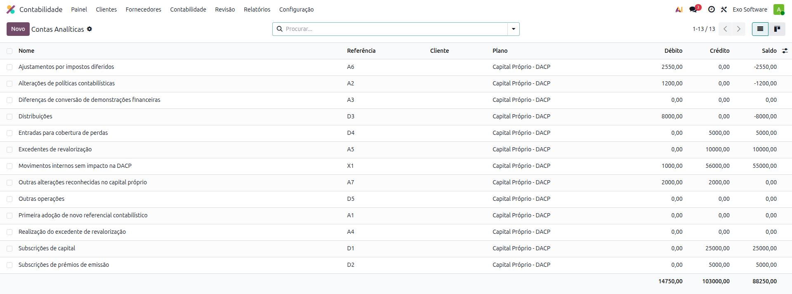
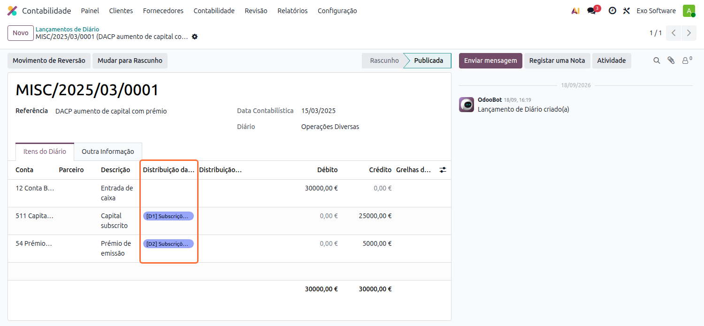
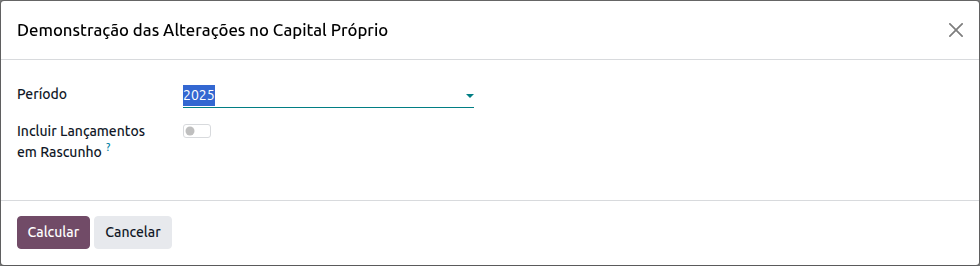
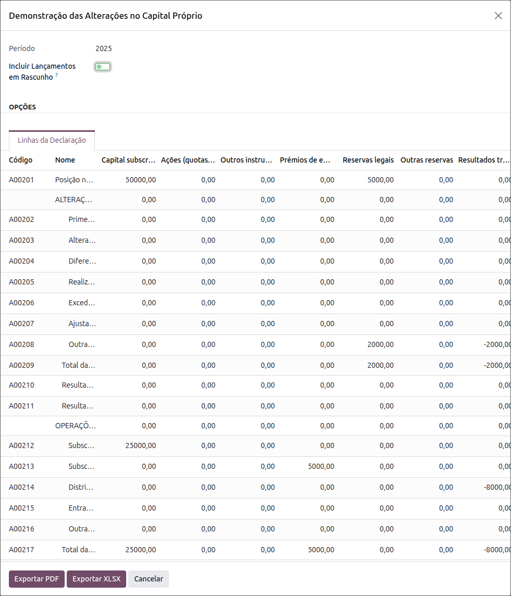
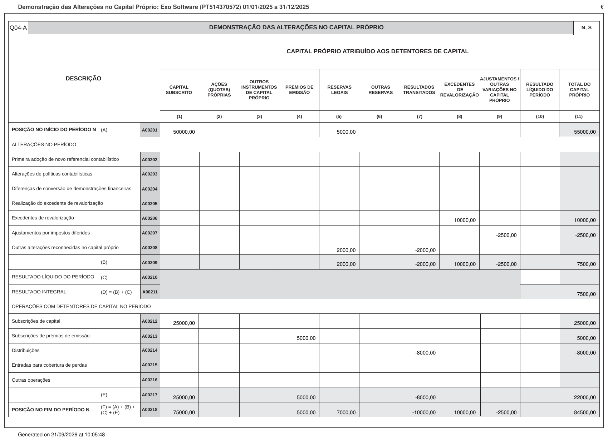

:show-content:

===============
Capital Próprio
===============
A localização da **Exo Software** permite etiquetar os movimentos das contas de capital próprio pela
natureza da alteração e obter a **Demonstração das Alterações no Capital Próprio** (o quadro **04-A** do
Anexo A da IES), com exportação em PDF e XLSX

A etiqueta é o que diz à demonstração em que linha apresentar cada movimento: a conta, por si só, não
distingue um aumento de capital de uma distribuição ou de uma correção de política contabilística

.. raw:: html

    

        ─── ✦ ───
    

Configuração
============

Etiquetas de Capital Próprio
----------------------------
As etiquetas correspondem às linhas de movimento do quadro 04-A e vêm pré-configuradas com o módulo. Para
as consultar, aceda à app de **Faturação / Contabilidade** (dependendo respetivamente se tem versão
Community ou Enterprise do Odoo) e vá ao menu
:menuselection:`Configuração --> Contabilidade --> Contas Analíticas`

.. list-table::
   :header-rows: 1

   * - Etiqueta
     - Linha da demonstração
   * - A1
     - Primeira adoção de novo referencial contabilístico
   * - A2
     - Alterações de políticas contabilísticas
   * - A3
     - Diferenças de conversão de demonstrações financeiras
   * - A4
     - Realização do excedente de revalorização
   * - A5
     - Excedentes de revalorização
   * - A6
     - Ajustamentos por impostos diferidos
   * - A7
     - Outras alterações reconhecidas no capital próprio
   * - D1
     - Subscrições de capital
   * - D2
     - Subscrições de prémios de emissão
   * - D3
     - Distribuições
   * - D4
     - Entradas para cobertura de perdas
   * - D5
     - Outras operações
   * - X1
     - Movimentos internos, sem impacto na demonstração

A etiqueta **X1** existe para os movimentos entre contas da mesma natureza, que não alteram o capital
próprio: são etiquetados na mesma, mas não aparecem em nenhuma linha da demonstração

.. important::
    As etiquetas são as linhas de uma declaração legal e não contabilidade analítica da empresa: não
    podem ser alteradas, arquivadas nem eliminadas. Pela mesma razão, o plano **Capital Próprio - DACP**
    não aparece na lista de planos analíticos, apesar de ser oferecido nas linhas dos lançamentos

Colunas da demonstração
-----------------------
As onze colunas do quadro 04-A são obtidas pela taxonomia das contas, a mesma que alimenta o Balanço, pelo
que funcionam com o plano de contas de cada empresa sem configuração adicional

.. list-table::
   :header-rows: 1

   * - Coluna
     - Contas
   * - (1) Capital subscrito
     - 51
   * - (2) Ações (quotas) próprias
     - 52
   * - (3) Outros instrumentos de capital próprio
     - 53
   * - (4) Prémios de emissão
     - 54
   * - (5) Reservas legais
     - 551
   * - (6) Outras reservas
     - 55, exceto 551
   * - (7) Resultados transitados
     - 56
   * - (8) Excedentes de revalorização
     - 58
   * - (9) Ajustamentos / outras variações no capital próprio
     - 57 e 59
   * - (10) Resultado líquido do período
     - 81
   * - (11) Total do capital próprio
     - soma das anteriores

.. tip::
    Se as contas de capital próprio ainda não tiverem taxonomia atribuída, a demonstração vem a zero.
    Atribua-a no plano de contas, selecionando as contas e usando a ação **Configurar Taxonomias**, tal
    como faz para o Balanço e para a Demonstração de Resultados

Utilização
==========

Etiquetar os movimentos
-----------------------
Sempre que um lançamento movimenta uma conta da classe 5, a linha pede a etiqueta no campo
:guilabel:`Distribuição Analítica`. A etiqueta é pedida em todas as vias em que uma conta de capital
próprio pode ser usada: lançamentos de diário, faturas de cliente e de fornecedor, despesas e encomendas
de venda

Cada linha leva uma só etiqueta, a 100%. Uma operação que abranja duas naturezas reparte-se por duas
linhas de lançamento, uma para cada etiqueta, que é também o que corresponde à realidade contabilística:
um aumento de capital com prémio de emissão tem mesmo uma linha na conta 51 e outra na 54

.. warning::
    Um lançamento com uma conta da classe 5 sem etiqueta não é publicado, venha do ecrã, de uma
    importação ou de uma integração. Sem isso, os valores desapareciam da demonstração sem aviso

Demonstração das Alterações no Capital Próprio
==============================================
A demonstração está disponível no menu
:menuselection:`Relatórios --> Portugal --> Financeiros --> Demonstração das Alterações no Capital
Próprio`: escolha o período e clique em :guilabel:`Calcular`

O ecrã de análise apresenta as vinte linhas do quadro oficial e as onze colunas do capital próprio. A
posição no início e no fim do período sai do saldo das contas, as linhas de alterações e de operações com
detentores de capital saem das etiquetas dos movimentos do período, e o botão :guilabel:`Ver` abre os
itens de diário que compõem cada linha

Os valores seguem a convenção da contabilidade: os saldos e os movimentos credores aparecem positivos e os
devedores negativos, pelo que uma distribuição de resultados ou a compra de ações próprias surgem com
sinal negativo

.. note::
    Quando uma conta de capital próprio tem etiqueta mas não corresponde a nenhuma coluna do quadro, a
    demonstração indica-o no ecrã de análise em vez de a deixar de fora em silêncio

Por fim, exporte com :guilabel:`Exportar PDF` ou :guilabel:`Exportar XLSX`. O PDF preenche o modelo oficial
do quadro 04-A, com o cabeçalho da empresa e a data de criação no rodapé

