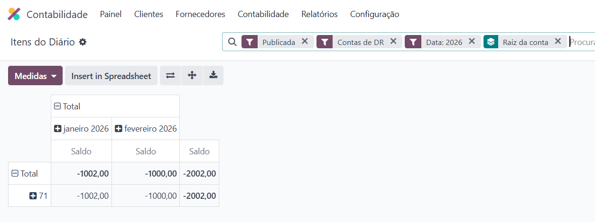
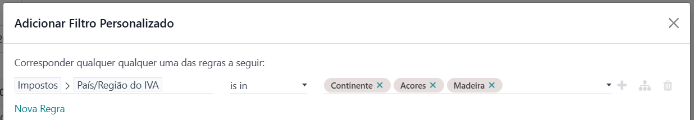
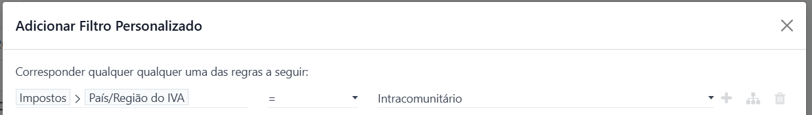
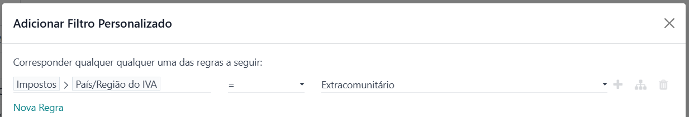

:show-content:

=====================================
Declarações para preenchimento do IES
=====================================
.. important::
    A localização da **Exo Software** não fornece neste momento forma para tirar o IES diretamente no Odoo

No entanto, veja os procedimentos que deve seguir para conseguir cada uma das informações necessárias ao mesmo

.. raw:: html

    

        ─── ✦ ───
    

Método para obtenção dos valores a preencher por mercados geográficos no IES [NOTA 44]
======================================================================================
A partir da tabela de **Itens de Diário** fazer os seguintes filtros:

- Publicado
- Contas de DR
- Período de análise desejado

Agrupe por **Raiz da conta** e colocar em vista pivot

Em seguida, use um filtro personalizado para obter os valores por mercado geográfico:

- Mercado Interno

- Mercado Comunitário

- Mercado Extra-Comunitário

