:show-content:

==============
Importar SAF-T
==============
A localização da **Exo Software** importa ficheiros **SAF-T (PT) 1.04_01** de outro software para
o Odoo: o plano de contas, os clientes e fornecedores, os produtos, os impostos, os diários, os
lançamentos contabilísticos, os saldos de abertura e as faturas, notas de crédito e recibos

A importação é feita em duas etapas: primeiro o ficheiro é **analisado** e o Odoo mostra, elemento
a elemento, o que vai criar e o que vai reutilizar; só depois, quando confirmar essa proposta, é
que os registos são criados. Os mapeamentos que confirmar ficam guardados como regras e são
reaproveitados nas importações seguintes

.. raw:: html

    

        ─── ✦ ───
    

Antes de começar
================
O importador aceita os três tipos de SAF-T (PT) previstos na Portaria n.º 302/2016, em ``.xml`` ou
dentro de um ``.zip``:

.. list-table::
    :header-rows: 1
    :widths: 20 80

    * - Tipo de ficheiro
      - O que traz
    * - **Contabilidade**
      - O plano de contas, os saldos de abertura e os lançamentos do período
    * - **Faturação**
      - Os clientes, os produtos, os impostos e os documentos emitidos (faturas, notas de
        crédito e recibos)
    * - **Integrado**
      - As duas coisas: contabilidade e documentos

Só são aceites ficheiros **válidos face ao esquema oficial da AT**. Um ficheiro de outra versão
(1.03, por exemplo), de outro país, ou com elementos que não cumprem o esquema é recusado com a
indicação do que está errado, para que seja corrigido na origem e exportado outra vez

A empresa que recebe a importação tem de estar configurada antes: plano de contas português
instalado, diários criados e, se o ficheiro trouxer notas de crédito, a **Conta de Crédito de
Vendas** preenchida em :menuselection:`Configuração --> Definições`, junto às contas por omissão
dos produtos. A análise avisa quando falta

.. important::
    O ficheiro deve ser da própria empresa. Se o NIF do emitente não coincidir com o NIF da
    empresa ativa, a análise deixa um aviso: confirme que está na empresa certa antes de importar

O que é importado
=================

.. list-table::
    :header-rows: 1
    :widths: 30 70

    * - Do ficheiro
      - Para o Odoo
    * - Contas do plano (``GeneralLedgerAccounts``)
      - Contas e grupos de contas. Por omissão só entram as contas com movimentos ou com saldo no
        período; pode escolher trazer todas
    * - Clientes e fornecedores
      - Parceiros, criados ou atualizados. O NIF genérico 999999990 usa sempre o parceiro
        **Consumidor Final**
    * - Produtos
      - Produtos, criados ou ligados aos que já existem pelo código, código de barras ou nome
    * - Tabela de impostos
      - Ligação aos impostos do plano da empresa. **Nunca são criados impostos novos**
    * - Diários (``Journals``)
      - Diários, pelo código. As transações de apuramento, regularização e ajustamento ficam em
        diários próprios
    * - Lançamentos (``GeneralLedgerEntries``)
      - Lançamentos **em rascunho**, com a referência original no campo Referência
    * - Saldos de abertura
      - Um lançamento em rascunho com data do dia anterior ao início do período
    * - Faturas, notas de crédito e recibos (``SourceDocuments``)
      - Documentos fiscais **de integração**, lançados, com o número, o ATCUD e a assinatura de
        origem

.. note::
    As guias de transporte e os orçamentos e encomendas do ficheiro não são importados: não têm
    efeito contabilístico nem de cobrança, e as faturas que lhes seguiram são importadas. A
    análise conta-os para que saiba que existiam

Configuração
============

Permissões
----------
O menu e os ecrãs da importação estão disponíveis a quem tem o acesso contabilístico de
**Faturação** ou superior. Quem tem apenas leitura vê as importações e as regras, mas não as pode
alterar

Menu
----
Aceda à app **Faturação / Contabilidade** (dependendo respetivamente se tem versão Community ou
Enterprise do Odoo) e vá ao menu :menuselection:`Relatórios --> Portugal --> Importar SAF-T`

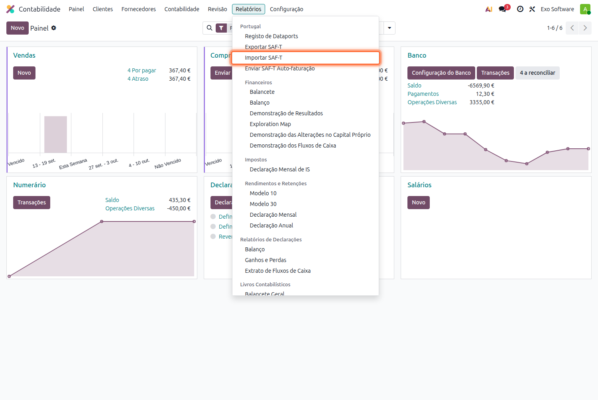

Regras de mapeamento
--------------------
As regras dizem ao Odoo para onde vai cada código do ficheiro. São criadas a partir das linhas da
importação (ver :ref:`Guardar como Regra <saft_import_regras>`) ou à mão, e ficam guardadas por
empresa. Chega-se a elas pelo botão **Regras de Mapeamento**, ao lado do **Novo**, na lista das
importações

Há uma regra para cada coisa que o ficheiro pode trazer:

.. list-table::
    :header-rows: 1
    :widths: 25 40 35

    * - Tipo de regra
      - O que apanha no ficheiro
      - Para onde mapeia
    * - **Conta**
      - Um número de conta do plano
      - Uma conta do Odoo
    * - **Conta de Terceiro**
      - As contas que o software de origem abre por cliente ou por fornecedor (21110001,
        21110002, ...)
      - A conta a receber ou a pagar do parceiro, em vez de criar uma conta por cliente
    * - **Parceiro**
      - Um ``CustomerID`` ou ``SupplierID``
      - Um parceiro do Odoo
    * - **Produto**
      - Um ``ProductCode``
      - Um produto do Odoo, ou uma linha **sem produto** (só descrição, quantidade, preço e
        imposto)
    * - **Imposto**
      - A chave do imposto, como aparece nas linhas da importação
        (``IVA|PT|NOR|23||S``)
      - Um imposto do plano da empresa
    * - **Diário**
      - Um ``JournalID``
      - Um diário do Odoo
    * - **Meio de Pagamento**
      - O meio de pagamento dos recibos (``NU``, ``TB``, ``CC``, ...)
      - O diário onde esses recibos são lançados

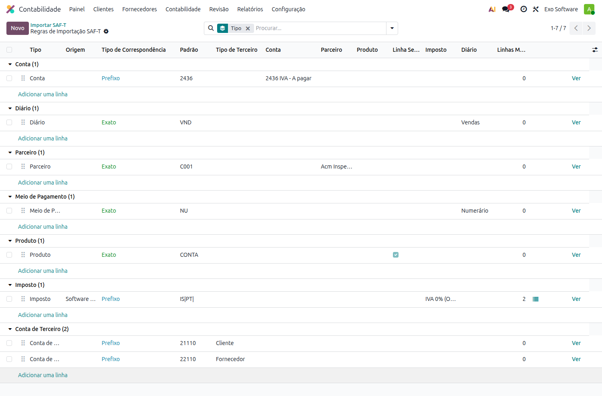

Cada regra reconhece os códigos de quatro maneiras, da mais restrita para a mais abrangente:

.. list-table::
    :header-rows: 1
    :widths: 22 78

    * - Como reconhecer
      - O que significa
    * - **Exato**
      - O código é exatamente o padrão. ``2111`` apanha só a conta 2111
    * - **Prefixo**
      - Todos os códigos começados pelo padrão. ``2111`` apanha 21110001 e 21119
    * - **Máscara**
      - ``*`` representa qualquer coisa e ``?`` um carácter. ``2111*`` ou ``C?00``
    * - **Expressão Regular**
      - Para os restantes casos. ``^2111\d{4}$`` é 2111 seguido de exatamente quatro dígitos

Quando várias regras apanham o mesmo código, ganha a mais precisa: o exato ao prefixo, o prefixo à
máscara e a máscara à expressão regular. Entre regras igualmente precisas ganha a de **Sequência**
mais baixa, e entre prefixos ganha o mais longo

Uma regra pode ainda ficar presa a um **software de origem** (o campo Origem, lido do cabeçalho do
ficheiro): assim a mesma empresa pode ter regras diferentes para ficheiros de programas diferentes.
Uma regra sem origem aplica-se a qualquer ficheiro

Ao abrir uma regra, o Odoo mostra em baixo que códigos da última importação analisada é que ela
reconhece, para poder confirmar o padrão antes de o deixar ficar

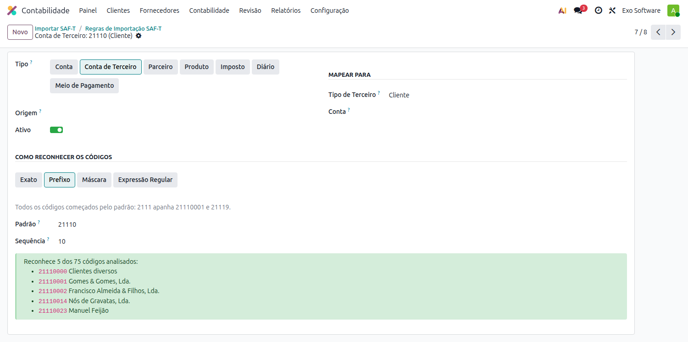

Utilização
==========

1. Criar a importação e carregar o ficheiro
-------------------------------------------
O menu abre a lista das importações da empresa, agrupadas pelo estado em que estão. É daqui que se
começa uma nova, e é também daqui que se chega às regras de mapeamento

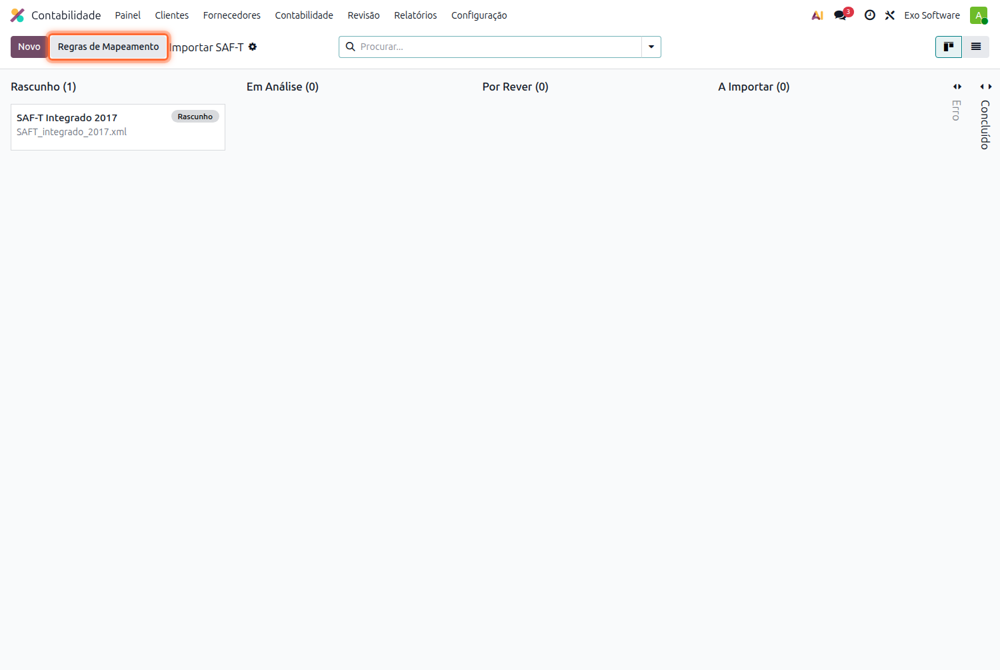

Carregue em **Novo**, dê um nome à importação e escolha o ficheiro. Antes de analisar, confirme as
opções

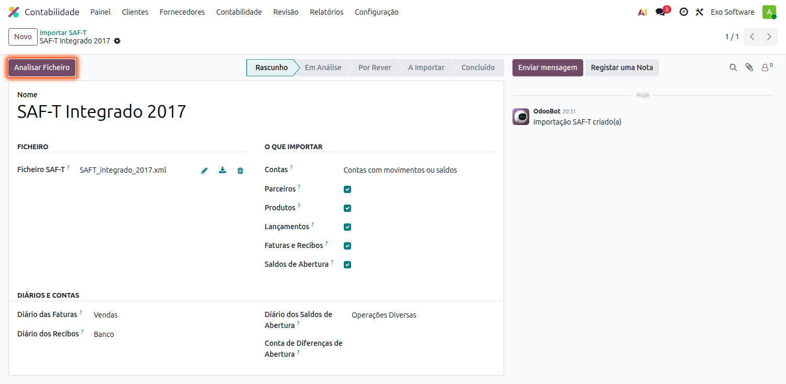

No grupo **O que importar** decide o que vem do ficheiro:

.. list-table::
    :header-rows: 1
    :widths: 30 70

    * - Opção
      - O que faz
    * - **Contas**
      - *Contas com movimentos ou saldos* traz só as contas usadas no período; *Todas as contas do
        ficheiro* traz o plano inteiro
    * - **Parceiros**
      - Cria ou atualiza os clientes e fornecedores do ficheiro
    * - **Produtos**
      - Cria ou atualiza os produtos do ficheiro
    * - **Lançamentos**
      - Cria os lançamentos contabilísticos, em rascunho
    * - **Faturas e Recibos**
      - Cria os documentos emitidos como documentos de integração
    * - **Saldos de Abertura**
      - Cria o lançamento com os saldos de abertura das contas

No grupo **Diários e Contas** escolhe onde é que os registos são lançados: o **Diário das Faturas**
(normalmente o diário de vendas), o **Diário dos Recibos** (usado quando nenhuma regra de meio de
pagamento se aplica), o **Diário dos Saldos de Abertura** e a **Conta de Diferenças de Abertura**,
esta última só necessária se os saldos do ficheiro não estiverem saldados

2. Analisar o ficheiro
----------------------
Carregue em **Analisar Ficheiro**. A leitura corre em segundo plano e o formulário acompanha o
progresso, sem ser preciso atualizar a página

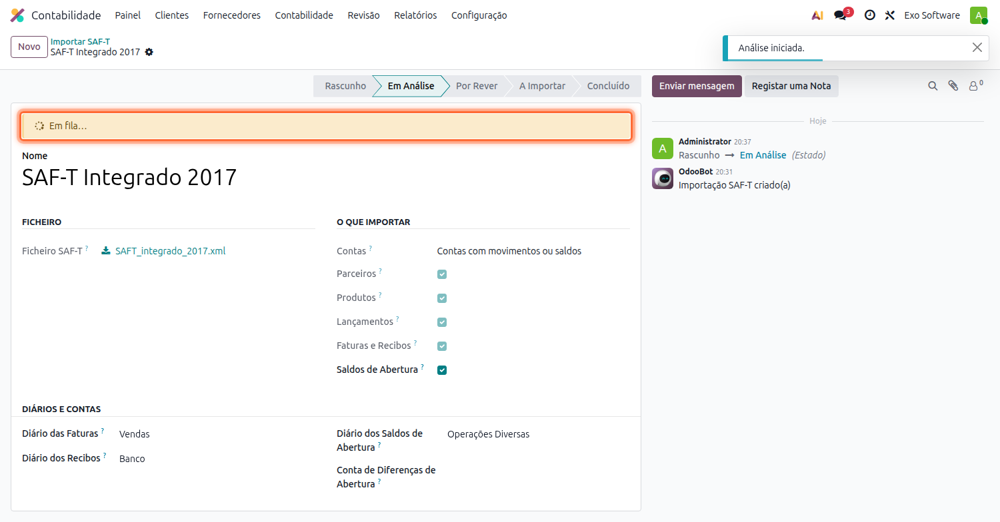

.. tip::
    A análise de um ficheiro grande, com milhares de lançamentos ou de documentos, demora menos de
    um minuto. Pode fechar o separador e voltar mais tarde

Quando termina, a importação fica **Por Rever** e o Odoo mostra o que leu do cabeçalho (tipo de
ficheiro, período, emitente, software de origem e certificado), os avisos e o que propõe fazer

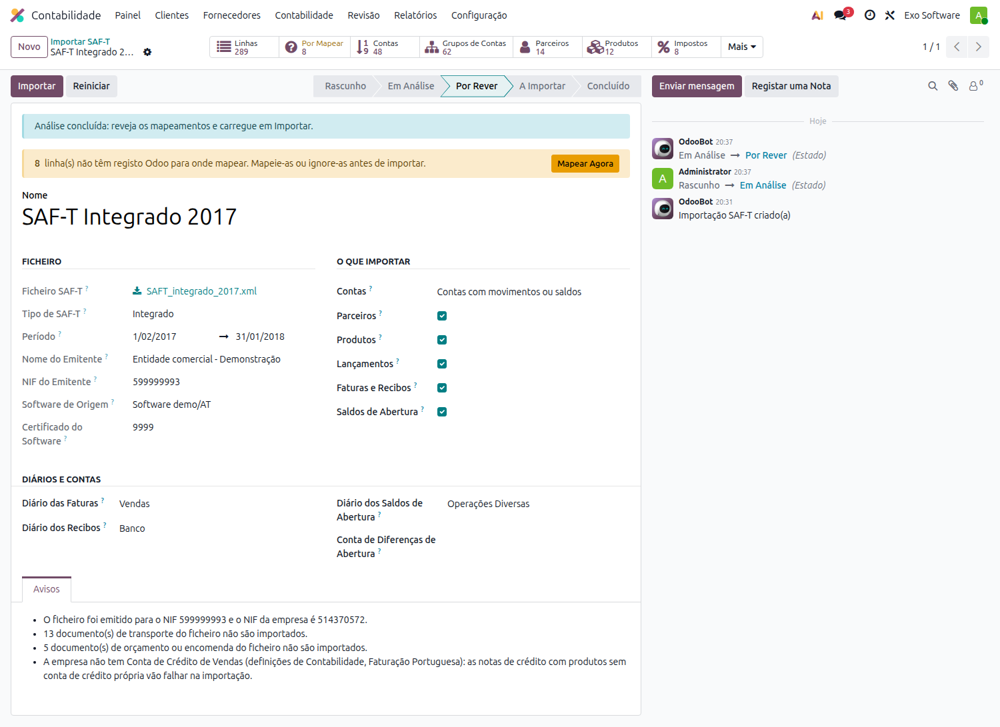

Os **Avisos** são situações encontradas no ficheiro que vale a pena conhecer e que não impedem a
importação: documentos que não são importados, contas usadas pelos lançamentos mas em falta no
plano do ficheiro, lançamentos não saldados, NIF do emitente diferente do da empresa

3. Rever o que vai ser criado
-----------------------------
Os botões no topo do formulário contam tudo o que a importação encontrou, por tipo. Antes de
importar abrem as linhas de preparação; depois de importar abrem os registos criados no Odoo

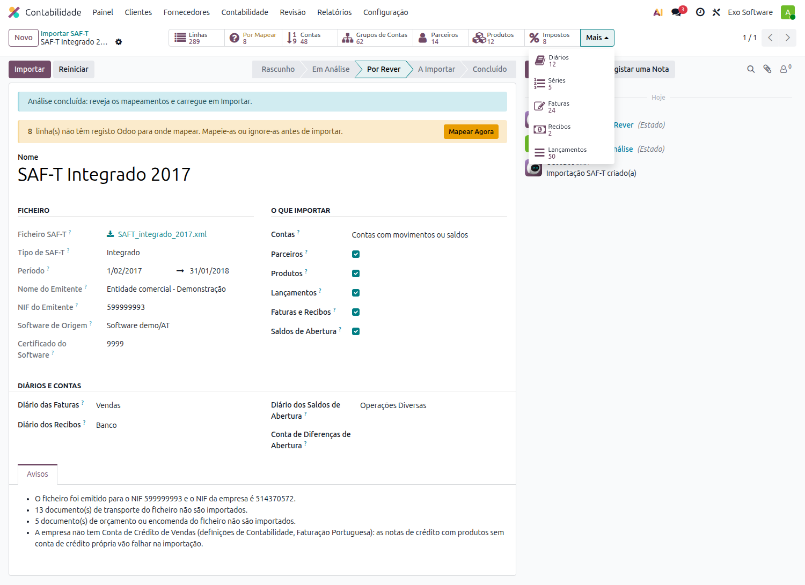

.. list-table::
    :header-rows: 1
    :widths: 25 75

    * - Botão
      - O que mostra
    * - **Linhas**
      - Todas as linhas da importação, agrupadas por tipo: a vista de conjunto
    * - **Por Mapear**
      - As linhas que ainda não têm registo Odoo. Enquanto existirem, a importação não avança
    * - **Erros**
      - As linhas que falharam, com a explicação de cada uma
    * - **Contas** e **Grupos de Contas**
      - As contas do plano e os grupos que as arrumam
    * - **Parceiros**, **Produtos**, **Impostos**, **Diários**
      - As tabelas do ficheiro e o registo Odoo correspondente
    * - **Séries**
      - As séries de integração onde os documentos importados são emitidos, uma por tipo de
        documento
    * - **Faturas**, **Recibos**
      - Os documentos do ficheiro
    * - **Lançamentos**
      - Os lançamentos contabilísticos
    * - **Saldos de Abertura**
      - O lançamento de abertura (depois de criado)

O botão **Linhas** dá a vista de conjunto, com tudo o que o ficheiro trouxe

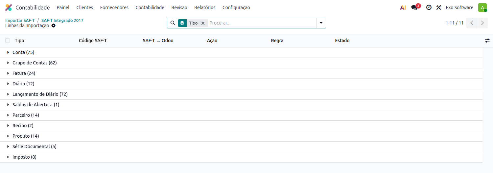

Em cada lista, a coluna **SAF-T → Odoo** conta a história de cada elemento: à esquerda o que o
ficheiro diz, à direita o que o Odoo vai fazer com ele, e por baixo a razão da proposta

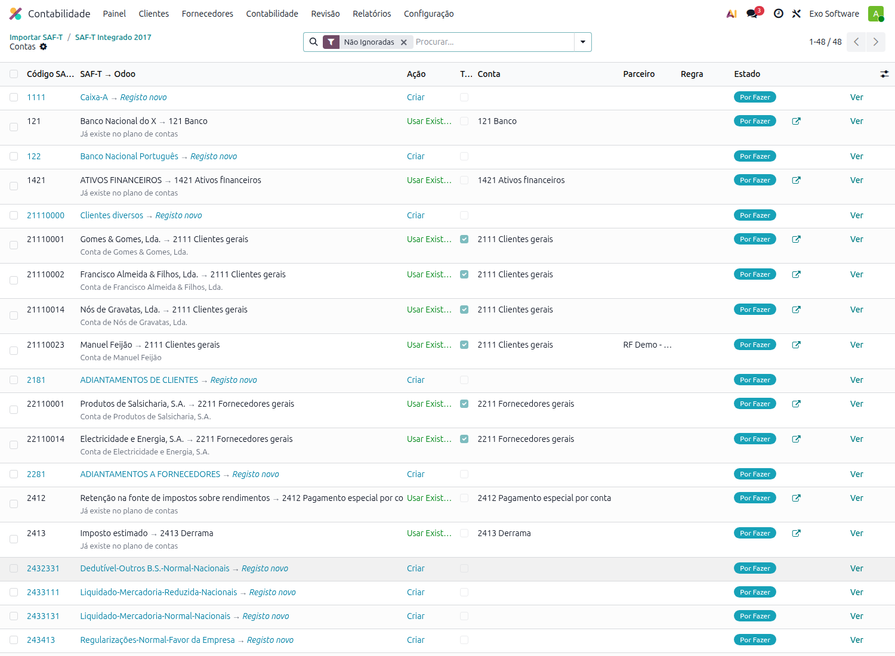

A coluna **Ação** é o que vai acontecer, e pode ser alterada:

.. list-table::
    :header-rows: 1
    :widths: 22 78

    * - Ação
      - O que faz
    * - **Criar**
      - Cria um registo novo no Odoo
    * - **Atualizar**
      - Atualiza o registo encontrado com os dados do ficheiro
    * - **Usar Existente**
      - Usa o registo tal como está, sem lhe tocar
    * - **Ignorar**
      - Deixa o elemento de fora

.. note::
    As faturas, os recibos e os lançamentos só admitem **Criar** ou **Ignorar**: são construídos a
    partir do ficheiro e não há registo Odoo para lhes escolher. Os documentos que já tinham sido
    importados antes são reconhecidos pela análise e ficam automaticamente em **Usar Existente**

Para ver ou alterar uma linha em detalhe, use o **Ver** no fim da linha

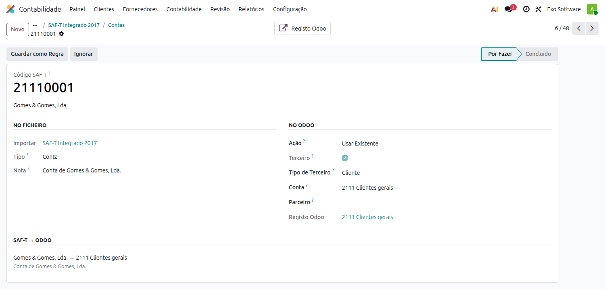

As linhas que ainda não têm para onde ir estão a amarelo e juntam-se todas no botão **Por Mapear**,
que é também o que o aviso do topo abre com **Mapear Agora**

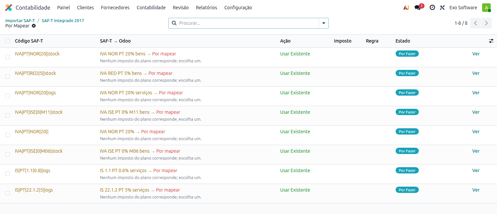

Parceiros
~~~~~~~~~
Os clientes e fornecedores do ficheiro são procurados no Odoo pelo NIF, depois pela referência e
por fim pelo nome. Quando são encontrados, a linha propõe **Atualizar** e mostra o que muda; quando
não são, propõe **Criar**. As faturas ao consumidor final, com o NIF genérico 999999990, usam
sempre o parceiro **Consumidor Final** e não criam ficha nova

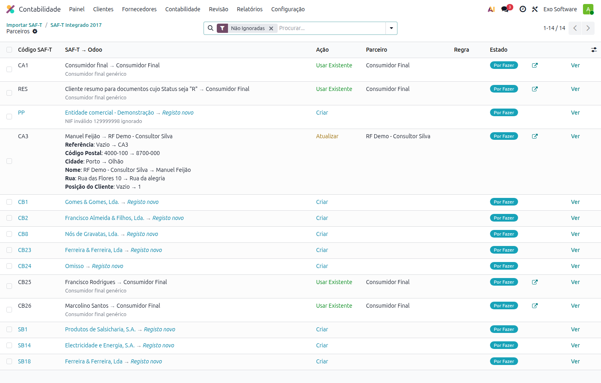

Produtos
~~~~~~~~
Os produtos são procurados pelo código, pelo código de barras e pelo nome. Um código que os
documentos usem mas que não conste da tabela de produtos do ficheiro é recolhido à mesma, marcado
como **Em Falta no Ficheiro**, para que decida o que fazer com ele. Há códigos que não são produtos
verdadeiros, como os que o próprio Odoo usa nas exportações para linhas sem artigo: esses entram
como **Linha Sem Produto**, que traz a descrição, a quantidade, o preço e o imposto sem criar
nenhum produto

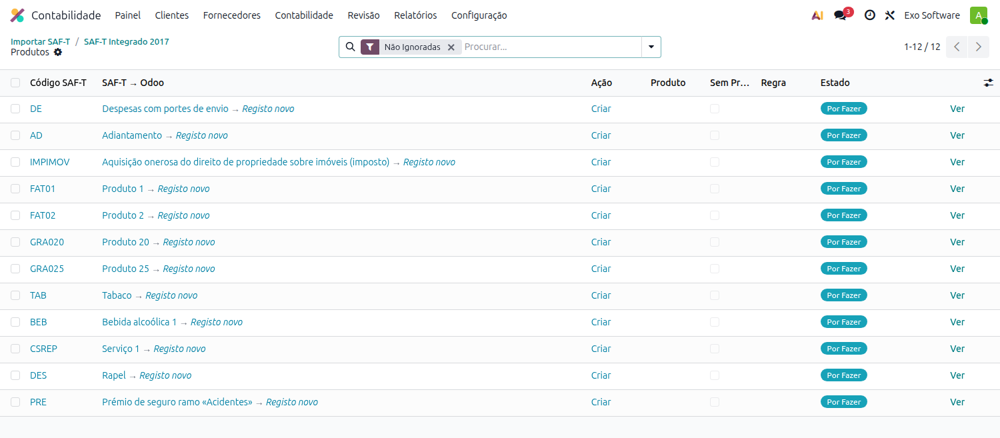

Diários
~~~~~~~
Cada diário do ficheiro é ligado ao diário do Odoo com o mesmo código, ou criado. No SAF-T o tipo
de movimento (normal, regularização, apuramento, ajustamento) vem em cada transação, enquanto no
Odoo é uma característica do diário: por isso as transações que não são normais são separadas em
diários próprios

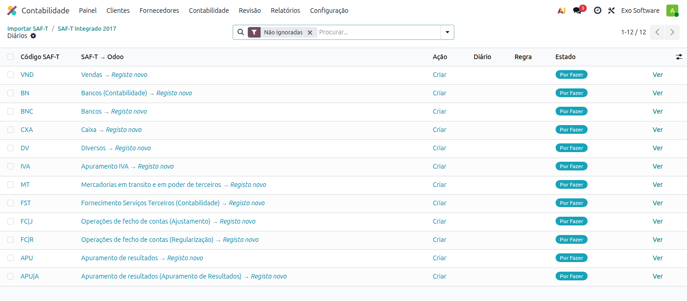

Séries documentais
~~~~~~~~~~~~~~~~~~
Os documentos importados não podem usar as séries com que a empresa fatura: o número, a data e a
assinatura vêm do software de origem. Por isso a importação usa uma **série de integração** por
tipo de documento, criada na primeira importação e reutilizada nas seguintes. Estas séries não são
comunicadas à AT e não emitem numeração nova; o número original fica guardado no documento

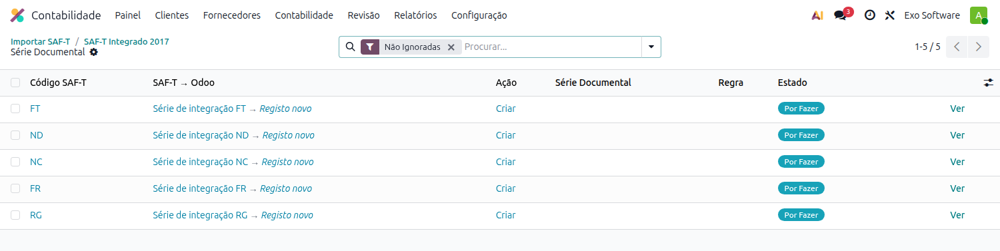

Se quiser separar as importações por série, por exemplo uma por ano ou uma por cada série do
software antigo, crie antes as séries em :menuselection:`Configuração --> Faturação --> Séries
Documentais`, com o tipo de documento respetivo e a origem **Integração**, e escolha-as aqui antes
de importar. A lista só oferece séries de integração do mesmo tipo de documento

Documentos e lançamentos
~~~~~~~~~~~~~~~~~~~~~~~~
As faturas, os recibos e os lançamentos aparecem com a data, o valor e o parceiro que o ficheiro
indica, prontos a criar

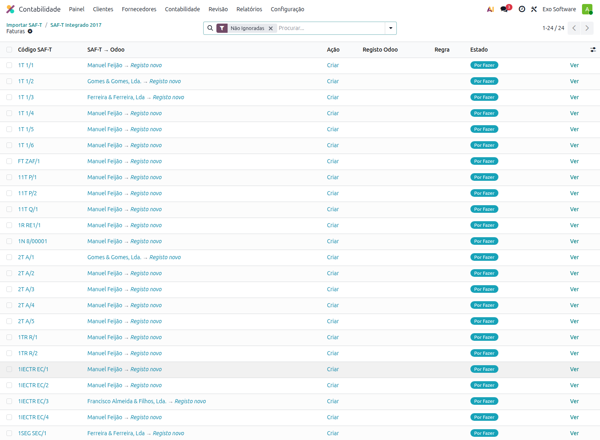

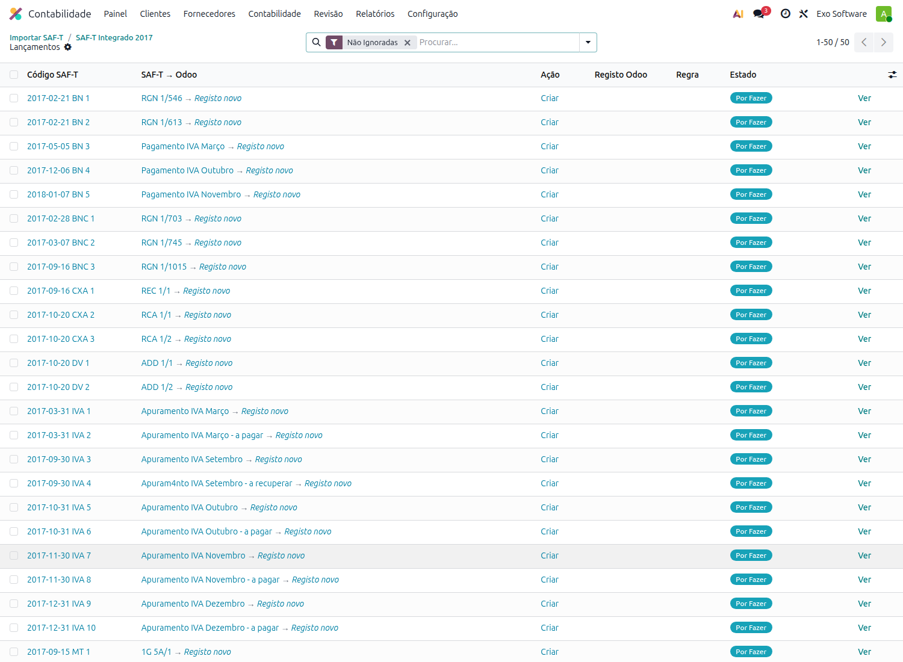

.. note::
    Num ficheiro **integrado**, as faturas e os recibos também aparecem na contabilidade do
    ficheiro. Para não lançar duas vezes a mesma operação, as transações que correspondem a
    documentos importados são ignoradas, com a nota do documento que as originou

Contas de terceiros
~~~~~~~~~~~~~~~~~~~
Muitos programas abrem uma conta por cliente e por fornecedor (21110001, 21110002, ...). O Odoo
trabalha de outra maneira: uma única conta a receber e uma única conta a pagar, com o parceiro em
cada linha. A análise deteta essas contas pelo ``AccountID`` que o cliente ou o fornecedor indica no
ficheiro, marca-as como **Conta de Terceiro** e encaminha os seus movimentos para a conta do
parceiro, em vez de criar centenas de contas novas

Se o software de origem não declarar essa ligação, pode dizê-lo com uma regra **Conta de
Terceiro** sobre o prefixo das contas

Impostos
~~~~~~~~
Os impostos nunca são criados pela importação: cada imposto do ficheiro tem de apontar para um
imposto do plano da empresa. Num ficheiro antigo é normal aparecerem taxas que já não existem (IVA
a 20%, a 5%, isenções revogadas). Nesse caso, ou cria no plano o imposto com a taxa histórica, ou
mapeia para o equivalente atual

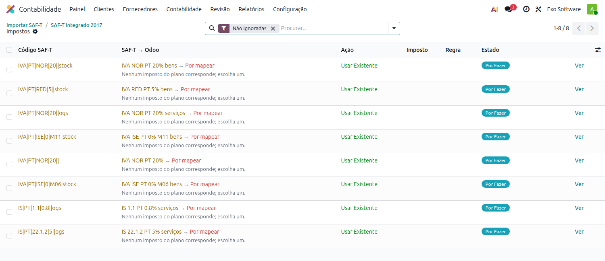

.. warning::
    O Odoo confirma o imposto calculado contra o que o documento declara. Se mapear uma taxa de 20%
    para um imposto de 23%, os documentos que a usam vão falhar na importação por diferença de
    valores. Para períodos antigos, crie o imposto com a taxa da época

Para mapear, escolha o registo Odoo na coluna do tipo respetivo

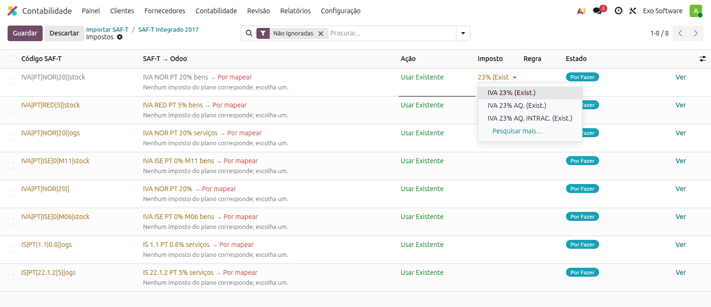

Assim que todos os impostos têm destino, deixa de haver linhas por mapear e a importação pode
avançar

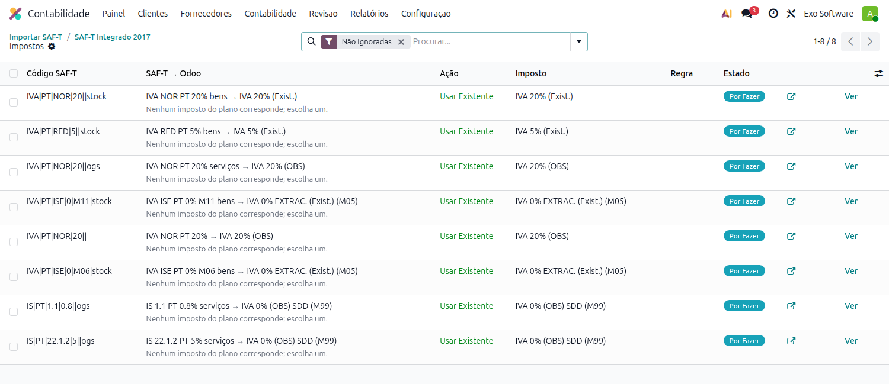

.. _saft_import_regras:

4. Guardar um mapeamento como regra
-----------------------------------
Depois de mapear uma ou mais linhas, selecione-as e carregue em **Guardar como Regra**. O Odoo
sugere como reconhecer aqueles códigos: uma regra exata por código, ou uma única regra pelo início
que todos partilham, e mostra logo que códigos da importação é que o padrão reconhece

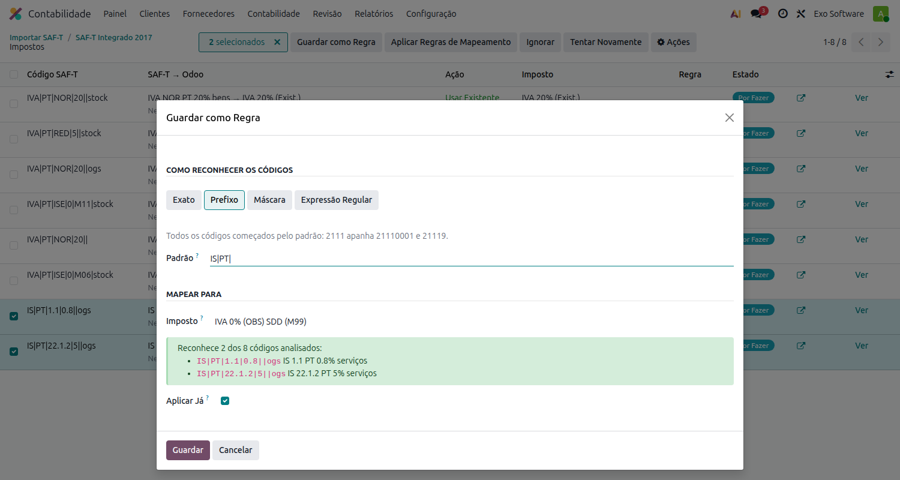

Com **Aplicar Já** ligado, a regra é aplicada de imediato às linhas que ainda não estavam
mapeadas. Na importação seguinte da mesma empresa, esses códigos já vêm resolvidos de origem

Para voltar a aplicar as regras depois de as alterar, use **Aplicar Regras de Mapeamento**: no
formulário da importação trata de todas as linhas pendentes, na lista de linhas trata só das
selecionadas. A janela mostra que regras batem certo e deixa desmarcar as que não quiser aplicar
agora

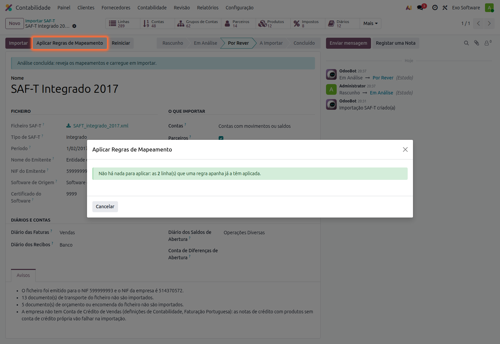

5. Importar
-----------
Quando não houver linhas por mapear, carregue em **Importar**

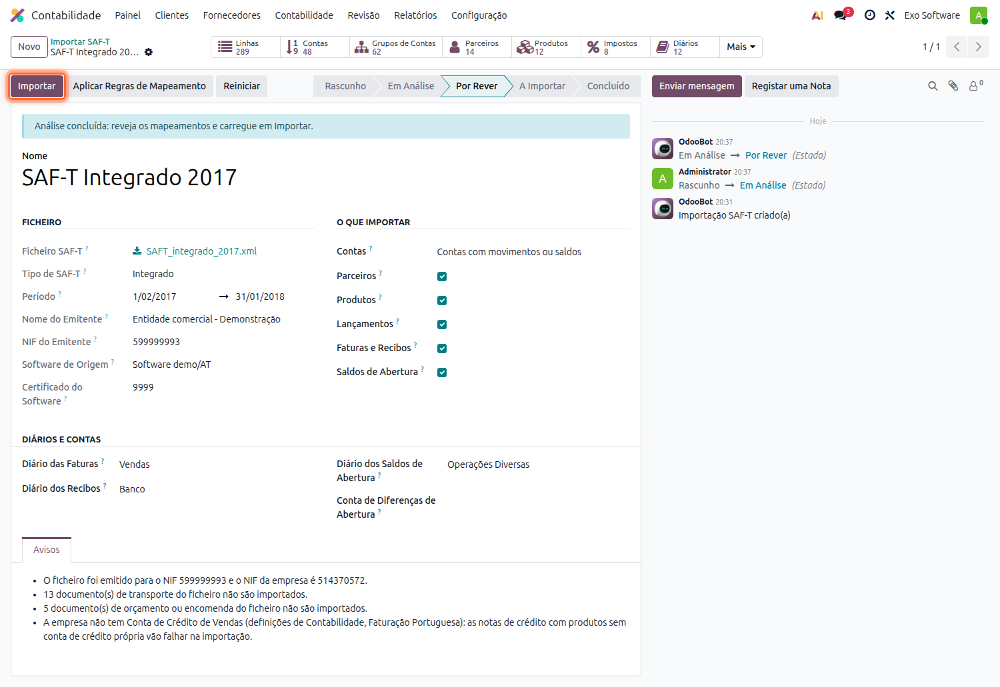

Os registos são criados em segundo plano, pela ordem certa: primeiro as contas, os parceiros, os
produtos, os impostos, os diários e as séries, depois os documentos, os lançamentos e, por fim, os
saldos de abertura

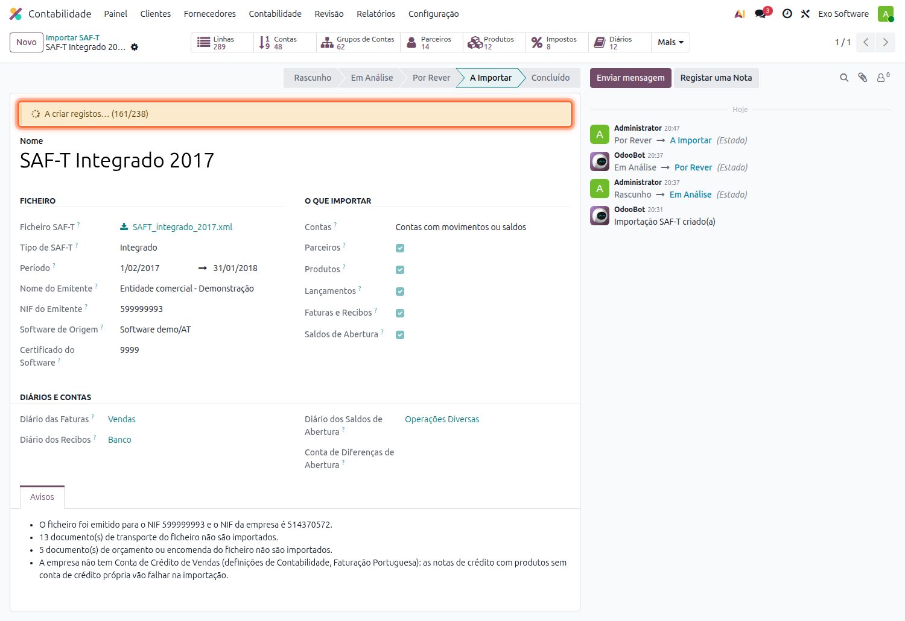

.. tip::
    A criação é bastante mais demorada do que a análise, porque cada documento é lançado como se
    fosse emitido: num ficheiro com milhares de documentos conte com dezenas de minutos. O trabalho
    é retomado onde ficou, por isso pode fechar o separador

Se alguma coisa correr mal, só essa linha falha: o resto da importação continua e no fim a
importação fica em **Erro** com o número de registos que não entraram. O botão **Erros** explica
cada um

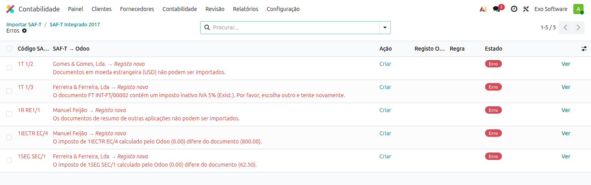

Depois de corrigir a causa (mapear o que faltava, criar o imposto certo, preencher uma conta nas
definições), selecione as linhas e carregue em **Tentar Novamente**: só os registos que falharam
são repetidos. Se um documento não puder mesmo ser importado, selecione-o e carregue em **Ignorar**
para poder fechar a importação

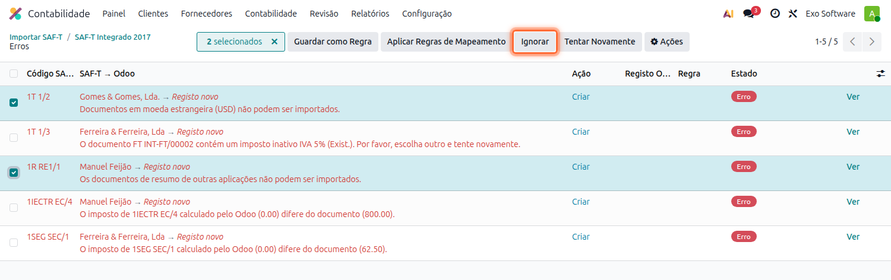

Há documentos que o Odoo não pode guardar como documento fiscal e que são sempre recusados: os que
estão em moeda estrangeira, os documentos de resumo de outras aplicações, os de autofaturação e os
tipos que a localização não trata (VD, TV, entre outros)

6. Depois de importar
---------------------
A importação fica **Concluído** e os botões do topo passam a abrir os registos criados

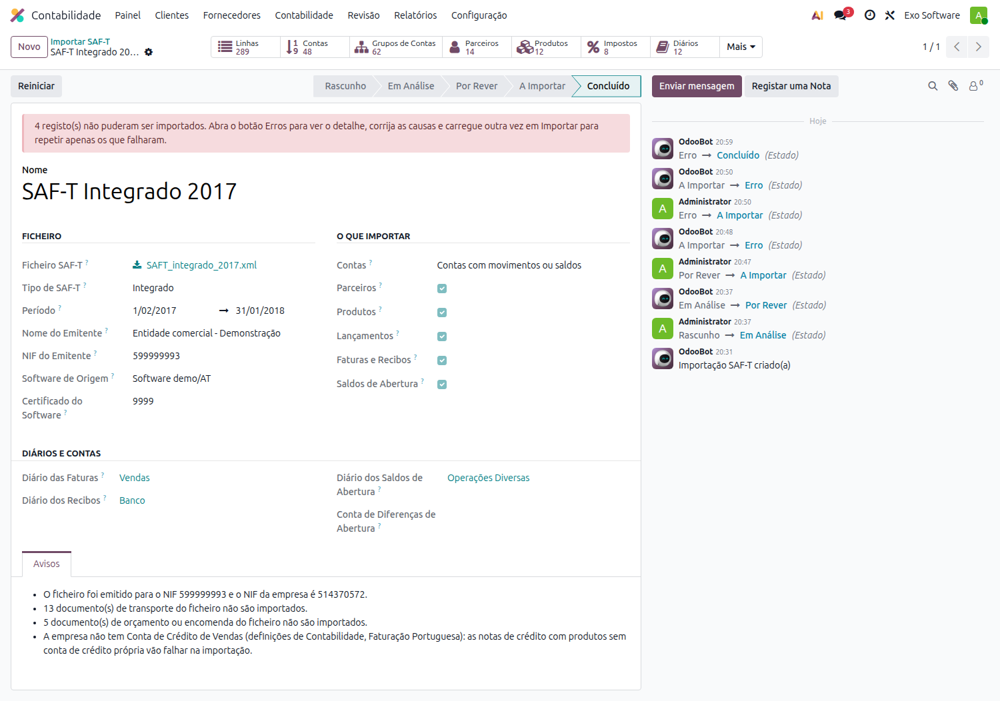

O que foi criado:

- As **faturas, notas de crédito e recibos** ficam lançados, como documentos de integração: mantêm
  o número, o ATCUD e a assinatura do software de origem, e saem no SAF-T exportado pelo Odoo com
  origem **I**. Cada tipo de documento tem a sua série de integração, criada na primeira importação
- Os **lançamentos contabilísticos** e o **lançamento dos saldos de abertura** ficam em **rascunho**,
  para serem revistos antes de lançados. Um lançamento publicado já não se apaga, por isso a
  decisão é sua
- Os **recibos** ficam reconciliados com as faturas que liquidam, quando essas faturas também
  vieram no ficheiro ou já existiam no Odoo

O botão **Faturas** passa a abrir os documentos criados

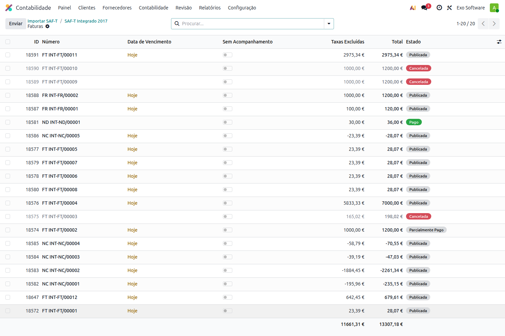

Cada documento fica com o nome interno da série de integração e, ao lado, o número original do
software de origem

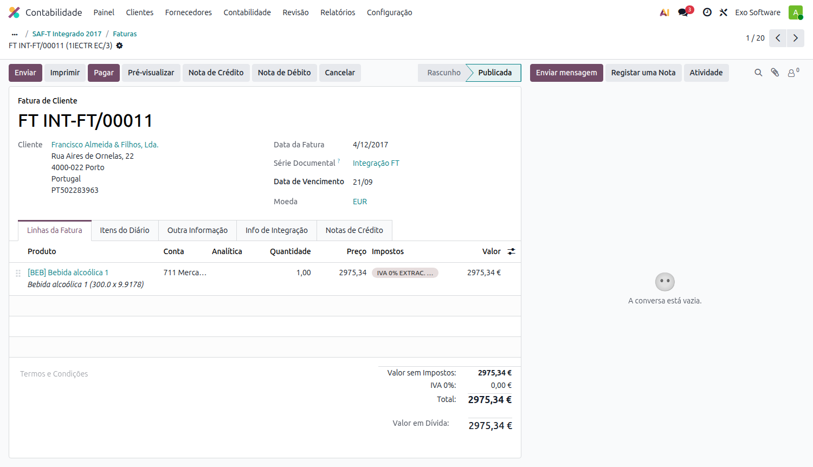

No separador **Info de Integração** encontra o que veio do ficheiro e que a lei manda conservar: a
assinatura digital, a versão da chave privada (o certificado do software de origem), a data de
validação e o número do documento integrado

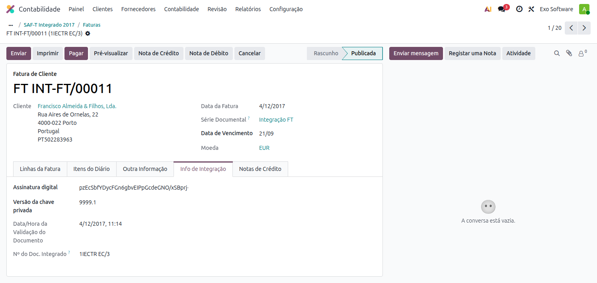

O lançamento dos saldos de abertura tem uma linha por conta com saldo, com o parceiro nas contas de
terceiros, e fica em rascunho

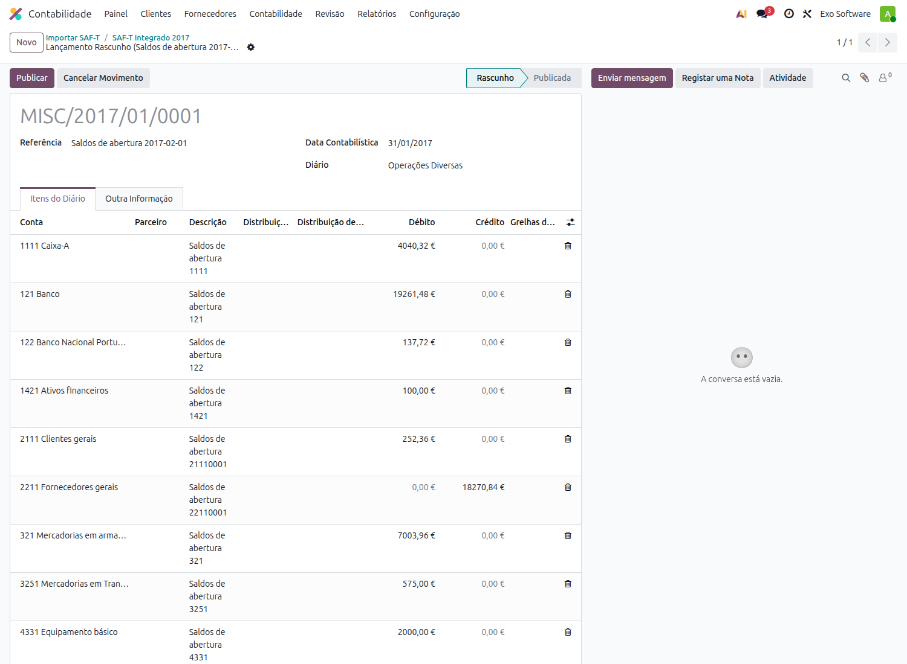

.. tip::
    Para lançar os movimentos depois de os rever, abra-os pelo botão **Lançamentos**, selecione-os
    na lista e use o botão **Publicar**

Casos particulares
==================

Importar o mesmo ficheiro outra vez
-----------------------------------
Não duplica nada. A análise reconhece o que já existe no Odoo (documentos pelo número original,
lançamentos pela referência, contas e parceiros pelos códigos) e marca essas linhas como **Usar
Existente**, com a nota *Já existe no Odoo*. Isto permite retomar uma importação interrompida ou
importar um ficheiro que se sobrepõe em parte a outro já importado

Ficheiros de outros softwares
-----------------------------
O importador foi ensaiado com ficheiros de vários programas certificados além do Odoo. O que
costuma precisar de atenção nesses ficheiros:

- taxas de IVA que já não existem no plano atual
- contas por cliente e por fornecedor, tratadas como contas de terceiros
- códigos de produto usados nos documentos mas ausentes da tabela de produtos do ficheiro, que a
  análise recolhe à mesma para que os possa mapear
- ficheiros que não cumprem o esquema da AT, que são recusados com a indicação do elemento em falta

Receber o ficheiro por email
----------------------------
Pode criar um alias de email para o modelo da importação em :menuselection:`Definições -->
Técnico --> Aliases`. Um email enviado para esse endereço com um SAF-T em anexo cria uma importação
em rascunho com o ficheiro, na empresa a que o NIF do ficheiro pertence. Nada é analisado nem
importado automaticamente

Reiniciar uma importação
------------------------
O botão **Reiniciar** apaga as linhas de preparação e devolve a importação a rascunho, para trocar
o ficheiro ou as opções. Os registos já criados no Odoo não são tocados
