:show-content:

==================
Declarações de IVA
==================
Veja os procedimentos que deve seguir para conseguir cada uma das declarações de IVA e garantir que os seus períodos
fiscais estão salvaguardados

.. raw:: html

    

        ─── ✦ ───
    

Declaração Períódica IVA
========================
A Declaração de IVA serve para apuramento de imposto a entregar ou receber, resultante da diferença entre impostos
liquidados e impostos dedutíveis para um determinado período

Após a conclusão dos seus movimentos no período respetivo deve seguir o seguinte procedimento:

- Declarações de suporte (:ref:`Declaração Recapitulativa IVA <vat_recapitulative_statment>`, :ref:`Anexo R <vat_anex_r>`)
- Validar a declaração
- Emitir e submeter na AT
- Fazer os movimentos contabilísticos necessários
- Fechar o período

Retirar a declaração
--------------------
Para a retirarem deve na app **Faturação / Contabilidade** (dependendo respetivamente se tem versão Community ou
Enterprise do Odoo), ir ao menu de **Relatórios** e no separador Portugal selecione a opção **Declarações Impostos**

.. image:: ../invoicing/fiscal_documents/v17_appInvoicingAccounting.png
   :align: center

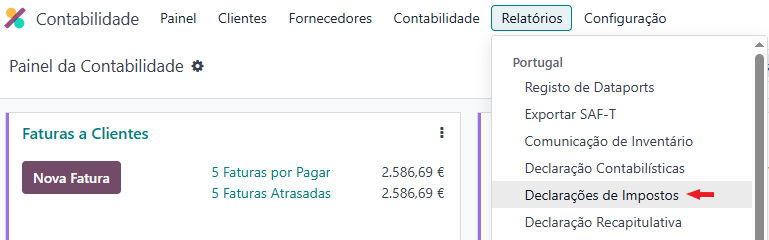

No assistente que abre selecione o tipo de declaração como **IVA - Decl. Periódica**, o **Período** ou selecione
manualmente **Data Inicial** e **Data Final**

A **Localização da Sede** é selecionada com base na morada que consta da morada da Empresa

Caso exista Declarações Períodica do Período Anterior para regularizar deve incluir a mesma, ou apenas o valor a acrescentar

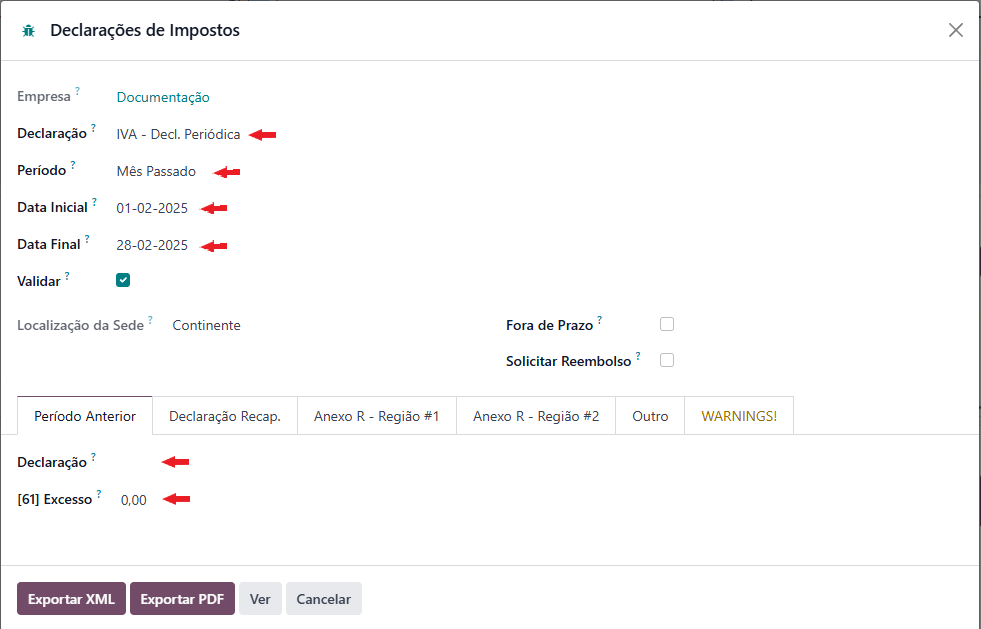

Acrescente depois Declarações Recapitulativas ou Anexos R existentes

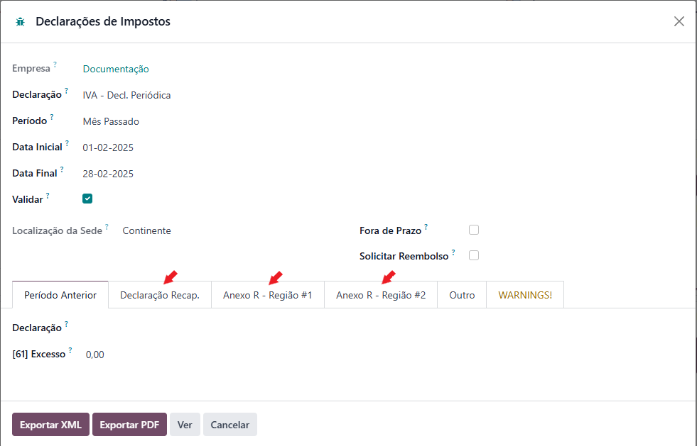

Como em alguns casos pode acontecer de não ter toda a informação em Odoo, existe a aba Outro para incluir alterações
necessárias bem como os valores de impostos de importações já liquidados

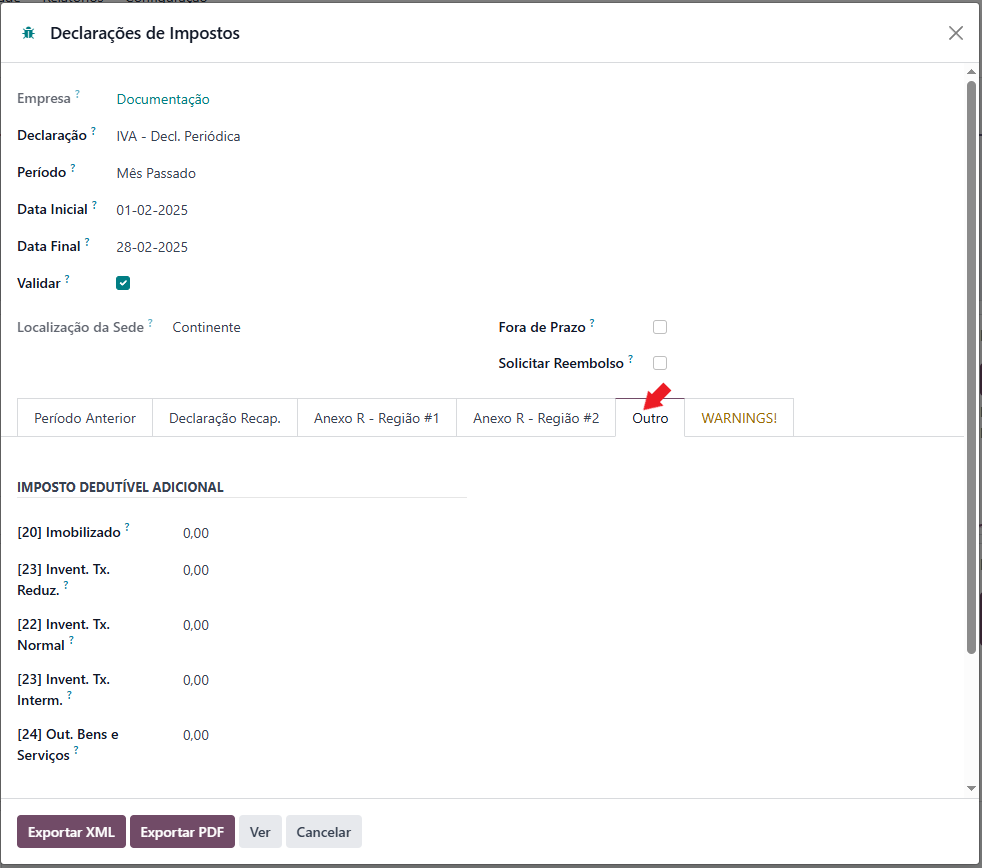

Aconselhamos que primeiro veja os valores esperados para saber se vai solicitar Reembolso, ou não

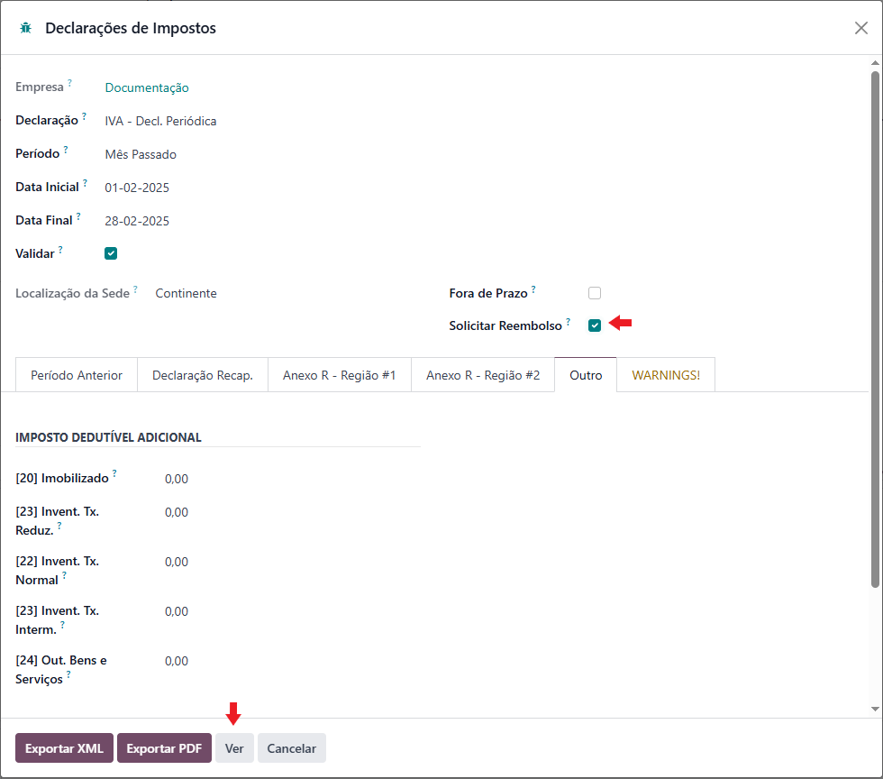

Caso esteja a submeter uma declaração **Fora de Prazo** selecione o campo correspondente

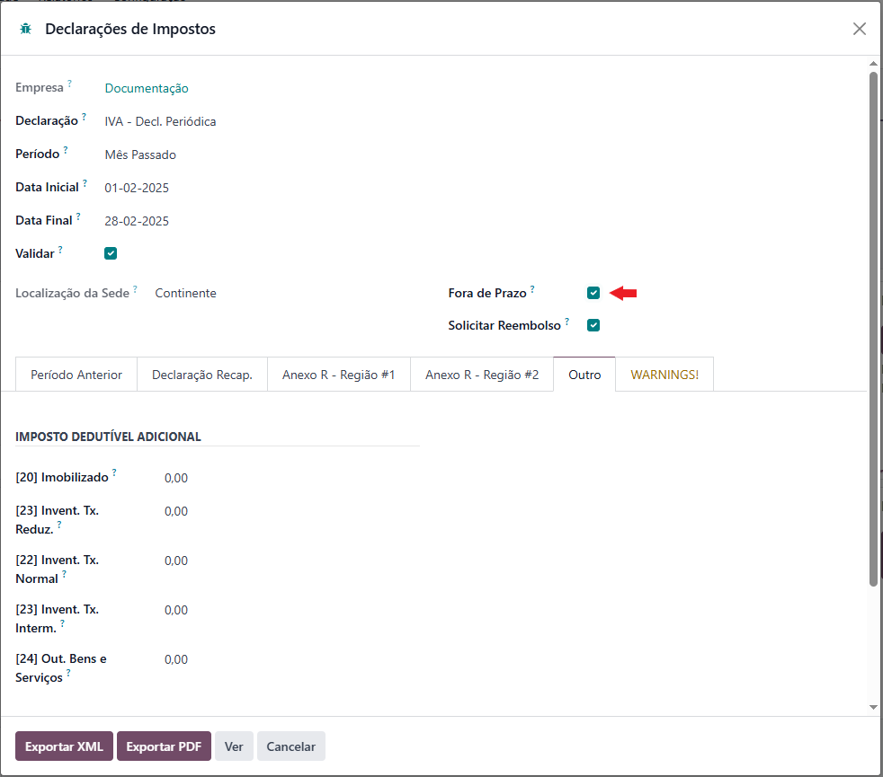

Depois de validar os valores esperados pode Exportar um PDF da decladação para guardar e Eeportar o ficheiro respetivo
para submissão na AT

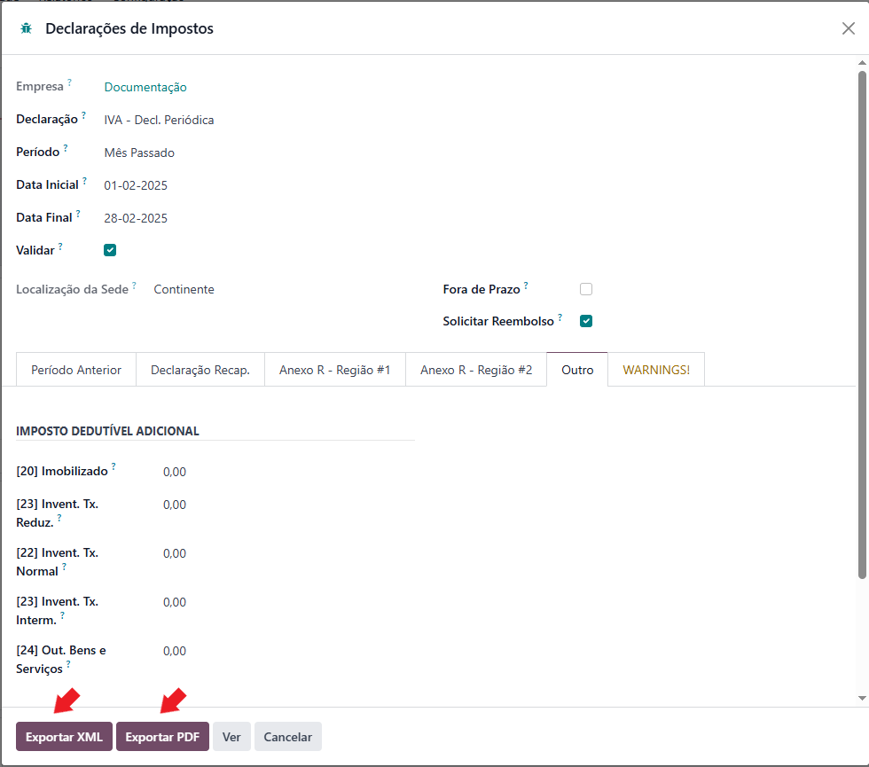

Verá um resumo dos valores constantes na declaração e terá um link para fazer o download do ficheiro e a possibilidade
de o guardar em Dataport, o que recomendamos para poder ser utilizada na Declaração Períodica IVA seguinte

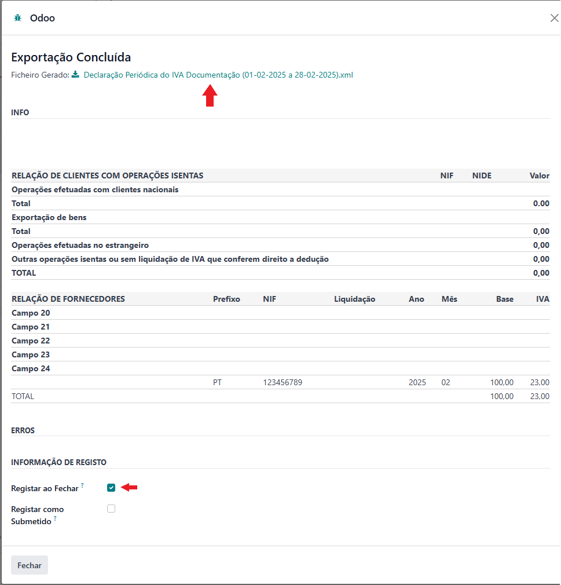

Movimentos contabilísticos
--------------------------

.. important::
    O processo de gerar uma declaração não gera qualquer movimento contabilístico

Para que o processo possa ser devidamente concluído deve depois de extrair as declarações efetuar os movimentos
contabilísticos para refletir o resultado das declarações

Existem 2 processos para fazer este processo:

- Um lançamento manual em diário que registe as mudanças de contas dos valores, para isso deve ir ao menu **Contabilidade** e selecionar a opção **Lançamentos de Diário** fazendo um novo

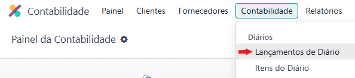

- Utilizar a ferramenta da Exo Software de **Transferências de Saldos**

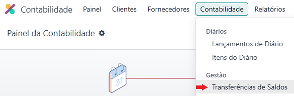

.. seealso::
    Conheça a ferramenta de :doc:`Transferências de Saldos <balance_transfer>`

    `Se pretender formação sobre a ferramenta solicite <https://exosoftware.pt/appointment>`_

Fecho do período
----------------
Terminados os movimentos relativos ao período e feitos os movimentos de tranferência de saldos deve fechar o período
para garantir que nenhum utilizador não autorizado altera os valores que estão para trás impedindo registos não
autorizados pela contabilidade

Para o fazer deve na app **Faturação / Contabilidade** (dependendo respetivamente se tem versão Community ou
Enterprise do Odoo), ir ao menu de **Contabilidade** e no separador Ações selecione a opção **Bloquear Datas**

.. image:: ../invoicing/fiscal_documents/v17_appInvoicingAccounting.png
   :align: center

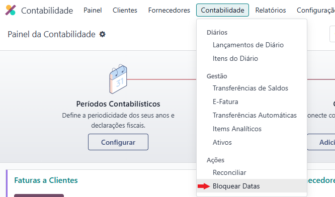

No assistente que se abre preencha o campo **Data de Bloqueio da Declaração Fiscal**

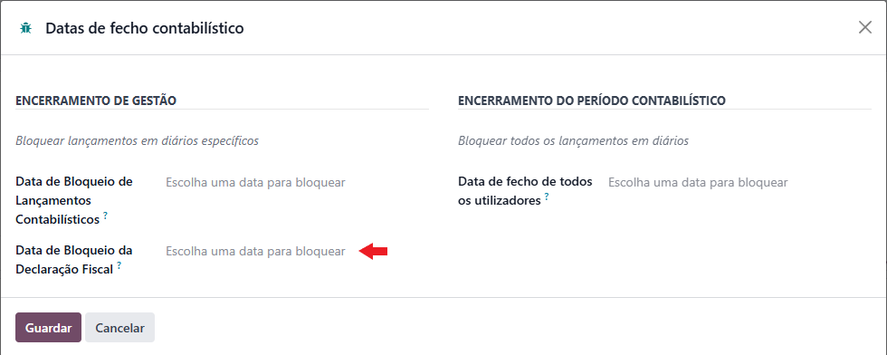

.. _vat_recapitulative_statment:

Declaração Recapitulativa IVA
=============================
A Declaração recapitulativa é enviada sempre que se efetuem tranmissões intracomunitárias e os valores resultantes da
mesma são usados para o preenchimento da Declaração Periódica IVA

Para a retirarem deve na app **Faturação / Contabilidade** (dependendo respetivamente se tem versão Community ou
Enterprise do Odoo), vá ao menu de **Relatórios** e no separador Portugal selecione a opção **Declaração Recapitulativa**

.. image:: ../invoicing/fiscal_documents/v17_appInvoicingAccounting.png
   :align: center

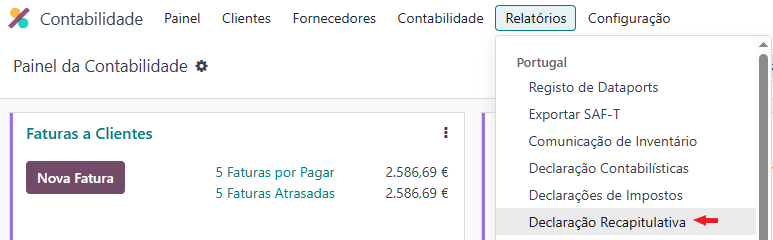

No assistente que abre selecione o **Período** ou selecione manualmente **Data Inicial** e **Data Final**

Carregue em Exportar XML

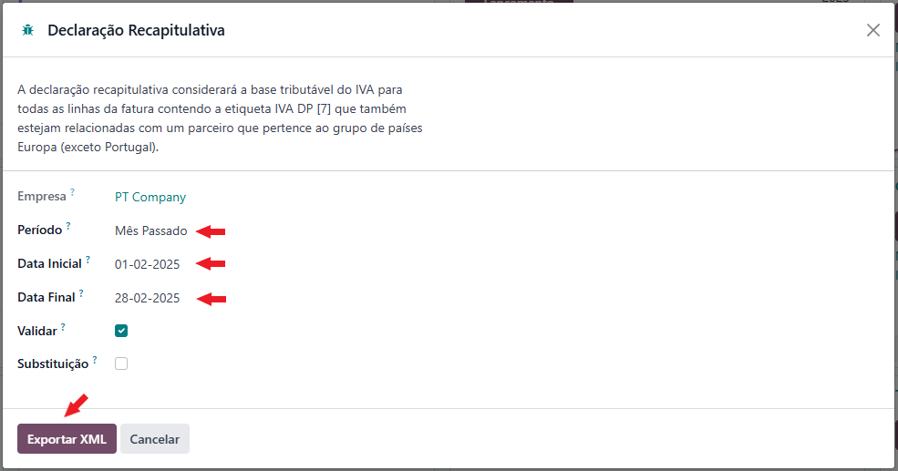

Nos casos em que queira fazer uma declaração de **Substituíção** assinale o campo próprio para o efeito

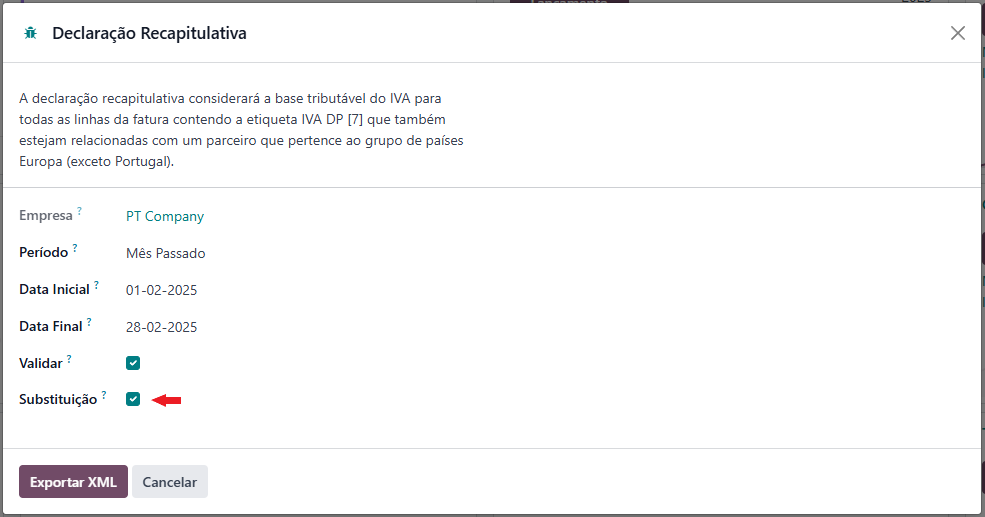

Vai ter acesso a um resumo dos cálculos contidos no documento, terá um link para fazer o download do ficheiro e a
possibilidade de o guardar em Dataport, o que recomendamos para poder ser utilizada na Declaração Períodica IVA

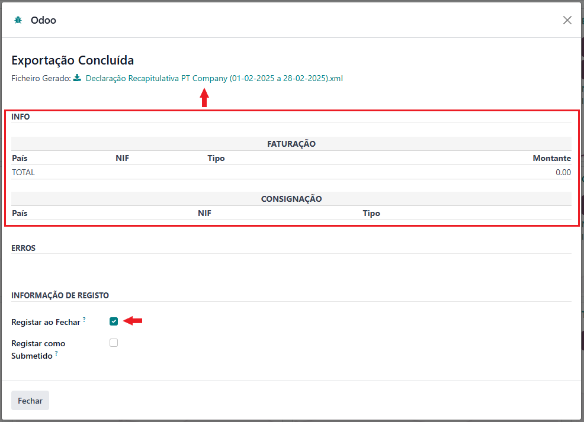

.. _vat_anex_r:

Anexo R
=======
O Anexo R da Declaração Periódica IVA é um anexo que permite às entidades declarar transações com outras regiões do
território nacional, que se divide em 3 regiões:

- Continente
- Açores
- Madeira

A Declaração Periódica é emitida com base na morada fiscal da empresa, no entanto, pode ser necessário declarar valores
com incidência em alguma das outras regiões do território nacional, para esse efeito usa-se este anexo

.. important::
    É aconselhado que historicamente se preencha sempre como **Anexo R - Região #1** e **Anexo R - Região #2** para as
    mesmas regiões, por exemplo:

    - A entidade tem sede fiscal no Continente
    - Usar sempre Região #1 para Açores e Região #2 para Madeira ou vice-versa

Para a retirarem deve na app **Faturação / Contabilidade** (dependendo respetivamente se tem versão Community ou
Enterprise do Odoo), vá ao menu de **Relatórios** e no separador Portugal selecione a opção **Declarações Impostos**

.. image:: ../invoicing/fiscal_documents/v17_appInvoicingAccounting.png
   :align: center

No assistente que abre selecione o tipo de declaração como **IVA - Decl. Periódica - Anexo R**, o **Período** ou
selecione manualmente **Data Inicial** e **Data Final**, e a **Localização das Operações** que pretende

Como em alguns casos pode acontecer de não ter toda a informação em Odoo, existe a aba Outro para incluir alterações
necessárias bem como os valores de impostos de importações já liquidados

Exporte o ficheiro

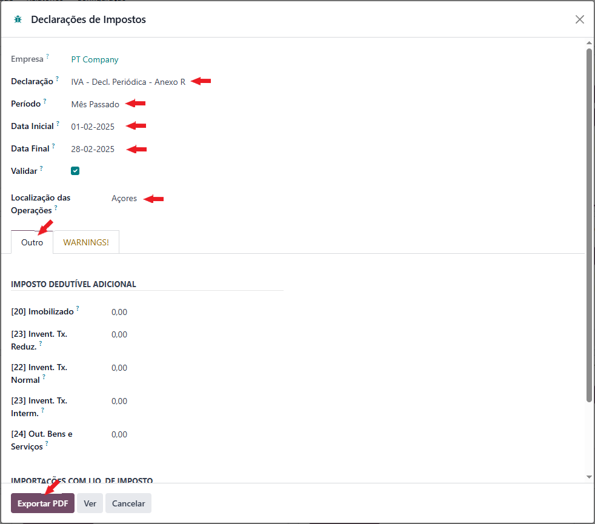

Terá um link para fazer o download do ficheiro e a possibilidade de o guardar em Dataport, o que recomendamos para poder
ser utilizada na Declaração Períodica IVA

