:show-content:

==================
Declarações de IVA
==================
Veja os procedimentos que deve seguir para conseguir cada uma das declarações de IVA e garantir que os seus períodos
fiscais estão salvaguardados

A Declaração Periódica do IVA e a Declaração Recapitulativa têm um ecrã novo, descrito em
`Nova Declaração Periódica e Declaração Recapitulativa`_. As declarações anteriores continuam disponíveis e são
descritas nas secções seguintes

.. raw:: html

    

        ─── ✦ ───
    

Nova Declaração Periódica e Declaração Recapitulativa
=====================================================
A Declaração Periódica do IVA e a Declaração Recapitulativa passam a ter um ecrã próprio, no mesmo sítio das restantes
declarações. Escolhe o período, calcula a declaração, revê cada campo e exporta o ficheiro XML para submeter no Portal
das Finanças ou o formulário oficial em PDF. O cálculo demora poucos segundos, mesmo em empresas com muitos movimentos

Para as abrir deve na app **Contabilidade** ir ao menu :menuselection:`Relatórios --> Portugal --> Impostos` e
selecionar a opção **Declaração Periódica de IVA** ou **Declaração Recapitulativa de IVA**

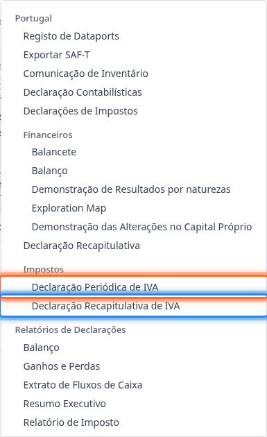

.. note::
    As declarações anteriores (**Declarações de Impostos** e **Declaração Recapitulativa**) continuam disponíveis no
    mesmo menu. Pode retirar as duas versões para o mesmo período e comparar os valores

Declaração Periódica do IVA
---------------------------
No assistente que abre selecione o **Período**: o mês ou o trimestre a declarar

A **Localização da Sede** é preenchida com base na morada da Empresa. Os valores da **Declaração Anterior** (campo 61,
excesso a reportar) e da **Decl. Recapitulativa** (campo 7) são lidos das declarações do Registo de Dataports
marcadas como reportadas, e pode alterá-los antes de calcular

Na secção **Valores Manuais** pode acrescentar os valores que não estão no Odoo, como o imposto das importações já
liquidado ou imposto dedutível adicional

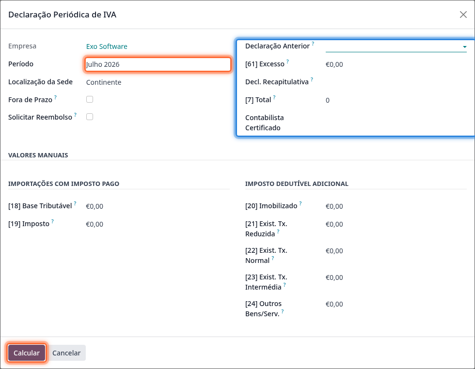

Assinale **Solicitar Reembolso** se pretende pedir o reembolso do crédito de imposto, e **Fora de Prazo** se a
declaração for entregue depois do prazo. Carregue em **Calcular**

Depois do cálculo, a secção **Avisos** indica o que convém rever antes de submeter a declaração, por exemplo:

- o total da Declaração Recapitulativa não bate com as operações intracomunitárias do período
- há impostos de IVA sem etiqueta da declaração periódica
- há notas de crédito no período relativas a faturas de outro período, que podem obrigar a uma declaração de
  substituição desse período

Logo abaixo, a secção **Declaração** resume o tipo de operações encontradas, e a secção **Anexo R** indica as regiões
com operações, diferentes da sede

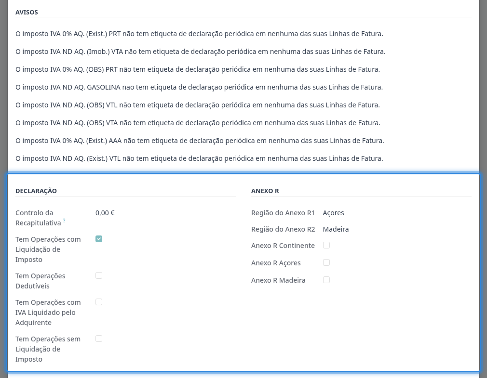

O separador **Rosto** mostra o valor de cada campo da declaração. Carregue em **Ver** para abrir os movimentos
contabilísticos que compõem o campo

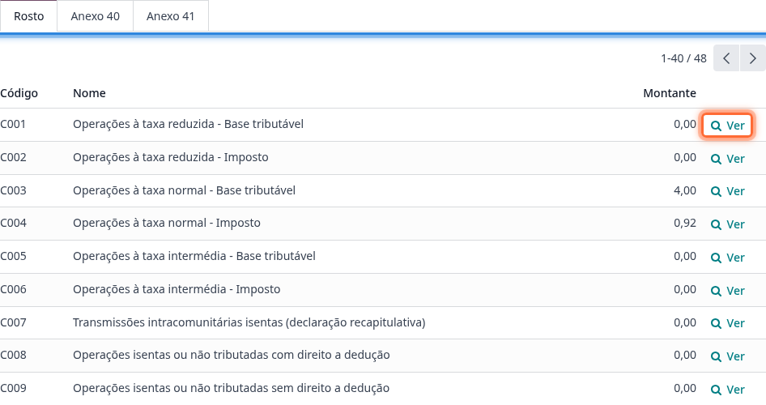

Os separadores **Anexo 40** e **Anexo 41** detalham as regularizações. Quando pede o reembolso aparecem também os
anexos de reembolso de **Clientes** e de **Fornecedores**

O **Anexo R** das operações localizadas nas outras regiões é calculado com a declaração e aparece no seu próprio
separador, sem ter de ser retirado região a região. O primeiro Anexo R preenche os campos 65 e 66 da declaração, e só
um segundo Anexo R, quando há operações nas duas outras regiões, preenche os campos 67 e 68

Depois de rever os valores, exporte o ficheiro com **Exportar XML** para o submeter no Portal das Finanças, ou o
formulário oficial com **Exportar PDF**. Para mudar o período ou os valores manuais carregue em **Alterar Opções** e
volte a calcular

.. tip::
    Depois de exportar, assinale **Registar ao Fechar** e **Registar como Reportado** antes de fechar o assistente. A
    declaração fica guardada no Registo de Dataports, e é daí que a declaração do período seguinte lê o excesso a
    reportar (campo 61)

Declaração Recapitulativa
-------------------------
No assistente que abre selecione o **Período** e carregue em **Calcular**. O separador **Faturação** lista o valor das
transmissões intracomunitárias por país, cliente e natureza (bens ou serviços), e a secção **Totais** soma-os

Carregue em **Exportar XML** para obter o ficheiro a submeter no Portal das Finanças

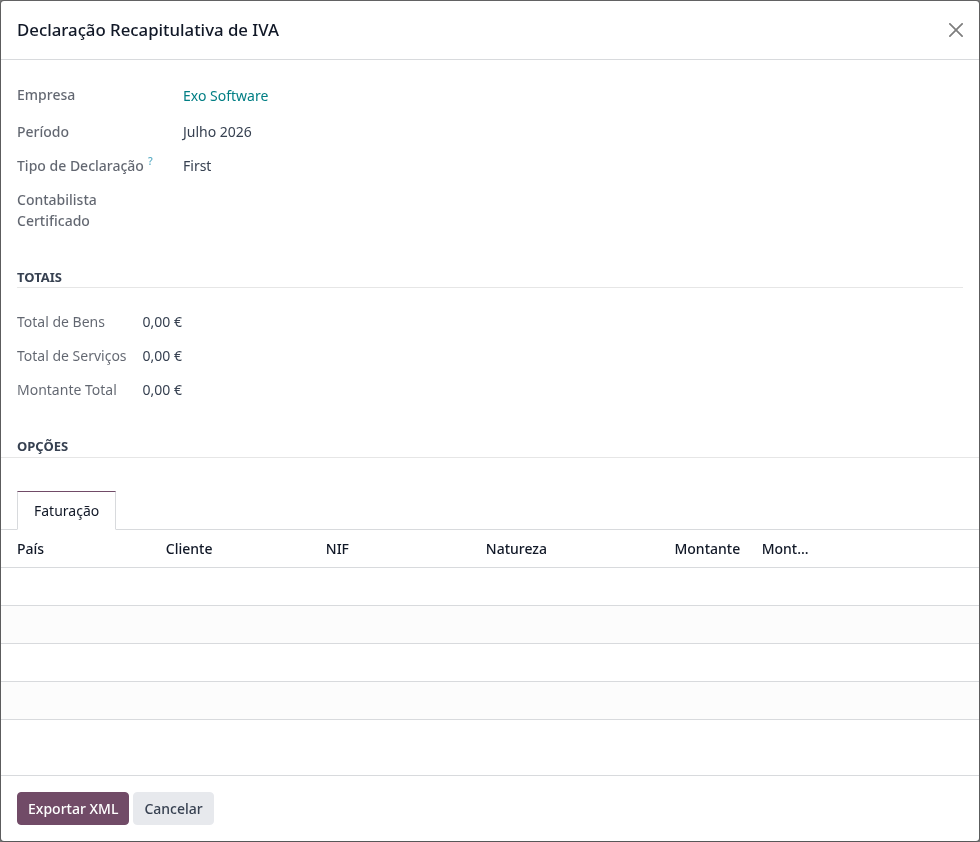

.. tip::
    Assinale também aqui **Registar ao Fechar** e **Registar como Reportado** antes de fechar o assistente. É do
    Registo de Dataports que a Declaração Periódica do mesmo período lê o total do campo 7

Declaração Periódica IVA
========================
A Declaração de IVA serve para apuramento de imposto a entregar ou receber, resultante da diferença entre impostos
liquidados e impostos dedutíveis para um determinado período

Após a conclusão dos seus movimentos no período respetivo deve seguir o seguinte procedimento:

- Declarações de suporte (:ref:`Declaração Recapitulativa IVA <vat_recapitulative_statment>`, :ref:`Anexo R <vat_anex_r>`)
- Validar a declaração
- Emitir e submeter na AT
- Fazer os movimentos contabilísticos necessários
- Fechar o período

Retirar a declaração
--------------------
Para a retirarem deve na app **Faturação / Contabilidade** (dependendo respetivamente se tem versão Community ou
Enterprise do Odoo), ir ao menu de **Relatórios** e no separador Portugal selecione a opção **Declarações Impostos**

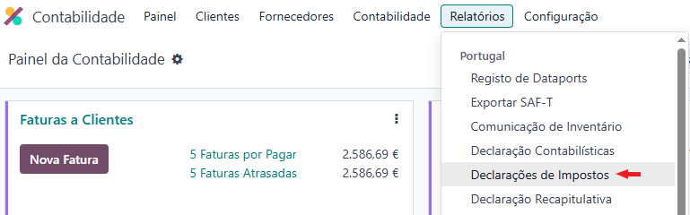

No assistente que abre selecione o tipo de declaração como **IVA - Decl. Periódica**, o **Período** ou selecione
manualmente **Data Inicial** e **Data Final**

A **Localização da Sede** é selecionada com base na morada que consta da morada da Empresa

Caso exista Declarações Periódica do Período Anterior para regularizar deve incluir a mesma, ou apenas o valor a acrescentar

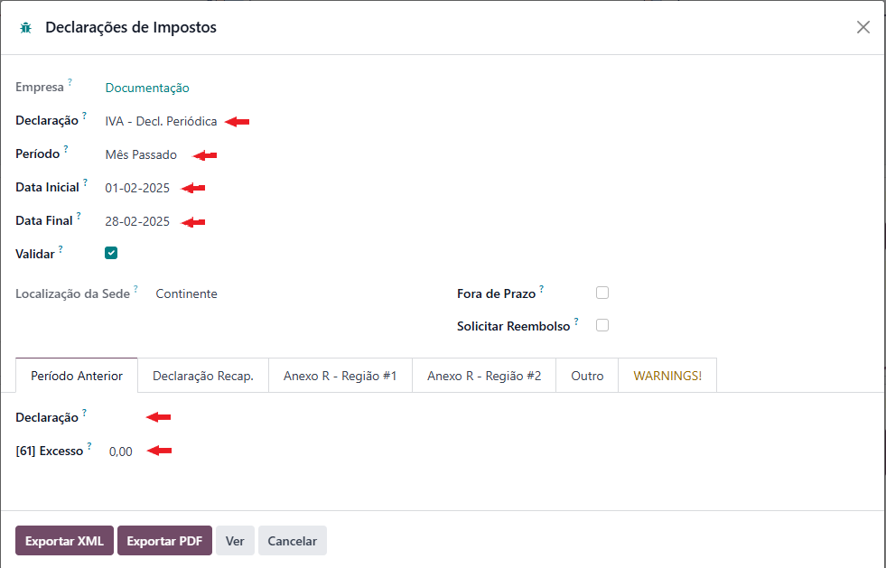

Acrescente depois Declarações Recapitulativas ou Anexos R existentes

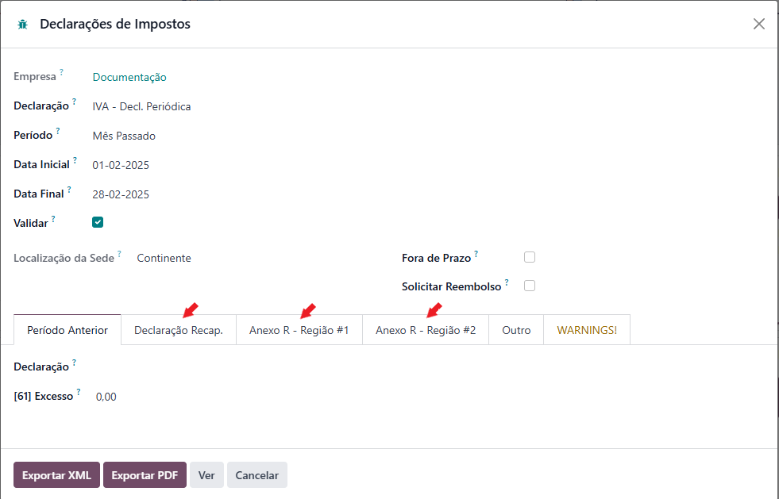

Como em alguns casos pode acontecer de não ter toda a informação em Odoo, existe a aba Outro para incluir alterações
necessárias bem como os valores de impostos de importações já liquidados

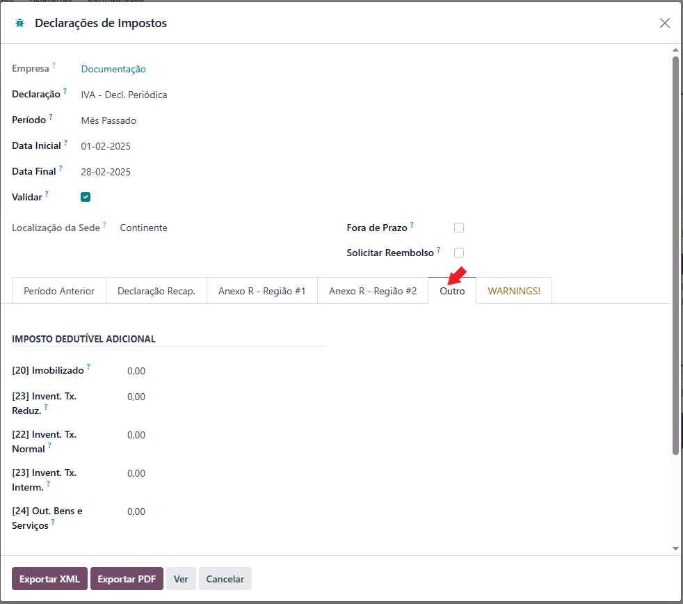

Aconselhamos que primeiro veja os valores esperados para saber se vai solicitar Reembolso, ou não

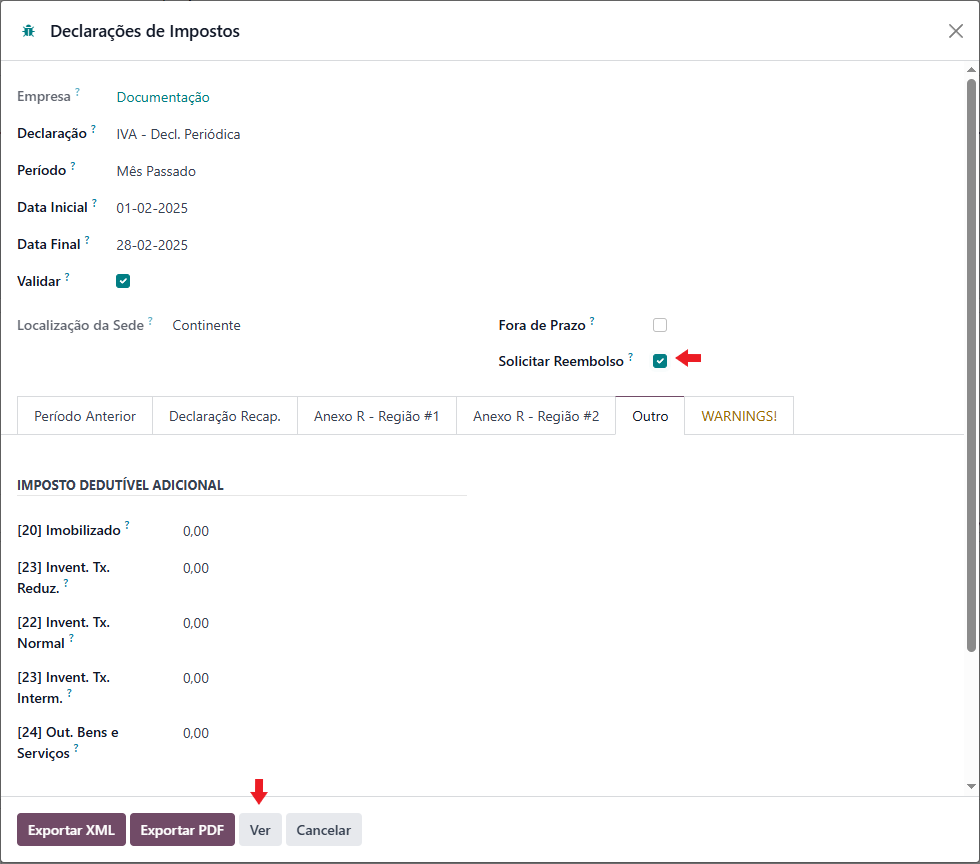

Caso esteja a submeter uma declaração **Fora de Prazo** selecione o campo correspondente

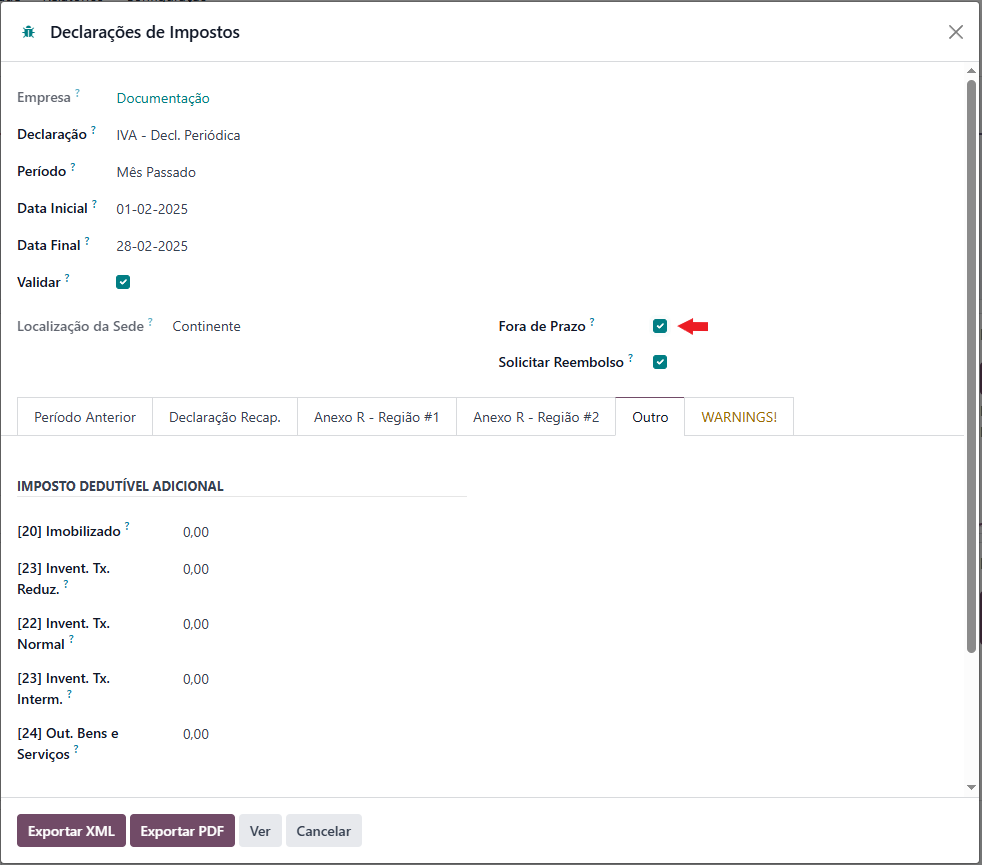

Depois de validar os valores esperados pode Exportar um PDF da declaração para guardar e Exportar o ficheiro respetivo
para submissão na AT

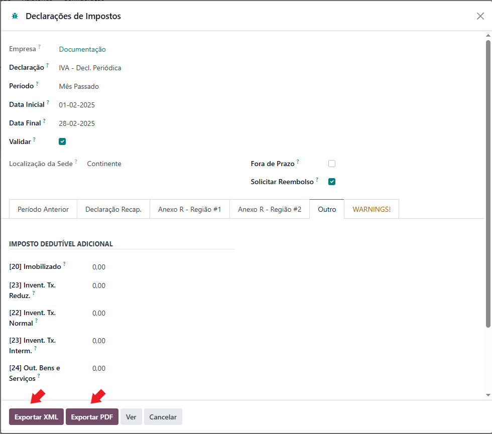

Verá um resumo dos valores constantes na declaração e terá um link para fazer o download do ficheiro e a possibilidade
de o guardar em Dataport, o que recomendamos para poder ser utilizada na Declaração Periódica IVA seguinte

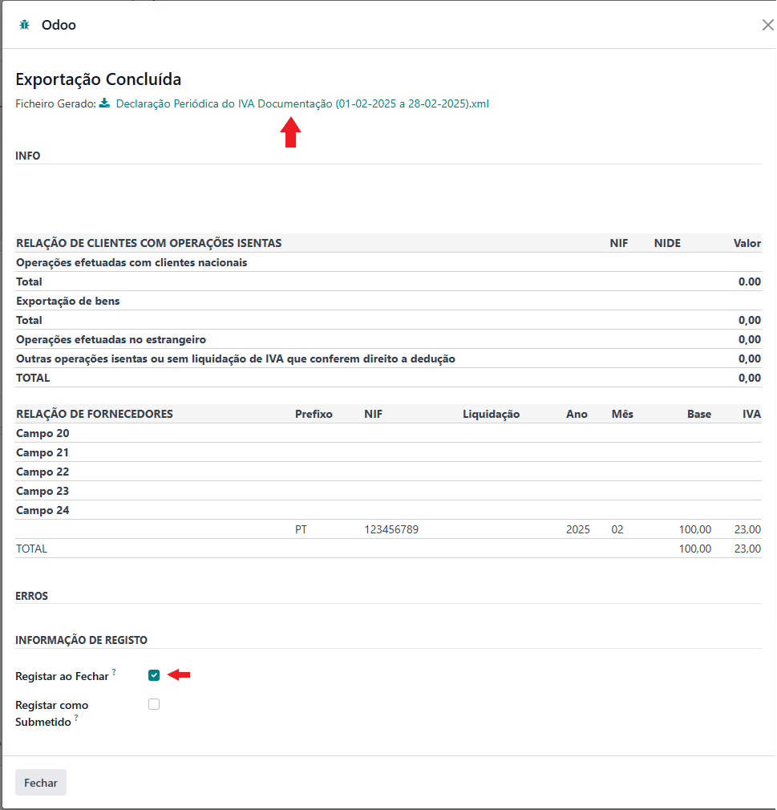

Movimentos contabilísticos
--------------------------

.. important::
    O processo de gerar uma declaração não gera qualquer movimento contabilístico

Para que o processo possa ser devidamente concluído deve depois de extrair as declarações efetuar os movimentos
contabilísticos para refletir o resultado das declarações

Existem 2 processos para fazer este processo:

- Um lançamento manual em diário que registe as mudanças de contas dos valores, para isso deve ir ao menu **Contabilidade** e selecionar a opção **Lançamentos de Diário** fazendo um novo

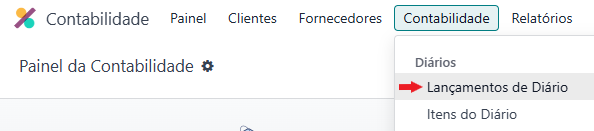

- Utilizar a ferramenta da Exo Software de **Transferências de Saldos**

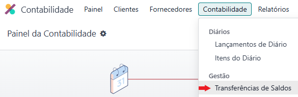

.. seealso::
    Conheça a ferramenta de :doc:`Transferências de Saldos <balance_transfer>`

    `Se pretender formação sobre a ferramenta solicite <https://exosoftware.pt/appointment>`_

Fecho do período
----------------
Terminados os movimentos relativos ao período e feitos os movimentos de transferência de saldos deve fechar o período
para garantir que nenhum utilizador não autorizado altera os valores que estão para trás impedindo registos não
autorizados pela contabilidade

Para o fazer deve na app **Faturação / Contabilidade** (dependendo respetivamente se tem versão Community ou
Enterprise do Odoo), ir ao menu de **Contabilidade** e no separador Ações selecione a opção **Bloquear Datas**

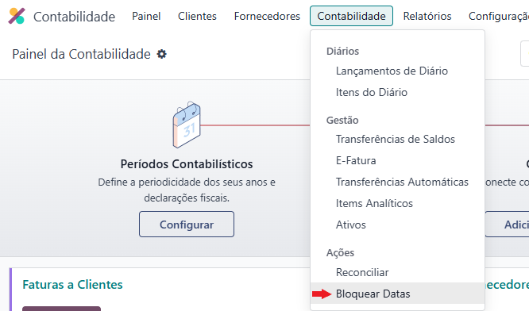

No assistente que se abre preencha o campo **Data de Bloqueio da Declaração Fiscal**

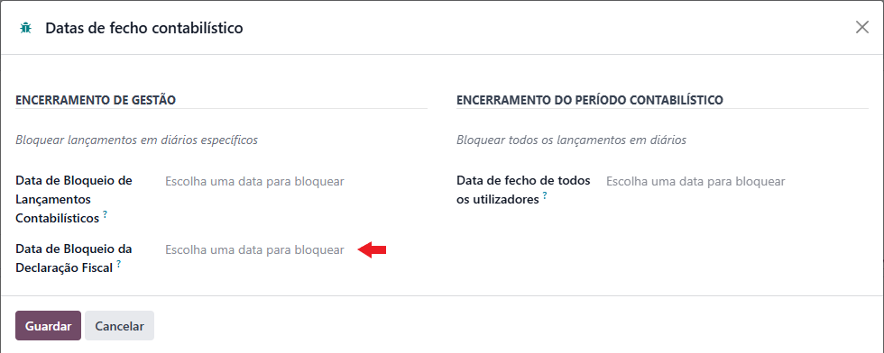

.. _vat_recapitulative_statment:

Declaração Recapitulativa IVA
=============================
A Declaração recapitulativa é enviada sempre que se efetuem transmissões intra comunitárias e os valores resultantes da
mesma são usados para o preenchimento da Declaração Periódica IVA

Para a retirarem deve na app **Faturação / Contabilidade** (dependendo respetivamente se tem versão Community ou
Enterprise do Odoo), vá ao menu de **Relatórios** e no separador Portugal selecione a opção **Declaração Recapitulativa**

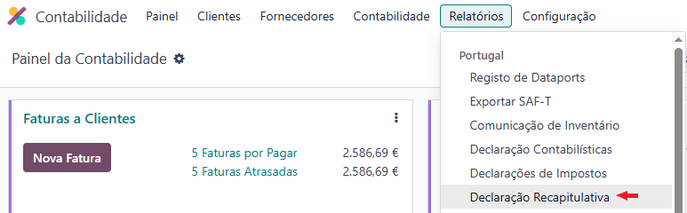

No assistente que abre selecione o **Período** ou selecione manualmente **Data Inicial** e **Data Final**

Carregue em Exportar XML

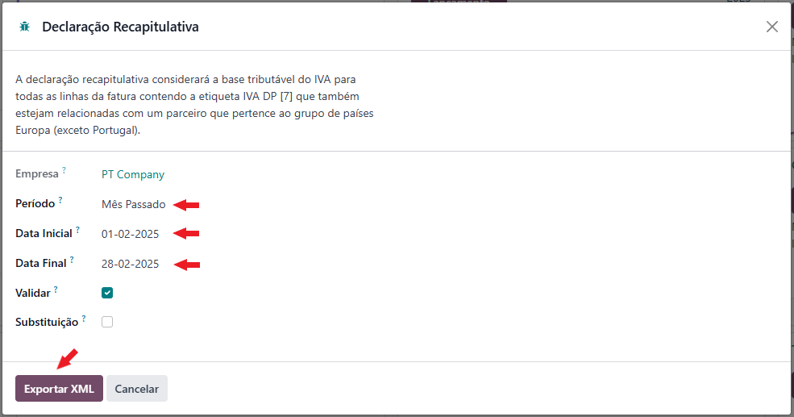

Nos casos em que queira fazer uma declaração de **Substituição** assinale o campo próprio para o efeito

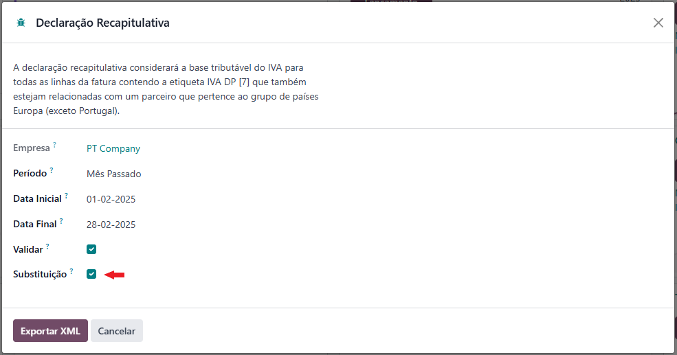

Vai ter acesso a um resumo dos cálculos contidos no documento, terá um link para fazer o download do ficheiro e a
possibilidade de o guardar em Dataport, o que recomendamos para poder ser utilizada na Declaração Periódica IVA

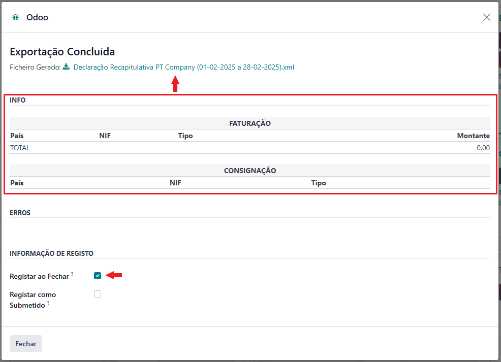

.. _vat_anex_r:

Anexo R
=======
O Anexo R da Declaração Periódica IVA é um anexo que permite às entidades declarar transações com outras regiões do
território nacional, que se divide em 3 regiões:

- Continente
- Açores
- Madeira

A Declaração Periódica é emitida com base na morada fiscal da empresa, no entanto, pode ser necessário declarar valores
com incidência em alguma das outras regiões do território nacional, para esse efeito usa-se este anexo

.. important::
    Segundo as instruções de preenchimento da declaração periódica, o primeiro Anexo R preenchido vai sempre para os
    campos 65 e 66 da declaração, seja qual for a região. Só quando há um segundo Anexo R, ou seja operações nas duas
    regiões diferentes da sede, é que este preenche os campos 67 e 68. Por exemplo, numa empresa com sede no Continente
    e operações apenas na Madeira, o Anexo R da Madeira preenche os campos 65 e 66

Para a retirarem deve na app **Faturação / Contabilidade** (dependendo respetivamente se tem versão Community ou
Enterprise do Odoo), vá ao menu de **Relatórios** e no separador Portugal selecione a opção **Declarações Impostos**

No assistente que abre selecione o tipo de declaração como **IVA - Decl. Periódica - Anexo R**, o **Período** ou
selecione manualmente **Data Inicial** e **Data Final**, e a **Localização das Operações** que pretende

Como em alguns casos pode acontecer de não ter toda a informação em Odoo, existe a aba Outro para incluir alterações
necessárias bem como os valores de impostos de importações já liquidados

Exporte o ficheiro

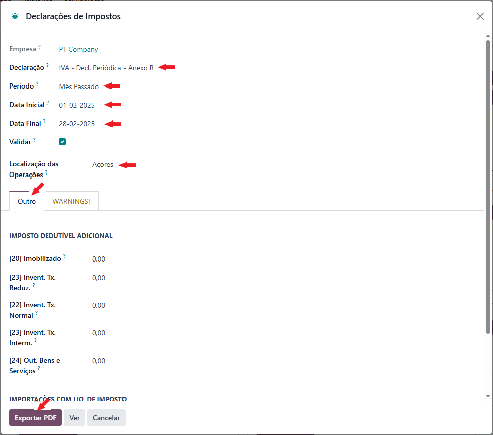

Terá um link para fazer o download do ficheiro e a possibilidade de o guardar em Dataport, o que recomendamos para poder
ser utilizada na Declaração Periódica IVA

