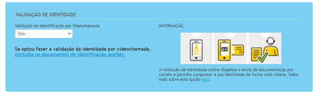

:show-content:

==========================
Assinatura digital de PDFs
==========================

Que elementos são necessários para solicitar um certificado?
============================================================
Paa solicitar um certificado digital, deve fornecer os seguintes elementos:

Dados da Organização
- Código da Certidão Permanente
- NIF
- Nº de telemóvel (que fica associado ao certificado)
- Morada
- Código Postal
- Nome da organização (conforme Certidão Permanente)
- Telefone
- Nº de porta / andar
- Cidade/Localidade
- País

Dados do Representante Legal
- Nome completo
- Número do CC

Informação para o Certificado
- Frase de identificação (senha para levantamento do certificado)
- Email (que fica associado ao certificado)

De que forma é validada a empresa?
==================================
Naturalmente, para emissão de um certificado para assinatura de documentos da empresa, é necessário atestar a autenticidade desta, bem como do seu representante. Para o efeito, há 3 métodos possíveis.

1. Através de vídeo-chamada com o representante legal associado ao certificado. Para selecionar esta modalidade, é necessário indicar Sim na respetiva opção. Se a resposta for Não, podem ainda ser usadas as duas formas alternativas a seguir.

2. Através de um PDF que, após receção, é assinado digitalmente com um certificado qualificado da empresa, cartão de cidadão ou chave móvel digital.

3. Através de um PDF que, após receção, é impresso, assinado manuscritamente e enviado por correio físico para a Digitalsign após reconhecimento por notário ou advogado.
