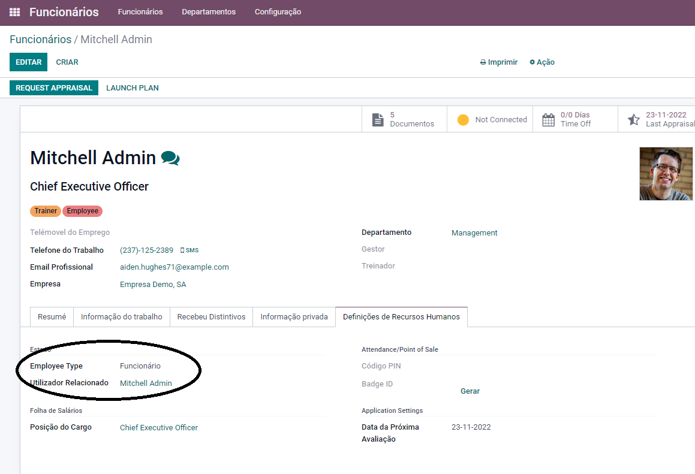

:show-content:

=============================
POS Configuração Utilizadores
=============================

O botão no canto superior direito para fechar sessão do POS não está disponível
===============================================================================
Se tiver um utilizador interno, este pode abrir a sessão POS, criar encomendas, guardá-las, e fechar sessões POS na base de dados.

Mas, se tiver um funcionário caixa (apenas utilizador/empregado não remunerado), então o funcionário pode abrir a sessão POS (depois de se ter registado com outro utilizador do portal), criar uma encomenda, e guardar contas, mas não pode fechar a sessão POS na base de dados. Para o fazer, o funcionário precisa de mudar para o utilizador com sessão iniciada (Utilizador pago).

Por outras palavras, qualquer funcionário que seja adicionado como funcionário autorizado pode abrir uma sessão POS, mas apenas os utilizadores registados (Pago) podem fechar a sessão POS. De forma a resolver este problema, precisa de selecionar o funcionário e ir para as "Configurações de RH", selecionar o "Utilizador Relacionado" e verificar que é o mesmo que o funcionário. Se o Funcionário não tiver um utilizador relacionado, precisa de adicionar um.

**Depois de fazer isso, deve ter a opção de fechar a sessão de POS**
