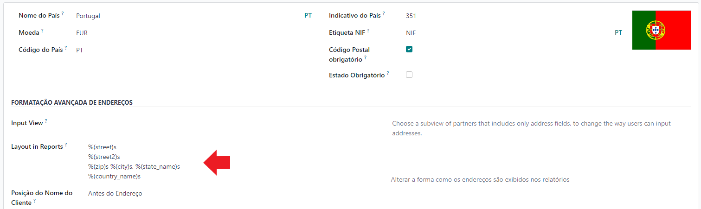

:show-content:

============
Configuração
============

Como ativar a subscrição Enterprise?
====================================
Quando é instalado, um sistema Odoo Enterprise tem um período experimental de 1 mês.

Antes desse período terminar, vai aparecer o respetivo aviso, no menu principal (app drawer), juntamente com a possibilidade de introduzir o código da subscrição.

Introduz-se o código fornecido pela Odoo SA e pronto, sistema ativado.

.. tip::
   Em alguns casos, é possível que não apareça a zona de introdução do código de subscrição, o que impede o funcionamento de algumas funcionalidades, como partilhas nas redes sociais ou VoIP.

    Nesse caso, temos que forçar a sua exibição com o seguinte procedimento:

   - Ativar o modo programador
   - Na app Configurações, ir ao menu :menuselection:`Técnico --> Parâmetros dos Sistema`
   - Adicionar ou editar a chave **database.expiration_date**. Colocar a data do próprio dia no valor e gravar
   - Voltar ao menu principal e pressionar F5. Já vai aparecer o aviso de expiração da BD
   - Clicar em Renovar a Subscrição e introduzir o código de subscrição. A BD fica ativada e a data de expiração é alterada para a que consta na Odoo SA

Pode consultar mais detalhes na `página oficial Odoo <https://www.odoo.com/documentation/17.0/pt_BR/administration/on_premise.html>`_.

Formato de morada errado
========================
O formato da morada está errado, aparece primeiro a cidade e depois o código postal
É verdade que a configuração do formato da morada que vem com o Odoo standard é incorreta no caso Português.

Para corrigir, é necessário:

- Instalar a app **Contactos**, caso não esteja já instalada.
- Na app **Contactos** ir ao menu :menuselection:`Configuração --> Localização --> Países` e selecionar **Portugal**
- Mudar o valor do campo **Formato do Endereço** para:

.. note::
    %(street)s

    %(street2)s

    **%(zip)s %(city)s, %(state_name)s**

    %(country_name)s

