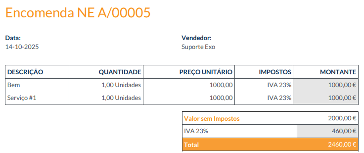
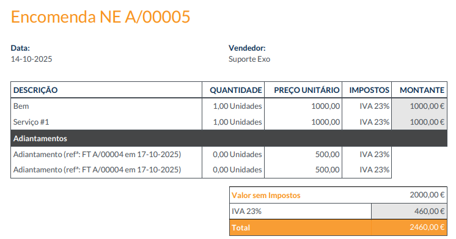
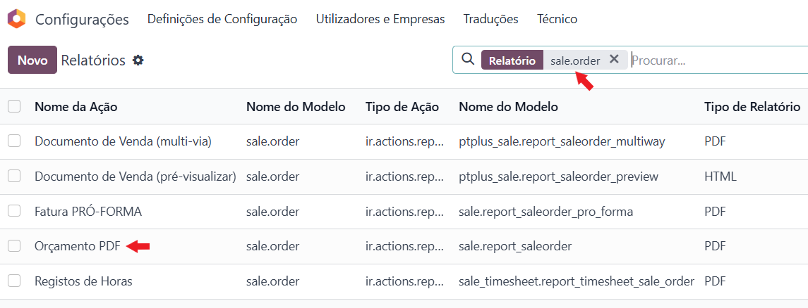
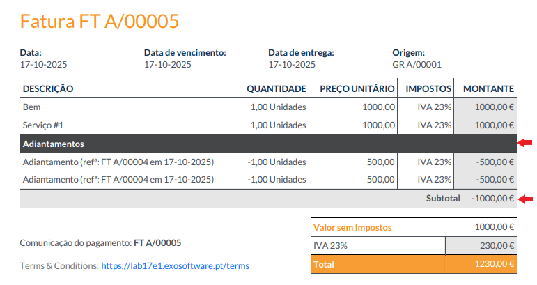
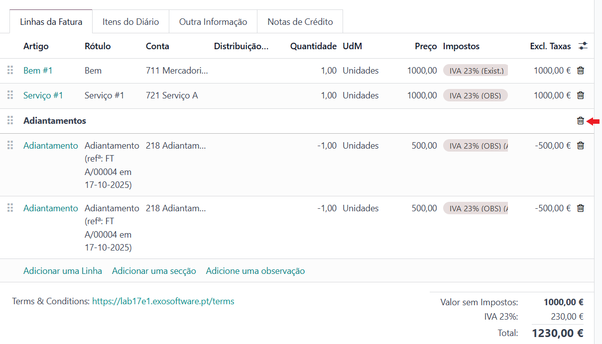
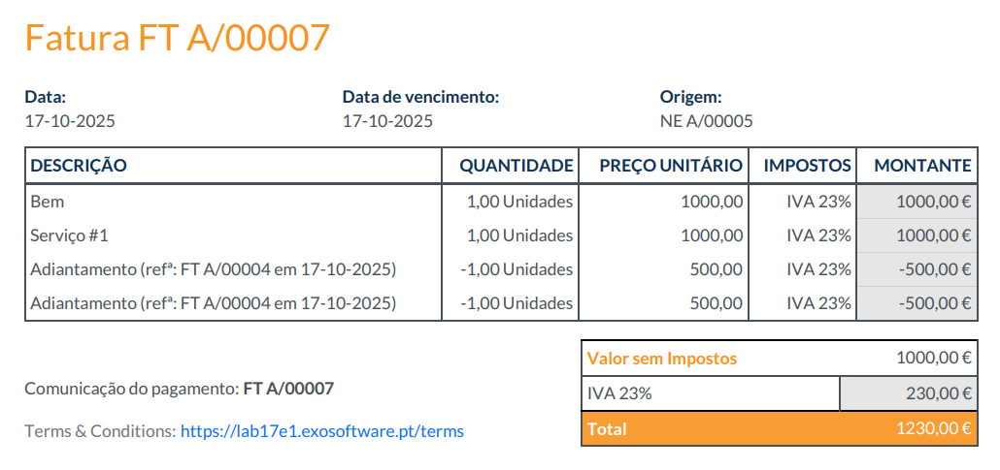

:show-content:

====================
Faturas Adiantamento
====================

.. Important::
    Estas decisões foram tomadas pelo nosso compromisso em alterar de forma mínima os comportamentos nativos do Odoo,
    uma vez que, na mesma base de dados podem existir empresas de países diferentes e com localizações distintas que
    usem os mesmos relatórios

Problemas de arredondamento
===========================
Devido a algumas configurações que podem existir na sua base de dados, podem surgir problemas ao fazer um adiantamento
por valor percentual de 100%

.. note::
    As configurações que podem gerar esta situação são:

    - Precisão decimal
    - Método de arredondamento de impostos

Nestes casos o que pode acontecer é que o arredondamento dos 100% gere um valor a pagar na fatura de adiantamento
diferente ao valor da NE

Esta situação acontece, pois o Odoo gera uma linha de adiantamento, por cada imposto utilizado e agrega as linhas da NE
com base nessa premissa antes de proceder ao cálculo dos impostos

Existindo diferenças no cáculo dos impostos é normal que o valor total do documento possa ser diferente

.. note::
    Por parte da **Exo Software** vemos estas situações como as exceções à regra do adiantamento e sugerimos o
    tratamento como tal

Nestes casos sugerimos o seguinte processo:

- Emitir a fatura como **Adiantamento (montante fixo)** e não Adiantamento (percentagem), colocando o valor exato que recebe do cliente
- No momento da emissão da fatura final regularizada, pode surgir o problema de gerar uma NC e não FT

.. tip::
    O Odoo prevê um mecanismo para corrigir estas situações

    Na NC criada, vá ao menu **Ação** e selecione a opção **Alternar para fatura/nota de crédito**

    .. image:: downpayment_invoices/v17_swap_FT&NC.png
        :align: center

- Visto que o documento que tinha sido criado era uma NC, as quantidades estarão a negativo, corrija para positivo
- Elimine as linhas de secção do Adiantamento, bem como as linhas respetivas ao adiantamento
- Confirme a fatura

.. note::
    Com este processo o que efetivamente fez foi emitir a fatura sem regularizar o adiantamento anterior, pelo que deve
    agora fazer essa regularização com uma NC à fatura final

- A partir da fatura final crie uma NC global
- Insira uma linha de observação em que mencione o texto de regularização do adiantamento, por exemplo **Regularização de Adiantamento (refª:FT A/00004 em 17-10-2025)**
- Confirme a nota crédito

Este processo regulariza o adiantamento e dá a fatura como liquidada, sem existirem problemas de arredondamentos, no
entanto, pode ainda surgir uma situação resultante deste processo, pois a NE pode deixar de estar em sistema como faturada

.. tip::
    Nestes casos aconselhamos a instalação de uma app OCA que permite dar como Totalmente Faturada a NE

Nota Encomenda exibe informação dos adiantamentos
=================================================
De forma nativa em Odoo, a Nota Encomenda é um documento que é reimpresso cada vez que o tenta imprimir e o seu aspeto
habitual é o seguinte

No entanto, caso exista um adiantamento, o seu aspeto fica diferente e fará menção ao mesmo

Caso não goste da alteração e pretenda que a informação adicional não surja, pode mudar o comportamento nativo do
relatório

Na app de **Configurações** aceda ao menu **Técnico** (para aceder a este menu precisa de ter o **Modo programador**
ativo) e na secção de Ações escolha a opção **Relatórios** e no modelo **sale.order** escolha a opção **Orçamento PDF**

.. image:: ../../administration/install/initial_configuration/v17_appSettings.png
    :align: center

.. image:: downpayment_invoices/v17_report_menu.png
    :align: center

Na aba **Propriedades Avançadas** selecione a opção **Recarregar a partir do Anexo**

.. image:: downpayment_invoices/v17_NE_report_attachment.png
    :align: center

Com esta configuração, desde que tenha o documento original nos anexos do Chatter, terá sempre acesso à versão original
da Nota Encomenda, sem a adição da informação do adiantamento, em vez de imprimir um novo relatório

Fatura final sem subtotal ou secção de adiantamentos
====================================================
Na sua versão nativa o Odoo cria uma secção para os adiantamentos na fatura final como se pode ver na imagem abaixo

Para retirar estas menções caso não as queira ver, no momento em que o documento ainda está em rascunho, deve eliminar a
secção criada, carregando no icon para o efeito

Com esta alteração a secção e respetivo subtotal não são exibidos no PDF

.. seealso::
    Apesar das decisões tomadas, a **Exo Software** está sempre disponível para fazer personalizações/desenvolvimentos
    numa premissa de caso a caso e conforme a necessidade dos seus clientes

    `Contacte os nossos serviços se desejar essas alterações <https://exosoftware.pt/appointment>`_

   :ref:`Conheça o procedimento para emitir faturas adiantamento e regularização da fatura final <odoo_process_downpayment>`
