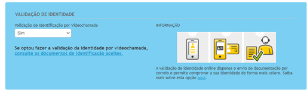

:show-content:

==========================
Assinatura digital de PDFs
==========================

Que elementos são necessários para solicitar um certificado?
============================================================
Para solicitar um certificado digital, deve fornecer os seguintes elementos:

**Informação para o Certificado**

- **Nº Telemóvel**, que vai ficar associado ao certificado
- **Email**, que vai ficar associado ao certificado
- **Frase identificação**, senha utilizada para levantamento do certificado
- **Validação Empresa**, método escolhido para validação da empresa. :ref:`Métodos disponíveis <FAQs_PDF_Digital_Signature_Company_Validation_Methods>`

**Dados da Organização**

- **Nome Organização** conforme Certidão Permanente
- **Código Certidão Permanente**
- **NIF**
- **Morada**
- **Nº Porta / Andar**
- **Código Postal**
- **Localidade**
- **País**
- **Telefone**

**Dados do Representante Legal**

- **Nome Completo**, conforme documento de identificação
- **Nº CC**

.. _FAQs_PDF_Digital_Signature_Company_Validation_Methods:

De que forma é validada a empresa?
==================================
Naturalmente, para emissão de um certificado para assinatura de documentos da empresa, é necessário atestar a
autenticidade desta, bem como do seu representante.

Para o efeito, há 3 métodos possíveis:

1. **Vídeochamada com Representante Legal** que foi associado ao certificado

Para selecionar esta modalidade, é necessário indicar **Sim** na opção **Validação de Identificação por Videochamada**

Se a resposta for **Não**, podem ainda ser usadas as duas formas alternativas a seguir

2. **PDF assinado com Chave Digital (CMD ou CC)**

Após receção de um PDF, preencher e assinar de forma digital, usando um Certificado Qualificado da Empresa, Chave Móvel
Digital ou Cartão de Cidadão

3. **Formulário por Correio**

Após receção de um PDF, imprimir, preencher e assinar manuscritamente. Fazer reconhecimento por notário ou advogado e
enviar por correio físico para a Digitalsign

Verificação das assinaturas
===========================
Se quiser validar que os seus documentos estão a ser devidamente assinados pode utilizar este `validador <https://validador.digitalsign.pt/verify>`_

Arraste o documento para a página e verifique o estado das assinaturas
