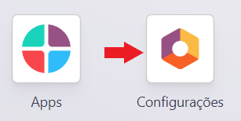
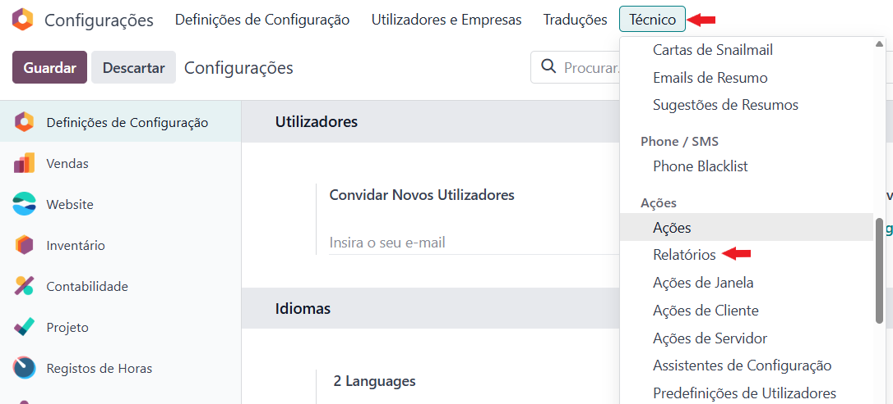
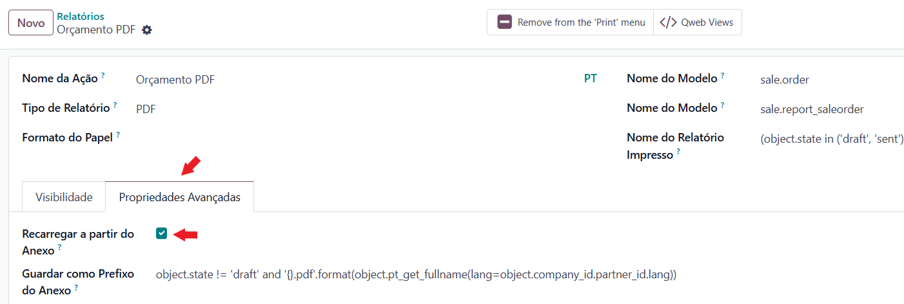

:show-content:

==========================
Assinatura digital de PDFs
==========================

.. seealso::
    :doc:`Consulte o nosso Guia sobre assinatura digital de PDFs <../invoicing/pdf_signing>`

Quantos certificados precisa?
=============================
Pelas regras da DigitalSign cada empresa emissora precisa de ter um certificado próprio, ou seja,
**cada NIF precisa do seu próprio certificado**, não pode ter apenas um certificado para um grupo de empresas.

Que elementos são necessários para solicitar um certificado?
============================================================
Para solicitar um certificado digital, deve fornecer os seguintes elementos:

**Informação para o Certificado**

- **Nº Telemóvel**, que vai ficar associado ao certificado
- **Email**, que vai ficar associado ao certificado
- **Frase identificação**, senha utilizada para levantamento do certificado
- **Validação Empresa**, método escolhido para validação da empresa. :ref:`Métodos disponíveis <faqs_pdf_digital_signature_company_validation_methods>`

**Dados da Organização**

- **Nome Organização** conforme Certidão Permanente
- **Nº Certidão Permanente**
- **NIF / NIPC**
- **Morada da Sede**
- **Nº Porta / Andar**
- **Código Postal**
- **Localidade**
- **País**
- **Telefone**

**Dados do Representante Legal**

- **Primeiro(s) nome(s)**, conforme documento de identificação
- **Último(s) nome(s)**, conforme documento de identificação
- **Tipo de Documento**, pode ser Cartão de Identificação (ex. CC) ou Passaporte
- **País do Documento**, que país emitiu o documento do representante legal
- **Nº Documento**
- **Documento Representação**, Documento que evidencie os poderes de representação. Ex. Procuração emitida pela Empresa ou Registo na Conservatória de Registo Comercial

.. _faqs_pdf_digital_signature_company_validation_methods:

De que forma é validada a empresa?
==================================
Naturalmente, para emissão de um certificado para assinatura de documentos da empresa, é necessário atestar a
autenticidade desta, bem como do seu representante.

Para o efeito, há 3 métodos possíveis:

1. **PDF assinado com Certificado Qualificado (CMD, CC ou app)**

Após receber por parte da Exo Software um email que contém o PDF do seu pedido, assine de forma digital, usando um
Certificado Qualificado da Empresa, Chave Móvel Digital ou Cartão de Cidadão

Esta assinatura deve de ser feita com um perfil profissional ativo e o documento enviado novamente à Exo Software

2. **Vídeochamada com Representante Legal** que foi associado ao certificado

Terá de anexar uma cópia do Cartão do Cidadão para validação aoa preencher o formulário do pedido

3. **Formulário por Correio**

Após receber por parte da Exo Software um email que contém o PDF do seu pedido, imprimir e assinar manuscritamente.
Fazer reconhecimento por notário ou advogado e enviar por correio físico para a Digitalsign

.. note::
    Irá receber por parte da DigitalSign um email com informações para onde devolver o formulário mas a morada de envio
    é a seguinte:

    Digitalsign S.A Largo Pe. Bernardino Ribeiro Fernandes
    26 4835-489 Nespereira - Guimarães

Verificação das assinaturas
===========================
Se quiser validar que os seus documentos estão a ser devidamente assinados pode utilizar este `validador <https://validador.digitalsign.pt/verify>`_

Arraste o documento para a página e verifique o estado das assinaturas

Este serviço é uma implementação do webservice da União Europeia para validação de assinaturas digitais

.. TODO : verificar se é mesmo um webservice

Quantidade de assinaturas disponíveis
=====================================
Dependendo do tipo de certificado que adquira, vai ter um número fixo de assinaturas disponíveis e uma validade para
as mesmas, verifique as condições no ato da compra

O nº de assinaturas é acrescentado numa base anual, mas as que não forem gastas transitam para o ano seguinte, juntamente
com o valor do ano seguinte, exceto se ultrapassarem o período da sua validade

Se quiser assinar mais do que o nº fixo de documentos, pode adquirir pacotes adicionais de assinaturas

.. TODO : como controlar nº de assinaturas e quem fica com o prejuízo se ultrapassar? vai continuar a assinar?

.. _change_report_print_behavior:

Garantir que documentos não são assinados múltiplas vezes
=========================================================
Em Odoo alguns relatórios são reimpressos cada vez que os tenta imprimir, isto porque podem ter existido alterações

No entanto, e visto que se estão a fazer assinaturas nesses documentos, de cada vez que imprime vai voltar a assinar
os seus documentos, gastando desnecessariamente o seu saldo de assinaturas

Para mudar esse comportamento, siga os seguintes passos

Na app de **Configurações** aceda ao menu **Técnico** (para aceder a este menu precisa de ter o **Modo programador**
ativo) e na secção de Ações escolha a opção **Relatórios**

Selecione o modelo do relatório para o qual pretende alterar o comportamento e na aba **Propriedades Avançadas**
selecione a opção **Recarregar a partir do Anexo**

Com esta configuração, desde que tenha o documento original nos anexos do Chatter, terá sempre acesso à versão original
e respetiva assinatura, em vez de imprimir um novo relatório e voltar a assinar

Obrigatoriedade legal vs Arquivo digital
========================================
Para que cumpra com a **Obrigatoriedade legal** apenas precisa de assinar com certificado qualificado:

- Faturas
- Notas de Crédito
- Notas de Débito

Se quiser fazer **Arquivo digital** precisa de assinar com certificado qualificado:

- Todos os documentos que emite
- Garantir que os documentos que recebe também estão assinados
- Todos os documentos que sustentam os documentos que envia

        - Para guardar uma Fatura também terá de ter arquivado o Orçamento, Notas de Encomenda, Guias de Remessa, etc.
