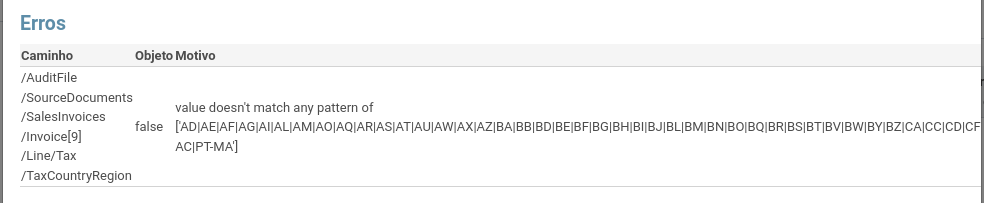
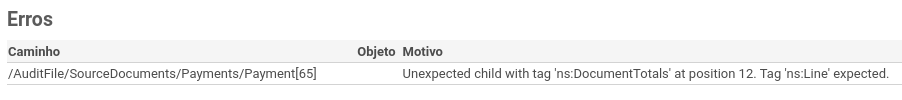

:show-content:

===========
Erros SAF-T
===========

.. seealso::
    :doc:`Consulte o nosso Guia sobre SAF-T de Faturação <../invoicing/saft_invoicing>`

Erro: Value doesn't match any pattern of ['AD|AE|AF|AG|AI|AL|AM|AO|AQ|AR|(...)
==============================================================================
Quando o validador do SAF-T dá uma indicação parecida com esta:

Significa que o validador não consegue associar um país ao imposto usado, ou ao cliente.

O problema em questão é geralmente devido a falta de dados em algum local que não permite ligar corretamente a posição fiscal do cliente ao imposto utilizado num documento.

Existem 2 locais onde a situação pode estar em falha:

.. tip::
    **Falta de dados no cliente**

    Foi usado um imposto cujo campo **País/Região** é Intracomunitário ou Extracomunitário. Nestes casos, a especificação do SAF-T manda que seja indicado o país do cliente no campo TaxCountryRegion. Se este não estiver definido, o erro é inevitável

    - Precisa de identificar o documento
        - Abra o ficheiro XML e procure pela palavra **false**. Suba o cursor até chegar ao identificador da fatura (ou documento similar), do tipo **<InvoiceNo>FT A/00009</InvoiceNo>**
    - Procure o documento no Odoo e abra-o. Clique no cliente para ser redirecionado para a ficha do contacto do cliente
    - Atribua ao cliente o país correto e grave
    - Extraia novamente o ficheiro SAF-T que o erro deve desaparecer

    .. image:: saft_errors/v17_partner_country.png
        :align: center

.. tip::
    **Falta de dados no imposto**

    Foi usado pela primeira vez, um imposto do tipo IVA N/S. A configuração inicial do imposto em questão (IVA Não Sujeito) deixa propositadamente em branco a região, o que provoca o erro indicado. Há vários tipos de uso para o IVA N/S, com diferentes regiões possíveis. Dada a sua relativamente baixa utilização, a Exo Software optou por deixar a configuração deste imposto incompleta, sabendo que o erro em questão iria aparecer e obrigar o utilizador a completar a configuração

    - Abra a ficha do imposto IVA N/S
    - No separador **Opções Avançadas**, preencha o conteúdo do campo **País/Região**, de acordo com o tipo de utilização que fez para o imposto.

    .. important::
        Se houver transações que necessitem do IVA N/S para mais do que um país, o imposto deve ser duplicado, ficando assinalado em cada um o país de destino.

    - Extraia novamente o ficheiro SAF-T que o erro deve desaparecer

    .. image:: saft_errors/v17_tax_countryRegion.png
        :align: center

Erro: o imposto IVA N/S deve ter uma etiqueta a mencionar a região do imposto
=============================================================================
A configuração inicial do imposto em questão (IVA Não Sujeito) deixa propositadamente em branco a região, o que provoca o erro indicado. Há vários tipos de uso para o IVA N/S, com diferentes regiões possíveis. Dada a sua relativamente baixa utilização, a Exo Software optou por deixar a configuração deste imposto incompleta, sabendo que o erro em questão iria aparecer e obrigar o utilizador a completar a configuração

.. tip::
    - Abra a ficha do imposto IVA N/S
    - No separador **Opções Avançadas**, preencha o conteúdo do campo **País/Região**, de acordo com o tipo de utilização que fez para o imposto.

    .. important::
        Se houver transações que necessitem do IVA N/S para mais do que um país, o imposto deve ser duplicado, ficando assinalado em cada um o país de destino.

    - Extraia novamente o ficheiro SAF-T que o erro deve desaparecer

    .. image:: saft_errors/v17_tax_countryRegion.png
        :align: center

Erro: Unexpected child with tag 'ns:DocumentTotals' at position 12. Tag 'ns:Line' expected.
===========================================================================================
Quando o validador do SAF-T dá uma indicação parecida com esta:

é porque há um pagamento de cliente que não está reconciliado com nenhum fatura (nem foi cancelado). Neste caso, é
o 65º pagamento a contar a partir do início do período que está a ser reportado. Dado que a AT não permite a
existência de pagamentos nestas condições, teremos que o associar a uma fatura.

.. tip::
    - Identifique o pagamento
        - Na janela onde é apresentado o erro SAF-T, coloque o rato por cima da coluna **Caminho** e da linha que
          provocou o erro
        - Será exibido o nó XML do SAF-T com a informação do pagamento. O nº do recibo aparece logo no início, no
          tag **<PaymentRefNo>**
    - Em alternativa, vá à app **Faturação / Contabilidade** (dependendo respetivamente se tem versão Community ou
      Enterprise do Odoo) e no menu :menuselection:`Clientes --> Pagamentos`

        .. image:: saft_errors/v17_access_payments.png
            :align: center

        - filtre os pagamento que estejam dentro do período e tenham o estado publicado
        - Como, infelizmente, não há forma de filtrar por pagamentos que não estejam reconciliados com nenhuma fatura,
          é necessário ver a ficha de cada um até aparecer o que não tem o botão de acesso rápido **Faturas** no topo do
          formulário

    - Escolha uma fatura em aberto do mesmo parceiro e reconcilie com o pagamento identificado
    - Extraia novamente o ficheiro SAF-T

    Com fatura associada

    .. image:: saft_errors/v17_payment_with_invoice.png
        :align: center

    Sem fatura associada

    .. image:: saft_errors/v17_payment_without_invoice.png
        :align: center
