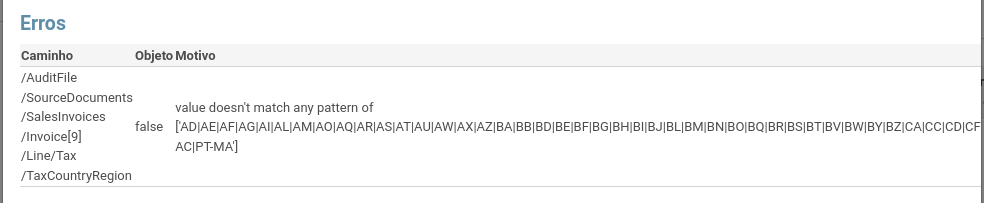
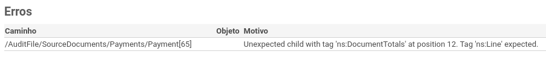

:show-content:

=================
Ficheiro SAF-T PT
=================

Erro: Value doesn't match any pattern of ['AD|AE|AFAG|AI|AL (...)
=================================================================
Quando o validador do SAF-T dá uma indicação parecida com esta:

o problema é geralmente devido à ocorrência de um destes 2 problemas:

1 - Foi usado um imposto cujo campo País/Região é Intracomunitário ou Extracomunitário. Nestes casos, a especificação do SAF-T manda que seja indicado o país do cliente no campo TaxCountryRegion. Se este não estiver definido, o erro é inevitável.

- Identificar o documento. Abrir o ficheiro XML e procurar pela palavra false. Subir o cursor até chegar ao identificador da fatura (ou documento similar), do tipo <InvoiceNo>FT A/00009</InvoiceNo>
- Procurar o documento no Odoo e abri-lo. Clicar no cliente para ser redirecionado para a ficha deste.
- Atribuir ao cliente um país específico e gravar.
- Extrair novamente o ficheiro SAF-T.

2 - Foi usado, pela primeira vez, um imposto do tipo IVA N/S. A configuração inicial do imposto em questão (IVA Não Sujeito) deixa propositadamente em branco a região, o que provoca o erro indicado. Há vários tipos de uso para o IVA N/S, com diferentes regiões possíveis. Dada a sua relativamente baixa utilização, a Exo Software optou por deixar a configuração deste imposto incompleta, sabendo que o erro em questão iria aparecer e obrigar o utilizador a completar a configuração.

- Abrir a ficha do imposto IVA N/S
- Preencher o conteúdo do campo País/Região do IVA, no separador Opções Avançadas, de acordo com o tipo de utilização que fez para o dito imposto.
- Se houver transações que necessitem do IVA N/S para mais do que um país, o imposto deve ser duplicado, ficando assinalado em cada um o país de destino.
- Emitir novamente o SAF-T PT.

.. image:: ficheiro_saft_pt/erro_saft_2.png
   :align: center

Erro: o imposto IVA N/S deve ter uma etiqueta a mencionar a região do imposto
=============================================================================
A configuração inicial do imposto em questão (IVA Não Sujeito) deixa propositadamente em branco a região, o que provoca o erro indicado. Há vários tipos de uso para o IVA N/S, com diferentes regiões possíveis. Dada a sua relativamente baixa utilização, a Exo Software optou por deixar a configuração deste imposto incompleta, sabendo que o erro em questão iria aparecer e obrigar o utilizador a completar a configuração.

Solução:

- Abrir a ficha do imposto IVA N/S
- Preencher o conteúdo do campo **País/Região do IVA**, no separador Opções Avançadas, de acordo com o tipo de utilização que fez para o dito imposto.
- Emitir novamente o SAF-T PT.

.. image:: ficheiro_saft_pt/erro_saft_3.png
   :align: center

Erro: Unexpected child with tag 'ns:DocumentTotals' at position 12. Tag 'ns:Line' expected.
===========================================================================================
Quando o validador do SAF-T dá uma indicação parecida com esta:

é porque há um pagamento de cliente que não está reconciliado com nenhum fatura (nem foi cancelado). Neste caso, é o 65º pagamento a contar a partir do início do período que está a ser reportado. Dado que a AT não permite a existência de pagamentos nestas condições, teremos que o associar a uma fatura.

Solução:

#. Identificar o pagamento. Na janela onde é apresentado o erro SAF-T, colocar o rato por cima da coluna Caminho e da linha que provocou o erro. Será exibido o nó XML do SAF-T com a informação do pagamento. O nº do recibo aparece logo no início, no tag PaymentRefNo.
#. Em alternativa, ir até Faturação / Clientes / Pagamentos e filtrar os pagamento que estejam dentro do período e tenham o estado publicado. Como, infelizmente, não há forma de filtrar por pagamentos que não estejam reconciliados com nenhuma fatura, é necessário ver a ficha de cada um até aparecer o que não tem o botão Faturas no topo direito do formulário.
#. Escolher uma fartura em aberto do mesmo parceiro e reconciliá-la com o pagamento identificado.
#. Extrair novamente o ficheiro SAF-T.
