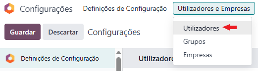
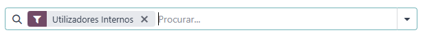
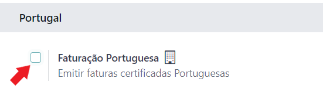

:show-content:

============
Utilizadores
============

Contagem de Utilizadores
========================
Em Odoo, a contagem de utilizadores é feita pelo nº de utilizadores internos ativos

Pode consultar esta informação na app de **Configurações** acedendo ao menu :menuselection:`Imprimir --> Utilizadores e Empresas / Utilizadores`
e em seguida filtrar por utilizadores internos

.. image:: ../../administration/install/initial_configuration/v17_appSettings.png
   :align: center

Para a Exo Software, a contagem de utilizadores é feita com base na contagem que o Odoo faz, mas filtrada por
utilizadores que estejam associados a uma empresa que tem a Faturação Portuguesa ativa

Para saber ver se a empresa tem a Faturação portuguesa ativa consulte as **definições de Faturação/Contabilidade** e na
secção **Portugal** veja se o campo **Faturação Portuguesa** está ativa

Em seguida na listagem de utilizadores, filtre por todos os utilizadores que pertençam a empresas com esta característica
