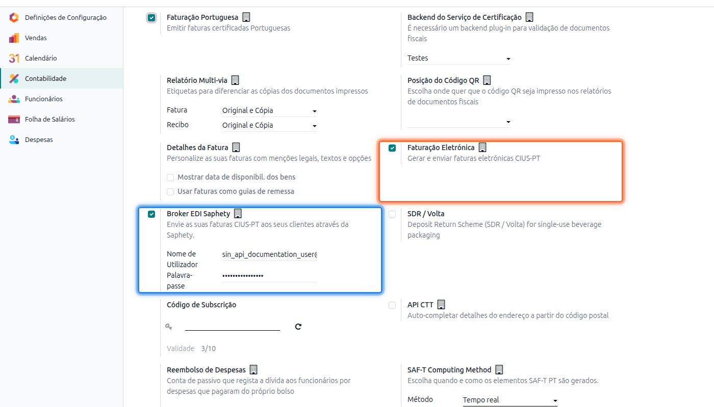
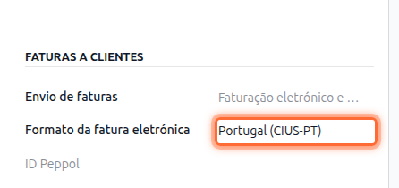
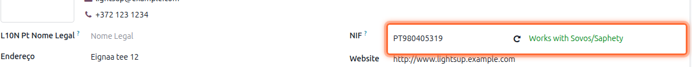
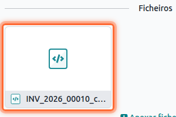
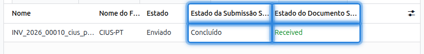
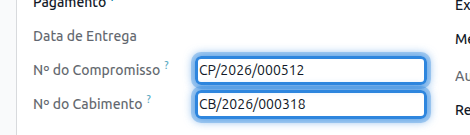
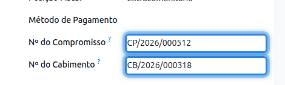
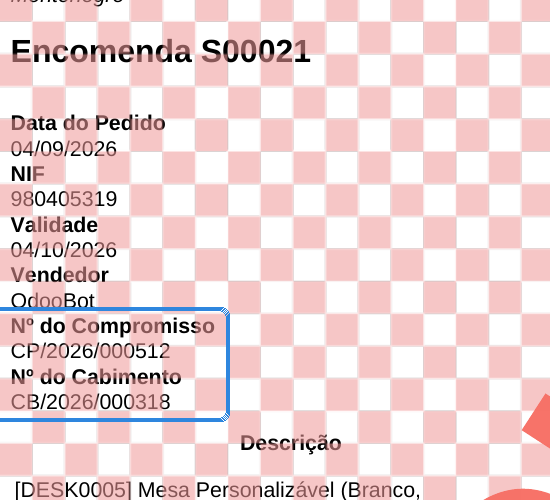

:nosearch:

================================
Faturação Eletrónica (CIUS-PT)
================================
EDI (*Electronic Data Interchange*) é a troca eletrónica de documentos entre entidades através de
um intermediário — o **broker** — que, além de entregar o documento, certifica o envio e a
receção. A **CIUS-PT** é a especificação portuguesa da norma europeia CIUS para faturas em
ficheiro estruturado (XML), e é o formato usado quando fatura eletronicamente em Portugal.

.. important::
    A obrigatoriedade legal do CIUS-PT aplica-se **apenas à venda a entidades do setor público
    (B2G)**. Entre empresas (B2B) o formato é tecnicamente suportado mas a sua utilização é
    opcional.

Não existe um broker único em Portugal: cada entidade pública escolhe o seu. A Exo tem
integração implementada com a **Saphety** — entretanto adquirida pela Sovos, pelo que a interface
do produto apresenta as duas designações. Para alcançar destinatários servidos por outro broker,
contrata diretamente com a Saphety a abertura de interligação — um valor **por interligação,
pagamento único**, não por destinatário nem recorrente. A este acresce a avença do broker, e é
este custo recorrente — não o de implementação — que justifica optar pela via manual descrita
mais abaixo para um volume esporádico de faturas B2G.

.. note::
    A negociação e o pagamento destes valores são matéria entre a sua empresa e a Saphety;
    valores indicativos, alteráveis unilateralmente pela Saphety.

A solução é composta por três módulos, com um único fluxo: a base gera e valida o ficheiro
CIUS-PT; o broker acrescenta-lhe transmissão automática; o de vendas acrescenta captura a
montante, na encomenda.

.. list-table::
   :header-rows: 1

   * - Módulo
     - O que acrescenta
     - Depende de
   * - **Portugal - E-invoicing CIUS-PT**
     - Geração e validação do ficheiro CIUS-PT na fatura e nota de crédito. Funciona sozinho.
     - —
   * - **Portugal - Saphety EDI**
     - Transmissão automática ao broker e acompanhamento do estado de entrega.
     - E-invoicing CIUS-PT
   * - **Portugal - Sales B2G and EDI**
     - Campos B2G na encomenda de venda, com propagação para a fatura.
     - E-invoicing CIUS-PT e Vendas PT+

.. warning::
    A comunicação em CIUS-PT cobre exclusivamente **faturas e notas de crédito**, e apenas no
    **sentido da venda**. Guias de remessa, encomendas a fornecedores, receção de documentos e o
    intercâmbio típico do retalho B2B não estão cobertos por esta solução. Se precisar de um
    destes cenários, contacte a **Exo Software** para avaliação em sede de implementação.

.. raw:: html

    

        ─── ✦ ───
    

Pré-Configurações
==================
Os três módulos fazem parte da sua subscrição **PT+** e não exigem pedido à Exo Software: ativam-se
diretamente nas definições, tal como qualquer outra funcionalidade da localização.

Aceda à app **Faturação / Contabilidade** (dependendo respetivamente se tem versão Community ou
Enterprise do Odoo), vá ao menu :menuselection:`Configuração --> Configurações` e na secção
**Portugal** ative a opção :guilabel:`Faturação Eletrónica`. Se pretender transmissão automática
via Saphety, ative também a opção :guilabel:`Broker EDI Saphety`, disponível na mesma secção assim
que a opção anterior está ativa.

.. note::
    Cada uma destas opções instala o respetivo módulo. A **Portugal - Sales B2G and EDI** não
    aparece aqui — instala-se sozinha assim que a E-invoicing CIUS-PT e as Vendas PT+ estão
    presentes.

.. tip::
    A secção Portugal expõe ainda a opção :guilabel:`Desativar Validação do Esquema`, apenas em
    modo de programador e apenas com o backend de certificação em modo **Testes**. Serve para
    publicar faturas apesar de a validação do ficheiro CIUS-PT falhar — não recomendado fora de um
    ambiente de testes.

Configurações
==================

Formato do parceiro e herança
-------------------------------
Indique, na ficha de cada parceiro cliente, que este deve receber faturas em CIUS-PT. Abra a
ficha do parceiro, separador :guilabel:`Contabilidade`, e na secção **Faturas a Clientes** defina
o campo :guilabel:`Formato da fatura eletrónica` como :guilabel:`Portugal (CIUS-PT)`.

.. note::
    O campo só é visível em modo de programador. Para o ativar, clique no ícone de inseto no
    canto superior direito ou adicione ``?debug=1`` ao endereço da página.

.. important::
    Esta definição faz-se no **parceiro principal** e é herdada automaticamente por todos os seus
    contactos filhos — não precisa de a repetir por delegação, departamento ou morada de entrega.
    Para um contacto individual associado a uma empresa esta herança não é sequer visível na
    interface: o Odoo esconde o separador de faturação nesse caso, por não ser normalmente esse
    contacto a ser faturado. A definição no parceiro principal é o suficiente e aplica-se de forma
    transparente sempre que um documento é emitido para qualquer um dos seus contactos.

Credenciais do broker
------------------------
Com a opção **Broker EDI Saphety** ativa, preencha o :guilabel:`Nome de Utilizador` e a
:guilabel:`Palavra-passe` da conta Saphety da sua empresa, na mesma secção Portugal das
definições, e guarde.

Verificação prévia do destinatário
--------------------------------------
Antes de faturar, confirme que o NIF do parceiro está registado na plataforma Saphety: na ficha
do parceiro, ao lado do campo :guilabel:`NIF`, o botão :guilabel:`Check Sovos/Saphety` consulta a
plataforma e mostra o resultado — verde se o parceiro está apto a receber faturas via Saphety,
vermelho caso contrário.

.. important::
    Trate esta verificação como **pré-condição do fluxo**, não como funcionalidade acessória: um
    NIF não registado na Saphety impede a entrega mesmo com o ficheiro CIUS-PT correto.

Utilização
==================
O fluxo é único; as variações introduzidas por cada módulo estão assinaladas nos pontos em que
divergem.

Publicação e validação
--------------------------
O CIUS-PT impõe regras de conteúdo além das regras legais da fatura. Essa validação corre na
**publicação**: se falhar, a fatura **não é publicada** e os erros detetados são apresentados
para correção.

.. important::
    Este comportamento é deliberado e evita ter de anular e reemitir faturas já publicadas: a
    contrapartida é um ligeiro aumento do tempo de publicação, não uma limitação do sistema.

O ficheiro XML CIUS-PT é gerado nesse mesmo momento — não no envio — e a sua representação visual
é incluída no PDF da fatura, pelo que **não precisa de transmitir o PDF em separado**.

.. seealso::
    :doc:`Consulte as nossas FAQs sobre Faturação eletrónica <../faq/e-invoicing_errors>`

Via manual, sem broker
--------------------------
Sem o módulo de broker instalado, ou para um volume esporádico que não justifique a avença
descrita no início desta página, descarregue o ficheiro CIUS-PT e submeta-o você mesmo no portal
da Saphety — serviço normalmente prestado sem custo para submissão avulsa.

O ficheiro fica disponível nos anexos da fatura publicada, no painel **Ficheiros** do registo de
atividade (ícone de clip no canto superior direito):

Descarregue-o a partir daí e submeta-o no portal do broker escolhido.

Via broker (Saphety)
------------------------
Com a **Saphety EDI** instalada e configurada, a transmissão é automática e **assíncrona**: um
processo agendado do Odoo envia os ficheiros pendentes em lote e atualiza periodicamente o estado
de cada um. Depois de confirmar a fatura não espere ver a transmissão de imediato — é o
comportamento esperado, não uma falha.

.. note::
    Este processo corre na Ação Agendada nativa do Odoo para documentos EDI
    (:menuselection:`Definições --> Técnico --> Automação --> Ações Agendadas`). Se a sua base de
    dados não tiver essa ação ativa, o envio automático não ocorre até a ativar — confirme com a
    Exo Software ou com o seu administrador de sistema se não vir movimento.

Depois de a fatura ter sido enviada pelo menos uma vez (botão :guilabel:`Enviar`), o separador
:guilabel:`Documentos EDI` da fatura mostra o estado do documento CIUS-PT:

.. list-table::
   :header-rows: 1
   :widths: 30 70

   * - Coluna
     - Descrição
   * - **Estado**
     - Estado do próprio ficheiro CIUS-PT (por exemplo, *Enviado*).
   * - **Estado da Submissão Saphety**
     - Estado do pedido de entrega junto da Saphety: *Em Espera*, *Em Curso*, *Erro* ou
       *Concluído*.
   * - **Estado do Documento Saphety**
     - Estado devolvido pela própria plataforma Saphety (por exemplo, *Received*) — texto
       apresentado tal como a Saphety o devolve, sem tradução.

.. tip::
    Se a coluna **Estado da Submissão Saphety** indicar *Erro*, verifique o NIF do parceiro e as
    credenciais Saphety nas definições, e reenvie a fatura.

Campos para faturação a entidades públicas (B2G)
----------------------------------------------------
Os campos :guilabel:`Nº do Compromisso` e :guilabel:`Nº do Cabimento`, exigidos na contratação
pública portuguesa, existem na fatura com a app base instalada e podem ser preenchidos
manualmente no separador :guilabel:`Outra Informação`.

Com o módulo **Portugal - Sales B2G and EDI** instalado, estes mesmos campos ficam também
disponíveis na **encomenda de venda**, no separador :guilabel:`Outra Informação`, secção
**Faturação**:

.. tip::
    Os campos só aparecem em encomendas às quais já esteja associado um Tipo de Documento Fiscal
    português (**Série Documental**) — antes disso o Odoo não trata a encomenda como um documento
    fiscal PT e os campos ficam ocultos.

Ao criar a fatura a partir dessa encomenda, os valores propagam-se automaticamente e ficam
igualmente visíveis no separador :guilabel:`Outra Informação` da fatura. Quando preenchidos, são
incluídos no XML CIUS-PT e impressos no PDF de ambos os documentos, encomenda e fatura:

Acompanhamento e resolução de erros
======================================

Conformidade não garante aceitação
--------------------------------------
Uma fatura conforme ao CIUS-PT pode ser aceite pelo broker e ainda assim recusada pelo
destinatário, porque entidades públicas impõem por vezes regras próprias além do formato — por
exemplo, algumas exigem referências Multibanco, que o CIUS-PT prevê mas não torna obrigatórias.

.. important::
    Este é o cenário de erro mais provável em produção: a fatura fica publicada, transmitida com
    sucesso, e é recusada pelo destinatário dias depois. Quando isso acontece, a fatura emitida
    **não é corrigível** — tem de ser anulada, duplicada e reemitida com a correção necessária.

Erros de submissão
----------------------
Um erro no estado de submissão (coluna **Estado da Submissão Saphety** a *Erro*) remete quase
sempre para o NIF do parceiro ou para as credenciais Saphety da empresa. Confirme ambos — usando o
botão :guilabel:`Check Sovos/Saphety` na ficha do parceiro — e reenvie a fatura.
