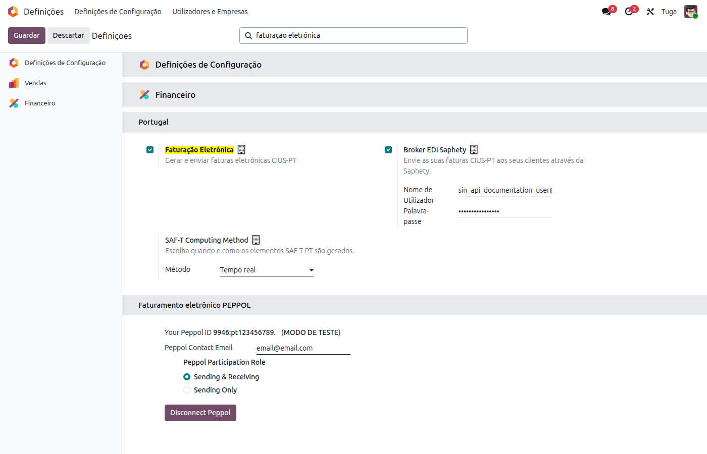
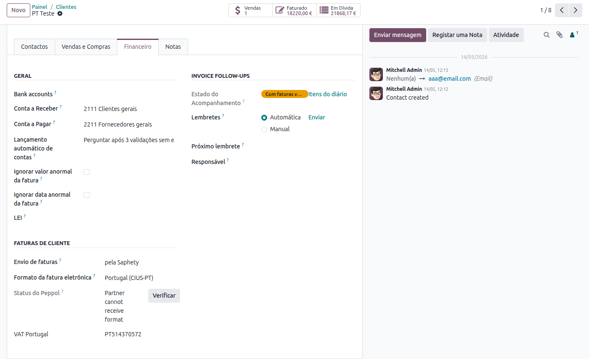
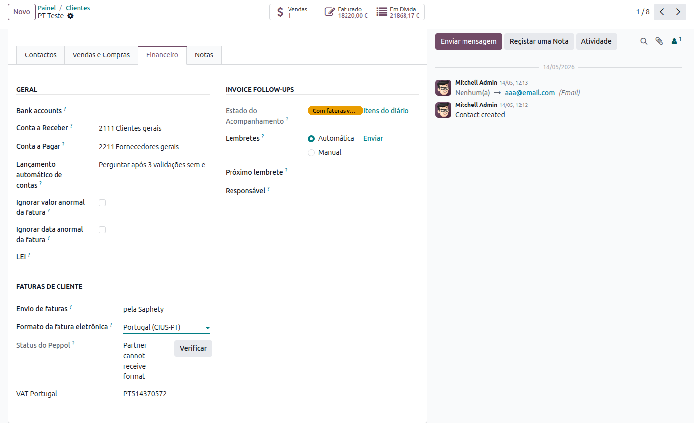
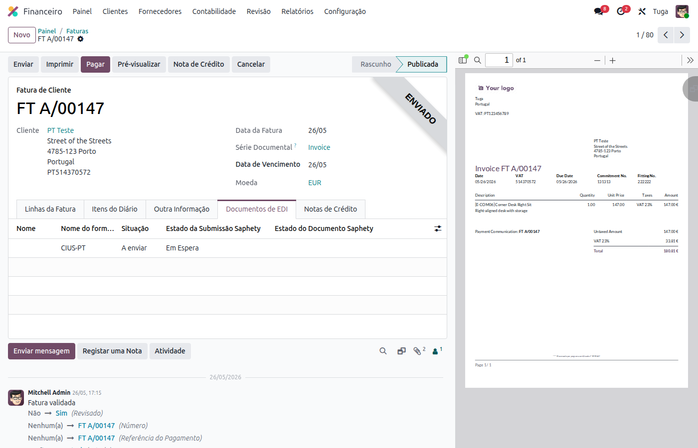
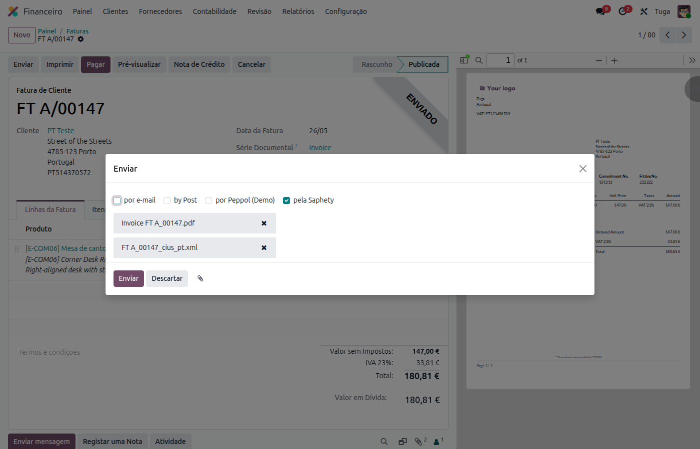
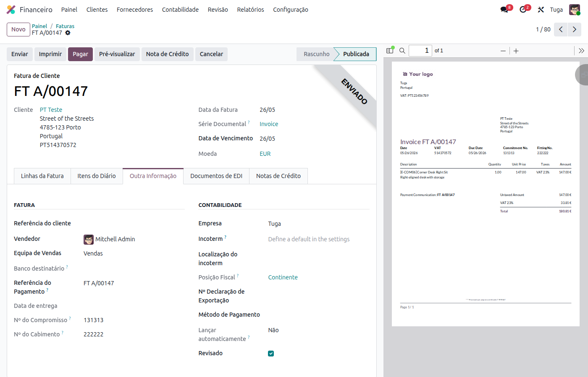
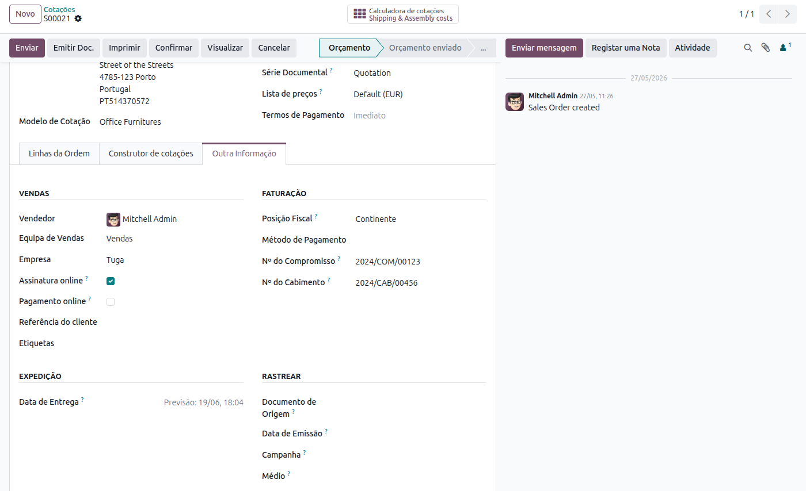

:nosearch:

================================
Faturação Eletrónica (CIUS-PT)
================================
A faturação eletrónica CIUS-PT é o formato padrão português para a troca de faturas em
ficheiro estruturado (XML), segundo a norma
`CIUS-PT 2.1.1 <https://www.espap.gov.pt/spfin/normas/Paginas/normas.aspx>`_
publicada pela eSPap. Permite a transmissão de faturas entre empresas (B2B) e para entidades
do setor público (B2G) de forma estruturada e validada pelo organismo oficial.

.. raw:: html

    

        ─── ✦ ───
    

.. important::
    Esta funcionalidade não está disponível na loja Odoo. Para ter acesso à mesma,
    terá de solicitar a sua instalação e ativação à **Exo Software**.

Configuração
============

Ativar a Faturação Eletrónica
------------------------------

Aceda à app **Faturação / Contabilidade** (dependendo respetivamente se tem versão Community ou
Enterprise do Odoo), vá ao menu :menuselection:`Configuração --> Configurações` e pesquise por
**Faturação Eletrónica** na barra de pesquisa.

Certifique-se de que a opção **Faturação Eletrónica** está ativa na secção **Portugal** e guarde
as definições.

Configurar o Parceiro
---------------------

Para que o Odoo gere automaticamente o ficheiro CIUS-PT, é necessário indicar na ficha de cada
parceiro cliente que este deve receber faturas nesse formato.

Navegue até à ficha do parceiro em causa e abra o separador **Financeiro**. Na secção
**Faturas de Cliente**, defina o campo **Formato da fatura eletrônica** como
:guilabel:`Portugal (CIUS-PT)`.

Utilização
==========

Após configurar o parceiro, o processo é inteiramente automático: sempre que publicar uma fatura
de cliente para esse parceiro, o Odoo gera o ficheiro XML CIUS-PT e valida-o contra o esquema
oficial disponibilizado pela eSPap.

.. important::
    Se a validação do esquema falhar, a fatura **não será publicada**. O Odoo apresentará a
    lista de erros detetados — corrija os dados indicados e publique novamente.

Aceda à app **Faturação / Contabilidade**, abra ou crie a fatura e publique-a da forma habitual.
Pode verificar o estado do documento CIUS-PT no separador **Documentos de EDI**:

A coluna **Situação** indica o estado do ficheiro XML gerado, e a coluna **Estado da Submissão
Saphety** reflete o estado de transmissão caso o módulo de broker Saphety esteja instalado.

Envio
-----

Para enviar a fatura ao parceiro, carregue no botão :guilabel:`Enviar`. O diálogo de envio
apresenta os ficheiros que serão incluídos: o PDF da fatura e o ficheiro XML CIUS-PT.

.. note::
    O ficheiro XML é gerado no momento de **publicação** da fatura, não no momento de envio.
    Desta forma, garante-se que quaisquer problemas de conformidade são detetados antes de o
    documento ser comunicado ao cliente.

Campos Adicionais para Faturação B2G
=====================================

Nas faturas destinadas a entidades do setor público, o separador **Outra Informação** expõe
dois campos específicos exigidos no âmbito da contratação pública portuguesa:

- **Nº do Compromisso** — número de compromisso fornecido pela entidade pública compradora.
- **Nº do Cabimento** — número de cabimento fornecido pela entidade pública compradora.

Estes valores, quando preenchidos, são incluídos automaticamente no XML CIUS-PT gerado.

Encomendas de Venda B2G
------------------------

Com o módulo **Portugal - Faturação Eletrónica (Vendas)** instalado, os mesmos campos
**Nº do Compromisso** e **Nº do Cabimento** ficam disponíveis diretamente na encomenda de
venda, no separador **Outra Informação**.

Ao faturar a encomenda, os valores preenchidos são propagados automaticamente para a fatura
gerada, sem necessidade de os introduzir novamente.

Envio Automático via Broker (Saphety)
======================================

O módulo base gera e anexa o ficheiro XML CIUS-PT, mas o envio eletrónico automático para
o destinatário requer a instalação do módulo complementar **Portugal - Broker EDI Saphety**.
Com este módulo adicional, as faturas são transmitidas de forma automática através da
plataforma Saphety, certificada para o efeito.

Para mais informações sobre a configuração e utilização deste módulo, consulte a página
:doc:`Broker EDI Saphety <saphety>`.
