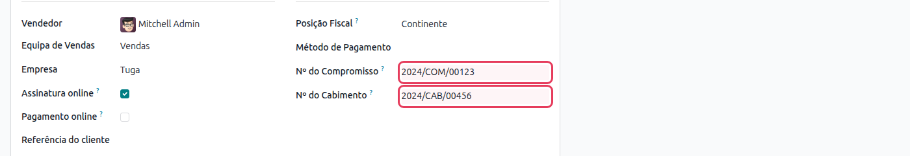
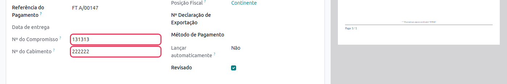

:nosearch:

==================================
Portugal - Vendas B2G e EDI
==================================
O módulo **Portugal - Vendas B2G e EDI** estende o fluxo de vendas com suporte
a contratos B2G (Business to Government): adiciona os campos **Nº do Compromisso**
e **Nº do Cabimento** às encomendas de venda e propaga-os automaticamente para as
faturas geradas.

.. raw:: html

    

        ─── ✦ ───
    

.. important::
    Esta funcionalidade não está disponível na loja Odoo. Para ter acesso à mesma,
    terá de solicitar a sua instalação e ativação à **Exo Software**.

.. note::
    Este módulo é instalado automaticamente quando os módulos
    :doc:`Faturação Eletrónica (CIUS-PT) <e-invoicing>` e
    **Portugal - Vendas** estão presentes.

Utilização
==========

Nº do Compromisso e Nº do Cabimento na Encomenda
--------------------------------------------------

Em contextos B2G, o cliente público (Estado, Câmara, etc.) fornece dois
referencias obrigatórias para a faturação:

.. list-table::
   :header-rows: 1
   :widths: 30 70

   * - Campo
     - Descrição
   * - **Nº do Compromisso**
     - Número atribuído pelo cliente B2G para comprometer a verba
       orçamental correspondente a esta compra.
   * - **Nº do Cabimento**
     - Número que identifica a reserva prévia de dotação orçamental.

Estes campos ficam disponíveis no separador :guilabel:`Outra Informação` da
encomenda de venda, na secção **Faturação**.

.. tip::
    Os campos **Nº do Compromisso** e **Nº do Cabimento** aparecem apenas em
    encomendas que utilizam uma série documental portuguesa (Tipo de Documento
    Fiscal configurado). Certifique-se de que a série documental está definida
    na encomenda antes de preencher estes campos.

Propagação Automática para a Fatura
-------------------------------------

Ao criar uma fatura a partir de uma encomenda de venda com estes campos
preenchidos, o Odoo propaga-os automaticamente. Na fatura resultante, os
valores aparecem também no separador :guilabel:`Outra Informação`.

Inclusão no Documento Impresso
---------------------------------

Quando a encomenda de venda é impressa (botão :guilabel:`Imprimir`), os campos
**Commitment No.** e **Fitting No.** são incluídos automaticamente na área de
informações do documento PDF, desde que estejam preenchidos.
