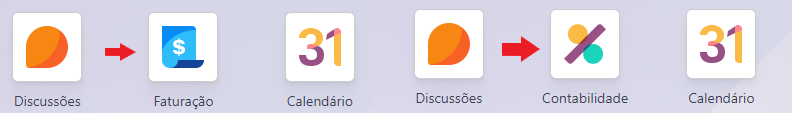
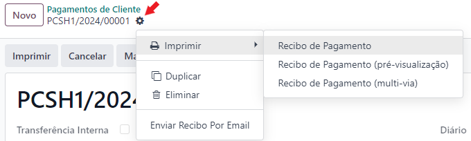

:show-content:

==================
Documentos Fiscais
==================

A localização Exo está preparada para o cumprimento e emissão de diversos documentos fiscais exigidos pela Autoridade Tributária e Aduaneira.

Para aceder aos documentos fiscais aceda à app **Faturação / Contabilidade** (dependendo respetivamente se tem versão Community ou Enterprise do Odoo), vá ao menu de **Configuração** e no separador Faturação selecione a opção **Séries**.

.. image:: fiscal_documents/v17_seriesMenu.png
   :align: center

.. note::
   - A coluna Ativo define se essa série vai estar disponível aos utilizadores, a coluna Usada significa se essa série está em uso, ou não
   - A coluna Filtro de Operações pode ser preenchida em cada série em que for necessária e corresponde aos Tipos de Operações que estão configurados na app Inventário
   - Por recomendação deve associar-se a Guia de Remessa à operação de Entregas e a Guia de Devolução a Devoluções (pode utilizar outros nomes para os tipos de operações)

.. image:: fiscal_documents/v17_seriesList.png
   :align: center

.. _fiscal_documents_quote:

Orçamento
=========

Documento informativo da cotação de serviços ou produtos. Depois de aprovado pelo cliente, é convertido em nota de encomenda.

Para emitir o pdf do orçamento basta ir ao menu **Ação** do documento e selecionar a opção :menuselection:`Imprimir --> Orçamento / Encomenda`

.. seealso::
   :ref:`Como fazer... <invoicing_process_quotation>`

Fatura pró-forma
----------------

Documento informativo frequentemente utilizado na cotação de produtos e na justificação da transacção internacional de produtos. Após aprovação do cliente pode ser convertida em nota de encomenda.

Para emitir o pdf da fatura pró-forma basta ir ao menu **Ação** do documento e selecionar a opção :menuselection:`Imprimir --> Orçamento / Encomenda`

.. seealso::
   :ref:`Como fazer... <invoicing_process_quotation>`

.. _fiscal_documents_order:

Nota de encomenda
-----------------

A nota de encomenda é um documento que é gerado automaticamente, sempre que um orçamento ou fatura pró-forma são confirmados depois da aprovação do cliente.

Este documento tem uma série de numeração independente dos anteriores.

Para emitir o pdf da nota de encomenda basta ir ao menu **Ação** do documento e selecionar a opção :menuselection:`Imprimir --> Orçamento / Encomenda`

Contem:

   - Número da nota de encomenda
   - Data de vencimento
   - Comerciante

      - Nome ou denominação social
      - Morada
      - NIF
   - Cliente

      - Nome ou denominação social
      - NIF (se pretendido, pode ser só como consumidor final)
   - Denominação e quantidade dos bens ou serviços
   - Valor da prestação de serviços ou da transmissão de bens
   - Taxas aplicáveis

Folha de obra
-------------

Documentação em breve

Fatura de consignação
---------------------

Documentação em breve

Crédito de consignação
----------------------

Documentação em breve

Consulta de mesa ou encomenda (POS)
-----------------------------------

Documentação em breve

.. _fiscal_documents_invoice:

Fatura
======
Documento que deve ser emitido sempre que se adquire um bem ou serviço sujeito a IVA

Contem:

   - Data de emissão
   - Número da fatura
   - Comerciante

      -   Nome ou denominação social
      -   Morada
      -   NIF
   - Cliente

        - Nome ou denominação social
        - NIF (se pretendido, pode ser só como consumidor final)
   - Denominação e quantidade dos bens ou serviços
   - Valor da prestação de serviços ou da transmissão de bens
   - Taxas aplicáveis
   - Montante de IVA liquidado
   - Motivo que justifique a não aplicação do imposto (se aplicável)

Para emitir o pdf da fatura basta ir ao menu **Ação** do documento e selecionar a opção :menuselection:`Imprimir --> Faturas ou Faturas (multi-via)`

.. seealso::
   :ref:`Como fazer... <invoicing_process_creat_invoice>`

.. important::
   Formas de corrigir faturas:

    - Pode cancelar o documento se o mesmo não foi comunicado em SAF-T, nem foi enviado ao cliente

        - Se já foi comunicado em SAF-T, ainda pode cancelar o documento, mas terá de submeter os devidos documentos de substituição à AT
        - Se já foi enviado ao cliente, deve ainda enviar comprovativo do seu cancelamento
    - Pode anular o documento, de forma total ou parcial, usando uma nota de crédito
    - Pode corrigir problemas de IVA incorretamente cobrado, usando uma nota de débito

Existem outros documentos com validade fiscal que poderão ser utilizados como substituto da fatura.

Fatura-recibo
-------------
Documento que agrega a fatura e o recibo, podendo apenas ser emitida quando a data da fatura e do pagamento coincidem (pronto pagamento).

Para emitir o pdf da fatura-recibo basta ir ao menu **Ação** do documento e selecionar a opção :menuselection:`Imprimir --> Faturas ou Faturas (multi-via)`

.. image:: fiscal_documents/v17_printInvoiceRecipt.png
   :align: center

.. seealso::
      :ref:`Como fazer... <invoicing_process_creat_invoice>`

Fatura-simplificada
-------------------
Documento emitido apenas para operações em território nacional, sujeito a condições:

   - Venda de bens por parte de retalhistas/vendedores ambulantes a um consumidor final, não sujeito passivo de IVA
   - O montante total da transação de um bem não pode ser superior a 1000€
   - O montante total da prestação de um serviço não pode ser superior a 100€

Para emitir o pdf da fatura simplificada basta ir ao menu **Ação** do documento e selecionar a opção :menuselection:`Imprimir --> Faturas ou Faturas (multi-via)`

.. image:: fiscal_documents/v17_printSimplifiedInvoice.png
   :align: center

.. seealso::
      :ref:`Como fazer... <invoicing_process_creat_invoice>`

Fatura eletrónica
-----------------

Documento emitido por software de faturação certificado e enviado por email. A esta fatura está associada uma assinatura digital que permite validar a autenticidade do documento.

Para que esta funcionalidade esteja disponível é preciso aceder à app **Faturação / Contabilidade** (dependendo respetivamente se tem versão Community ou Enterprise do Odoo), vá ao menu de :menuselection:`Configuração --> Configurações` e na secção **Portugal** ative a opção **Faturação Eletrónica**.

.. image:: fiscal_documents/v17_e_invoicing.png
   :align: center

.. seealso::
   :doc:`Saiba mais... <e-invoicing>`

Autofaturação
-------------
No processo de autofaturação o cliente substitiu-se ao fornecedor na emissão e comunicação dos documentos fiscais.

Para poder utilizar a autofaturação deve garantir as seguintes condições:

    - Existência de **acordo prévio** entre cliente e fornecedor, que tem de ser registado no portal da AT
    - Provar que o fornecedor tomou conhecimento da emissão dos documentos
    - O documento tem de mencionar o termo autofaturação
    - Utilização de uma série única com numeração sequencial

        - Para os fornecedores que sejam sujeitos passivos, tem de utilizar uma série única para cada um
        - Para os foenecedores que não forem sujeitos passivos, pode utilizar uma série para todos eles

.. seealso::
   :doc:`Saiba mais... <self-billing>`

.. _fiscal_documents_creditNote:

Nota de crédito
---------------
Documento que se emite quando há necessidade de efetuar uma retificação à fatura original, que reduz o seu valor.

A Autoridade Tributária e Aduaneira aconselha a emissão de nota de crédito nas seguintes situações:

   - **Erro na fatura**: emissão de nota de crédito na totalidade do valor da fatura e
     emissão de nova fatura com os novos dados
   - **Troca de Produtos**: emissão da nota de crédito apenas dos produtos a trocar
     e processamento de uma nova fatura
   - **Devolução de Produtos**: emissão de nota de crédito do valor parcial ou total dos
     produtos devolvidos

Para emitir o pdf da nota de crédito basta ir ao menu **Ação** do documento e selecionar a opção :menuselection:`Imprimir --> Faturas ou Faturas (multi-via)`

.. image:: fiscal_documents/v17_printCreditNote.png
   :align: center

.. important::
   Formas de corrigir notas de crédito:

    - Pode cancelar o documento se o mesmo não foi comunicado em SAF-T, nem foi enviado ao cliente

        - Se já foi comunicado em SAF-T, ainda pode cancelar o documento, mas terá de submeter os devidos documentos de substituição à AT
        - Se já foi enviado ao cliente, deve ainda enviar comprovativo do seu cancelamento
    - Pode anular o documento, emitindo uma nota de débito na fatura original

.. seealso::
   :ref:`Como fazer... <invoicing_process_create_creditNote>`

.. _fiscal_documents_debitNote:

Nota de débito
--------------
Tal como a nota de crédito, a nota de débito é um documento que se emite quando há necessidade de efetuar uma retificação à fatura original.

No entanto essa retificação só acrescenta valor à fatura original, não deve ser usada para corrigir dados da fatura, apenas para correção do IVA.

A Autoridade Tributária e Aduaneira aconselha a emissão de nota de débito nas seguintes situações:

    - **Não aplicação de IVA**: incorretamente não foi aplicado IVA a um produto ao qual deveria ter sido
    - **Aplicação de IVA inferior**: incorretamente foi aplicada uma taxa de IVA inferior ao que deveria ter sido

Para emitir o pdf da nota de débito basta ir ao menu **Ação** do documento e selecionar a opção :menuselection:`Imprimir --> Faturas ou Faturas (multi-via)`

.. important::
   Formas de corrigir notas de débito:

    - Pode cancelar o documento se o mesmo não foi comunicado em SAF-T, nem foi enviado ao cliente

        - Se já foi comunicado em SAF-T, ainda pode cancelar o documento, mas terá de submeter os devidos documentos de substituição à AT
        - Se já foi enviado ao cliente, deve ainda enviar comprovativo do seu cancelamento
    - Pode anular o documento, emitindo uma nota de crédito na fatura original

.. seealso::
   :ref:`Como fazer... <invoicing_process_create_debitNote>`

.. _fiscal_documents_receipt:

Recibo
======
Documento que comprova pagamento efetuado. A sua emissão comprova que o pagamento foi efetivamente recebido pelo emissor.

A emissão de recibos permite controlar a conta corrente de um cliente, através de uma verificação entre faturação e recibos.

Deve conter:

   - Data de transação
   - Número do recibo
   - Comerciante

      - Nome ou denominação social
      - Morada
      - NIF
   - Cliente

      - Nome ou denominação social
      - NIF (se pretendido, pode ser só como consumidor final)
   - Valor do recibo

Para emitir o pdf do recibo basta ir ao menu **Ação** do documento e selecionar a opção :menuselection:`Imprimir --> Recibo de Pagamento`

.. important::
   Como os recibos são um comprovativo do recebimento efetivo de recebimentos, deve evitar a todo custo erros na sua emissão

    No entanto pode:

    - Cancelar o documento se o mesmo não foi comunicado em SAF-T, nem foi enviado ao cliente

        - Se já foi comunicado em SAF-T, ainda pode cancelar o documento, mas terá de submeter os devidos documentos de substituição à AT
        - Se já foi enviado ao cliente, deve ainda enviar comprovativo do seu cancelamento

.. seealso::
   :ref:`Como fazer... <invoicing_process_create_recipt>`

Recibo de IVA de caixa
----------------------

Documentação em breve

.. seealso::
   :ref:`Como fazer... <invoicing_process_create_recipt>`

Guia de remessa / Guia de transporte
====================================

Documentação em breve

.. note::
   **Guias de Remessa para fora de Portugal**

   As Guias de Remessa só são informadas à Autoridade Tributária se a entrega for feita para um cliente em Portugal. Quando exporta produtos os mesmos não precisam de comunicar a Guia de Remessa pois essa é uma figura da legislação portuguesa que não existe noutros países.

.. seealso::
   :doc:`Como fazer... <other>`

Guia de transporte de ativos
----------------------------

Documentação em breve

.. seealso::
   :doc:`Como fazer... <other>`

Guia de consignação
-------------------

Documentação em breve

.. seealso::
   :doc:`Como fazer... <other>`

Guia de devolução
-----------------

Documentação em breve

.. seealso::
   :doc:`Como fazer... <other>`

Código QR e ATCUD
=================
O Código QR é um código de barras bidimensional que contém informação pertinente sobre o conteúdo do documento.

O ATCUD é um código único que permite identificar univocamente um documento, independentemente do seu emitente, do tipo de documento e da série utilizada.

São ambos gerados no momento da emissão do documento, pelo software, e adicionados ao mesmo tempo no documento.

Pode configurar a posição acedendo à app **Faturação / Contabilidade** (dependendo respetivamente se tem versão Community ou Enterprise do Odoo), vá ao menu de :menuselection:`Configuração --> Configurações` e na secção **Portugal** selecione a opção que deseja para **Posição do Código QR**.

As opções disponíveis são:

   - Topo da primeira página
   - Fim da última página

.. toctree::
    :hidden:

    invoicing_process
