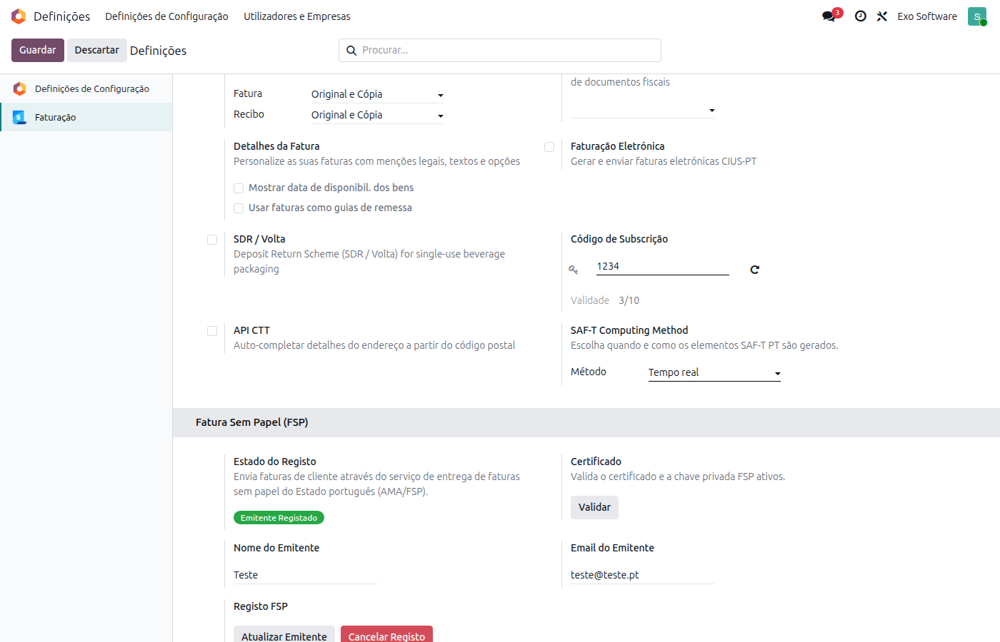
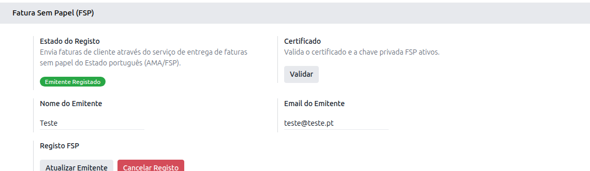
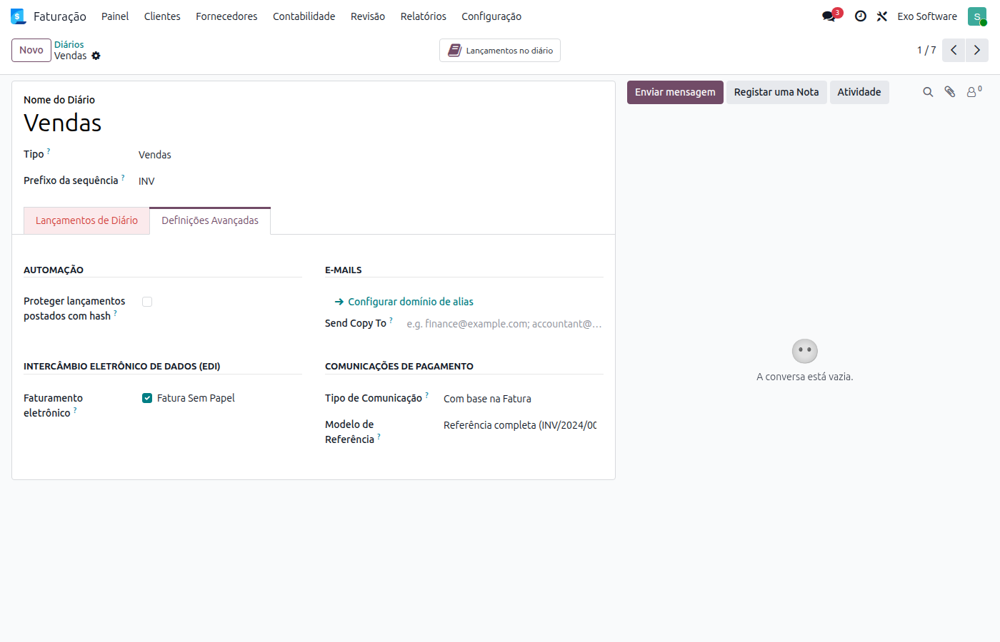
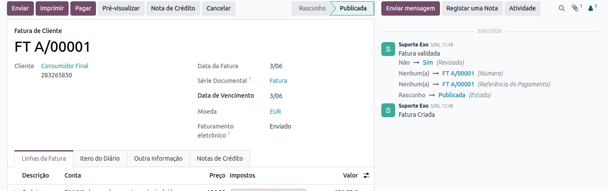

:show-content:

======================
Fatura Sem Papel (FSP)
======================
O serviço **Fatura Sem Papel** (FSP), operado pela AMA (Agência para a Modernização Administrativa),
permite que as empresas entreguem faturas digitalmente aos seus clientes diretamente através do portal
do governo português. Quando um cliente adere ao serviço FSP, as faturas que lhe sejam emitidas chegam
automaticamente ao seu email — sem necessidade de o emitente enviar qualquer email manualmente.

Com a app da Exo, o Odoo integra-se com o portal FSP de forma completamente **automática e silenciosa**:
sempre que uma fatura é confirmada, o Odoo verifica se o NIF do cliente está inscrito no serviço e, se
estiver, envia o PDF automaticamente. Clientes não inscritos são ignorados sem erros.

.. raw:: html

    

        ─── ✦ ───
    

.. important::
    Esta funcionalidade não está disponível na loja Odoo. Para ter acesso à mesma, terá de solicitar
    a sua instalação e ativação à **Exo Software**.

    O certificado digital e os identificadores do software junto da AMA são fornecidos e
    configurados pela **Exo Software** — não há nada a introduzir manualmente nesta secção.

    A empresa deve ter um **NIPC válido** (9 dígitos) configurado no Odoo e indicar um
    **email de seller** para receber as notificações do portal FSP.

Configuração inicial
====================

.. tip::
    O certificado é carregado automaticamente aquando da instalação do módulo — não é necessária
    qualquer configuração de certificado por parte do utilizador.

    Em ambiente de **pré-produção** (o modo padrão), as faturas de teste são enviadas para o portal
    de pré-produção da AMA. A passagem a **produção** é tratada pela **Exo Software**, que configura
    o certificado de produção fornecido pela AMA.

O bloco de configuração FSP só é visível para utilizadores com o grupo de segurança **FSP Manager**.

Aceda à app **Faturação / Contabilidade** (dependendo respetivamente se tem versão Community ou Enterprise
do Odoo), vá ao menu :menuselection:`Configuração --> Configurações` e procure a secção
**Paperless Invoice (FSP)**.

.. _fsp_certificate:

Validação do certificado
------------------------

O certificado e a chave privada são geridos pela **Exo Software** e carregados automaticamente
para o ambiente ativo — não existem campos para os introduzir manualmente nesta secção.

No campo **Certificate**, clique em **Validate** para confirmar que o par certificado/chave é válido:

- Mensagem verde → o certificado é válido e pode avançar para o passo seguinte
- Mensagem vermelha → contacte a **Exo Software**, pois o certificado do ambiente ativo não está
  corretamente configurado

Dados do seller
---------------

Preencha os dados da sua empresa enquanto emissora de faturas:

- **Seller Name** — nome comercial da empresa (por omissão usa o nome da company no Odoo)
- **Seller Email** — endereço de email para receber notificações do portal FSP

Autenticação do software
------------------------

Clique em **Authenticate SW**.

O Odoo autenticar-se-á junto da AMA usando o certificado. O estado do badge passa para
**SW Authenticated** (amarelo).

.. important::
    Se a autenticação falhar, valide novamente o certificado (botão **Validate**) e confirme que
    o ambiente ativo está corretamente configurado. Se o problema persistir, contacte a
    **Exo Software**.

Registo do seller
-----------------

Clique em **Register Seller**.

O Odoo regista a empresa como emissora de faturas no portal FSP. O estado do badge passa
para **Seller Registered** (verde).

.. important::
    Apenas no estado **Seller Registered** é que o Odoo envia faturas ao portal FSP.

    Se o registo falhar com erro 401, significa que o passo anterior (Authenticate SW)
    não foi concluído com sucesso. Repita-o antes de tentar novamente.

Configurar os diários
=====================

Após o registo, o FSP fica automaticamente ativo em todos os diários de vendas da empresa.
Para verificar ou alterar esta configuração, aceda à app **Faturação / Contabilidade**, vá ao
menu :menuselection:`Configuração --> Diários`, selecione o diário pretendido e procure a secção
**Intercâmbio Eletrónico de Dados**:

- Opção **Fatura Sem Papel** marcada → as faturas confirmadas neste diário são enviadas ao portal FSP
- Opção desmarcada → as faturas deste diário não são submetidas via FSP

Utilização
==========

Não é necessária nenhuma ação por parte do utilizador em cada fatura. O processo é inteiramente
automático:

1. Quando uma fatura de cliente é **confirmada**, o Odoo verifica via API da AMA se o NIF do
   cliente está inscrito no serviço FSP.
2. Se o NIF estiver inscrito, o PDF é automaticamente colocado em fila de envio. O cron de EDI
   processa a fila em background e entrega o ficheiro ao portal FSP.
3. Se o NIF não estiver inscrito, o Odoo marca o documento EDI como **Cancelado** — este estado
   é normal e não representa um erro.

Verificar o estado de envio
---------------------------

Na fatura, o campo **Faturamento eletrônico** na cabeçalho mostra o estado FSP atual.
Em modo de programador, pode ainda consultar o detalhe no separador **Documentos EDI**.

Os estados possíveis são:

.. list-table::
   :header-rows: 1
   :widths: 20 80

   * - Estado
     - Significado
   * - **A Enviar**
     - Em fila, aguarda o próximo ciclo do cron EDI.
   * - **Enviado**
     - PDF entregue com sucesso ao portal FSP.
   * - **Cancelado**
     - NIF do cliente não inscrito no FSP. Normal, não é um erro.
   * - **Erro**
     - Falha no envio. Consulte a mensagem de erro apresentada abaixo do badge.

Reenvio manual
--------------

Se uma fatura ficou com estado **Erro**, clique em **Enviar Agora** na secção
**Intercâmbio Eletrónico de Dados** para forçar uma nova tentativa imediata, sem aguardar
o próximo ciclo do cron.

.. tip::
    Pode acompanhar o detalhe de cada submissão (incluindo os erros retornados pela AMA) no separador
    **Documentos EDI** da fatura, se tiver o modo de programador ativo.

Gestão do seller
----------------

Após o registo, as seguintes ações ficam disponíveis na secção FSP das definições:

- **Update Seller** — atualiza o nome comercial e/ou email do seller no portal FSP
- **Unregister** — cancela permanentemente o registo desta empresa no FSP; os envios futuros
  falharão até que seja efetuado um novo registo

Renovação automática de tokens
-------------------------------

O acesso ao portal FSP requer tokens de autenticação que expiram a **cada 24 horas**. Um cron
diário renova-os automaticamente — não é necessária nenhuma ação.

.. important::
    Se o token de renovação (*refresh token*) expirar — o que acontece ao fim de um período
    prolongado de inatividade — o estado da empresa reverte para **Draft**. Nesse caso, será
    necessário repetir os passos de :ref:`Autenticação do software <fsp_certificate>` e
    **Registo do seller**.

Resolução de problemas
======================

Estado **Draft** ou **SW Authenticated** em vez de **Seller Registered**
-------------------------------------------------------------------------

O fluxo de registo não foi completado. Siga os passos de **Autenticação do software** e
**Registo do seller** descritos na configuração inicial.

Erro 401 ao enviar faturas
--------------------------

Os tokens do seller são inválidos ou expiraram. Clique em **Register Seller** para obter tokens
frescos — não é necessário repetir o passo de **Authenticate SW** se o badge ainda mostrar
*SW Authenticated*.

Todas as faturas com estado **Cancelado**
-----------------------------------------

O NIF do cliente não está inscrito no FSP. Não é um erro — significa que o cliente ainda não
aderiu ao serviço. A fatura deve ser enviada por outro meio (email normal).

Erro na validação do certificado
---------------------------------

O certificado do ambiente ativo não está corretamente configurado. Como o certificado é gerido
pela **Exo Software**, contacte-a para confirmar que:

- O certificado correto para o ambiente em uso (pré-produção ou produção) está carregado
- O certificado e a chave privada correspondem (são um par) e estão dentro da validade

O PDF chega encriptado ao cliente
----------------------------------

O cliente configurou uma password pessoal no portal FSP. O módulo encripta automaticamente o
PDF com essa password usando AES-256 — o cliente precisa de a introduzir ao abrir o ficheiro
ZIP recebido. Este comportamento é controlado pelo portal FSP do cliente e não pelo Odoo.
