:nosearch:

========================
Despesas de Funcionários
========================
.. TODO : Despesas de Funcionários - Ver com André e Tiago outros tipos de despesas

.. Documentação em breve

Existem diferentes tipos de despesas que podem ser registadas pelos seus funcionários:

    - Despesas de Deslocação
    - ...

Veja como as deve registar em Odoo

.. raw:: html

    

        ─── ✦ ───
    

.. _travelExpenses_ownVehicle:

Despesas de Deslocação em Viatura Própria
=========================================

.. important::
    Esta app não está disponível na loja Odoo. Para ter acesso à mesma, terá que solicitar a sua
    instalação e ativação na sua base de dados

Configuração
____________

Na app **Contactos**, entre no contacto respetivo e garanta que a informação está devidamente preenchida

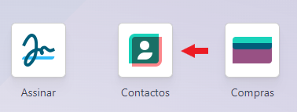

- Na aba **Vendas e Compras** vá à secção **Diversos** e preencha o campo **Distância à Sede** com os KMs a que esse parceiro está do seu estabelecimento
- Esta informação será usada para cálculo do valor da despesa

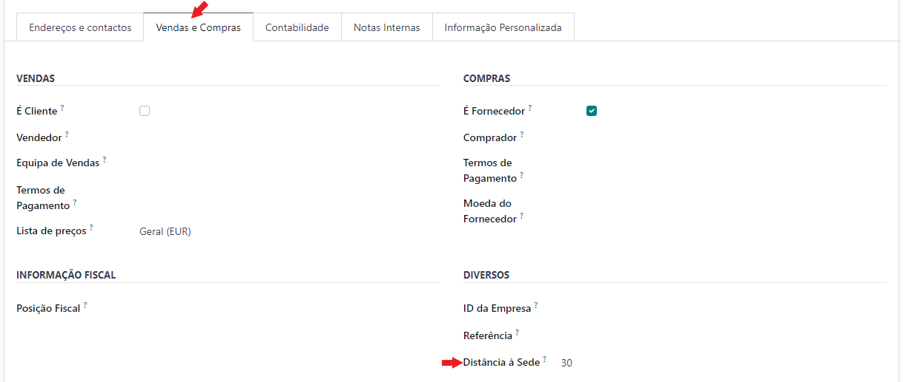

.. note::
    Este campo só é visível para contactos do tipo Empresa

    .. image:: hr_expenses/v17_Contacts02.png
        :align: center

Na app **Funcionários**, entre no funcionário vá à aba **Informação Privada** e garanta que o campo **Matrícula** está preenchido

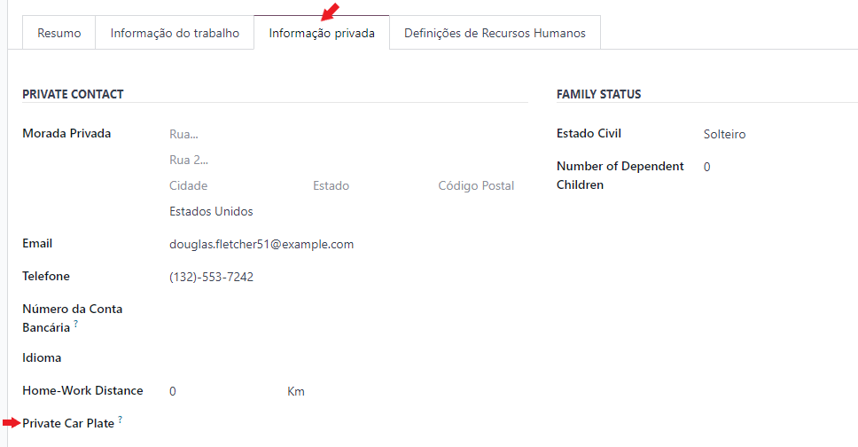

Na app de **Despesas** garanta que o artigo **Despesas de Deslocação (Viatura Própria)** está devidamente configurado.
para isso vá ao menu :menuselection:`Configuração --> Categorias Despesas`

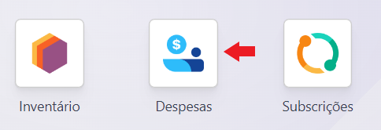

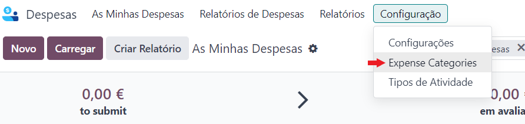

É importante garantir que o custo por KM está correto, como em qualquer outro artigo garanta que tem também devidamente
configurados os seguintes campos:

    - Categoria do Artigo
    - Conta de Gastos
    - Impostos de Fornecedor
    - Impostos a Cliente

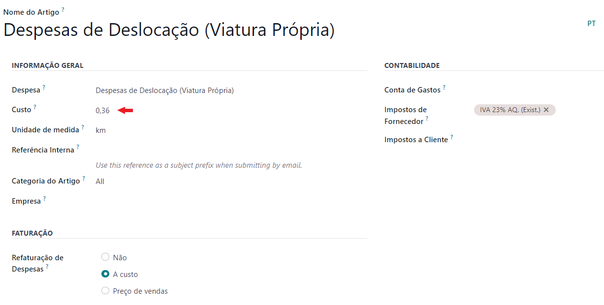

Utilização
__________

Na app de **Despesas** crie uma nova despesa e na Categoria selecione **Despesas de Deslocação (Viatura Própria)** e o parceiro respetivo

Algumas coisas vão acontecer:

- O campo **Matrícula** vai ser preenchido com a matrícula do **Funcionário**
- O campo **Preço Unitário** vai ser preenchido com o valor por KM estipulado no artigo
- O campo **Quantidade** vai ser preenchido com a distância do **Parceiro**

.. tip::
    O campo **Quantidade** usa este mecanismo para automatismo. No entanto, em cada despesa pode alterar o valor para
    o que pretender e assim cobrir diversas outras situações como:

    - Deslocações de funcionários em regime remoto à empresa
    - Deslocações a parceiros que sejam mais do que uma viagem à sua sede ou o ponto de partida seja diferente
    - Outro tipo de deslocações em viatura própria de funcionários

    Como esse tipo de alterações não pode ser previsto antecipadamente antes do seu acontecimento, terá de fazer a
    alteração manual no momento em que regista a despesa

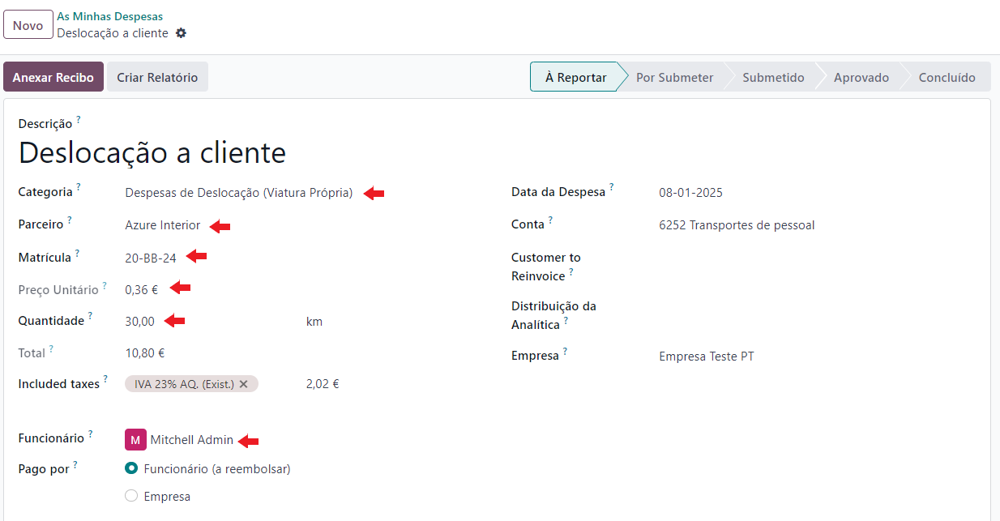

A partir deste ponto pode tratar a despesa como um processo normal de despesas até que a mesma esteja aprovada

Depois de aprovada tem acesso ao documento de compensação por deslocações indo ao menu :menuselection:`Ação --> Imprimir --> Compensação por Deslocações`

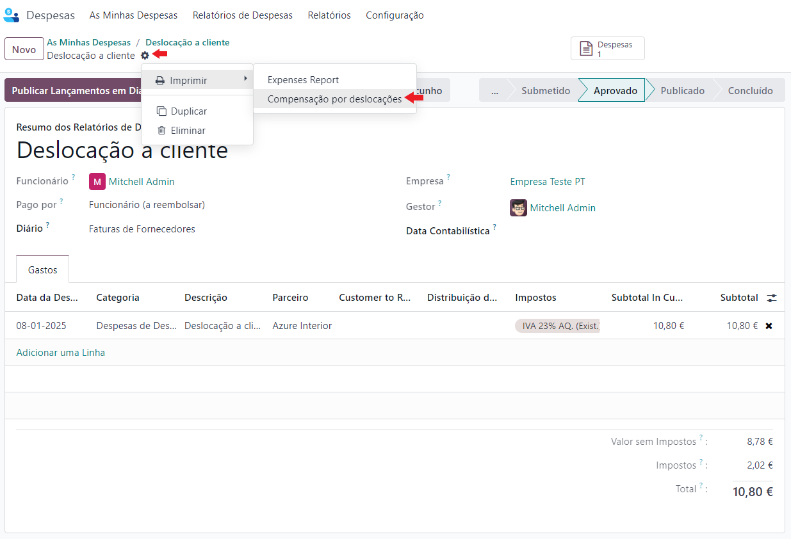

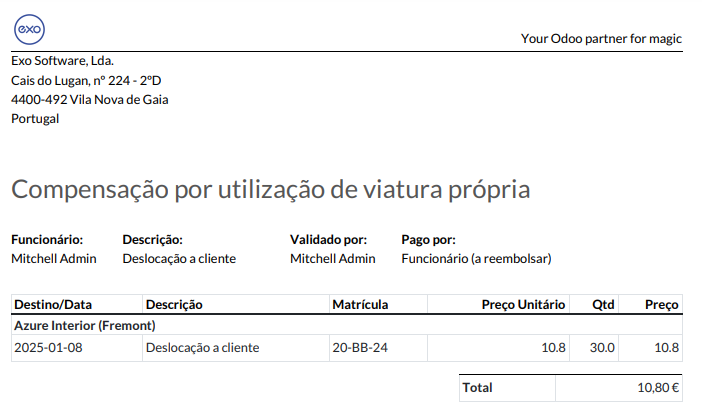

.. _expenseReimbursement:

Despesas Pagas pelo Próprio Funcionário e Reembolso
====================================================

.. important::
    Este fluxo aplica-se apenas a empresas portuguesas, nas despesas cujo campo **Pago por** esteja definido como
    **Funcionário (a reembolsar)**.

Quando um funcionário paga uma despesa do seu próprio bolso, em vez de o Odoo publicar diretamente um recibo de
despesa contabilizado ao funcionário, é criada uma **fatura de fornecedor em rascunho** no fornecedor real da
despesa. Isto permite à contabilidade rever o documento antes de o publicar. Só quando essa fatura de fornecedor é
publicada é que a dívida passa do fornecedor para o funcionário, através de um lançamento de transferência de
dívida, e só quando essa dívida ao funcionário for liquidada é que a despesa fica **Paga**.

Configuração
____________

Antes de poder usar este fluxo, defina a **Conta de Reembolso de Despesas**: aceda a
:menuselection:`Contabilidade --> Configuração --> Definições`, procure a secção **Portugal** e no bloco
**Reembolso de Despesas** escolha a conta de passivo corrente (reconciliável) que vai registar a dívida da empresa
aos seus funcionários.

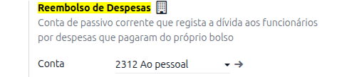

Utilização
__________

Ao criar a despesa, no campo **Pago por** escolha **Funcionário (a reembolsar)** e preencha o campo **Fornecedor**
com o fornecedor real da despesa. Este campo é obrigatório antes de publicar a despesa.

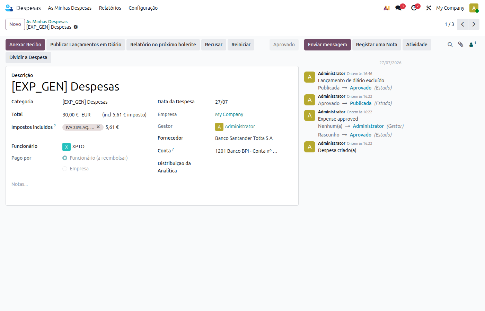

.. note::
    O campo **Fornecedor** só é visível nas despesas pagas pelo funcionário de empresas portuguesas, ou nas
    despesas pagas pela empresa.

Depois de aprovada, ao publicar a despesa com o botão **Publicar Lançamentos em Diário**, o Odoo cria uma
**fatura de fornecedor em rascunho** no fornecedor da despesa, com o campo **Parceiro a Reembolsar** já preenchido
com o funcionário. A despesa passa para o estado **Publicada**, mas ainda não fica **Paga**.

Reveja a fatura de fornecedor criada e publique-a normalmente. Ao publicá-la, o Odoo transfere automaticamente o
saldo a pagar do fornecedor para o funcionário, para a **Conta de Reembolso de Despesas**, através de um
lançamento de transferência de dívida acessível pelo botão **Debt Transfer** no topo da fatura.

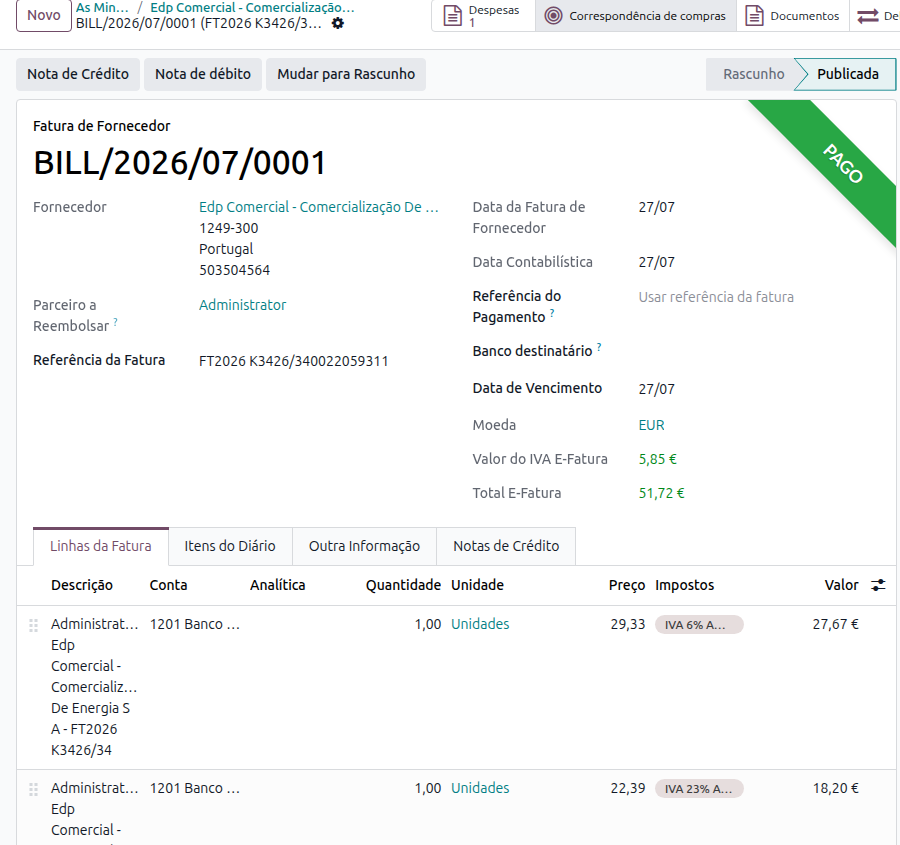

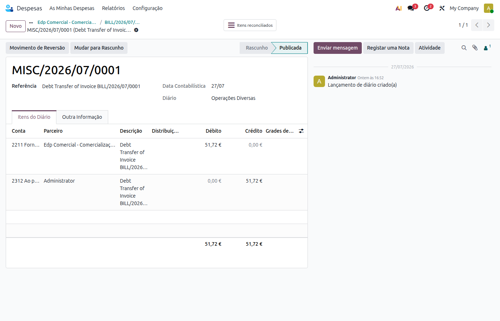

A despesa só passa a **Paga** quando essa dívida ao funcionário for liquidada, por exemplo com um pagamento
bancário ao funcionário reconciliado com o lançamento de transferência de dívida.

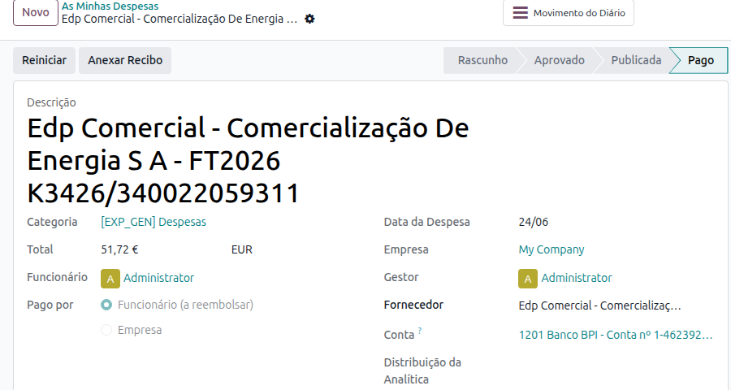

.. tip::
    Se o recibo da despesa já tiver sido lido através do **Scan QR** (ver :doc:`e-Fatura <../accounting/efatura>`)
    antes de a despesa ser publicada, o Odoo identifica automaticamente o registo e-Fatura correspondente e
    reaproveita a fatura de fornecedor já criada por essa sincronização, em vez de criar uma fatura duplicada —
    inclusive com uma linha por cada taxa de imposto do documento e-Fatura (por exemplo 6% + 23% no mesmo recibo).

    Nesse caso, os campos de imposto da própria despesa ficam ocultos, porque a repartição de imposto real passa a
    estar no registo e-Fatura.

.. seealso::
    `Consulte a documentação Odoo sobre Despesas <https://www.odoo.com/documentation/18.0/pt_BR/applications/finance/expenses.html>`_

    `Se pretender formação adicional sobre despesas faça a sua marcação <https://exosoftware.pt/appointment>`_
