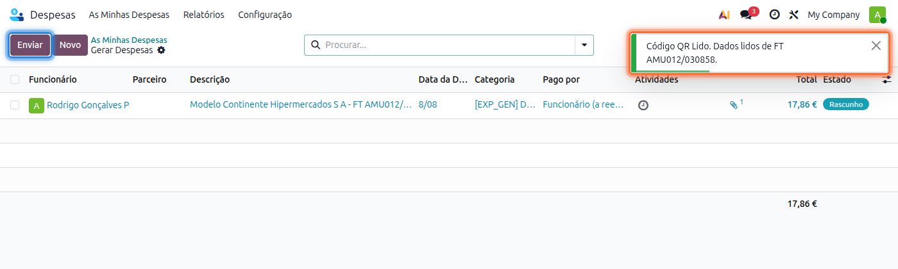
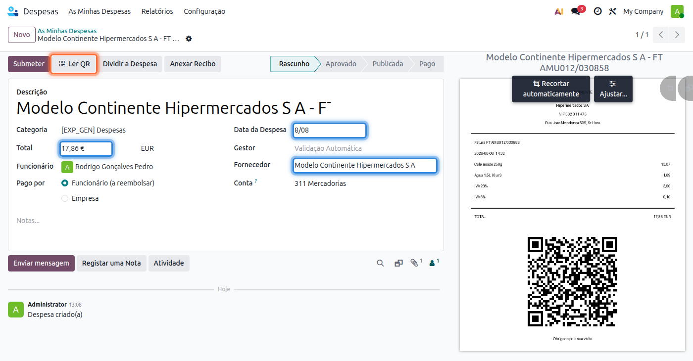
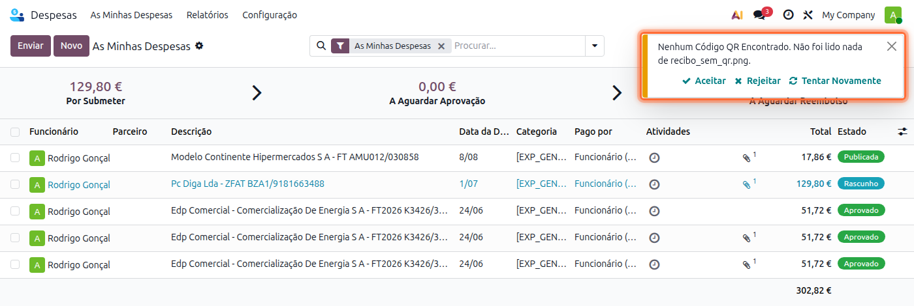
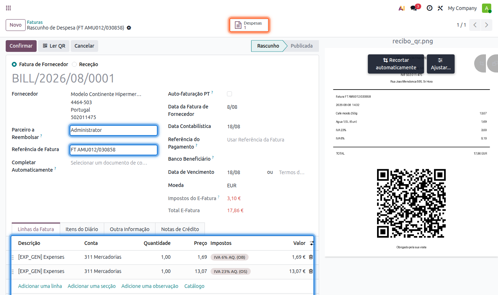
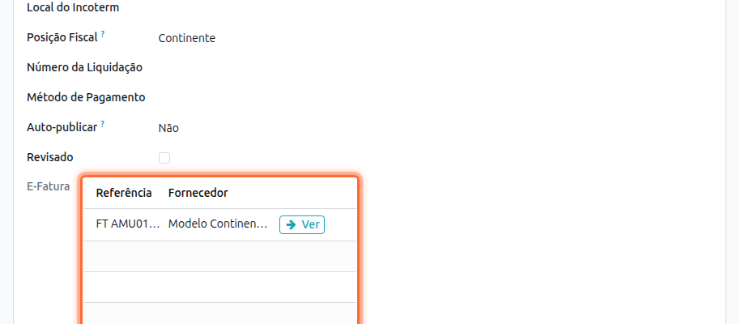
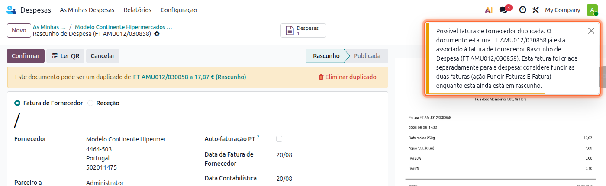

:nosearch:

========================
Despesas de Funcionários
========================
.. TODO : Despesas de Funcionários - Ver com André e Tiago outros tipos de despesas

.. Documentação em breve

Existem diferentes tipos de despesas que podem ser registadas pelos seus funcionários:

    - Despesas de Deslocação
    - ...

Veja como as deve registar em Odoo

.. raw:: html

    

        ─── ✦ ───
    

.. _travelExpenses_ownVehicle:

Despesas de Deslocação em Viatura Própria
=========================================

.. important::
    Esta app não está disponível na loja Odoo. Para ter acesso à mesma, terá que solicitar a sua
    instalação e ativação na sua base de dados

Configuração
____________

Na app **Contactos**, entre no contacto respetivo e garanta que a informação está devidamente preenchida

.. image:: hr_expenses/v17_appContacts01.png
   :align: center

- Na aba **Vendas e Compras** vá à secção **Diversos** e preencha o campo **Distância à Sede** com os KMs a que esse parceiro está do seu estabelecimento
- Esta informação será usada para cálculo do valor da despesa

.. image:: hr_expenses/v17_Contacts01.png
   :align: center

.. note::
    Este campo só é visível para contactos do tipo Empresa

    .. image:: hr_expenses/v17_Contacts02.png
        :align: center

Na app **Funcionários**, entre no funcionário vá à aba **Informação Privada** e garanta que o campo **Matrícula** está preenchido

.. image:: hr_expenses/v17_appEmployees.png
   :align: center

.. image:: hr_expenses/v17_Employees01.png
   :align: center

Na app de **Despesas** garanta que o artigo **Despesas de Deslocação (Viatura Própria)** está devidamente configurado.
para isso vá ao menu :menuselection:`Configuração --> Categorias Despesas`

.. image:: hr_expenses/v17_appExpenses.png
   :align: center

.. image:: hr_expenses/v17_Expenses01.png
   :align: center

É importante garantir que o custo por KM está correto, como em qualquer outro artigo garanta que tem também devidamente
configurados os seguintes campos:

    - Categoria do Artigo
    - Conta de Gastos
    - Impostos de Fornecedor
    - Impostos a Cliente

.. image:: hr_expenses/v17_Expenses02.png
   :align: center

Utilização
__________

Na app de **Despesas** crie uma nova despesa e na Categoria selecione **Despesas de Deslocação (Viatura Própria)** e o parceiro respetivo

Algumas coisas vão acontecer:

- O campo **Matrícula** vai ser preenchido com a matrícula do **Funcionário**
- O campo **Preço Unitário** vai ser preenchido com o valor por KM estipulado no artigo
- O campo **Quantidade** vai ser preenchido com a distância do **Parceiro**

.. tip::
    O campo **Quantidade** usa este mecanismo para automatismo. No entanto, em cada despesa pode alterar o valor para
    o que pretender e assim cobrir diversas outras situações como:

    - Deslocações de funcionários em regime remoto à empresa
    - Deslocações a parceiros que sejam mais do que uma viagem à sua sede ou o ponto de partida seja diferente
    - Outro tipo de deslocações em viatura própria de funcionários

    Como esse tipo de alterações não pode ser previsto antecipadamente antes do seu acontecimento, terá de fazer a
    alteração manual no momento em que regista a despesa

.. image:: hr_expenses/v17_Expenses03.png
   :align: center

A partir deste ponto pode tratar a despesa como um processo normal de despesas até que a mesma esteja aprovada

Depois de aprovada tem acesso ao documento de compensação por deslocações indo ao menu :menuselection:`Ação --> Imprimir --> Compensação por Deslocações`

.. image:: hr_expenses/v17_Expenses04.png
   :align: center

.. image:: hr_expenses/v17_Expenses05.png
   :align: center

.. _expenseReimbursement:

Despesas Pagas pelo Próprio Funcionário e Reembolso
====================================================

.. important::
    Este fluxo aplica-se apenas a empresas com localização PT+ ativa, nas despesas cujo campo **Pago por**
    esteja definido como **Funcionário (a reembolsar)**.

Quando um funcionário paga uma despesa do seu próprio bolso, em vez de ser publicado diretamente um recibo de
despesa contabilizado ao funcionário, é criada uma **fatura de fornecedor em rascunho** do fornecedor real da
despesa. Isto permite à contabilidade rever o documento antes de o publicar. Só quando essa fatura de fornecedor é
publicada é que a dívida passa do fornecedor para o funcionário, através de um lançamento de transferência de
dívida, e só quando essa dívida ao funcionário for liquidada é que a despesa passa ao estado de **Paga**.

Configuração
____________

Antes de poder usar este fluxo, defina a **Conta de Reembolso de Despesas**: aceda a
:menuselection:`Contabilidade --> Configuração --> Definições`, procure a secção **Portugal** e no bloco
**Reembolso de Despesas** escolha a conta do tipo **A pagar** (reconciliável) que vai registar a dívida da empresa
aos seus funcionários.

.. image:: hr_expenses/v19_reimbursement_settings.png
   :align: center

Utilização
__________

Ao criar a despesa, escolha o **Funcionário** a reembolsar, no campo **Pago por** escolha
**Funcionário (a reembolsar)** e preencha o campo **Fornecedor** com o real fornecedor da despesa. Este campo é
obrigatório antes de submeter e publicar a despesa na data contabilística pretendida.

.. image:: hr_expenses/v19_reimbursement_expense_form.png
   :align: center

.. note::
    O campo **Fornecedor** só é visível nas despesas pagas pelo funcionário para empresas com localização
    PT+ ativa, ou nas despesas pagas pela empresa para todas.

Depois de aprovada, ao publicar a despesa com o botão **Publicar Lançamentos em Diário**, o Odoo cria uma
**fatura de fornecedor em rascunho** no fornecedor da despesa, com o campo **Parceiro a Reembolsar** já preenchido
com o contacto do funcionário. A despesa passa para o estado **Publicada**, mas ainda não fica **Paga**.

Reveja a fatura de fornecedor criada e publique-a normalmente.

Ao publicá-la, o Odoo transfere automaticamente o saldo a pagar do fornecedor para o funcionário, para a
**Conta de Reembolso de Despesas**, através de um lançamento de transferência de dívida acessível pelo botão
**Transferência de Dívida** no topo da fatura.

.. image:: hr_expenses/v19_reimbursement_bill.png
   :align: center

.. image:: hr_expenses/v19_reimbursement_debt_transfer.png
   :align: center

A despesa só passa ao estado **Paga** quando a dívida ao funcionário for liquidada através da reconciliação
do(s) lançamento(s) de Transferência de Dívida com a respetiva linha do extrato bancário.

.. image:: hr_expenses/v19_reimbursement_expense_paid.png
   :align: center

.. tip::
    Se o recibo da despesa tiver o código QR obrigatório em Portugal, o Odoo lê-o e liga a despesa ao documento
    do e-Fatura correspondente, aproveitando a fatura de fornecedor que já exista em vez de criar uma segunda.
    Veja :ref:`expenseEfaturaQR`

.. _expenseEfaturaQR:

Recibos com Código QR e Ligação ao e-Fatura
===========================================

.. important::
    Esta funcionalidade não está disponível na loja Odoo. Para ter acesso à mesma, terá que solicitar a sua
    instalação e ativação na sua base de dados

Todas as faturas e recibos emitidos em Portugal são obrigados a ter um código QR. O Odoo lê esse código na
fotografia ou no PDF do recibo e preenche a despesa com os dados que o próprio documento traz, sem que ninguém os
tenha de escrever.

Mais importante do que poupar a escrita, é essa leitura que liga a despesa ao documento do **e-Fatura**: como o
seu fornecedor declara à AT a mesma fatura que o funcionário lhe entrega, o mesmo documento chega ao Odoo por dois
caminhos. Aproveitando o código QR, fica registado uma única vez, e não duas.

Configuração
____________

Nas configurações da app **Faturação / Contabilidade**, secção **Portugal**, ative a opção
:guilabel:`Leitura E-Fatura`. Configure também a tabela de **Mapeamento de Impostos E-Fatura**, que é o que
permite criar as linhas da fatura de fornecedor com o imposto certo (ver
:doc:`e-Fatura <../accounting/efatura>`)

Para as despesas pagas pelo funcionário, tenha ainda configurada a **Conta de Reembolso de Despesas**, conforme
explicado em :ref:`expenseReimbursement`

Ler o código QR do recibo
_________________________

O código QR é lido em qualquer um destes momentos:

- Ao carregar recibos com o botão :guilabel:`Enviar` da lista de despesas, que é também o que a aplicação móvel do
  Odoo faz quando o funcionário fotografa o recibo. É criada uma despesa por cada ficheiro, já preenchida
- Ao anexar o recibo a uma despesa que já existe, pelo botão :guilabel:`Anexar Recibo` ou pelo chatter
- A pedido, no botão :guilabel:`Ler QR` da despesa, que percorre todos os anexos do documento

Uma mensagem no canto superior direito confirma qual foi o documento lido, para que saiba se o Odoo aproveitou ou
não a fotografia.

Do código QR vêm o :guilabel:`Total`, a :guilabel:`Data da Despesa`, o :guilabel:`Fornecedor` e a descrição da
despesa, composta pelo nome do fornecedor e pelo número do documento.

.. note::
    Os campos de imposto da despesa deixam de estar visíveis quando o recibo tem documento do e-Fatura. É de
    propósito: a repartição real por taxa vem do e-Fatura, que pode ter mais do que uma (por exemplo 6% e 23% no
    mesmo recibo), e o campo único da despesa daria uma ideia errada dos valores.

.. tip::
    Se o fornecedor ainda não existir na sua base de dados, é criado a partir do NIF que vem no código QR e fica
    marcado com o pisco **Criado pelo E-Fatura** na ficha do contacto. Use-o para encontrar os contactos cujos
    dados ainda estão por completar.

Quando não é possível ler o código QR
_____________________________________

Uma fotografia tremida, cortada, ou tirada a um documento sem código QR, não dá nada ao Odoo. Em vez de deixar
seguir uma despesa vazia para a contabilidade, o Odoo pergunta o que fazer com ela:

- :guilabel:`Aceitar` mantém a despesa como está, para a preencher à mão
- :guilabel:`Rejeitar` apaga a despesa e a fotografia
- :guilabel:`Tentar Novamente` apaga a despesa e abre outra vez a câmara, para tirar nova fotografia no momento

A pergunta é feita quando não existe código QR nenhum, e quando existe mas não está legível (tremido, cortado, ou
não é o código QR de uma fatura portuguesa). Se enviar vários ficheiros de uma vez, é perguntado um a um,
indicando o nome do ficheiro e quantos faltam decidir.

Um recibo emitido ao NIF do funcionário, e não ao da empresa, é uma despesa válida como qualquer outra: é
preenchido normalmente e não lhe é perguntado nada.

.. note::
    Fechar a mensagem sem escolher nada tem o mesmo efeito que :guilabel:`Aceitar`: a despesa fica registada.

.. _expenseEfaturaMatch:

Ligação ao e-Fatura e reaproveitamento da fatura de fornecedor
______________________________________________________________

O mesmo documento chega ao Odoo por dois caminhos, e a ordem por que chega não é sempre a mesma. Nos dois casos o
resultado é uma única fatura de fornecedor:

**O e-Fatura chegou primeiro.** A sincronização do e-Fatura já criou a fatura de fornecedor em rascunho. Ao
publicar a despesa, o Odoo reconhece que se trata do mesmo documento e aproveita essa fatura, em vez de criar uma
segunda. A equivalência é feita pelo número do documento e pelo NIF do fornecedor, em qualquer formato em que o
NIF esteja escrito, com ou sem o prefixo PT.

A fatura aproveitada fica com o :guilabel:`Parceiro a Reembolsar` preenchido com o funcionário, recebe o recibo
como anexo e passa a estar ligada à despesa, acessível pelo botão :guilabel:`Despesas` no topo. E leva uma linha
por cada taxa do documento do e-Fatura, para que os impostos fiquem certos.

Na aba :guilabel:`Outra Informação` da fatura pode confirmar a que documento do e-Fatura ela ficou ligada.

**A despesa chegou primeiro.** Quando ainda não há nada do e-Fatura, a fatura de fornecedor é criada pela despesa
como habitualmente, mas com o número do documento na :guilabel:`Referência de Fatura`. É por aí que a
sincronização do e-Fatura, quando o fornecedor declarar o documento à AT, liga esse documento a esta fatura em vez
de criar outra.

Quando a fatura do e-Fatura já não pode ser aproveitada
_______________________________________________________

Se a fatura de fornecedor do documento do e-Fatura já estiver publicada, ou já pertencer a outra despesa, não pode
ser aproveitada. Nesse caso a publicação da despesa não fica bloqueada: é criada uma fatura em rascunho separada,
com a referência e a repartição por taxa do documento, e o Odoo avisa-o de que pode estar a duplicar o documento.

Enquanto a fatura estiver em rascunho pode juntar as duas com a ação **Fundir Faturas do E-Fatura**, descrita em
:doc:`e-Fatura <../accounting/efatura>`

.. note::
    O recibo emitido ao NIF do funcionário nunca é ligado a um documento do e-Fatura, porque não vai ser declarado
    à AT como compra da empresa. A fatura de fornecedor do reembolso é criada sem registo do e-Fatura, e a despesa
    é tratada em tudo o mais como as outras.

.. seealso::
    `Consulte a documentação Odoo sobre Despesas <https://www.odoo.com/documentation/18.0/pt_BR/applications/finance/expenses.html>`_

    `Se pretender formação adicional sobre despesas faça a sua marcação <https://exosoftware.pt/appointment>`_
