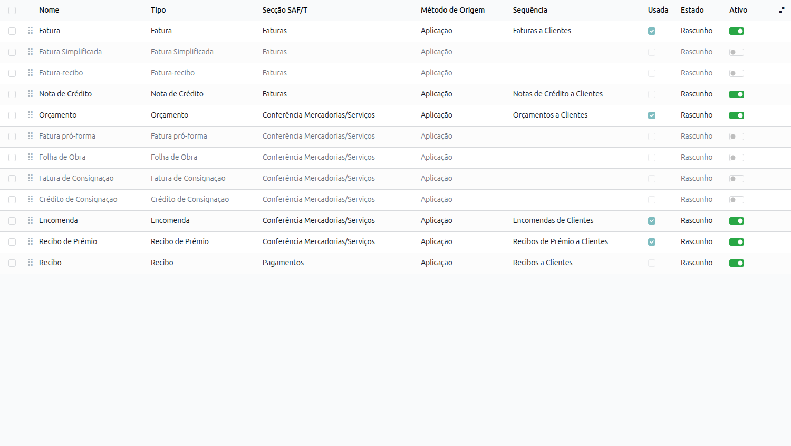
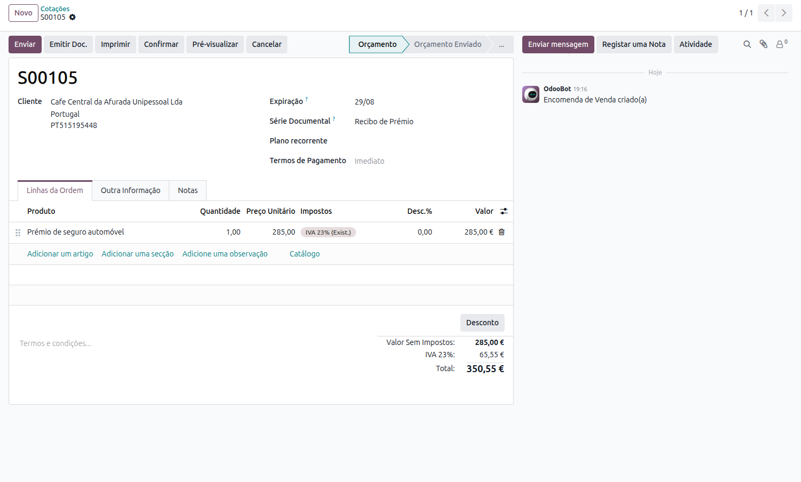
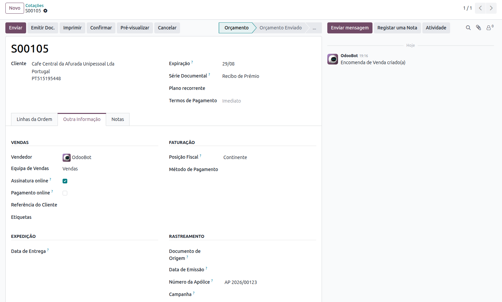
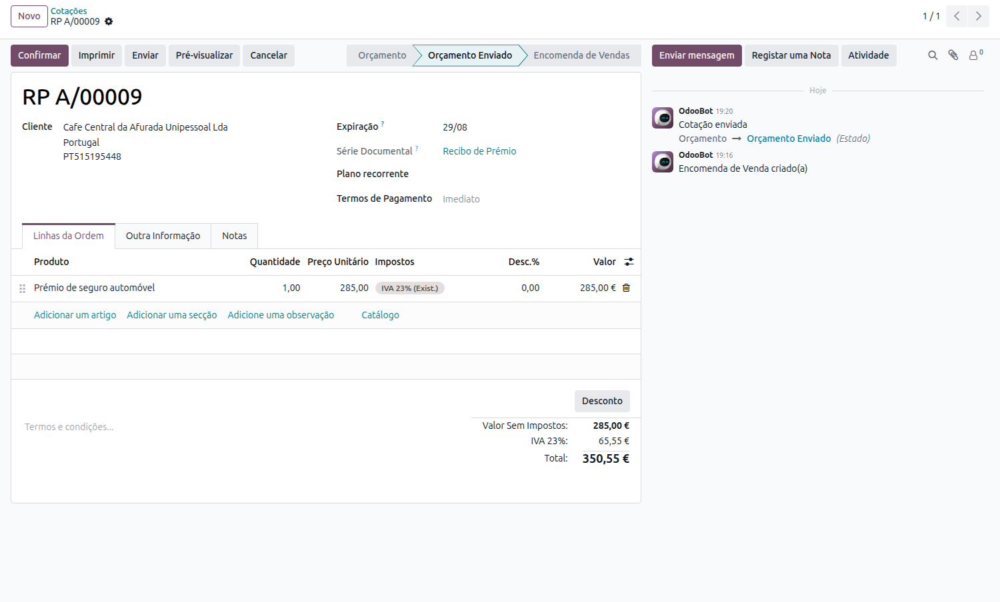
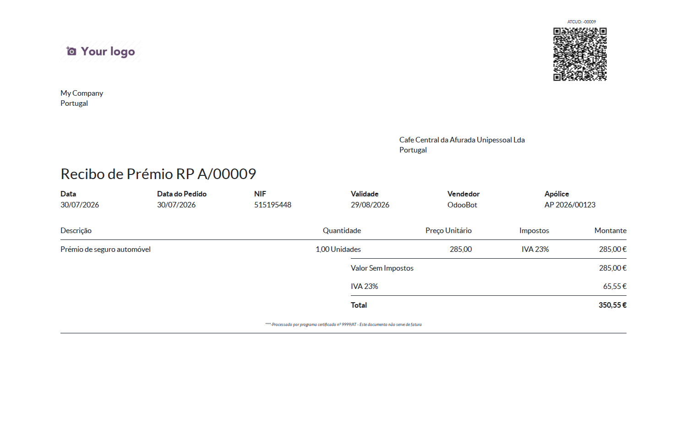
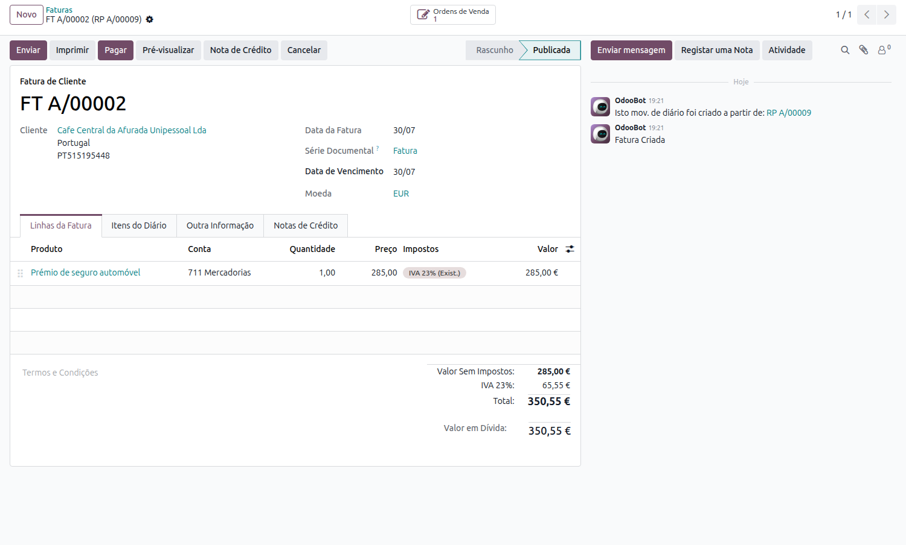

:nosearch:

===============
Setor Segurador
===============
Na atividade seguradora é habitual enviar ao cliente, com alguma antecedência em relação à data de pagamento, um
**aviso de cobrança** (também conhecido por *aviso/recibo de prémio*) a anunciar o débito que dá início ou renova uma
apólice. A Autoridade Tributária tem um tipo de documento próprio para estes avisos — **RP - Recibo de Prémio** — com
regras específicas de comunicação no SAF-T.

Veja como emitir estes documentos em Odoo com a **Localização PT+**

.. raw:: html

    

        ─── ✦ ───
    

.. important::
    Esta funcionalidade não está disponível na loja Odoo. Para ter acesso à mesma, terá de solicitar a sua
    instalação e ativação à **Exo Software**.

Configuração
============
A funcionalidade é disponibilizada pelo módulo **Portugal - Insurance Industry**. Ao instalá-lo é criada
automaticamente a série documental **Recibo de Prémio**, do tipo **RP**, com a sua própria numeração.

Para a consultar aceda à app **Faturação / Contabilidade** (dependendo respetivamente se tem versão Community ou
Enterprise do Odoo), vá ao menu de **Configuração** e no separador Faturação selecione a opção **Séries Documentais**.

.. image:: fiscal_documents/v17_appInvoicingAccounting.png
   :align: center

.. important::
    Tal como qualquer outra série documental, a série de Recibos de Prémio tem de ser comunicada à AT antes de ser
    utilizada.

.. seealso::
    :ref:`Criação e registo de Série Documental <invoicing_series_registration_new>`

Emissão do aviso de cobrança
============================
O aviso de cobrança é emitido a partir de um orçamento. Aceda à app **Vendas**, crie um novo orçamento e escolha a
**Série Documental** *Recibo de Prémio*.

Na aba **Outra Informação**, no grupo **Rastreamento**, preencha o **Número da Apólice** a que o prémio diz respeito.

.. important::
    O número da apólice é obrigatório: sem ele o documento não pode ser emitido. É esta a referência que a AT exige
    que acompanhe o aviso no ficheiro SAF-T, e um documento já emitido não pode ser corrigido.

Preencha as linhas com o prémio a cobrar e emita o documento com o botão **Emitir Doc.**, que lhe atribui o número da
série (por exemplo *RP A/00009*), a assinatura digital e o ATCUD. A partir deste momento o documento pode ser impresso
e enviado ao cliente.

No documento impresso, o número da apólice aparece junto às restantes referências do aviso.

.. note::
    Ao contrário de um orçamento normal, **um Recibo de Prémio não se transforma em nota de encomenda quando é
    confirmado** — mantém o seu próprio tipo de documento e a sua numeração, para que a fatura emitida a seguir o possa
    referenciar. A confirmação serve apenas para permitir a faturação.

.. note::
    Se as apólices forem geridas como **subscrições**, o aviso continua a ser um documento por cobrança: a subscrição
    representa o contrato e a sua recorrência, e cada período dá origem ao seu próprio Recibo de Prémio, com número e
    fatura próprios.

Faturação
=========
Na data do débito, confirme o aviso e crie a fatura a partir dele, através do processo normal de faturação de uma
encomenda.

.. seealso::
    :ref:`Como emitir uma fatura <odoo_process_creat_invoice>`

A fatura resultante é do tipo **FT** (ou **FR**, caso sirva simultaneamente de recibo) e mantém a ligação ao aviso que
lhe deu origem.

Nesse momento, e sem qualquer ação adicional, o aviso passa a ser comunicado como **faturado** no SAF-T.

.. note::
    O estado de faturado do aviso existe apenas para efeitos de comunicação no SAF-T, não sendo apresentado no ecrã.
    Se a fatura vier a ser anulada, o aviso regressa ao estado normal e volta a ficar disponível para faturação.
