:show-content:

=============
Processo Odoo
=============
O processo de faturação em Odoo foi pensado para seguir sempre a mesma sequência:

        - Orçamentação
        - Emissão de Fatura
        - Emissão do Recibo
        - Correções

            - Nota de Crédito
            - Nota de Débito

        - Reconciliação de documentos

Por esse motivo, é aconselhado que sigam sempre o processo normalizado para evitar problemas operacionais

.. raw:: html

    

        ─── ✦ ───
    

Operação em Odoo
================

.. _odoo_process_quotation:

Orçamentação
------------
A orçamentação em Odoo pode ser feita em diversas apps **Vendas**, **Compras**, **Subscrições** e **CRM**

Nas apps de **Vendas**, **Compras** e **Subscrições** basta aceder à app respetiva e carregar no botão **Novo**

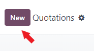

Na app de **CRM** dentro de cada lead pode carregar no botão **Novo Orçamento**

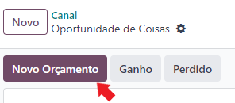

Depois deve preencher os campos necessários e selecionar a série documental a ser usada na orçamentação

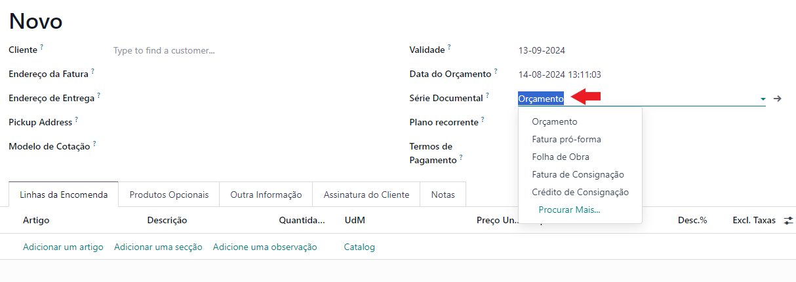

.. tip::
    No caso das **Subscrições**, terá também de selecionar o **Plano de Recorrência**
    que determina de quanto em quanto tempo serão feitas novas faturas de forma
    automática, bem como pode especificar uma data para o término da subscrição.

    .. image:: odoo_process/v17_recurringPlan.png
       :align: center

    .. example::
       Se cobra uma vez a um cliente por um serviço de 2 anos, o Plano de Recorrência
       deve ser de 2 anos e quantidade do serviço 1, não deve ser Plano de Recorrência
       anual mas quantidade a 2

    .. example::
       Se cobra mensalmente durante 2 anos por um serviço, o plano de recorrência deve
       ser mensal mas com uma data de término 2 anos no futuro

Descontos nos Orçamentos
~~~~~~~~~~~~~~~~~~~~~~~~

.. tip::
    Pode aplicar descontos no processo de **Venda** utilizando o botão **Desconto** existente para o efeito

    .. image:: odoo_process/v17_discount01.png
       :align: center

    Este botão vai disponibilizar 3 opções:

    - **Em todas as linhas de venda**, aplica um desconto percentual a cada linha do documento
    - **Desconto global**, aplica uma nova linha com um desconto percentual no final do documento (utiliza o artigo Odoo **Desconto**)
    - **Valor Fixo**, aplica uma nova linha com um desconto nominal no final do documento (utiliza o artigo Odoo **Desconto**)

    .. image:: odoo_process/v17_discount02.png
       :align: center

    .. image:: odoo_process/v17_discount03.png
       :align: center

    .. note::
        O artigo **Desconto** é criado de forma automática da primeira vez que aplicar um Desconto Global ou de Valor Fixo na app de Vendas

    .. important::
        As linhas de **Desconto global** e **Valor Fixo** também estão sujeitas a aplicação de impostos

        Se o imposto utilizado for igual para todos os artigos, pode usar esse imposto no artigo **Desconto**

        Se o imposto utilizado variar entre artigos, deve apenas usar um desconto de linha para cada artigo

    Este é o aspeto na impressão do documento

    .. image:: odoo_process/v17_discount04.png
       :align: center

    .. important::
        O texto que aparece na tabela resumo, é o texto que está na descrição do artigo **Desconto**

Depois de aprovação do cliente/fornecedor, pode confirmar o documento e será gerada uma **Nota de encomenda**

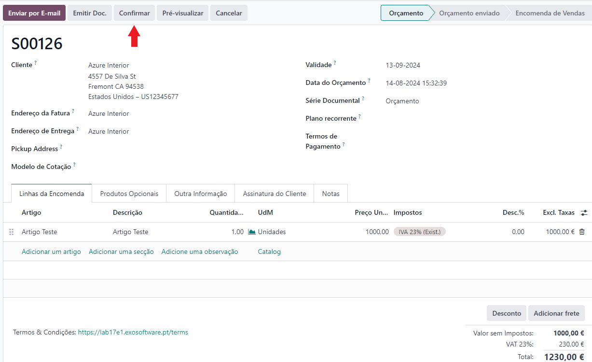

.. important::
    A legislação portuguesa proíbe a emissão de documentos não confirmados e comunicados, pelo que se tentarem fazer
    impressão do documento o mesmo sairá invalidado.

Revisões de Orçamentos
~~~~~~~~~~~~~~~~~~~~~~
A AT não permite alterar documentos já emitidos. No entanto, existe uma necessidade real de se alterar documentos já
enviados a clientes, pelo que fizemos uma adaptação de um módulo OCA às regras portuguesas, de forma a poder ter uma
funcionalidade semelhante a versões de orçamentos, mas cumprindo os requisitos legais da AT

.. seealso::
    :ref:`Saiba mais sobre o módulo Portugal - Sale Order Revisions <odoo_process_quotation_revisions>`

.. seealso::
   :ref:`O que é um orçamento e suas variantes <fiscal_documents_quote>`

   :ref:`O que é uma nota de encomenda <fiscal_documents_order>`

.. _odoo_process_creat_invoice:

Emissão de Fatura
-----------------
.. important::
    Existem 3 processos para se emitir uma fatura.

    O **processo recomendado** é emitir sempre a fatura a partir da Nota de encomenda. Que vai gerar um novo documento
    de fatura em rascunho.

    No entanto pode ser feita uma fatura sem esta ligação se realmente for necessário.

    O 3º processo é o **automático**, em que o próprio Odoo gera de forma autónoma a fatura para certo tipo de artigos
    vendidos, como as **subscrições**.

O processo de emissão da fatura deve então ser iniciado na **Nota de encomenda** e carregar no botão **Criar Fatura**

    .. image:: odoo_process/v17_createInvoice1.png
        :align: center

Na janela que abre decida o tipo de fatura que pretende criar de entre as opções:

    - Fatura regular
    - Fatura de adiantamento

        - Percentagem do valor total da encomenda
        - Valor nominal à escolha

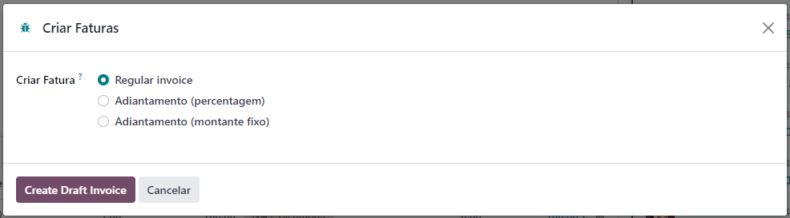

.. note::
    No caso de ser uma fatura de adiantamento o aspeto será diferente e terá mais informação para preencher

    .. image:: odoo_process/v17_createInvoice3.png
        :align: center

Depois de ter a fatura em modo de rascunho, deve preencher os campos necessários e escolher a série documental de
fatura que pretende.

A maioria dos campos já vão estar preenchidos pois são herdados da Nota de encomenda.

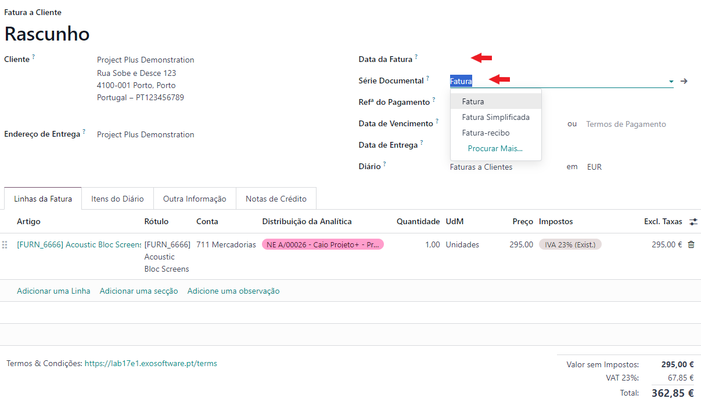

.. tip::
    O processo de criação de farura sem ligação a Nota de encomenda é bastante parecido, exceto em 2 pontos:

        - Onde se inicia o processo
        - A necessidade de preencher quase todos os campos de raíz

    Para iniciar o processo aceda à app **Faturação / Contabilidade** (dependendo respetivamente se tem versão
    Community ou Enterprise do Odoo), vá ao menu :menuselection:`Clientes --> Faturas` ou :menuselection:`Fornecedores --> Faturas de Fornecedores`

    Clique na opção **Novo**

    .. image:: odoo_process/v17_newInvoice.png
        :align: center

    Como os campos não são herdados de uma Nota de encomenda terão de ser preenchidos manualmente como se estivesse a
    criar um orçamento.

Descontos nas Faturas
~~~~~~~~~~~~~~~~~~~~~

.. tip::
    Pode aplicar descontos diretamente no processo de **Faturação** adicionando uma nova linha com o artigo Odoo
    **Desconto** existente para o efeito e o valor a negativo

    .. image:: odoo_process/v17_discount03.png
       :align: center

    .. note::
        O artigo **Desconto** é criado de forma automática da primeira vez que aplicar um Desconto Global ou de Valor Fixo na app de Vendas

    .. important::
        As linhas de **Desconto** também estão sujeitas a aplicação de impostos

        Se o imposto utilizado for igual para todos os artigos, pode usar esse imposto no artigo **Desconto**

        Se o imposto utilizado variar entre artigos, deve apenas usar um desconto de linha para cada artigo

    Este é o aspeto na impressão do documento

    .. image:: odoo_process/v17_discount04.png
       :align: center

    .. important::
        O texto que aparece na tabela resumo, é o texto que está na descrição do artigo **Desconto**

Em seguida confirme a fatura

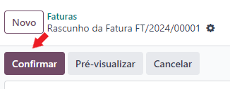

.. seealso::
   :ref:`O que é uma fatura e suas variantes <fiscal_documents_invoice>`

.. _odoo_process_downpayment:

Faturas de adiantamento
~~~~~~~~~~~~~~~~~~~~~~~

Clientes
^^^^^^^^

Processo iniciado em Odoo
"""""""""""""""""""""""""
.. important::
    Garanta que tem um artigo com a seguinte configuração

        .. image:: odoo_process/v17_downPayment01.png
            :align: center

    Em seguida complete as configurações de **Vendas** do Odoo com o respetivo artigo e impostos

        .. image:: odoo_process/v17_downPayment02.png
            :align: center

        .. image:: odoo_process/v17_downPayment03.png
            :align: center

    Esta configuração vai garantir que, na contabilidade, é usada a conta correta para adiantamentos, bem como o imposto
    aplicado e respetivos mapeamentos, também são os corretos

**Adiantamentos Nacionais, Intracomunitários B2C ou Extracomunitários**

A partir de uma Nota Encomenda (NE) gere a fatura do adiantamento, defina se é por valor percentual ou nominal e a
respetiva percentagem ou valor absoluto recebido, criando em seguida o rascunho da fatura de adiantamento

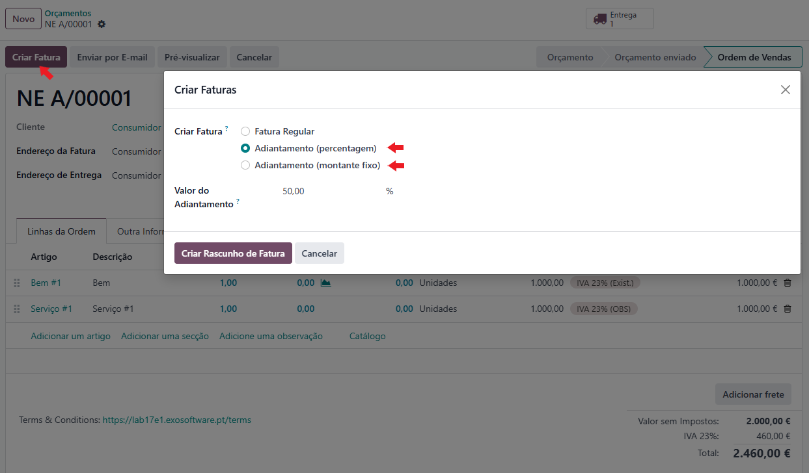

.. note::
    Serão geradas tantas linhas de adiantamento quantos impostos existam na NE

    Esses impostos serão mapeados para o imposto **OBS (Adiantamento)** respetivo da configuração que fez na app Vendas

Confirme a Fatura e emita o respetivo Recibo para formalizar o recebimento

.. note::
    Após a emissão do recibo, na sua contabilidade ficará com o saldo nas respetivas contas:

    - Crédito na 218, pelo valor do adiantamento
    - Crédito na 2433, pelo valor do IVA
    - Débito na conta tesouraria do recibo, pelo recebimento do dinheiro

Quando for emitir a Fatura final, deve seguir o procedimento padrão, o adiantamento será regularizado na própria fatura

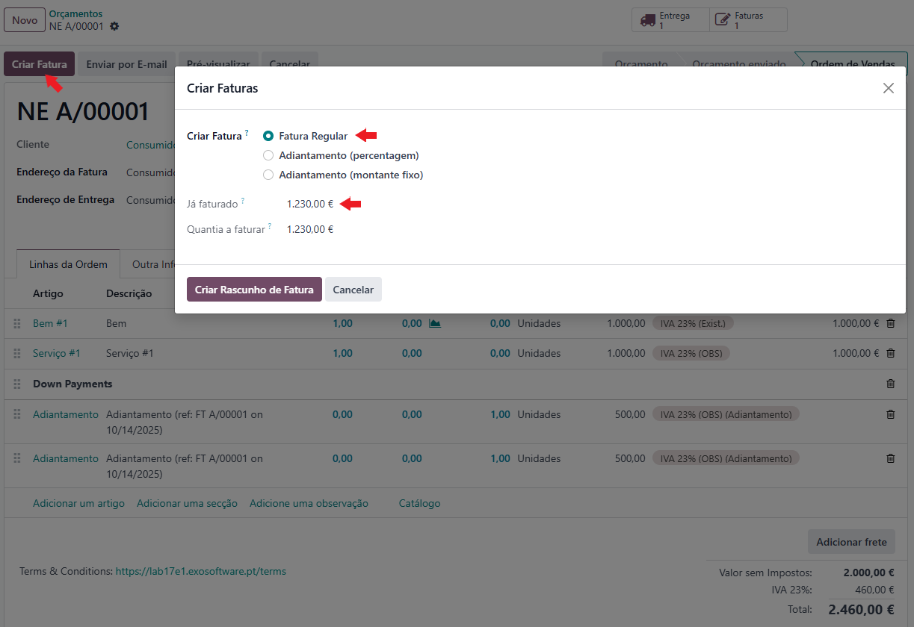

A fatura final fará menção da(s) fatura(s) do(s) adiantamento(s) que foram regularizados, bem como do subtotal dos
adiantamentos

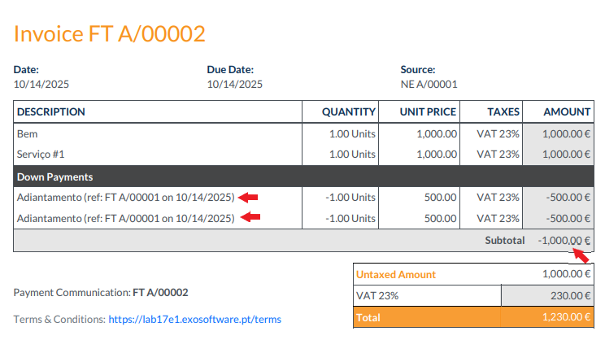

A partir deste ponto o processo é o normal para a emissão do recibo da fatura final

.. note::
    Contabilisticamente, são regularizadas as contas de impostos e adiantamentos como esperado

**Adiantamentos Intracomunitários B2B**

.. note::
    Nestes casos não deve usar a fatura de adiantamento, pelo que sugerimos a utilização da app da OCA
    `Sale Advance Payment (sale_advance_payment) <https://github.com/OCA/sale-workflow/tree/17.0/sale_advance_payment>`_
    no entanto, esta app não está preparada para as especificidades das regras portuguesas, pelo que precisará de uma
    app complementar que estamos a desenvolver para o efeito

.. important::
    De momento e visto que a nossa app complementar ainda não está desenvolvida, sugerimos que usem o mesmo método como
    se estivesse a fazer para um cliente Nacional

    Isto porque apesar de não ser o recomendado pela AT, não é um impeditivo usar a fatura de adiantamento para estes
    casos

Processo iniciado fora do Odoo
""""""""""""""""""""""""""""""
Este é o processo correto usando a Nota Crédito como regularizador, quando não tem a venda feita em Odoo

**Ainda não emitiu a Fatura de Adiantamento**

- Criar uma Fatura de Adiantamento
- Criar Recibo a partir da Fatura de Adiantamento
- Reconciliar o Recibo com o movimento do banco

**Já emitiu a Fatura de Adiantamento, mas não a Fatura final**

- Emitir Fatura final pelo valor total dos artigos
- Emitir Nota de Crédito para regularizar o Adiantamento
- Garantindo que a Nota de Crédito está associada à Fatura emitir o PDF e respetivo Recibo
- Reconciliar o Recibo com o movimento do banco

**Já emitiu a Fatura final**

- Emitir Nota de Crédito para regularizar o Adiantamento
- Decida se vai devolver o dinheiro, ou se vai usar a NC para regularizar pagamento futuro
- Proceda respetivamente com devolução o dinheiro e reconciliando no banco, ou deixando a NC pendente em sistema

Com este processo a sua fatura final sai com o valor total, mas o montante a pagar sai apenas com o valor em falta

Fornecedores
^^^^^^^^^^^^
Documentação em breve

.. seealso::
    Se tiver dúvidas pode sempre `pedir um esclarecimento aos nossos consultores <https://exosoftware.pt/en/appointment>`_

Correções
---------

.. _odoo_process_create_creditNote:

Notas de crédito
~~~~~~~~~~~~~~~~
.. important::
    Segundo as regras da AT as notas de crédito têm de estar ligadas ao documento de fatura a que dizem respeito e devem
    mencionar o mesmo.

Por esse motivo, as notas de crédito devem ser emitidas a partir do documento da fatura para que se cumpram as regras

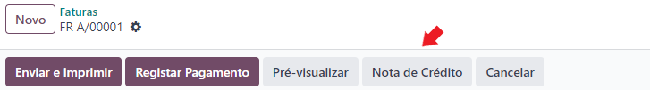

Não se esqueça de mencionar o motivo para a criação da nota de crédito, que vai ser exibido na nota de crédito, bem como
a norma de regularização do IVA associada à nota de crédito. Em seguida reverta o movimento da fatura

.. important::
    Normas de regularização de IVA são diferentes dos motivos de isenção de IVA

.. seealso::
    As normas de regularização de IVA permitidas podem ser consultadas nos seguintes artigos do CIVA:

    - `Artigo 23º <https://info.portaldasfinancas.gov.pt/pt/informacao_fiscal/codigos_tributarios/civa_rep/Pages/iva23.aspx>`_
    - `Artigo 24º <https://info.portaldasfinancas.gov.pt/pt/informacao_fiscal/codigos_tributarios/civa_rep/Pages/iva24.aspx>`_
    - `Artigo 25º <https://info.portaldasfinancas.gov.pt/pt/informacao_fiscal/codigos_tributarios/civa_rep/Pages/iva25.aspx>`_
    - `Artigo 26º <https://info.portaldasfinancas.gov.pt/pt/informacao_fiscal/codigos_tributarios/civa_rep/Pages/iva26.aspx>`_
    - `Artigo 78º <https://info.portaldasfinancas.gov.pt/pt/informacao_fiscal/codigos_tributarios/civa_rep/Pages/iva78.aspx>`_
    - `Artigo 78º-A <https://info.portaldasfinancas.gov.pt/pt/informacao_fiscal/codigos_tributarios/civa_rep/Pages/iva78a.aspx>`_
    - `Artigo 78º-B <https://info.portaldasfinancas.gov.pt/pt/informacao_fiscal/codigos_tributarios/civa_rep/Pages/iva78b.aspx>`_
    - `Artigo 78º-C <https://info.portaldasfinancas.gov.pt/pt/informacao_fiscal/codigos_tributarios/civa_rep/Pages/iva78c.aspx>`_

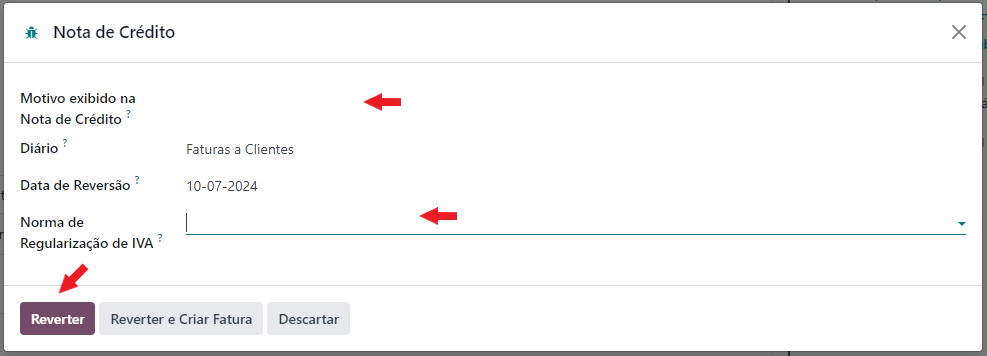

Devem depois ser feitos os ajustes necessários, mediante o motivo que levou à emissão da nota de crédito e confirmar o documento

.. tip::
    Existe um tipo de nota de crédito que não precisa de estar ligado à sua fatura original, as Notas de Crédito de
    Rappel, estes tipos de notas de crédito só devem ser emitidos para descontos de "rappel" concedidos

    Definição de **desconto de "Rappel"**

    Um desconto “rappel” escalonado, cujo primeiro escalão se inicia na unidade (em euros, quilos, litros, etc.), é um
    desconto de quantidade que, nos termos dos n.os 2 e 3 do artigo 3.º do Decreto-Lei n.º 370/93, de 29 de Outubro, na
    redacção do Decreto-Lei n.º 140/98, de 16 de Maio, releva para a determinação do preço de compra efectivo,
    satisfeitas que se mostrem as restantes exigências de se encontrar identificado na factura ou, por remissão desta,
    em contratos de fornecimento ou tabelas de preços e de ser susceptível de determinação no momento da respectiva emissão.

    Para poder utilizar esta funcionalidade deve:

    - Iniciar uma nota de crédito vazia indo a um dos menus :menuselection:`Clientes --> Notas de Crédito` ou :menuselection:`Fornecedores --> Reembolsos` e selecionar a opção **Novo**

    .. image:: odoo_process/v17_newCreditNote1.png
        :align: center

    .. image:: odoo_process/v17_newCreditNote2.png
        :align: center

    - Dentro do formulário, na aba **Outra Informação** selecionar a opção **Nota de Crédito de Rappel**

    .. image:: odoo_process/v17_createCreditNote3.png
        :align: center

Em seguida confirme a nota de crédito.

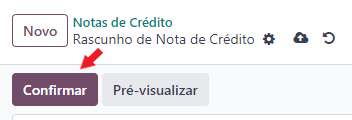

.. seealso::
   :ref:`O que é uma nota de crédito <fiscal_documents_creditNote>`

.. _odoo_process_create_debitNote:

Notas de débito
~~~~~~~~~~~~~~~
.. important::
    Segundo as regras da AT as notas de débito têm de estar ligadas ao documento de fatura a que dizem respeito e devem
    mencionar o mesmo.

Por esse motivo, as notas de débito devem ser emitidas a partir do documento da fatura para que se cumpram as regras.
Para isso deve ir ao menu **Ação** e selecionar a opção **Nota de Débito**

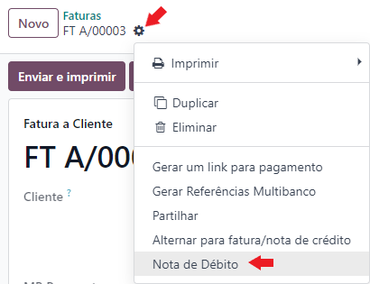

Não se esqueça de mencionar o motivo para a criação da nota de débito, bem como a norma de regularização do IVA
associada à nota de débito. Em seguida selecione **Criar Nota de Débito**

.. tip::
    Não se esqueça de mencionar o diário onde vão ser registaddos os movimentos da nota de débito

    Pode adicionar as linhas da fatura à nota de débito se, as alterações a efetuar forem em todas as linhas da fatura, selecionando a opção **Copiar linhas**

.. important::
    Normas de regularização de IVA são diferentes dos motivos de isenção de IVA

.. seealso::
    As normas de regularização de IVA permitidas podem ser consultadas nos seguintes artigos do CIVA:

    - `Artigo 23º <https://info.portaldasfinancas.gov.pt/pt/informacao_fiscal/codigos_tributarios/civa_rep/Pages/iva23.aspx>`_
    - `Artigo 24º <https://info.portaldasfinancas.gov.pt/pt/informacao_fiscal/codigos_tributarios/civa_rep/Pages/iva24.aspx>`_
    - `Artigo 25º <https://info.portaldasfinancas.gov.pt/pt/informacao_fiscal/codigos_tributarios/civa_rep/Pages/iva25.aspx>`_
    - `Artigo 26º <https://info.portaldasfinancas.gov.pt/pt/informacao_fiscal/codigos_tributarios/civa_rep/Pages/iva26.aspx>`_
    - `Artigo 78º <https://info.portaldasfinancas.gov.pt/pt/informacao_fiscal/codigos_tributarios/civa_rep/Pages/iva78.aspx>`_
    - `Artigo 78º-A <https://info.portaldasfinancas.gov.pt/pt/informacao_fiscal/codigos_tributarios/civa_rep/Pages/iva78a.aspx>`_
    - `Artigo 78º-B <https://info.portaldasfinancas.gov.pt/pt/informacao_fiscal/codigos_tributarios/civa_rep/Pages/iva78b.aspx>`_
    - `Artigo 78º-C <https://info.portaldasfinancas.gov.pt/pt/informacao_fiscal/codigos_tributarios/civa_rep/Pages/iva78c.aspx>`_

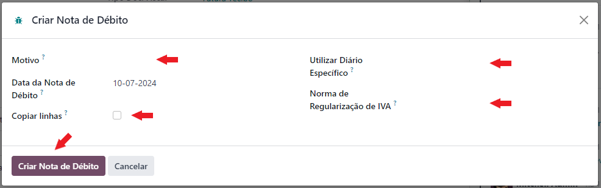

Em seguida confirme a nota de débito.

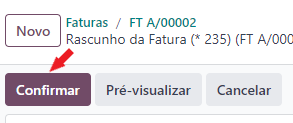

.. seealso::
   :ref:`O que é uma nota de débito <fiscal_documents_debitNote>`

.. _odoo_process_create_recipt:

Emissão de Recibos
------------------
.. important::
    Existem 2 processos para se emitir um recibo.

    O **processo recomendado** é emitir sempre o recibo a partir da Fatura. Que vai gerar um novo documento de recibo
    e publicar o mesmo.

    No entanto pode ser feita um recibo sem esta ligação se realmente for necessário.

O processo de emissão do recibo deve então ser iniciado na **Fatura** e carregar no botão **Registar Pagamento**

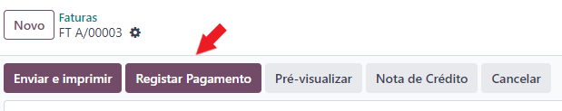

Em seguida deve escolher as seguintes opções:

- Em que Diário vai registar o pagamento
- O método de pagamento utilizado
- O valor do pagamento

Os restantes campos normalmente já estão preenchidos se seguir este processo. Carregue no botão **Criar pagamento**

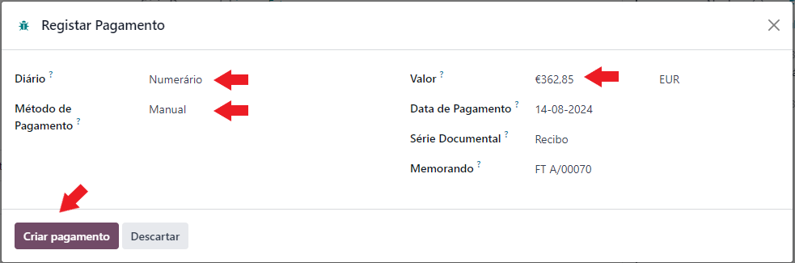

.. tip::
    No caso de o valor a receber ser diferente do valor total da fatura, vai ter uma vista diferente onde pode escolher
    o que fazer com a diferença

    .. image:: odoo_process/v17_createRecipt3.png
        :align: center

    Se optar por marcar como totalmente pago, será feito um Abatimento (Write-off) da diferença

.. tip::
    O processo de criação de recibos sem ligação a faturas é parecido, exceto em 2 pontos:

        - Onde se inicia o processo
        - A necessidade de preencher quase todos os campos de raíz

    Para iniciar o processo aceda à app **Faturação / Contabilidade** (dependendo respetivamente se tem versão
    Community ou Enterprise do Odoo), vá ao menu :menuselection:`Clientes --> Pagamentos` ou :menuselection:`Fornecedores --> Pagamentos`

    Clique na opção **Novo**

    .. image:: odoo_process/v17_newRecipt.png
        :align: center

    Como os campos não são herdados da fatura terão de ser preenchidos manualmente.

.. seealso::
   :ref:`O que é um recibo <fiscal_documents_receipt>`

.. _odoo_process_documents_states:

Reconciliação de documentos
---------------------------
A reconciliação de documentos é feita de forma automática, desde que siga os processos indicados.

.. note::
    Em Odoo o controlo e rastreabilidade entre documentos é feito linha a linha para cada documento

Essa ligação tem diferentes estados dependendo da fase em que se encontra:

    - :menuselection:`Nota de encomenda --> Fatura`
    - :menuselection:`Fatura --> Notas de crédito / Notas de débito / Recibos`

No Processo :menuselection:`Nota de encomenda --> Fatura` pode ver 3 tipos de estados:

    - **Nada a faturar** - dos diversos artigos que possam existir na nota de encomenda, ainda faltam cumprir requisitos para poder faturar alguns ou a totalidade dos artigos
    - **Para faturar** - dos diversos artigos que possam existir na nota de encomenda, alguns ou a totalidade já cumprem os requisitos para poderem ser faturados
    - **Totalmente Faturado** - todos os artigos da nota de encomenda cumpriram os seus requisitos e estão faturados

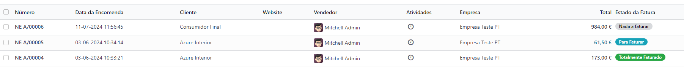

No processo :menuselection:`Fatura --> Notas de crédito / Notas de débito / Recibos`, dependendo da sua versão do Odoo
(Community ou Enterprise), pode ter 3 ou 4 tipos de estado respetivamente.

Community
~~~~~~~~~
Na versão Community terá 3 tipos de estado nas faturas:

    - **Não Paga** - Ainda não existe qualquer documento a liquidar o valor da fatura
    - **Parcialmente Pago** - Já existe(m) algum(uns) documento(s) a liquidar a fatura, mas o(s) seu(s) valor(es) é(são) inferior(s) ao total da fatura
    - **Pago** - O(s) documento(s) associado(s) à fatura liquidam a totalidade do valor da fatura

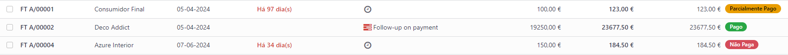

Os tipos de documento que podem servir para liquidar valores da fatura são as notas de crédito e os recibos

Enterprise
~~~~~~~~~~
Na versão Enterprise terá 4 tipos de estado nas faturas:

    - **Não Paga** - Ainda não existe qualquer documento a liquidar o valor da fatura
    - **Parcialmente Pago** - Já existe(m) algum(uns) documento(s) a liquidar a fatura, mas o(s) seu(s) valor(es) é(são) inferior(s) ao total da fatura
    - **Em pagamento** - O(s) documento(s) associado(s) à fatura liquidam total ou parcialmente o valor da fatura, mas ainda carecem de reconciliação com diário de pagamentos, pelo que o seu valor se encontra em contas transitórias
    - **Pago** - O(s) documento(s) associado(s) à fatura liquidam a totalidade do valor da fatura e a reconciliação com as contas transitórias foi feita

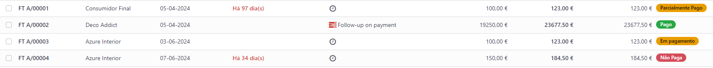

Os tipos de documento que podem servir para liquidar valores da fatura são as notas de crédito e os recibos

.. _odoo_process_payment_provider_journals:

Reconciliar Provedores de Pagamentos
~~~~~~~~~~~~~~~~~~~~~~~~~~~~~~~~~~~~

.. important::
    O seu Provedor de Pagamento vai receber a totalidade da fatura do seu cliente

    É o recibo criado pelo Provedor de Pagamento que deve ser reconciliado com a Fatura do cliente

    Dependendo se tem Odoo Community ou Enterprise o estado da fatura vai ser **Pago** ou **Em Pagamento**
    respetivamente, ficando no segundo caso a aguardar a reconciliação

**Crie um diário do Tipo Banco para receber os movimentos do Provedor de Pagamentos**, como se de um banco se tratasse

.. note::
    Será nesse diário que serão registados:

    - os recibos das faturas de clientes pelo valor da venda
    - os recibos das faturas de fornecedores pelo valor das comissões que paga ao provedor de pagamento

.. important::
    Deve tratar este diário do Provedor de Pagamentos como se fosse um diário de banco normal, pelo que deve fazer uma
    importação de extrato ou sincronização de movimentos

.. tip::
    Não se esqueça de registar as faturas de fornecedores para registar as comissões pagas e de as levar a uma conta
    da classe 6

    Deve imitir o recibo de pagamento desta fatura.

    No entanto, se não fizer a fatura, deve na reconciliação do extrato do Provedor de Pagamentos, fazer um movimento
    manual que leve o valor das comissões a uma conta da classe 6

Quando o Provedor de Pagamentos efetuar a transferência para o seu banco, deve fazer uma transferência interna de saldos
de um diário para o outro

Para tal vá ao **menu do diário do Provedor de Pagamentos** e selecione a opção **Pagamento de Fornecedor**

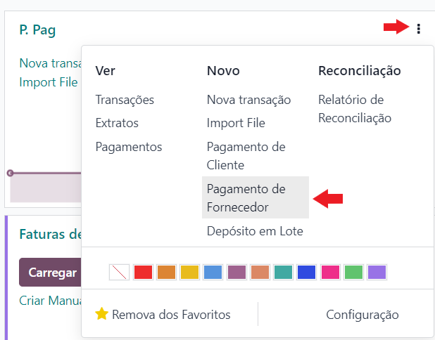

- Ative a opção **Transferência Interna**
- Preencha o **Valor** a transitar de saldo
- Preencha a **Data** e **Memorando** com a informação que consta no extrado do seu banco
- Preencha no **Diario de Destino** o diário do seu banco
- Confirme o movimento

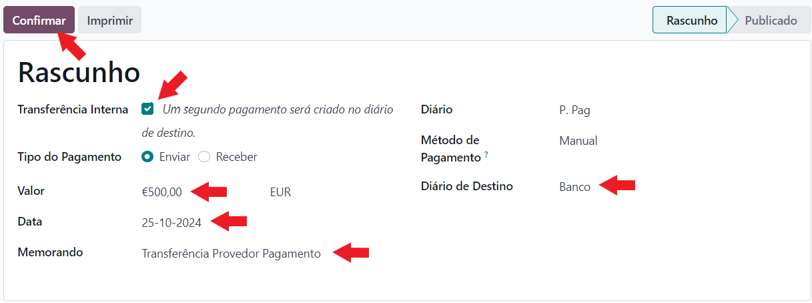

Com este movimento confirmado o saldo que até aqui estava no diário do Provedor de Pagamento, passa a estar
disponível no seu diário de Banco, a aguardar a reconciliação com o extrato bancário ou sincronização da conta

Mais informação
---------------
.. seealso::
    Se pretender formação mais detalhada sobre o processo Odoo contacte a `Exo Software <https://exosoftware.pt/appointment/2>`_.

Documentos de Importação
========================
No caso de ter documentos que sejam inseridos por importação deve seguir a seguinte configuração

- Ativar a funcionalidade de escolha do **Método de Origem** nas **Definições** da app **Contabilidade**

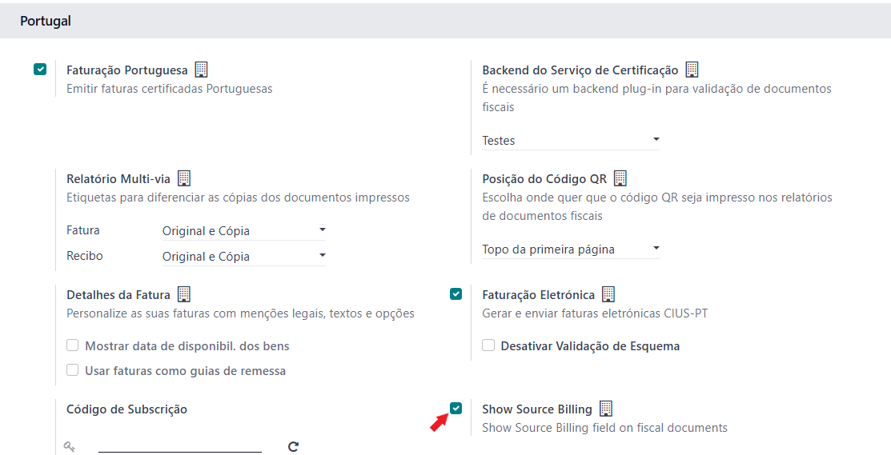

- Criar as séries documentais de importação
- No documento em questão, mudar o **Método de Origem** para **Integração**, isto fará com que possa escolher a série documental de Importação para o tipo de documento

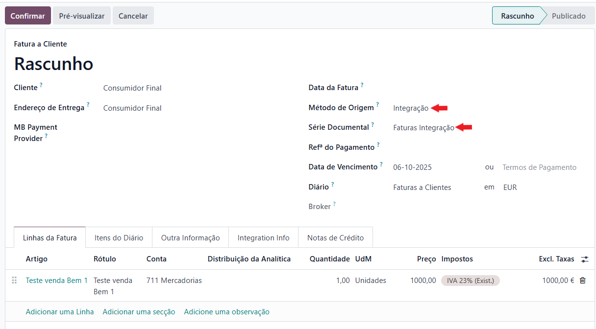

- Preencha os campos obrigatórios na nova aba **Informação Integração**:

    - Data/Hora da Validação do Documento
    - Nº Documento Integrado

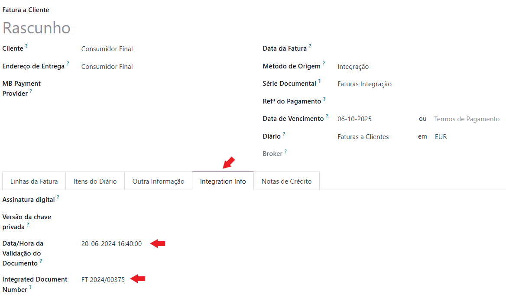

- Se o seu documento foi emitido por software certificado deve ainda preencher na mesma aba:

    - Assinatura Digital, o *Hash* do documento original
    - Versão da chave privada, que tem o formato *aaaa.b*, onde *aaaa* representa o certificado emissor e *b* a versão estes dados estão associados ao software anterior

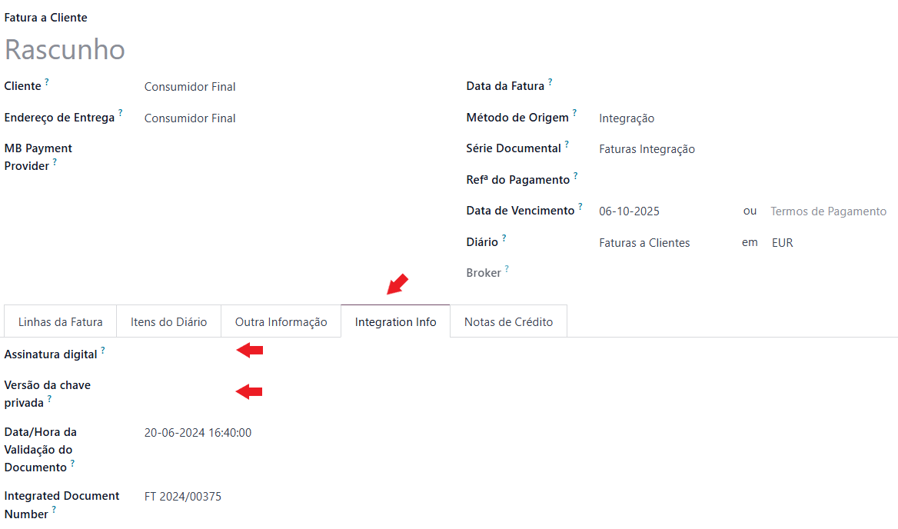

- Crie o documento em Odoo com a mesma informação do software de origem

.. important::
    Não esqueça de verificar que a **Data da Fatura** e **Data de Vencimento** estão em conformidade

.. note::
    Aconselhamos à criação de um template de importação para importação de documentos em massa

.. important::
    É aconselhado que ao inserir documentos em Odoo, também anexe o PDF original ao documento Odoo, em alguns casos e
    por restrições da AT, não poderá imprimir uma nova via do documento

    Essa situação acontece quando não insere os dados da validação do seu software certificado de onde importa

Caso tudo esteja devidamente preenchido, poderá gerar um novo documento no sistema que terá o seguinte aspeto

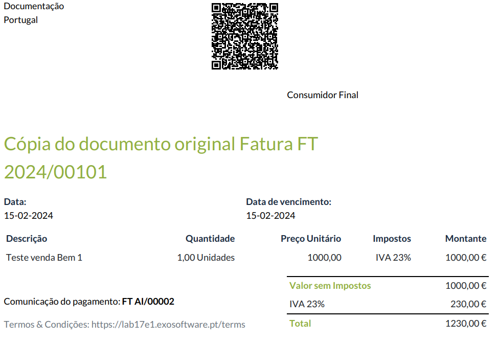

Comunicação por API
===================
É possível fazer a comunicação de documentos através de API em vez de serem gerados pelo utilizador no Odoo.

Para essa finalidade são instalados módulos ou apps específicos que lhe permitirão continuar a usar o seu sistema atual,
mas ter o Odoo como a ferramenta de backend.

Estes módulos ou apps podem já existir ou ser personalizados às necessidades do utilizador pela nossa equipa técnica.

As configurações de API são feitas numa fase inicial, entre os departamentos técnicos da Exo Software e da sua entidade,
para que tudo fique a funcionar corretamente e o utilizador não tenha de se preocupar com o processo.
