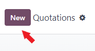
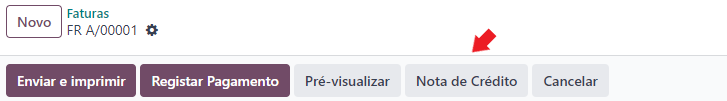

:show-content:

=============
Processo Odoo
=============
O processo de faturação em Odoo foi pensado para seguir sempre a mesma sequência:

        - Orçamentação
        - Emissão de Fatura
        - Emissão do Recibo
        - Correções

            - Nota de Crédito
            - Nota de Débito

        - Reconciliação de documentos

Por esse motivo, é aconselhado que sigam sempre o processo normalizado para evitar problemas operacionais

.. raw:: html

    

        ─── ✦ ───
    

Operação em Odoo
================

.. _odoo_process_quotation:

Orçamentação
------------
A orçamentação em Odoo pode ser feita em diversas apps **Vendas**, **Compras**, **Subscrições** e **CRM**

Nas apps de **Vendas**, **Compras** e **Subscrições** basta aceder à app respetiva e carregar no botão **Novo**

Na app de **CRM** dentro de cada lead pode carregar no botão **Novo Orçamento**

Depois deve preencher os campos necessários e selecionar a série documental a ser usada na orçamentação

.. tip::
    No caso das **Subscrições**, terá também de selecionar o **Plano de Recorrência**
    que determina de quanto em quanto tempo serão feitas novas faturas de forma
    automática, bem como pode especificar uma data para o término da subscrição.

    .. image:: odoo_process/v17_recurringPlan.png
       :align: center

    .. example::
       Se cobra uma vez a um cliente por um serviço de 2 anos, o Plano de Recorrência
       deve ser de 2 anos e quantidade do serviço 1, não deve ser Plano de Recorrência
       anual mas quantidade a 2

    .. example::
       Se cobra mensalmente durante 2 anos por um serviço, o plano de recorrência deve
       ser mensal mas com uma data de término 2 anos no futuro

.. tip::
    Pode aplicar descontos no processo de **Venda** utilizando o botão **Desconto** existente para o efeito

    .. image:: odoo_process/v17_discount01.png
       :align: center

    Este botão vai disponibilizar 3 opções:

    - **Em todas as linhas de venda**, aplica um desconto percentual a cada linha do documento
    - **Desconto global**, aplica uma nova linha com um desconto percentual no final do documento (utiliza o artigo Odoo **Desconto**)
    - **Valor Fixo**, aplica uma nova linha com um desconto nominal no final do documento (utiliza o artigo Odoo **Desconto**)

    .. image:: odoo_process/v17_discount02.png
       :align: center

    .. image:: odoo_process/v17_discount03.png
       :align: center

    .. important::
        As linhas de **Desconto global** e **Valor Fixo** também estão sujeitas a aplicação de impostos

        Se o imposto utilizado for igual para todos os artigos, pode usar esse imposto no artigo **Desconto**

        Se o imposto utilizado variar entre artigos, deve apenas usar um desconto de linha para cada artigo

    Este é o aspeto na impressão do documento

    .. image:: odoo_process/v17_discount04.png
       :align: center

Depois de aprovação do cliente/fornecedor, pode confirmar o documento e será gerada uma **Nota de encomenda**

.. important::
    A legislação portuguesa proíbe a emissão de documentos não confirmados e comunicados, pelo que se tentarem fazer
    impressão do documento o mesmo sairá invalidado.

.. TODO : a metodologia abaixo é sobre como partilhar orçamentos não confirmados, não é para divulgar aos clientes até que seja confirmado pela AT a sua possibilidade, por isso está comentada

..
    .. tip::
        No entanto, o Odoo permite partilhar documentos no portal com o vosso cliente.

        Basta ir ao menu :menuselection:`Ação --> Partilhar` e vai abrir uma nova janela onde pode inserir o contacto
        do parceiro

        .. image:: odoo_process/v17_shareQuote1.png
            :align: center
        .. image:: odoo_process/v17_shareQuote2.png
            :align: center

        Em seguida o parceiro pode aceder ao link do orçamento para verificar o mesmo e deixar algum comentário que
        será adicionado ao chatter do Odoo. Também tem acesso a outras funcionalidades. Esta é a vista do lado do parceiro

        .. image:: odoo_process/v17_shareQuote3.png
            :align: center

        Toda a informação do envio e visionamento fica registada no chatter do próprio documento.

        .. image:: odoo_process/v17_shareQuote4.png
            :align: center

.. seealso::
   :ref:`O que é um orçamento e suas variantes <fiscal_documents_quote>`

   :ref:`O que é uma nota de encomenda <fiscal_documents_order>`

.. _odoo_process_creat_invoice:

Emissão de Fatura
-----------------
.. important::
    Existem 3 processos para se emitir uma fatura.

    O **processo recomendado** é emitir sempre a fatura a partir da Nota de encomenda. Que vai gerar um novo documento
    de fatura em rascunho.

    No entanto pode ser feita uma fatura sem esta ligação se realmente for necessário.

    O 3º processo é o **automático**, em que o próprio Odoo gera de forma autónoma a fatura para certo tipo de artigos
    vendidos, como as **subscrições**.

O processo de emissão da fatura deve então ser iniciado na **Nota de encomenda** e carregar no botão **Criar Fatura**

    .. image:: odoo_process/v17_createInvoice1.png
        :align: center

Na janela que abre decida o tipo de fatura que pretende criar de entre as opções:

    - Fatura regular
    - Fatura de adiantamento

        - Percentagem do valor total da encomenda
        - Valor nominal à escolha

.. image:: odoo_process/v17_createInvoice2.png
    :align: center

.. note::
    No caso de ser uma fatura de adiantamento o aspeto será diferente e terá mais informação para preencher

    .. image:: odoo_process/v17_createInvoice3.png
        :align: center

Depois de ter a fatura em modo de rascunho, deve preencher os campos necessários e escolher a série documental de
fatura que pretende.

A maioria dos campos já vão estar preenchidos pois são herdados da Nota de encomenda.

.. tip::
    O processo de criação de farura sem ligação a Nota de encomenda é bastante parecido, exceto em 2 pontos:

        - Onde se inicia o processo
        - A necessidade de preencher quase todos os campos de raíz

    Para iniciar o processo aceda à app **Faturação / Contabilidade** (dependendo respetivamente se tem versão
    Community ou Enterprise do Odoo), vá ao menu :menuselection:`Clientes --> Faturas` ou :menuselection:`Fornecedores --> Faturas de Fornecedores`

    Clique na opção **Novo**

    .. image:: odoo_process/v17_newInvoice.png
        :align: center

    Como os campos não são herdados de uma Nota de encomenda terão de ser preenchidos manualmente como se estivesse a
    criar um orçamento.

.. tip::
    Pode aplicar descontos diretamente no processo de **Faturação** adicionando uma nova linha com o artigo Odoo
    **Desconto** existente para o efeito

    .. image:: odoo_process/v17_discount03.png
       :align: center

    .. important::
        As linhas de **Desconto** também estão sujeitas a aplicação de impostos

        Se o imposto utilizado for igual para todos os artigos, pode usar esse imposto no artigo **Desconto**

        Se o imposto utilizado variar entre artigos, deve apenas usar um desconto de linha para cada artigo

    Este é o aspeto na impressão do documento

    .. image:: odoo_process/v17_discount04.png
       :align: center

Em seguida confirme a fatura

.. image:: odoo_process/v17_confirmInvoice.png
    :align: center

.. seealso::
   :ref:`O que é uma fatura e suas variantes <fiscal_documents_invoice>`

Correções
---------

.. _odoo_process_create_creditNote:

Notas de crédito
^^^^^^^^^^^^^^^^
.. important::
    Segundo as regras da AT as notas de crédito têm de estar ligadas ao documento de fatura a que dizem respeito e devem
    mencionar o mesmo.

Por esse motivo, as notas de crédito devem ser emitidas a partir do documento da fatura para que se cumpram as regras

Não se esqueça de mencionar o motivo para a criação da nota de crédito, que vai ser exibido na nota de crédito, bem como
a norma de regularização do IVA associada à nota de crédito. Em seguida reverta o movimento da fatura

.. important::
    Normas de regularização de IVA são diferentes dos motivos de isenção de IVA

.. seealso::
    As normas de regularização de IVA permitidas podem ser consultadas nos seguintes artigos do CIVA:

    - `Artigo 23º <https://info.portaldasfinancas.gov.pt/pt/informacao_fiscal/codigos_tributarios/civa_rep/Pages/iva23.aspx>`_
    - `Artigo 24º <https://info.portaldasfinancas.gov.pt/pt/informacao_fiscal/codigos_tributarios/civa_rep/Pages/iva24.aspx>`_
    - `Artigo 25º <https://info.portaldasfinancas.gov.pt/pt/informacao_fiscal/codigos_tributarios/civa_rep/Pages/iva25.aspx>`_
    - `Artigo 26º <https://info.portaldasfinancas.gov.pt/pt/informacao_fiscal/codigos_tributarios/civa_rep/Pages/iva26.aspx>`_
    - `Artigo 78º <https://info.portaldasfinancas.gov.pt/pt/informacao_fiscal/codigos_tributarios/civa_rep/Pages/iva78.aspx>`_
    - `Artigo 78º-A <https://info.portaldasfinancas.gov.pt/pt/informacao_fiscal/codigos_tributarios/civa_rep/Pages/iva78a.aspx>`_
    - `Artigo 78º-B <https://info.portaldasfinancas.gov.pt/pt/informacao_fiscal/codigos_tributarios/civa_rep/Pages/iva78b.aspx>`_
    - `Artigo 78º-C <https://info.portaldasfinancas.gov.pt/pt/informacao_fiscal/codigos_tributarios/civa_rep/Pages/iva78c.aspx>`_

Devem depois ser feitos os ajustes necessários, mediante o motivo que levou à emissão da nota de crédito e confirmar o documento

.. tip::
    Existe um tipo de nota de crédito que não precisa de estar ligado à sua fatura original, as Notas de Crédito de
    Rappel, estes tipos de notas de crédito só devem ser emitidos para descontos de "rappel" concedidos

    Definição de **desconto de "Rappel"**

    Um desconto “rappel” escalonado, cujo primeiro escalão se inicia na unidade (em euros, quilos, litros, etc.), é um
    desconto de quantidade que, nos termos dos n.os 2 e 3 do artigo 3.º do Decreto-Lei n.º 370/93, de 29 de Outubro, na
    redacção do Decreto-Lei n.º 140/98, de 16 de Maio, releva para a determinação do preço de compra efectivo,
    satisfeitas que se mostrem as restantes exigências de se encontrar identificado na factura ou, por remissão desta,
    em contratos de fornecimento ou tabelas de preços e de ser susceptível de determinação no momento da respectiva emissão.

    Para poder utilizar esta funcionalidade deve:

    - Iniciar uma nota de crédito vazia indo a um dos menus :menuselection:`Clientes --> Notas de Crédito` ou :menuselection:`Fornecedores --> Reembolsos` e selecionar a opção **Novo**

    .. image:: odoo_process/v17_newCreditNote1.png
        :align: center

    .. image:: odoo_process/v17_newCreditNote2.png
        :align: center

    - Dentro do formulário, na aba **Outra Informação** selecionar a opção **Nota de Crédito de Rappel**

    .. image:: odoo_process/v17_createCreditNote3.png
        :align: center

Em seguida confirme a nota de crédito.

.. seealso::
   :ref:`O que é uma nota de crédito <fiscal_documents_creditNote>`

.. _odoo_process_create_debitNote:

Notas de débito
^^^^^^^^^^^^^^^^
.. important::
    Segundo as regras da AT as notas de débito têm de estar ligadas ao documento de fatura a que dizem respeito e devem
    mencionar o mesmo.

Por esse motivo, as notas de débito devem ser emitidas a partir do documento da fatura para que se cumpram as regras.
Para isso deve ir ao menu **Ação** e selecionar a opção **Nota de Débito**

Não se esqueça de mencionar o motivo para a criação da nota de débito, bem como a norma de regularização do IVA
associada à nota de débito. Em seguida selecione **Criar Nota de Débito**

.. tip::
    Não se esqueça de mencionar o diário onde vão ser registaddos os movimentos da nota de débito

    Pode adicionar as linhas da fatura à nota de débito se, as alterações a efetuar forem em todas as linhas da fatura, selecionando a opção **Copiar linhas**

.. important::
    Normas de regularização de IVA são diferentes dos motivos de isenção de IVA

.. seealso::
    As normas de regularização de IVA permitidas podem ser consultadas nos seguintes artigos do CIVA:

    - `Artigo 23º <https://info.portaldasfinancas.gov.pt/pt/informacao_fiscal/codigos_tributarios/civa_rep/Pages/iva23.aspx>`_
    - `Artigo 24º <https://info.portaldasfinancas.gov.pt/pt/informacao_fiscal/codigos_tributarios/civa_rep/Pages/iva24.aspx>`_
    - `Artigo 25º <https://info.portaldasfinancas.gov.pt/pt/informacao_fiscal/codigos_tributarios/civa_rep/Pages/iva25.aspx>`_
    - `Artigo 26º <https://info.portaldasfinancas.gov.pt/pt/informacao_fiscal/codigos_tributarios/civa_rep/Pages/iva26.aspx>`_
    - `Artigo 78º <https://info.portaldasfinancas.gov.pt/pt/informacao_fiscal/codigos_tributarios/civa_rep/Pages/iva78.aspx>`_
    - `Artigo 78º-A <https://info.portaldasfinancas.gov.pt/pt/informacao_fiscal/codigos_tributarios/civa_rep/Pages/iva78a.aspx>`_
    - `Artigo 78º-B <https://info.portaldasfinancas.gov.pt/pt/informacao_fiscal/codigos_tributarios/civa_rep/Pages/iva78b.aspx>`_
    - `Artigo 78º-C <https://info.portaldasfinancas.gov.pt/pt/informacao_fiscal/codigos_tributarios/civa_rep/Pages/iva78c.aspx>`_

Em seguida confirme a nota de débito.

.. seealso::
   :ref:`O que é uma nota de débito <fiscal_documents_debitNote>`

.. _odoo_process_create_recipt:

Emissão de Recibos
------------------
.. important::
    Existem 2 processos para se emitir um recibo.

    O **processo recomendado** é emitir sempre o recibo a partir da Fatura. Que vai gerar um novo documento de recibo
    e publicar o mesmo.

    No entanto pode ser feita um recibo sem esta ligação se realmente for necessário.

O processo de emissão do recibo deve então ser iniciado na **Fatura** e carregar no botão **Registar Pagamento**

.. image:: odoo_process/v17_createRecipt1.png
    :align: center

Em seguida deve escolher as seguintes opções:

- Em que Diário vai registar o pagamento
- O método de pagamento utilizado
- O valor do pagamento

Os restantes campos normalmente já estão preenchidos se seguir este processo. Carregue no botão **Criar pagamento**

.. tip::
    No caso de o valor a receber ser diferente do valor total da fatura, vai ter uma vista diferente onde pode escolher
    o que fazer com a diferença

    .. image:: odoo_process/v17_createRecipt3.png
        :align: center

    Se optar por marcar como totalmente pago, será feito um Abatimento (Write-off) da diferença

.. tip::
    O processo de criação de recibos sem ligação a faturas é parecido, exceto em 2 pontos:

        - Onde se inicia o processo
        - A necessidade de preencher quase todos os campos de raíz

    Para iniciar o processo aceda à app **Faturação / Contabilidade** (dependendo respetivamente se tem versão
    Community ou Enterprise do Odoo), vá ao menu :menuselection:`Clientes --> Pagamentos` ou :menuselection:`Fornecedores --> Pagamentos`

    Clique na opção **Novo**

    .. image:: odoo_process/v17_newRecipt.png
        :align: center

    Como os campos não são herdados da fatura terão de ser preenchidos manualmente.

.. seealso::
   :ref:`O que é um recibo <fiscal_documents_receipt>`

.. _odoo_process_documents_states:

Reconciliação de documentos
---------------------------
A reconciliação de documentos é feita de forma automática, desde que siga os processos indicados.

.. note::
    Em Odoo o controlo e rastreabilidade entre documentos é feito linha a linha para cada documento

Essa ligação tem diferentes estados dependendo da fase em que se encontra:

    - :menuselection:`Nota de encomenda --> Fatura`
    - :menuselection:`Fatura --> Notas de crédito / Notas de débito / Recibos`

No Processo :menuselection:`Nota de encomenda --> Fatura` pode ver 3 tipos de estados:

    - **Nada a faturar** - dos diversos artigos que possam existir na nota de encomenda, ainda faltam cumprir requisitos para poder faturar alguns ou a totalidade dos artigos
    - **Para faturar** - dos diversos artigos que possam existir na nota de encomenda, alguns ou a totalidade já cumprem os requisitos para poderem ser faturados
    - **Totalmente Faturado** - todos os artigos da nota de encomenda cumpriram os seus requisitos e estão faturados

No processo :menuselection:`Fatura --> Notas de crédito / Notas de débito / Recibos`, dependendo da sua versão do Odoo
(Community ou Enterprise), pode ter 3 ou 4 tipos de estado respetivamente.

Community
^^^^^^^^^
Na versão Community terá 3 tipos de estado nas faturas:

    - **Não Paga** - Ainda não existe qualquer documento a liquidar o valor da fatura
    - **Parcialmente Pago** - Já existe(m) algum(uns) documento(s) a liquidar a fatura, mas o(s) seu(s) valor(es) é(são) inferior(s) ao total da fatura
    - **Pago** - O(s) documento(s) associado(s) à fatura liquidam a totalidade do valor da fatura

Os tipos de documento que podem servir para liquidar valores da fatura são as notas de crédito e os recibos

Enterprise
^^^^^^^^^^
Na versão Enterprise terá 4 tipos de estado nas faturas:

    - **Não Paga** - Ainda não existe qualquer documento a liquidar o valor da fatura
    - **Parcialmente Pago** - Já existe(m) algum(uns) documento(s) a liquidar a fatura, mas o(s) seu(s) valor(es) é(são) inferior(s) ao total da fatura
    - **Em pagamento** - O(s) documento(s) associado(s) à fatura liquidam total ou parcialmente o valor da fatura, mas ainda carecem de reconciliação com diário de pagamentos, pelo que o seu valor se encontra em contas transitórias
    - **Pago** - O(s) documento(s) associado(s) à fatura liquidam a totalidade do valor da fatura e a reconciliação com as contas transitórias foi feita

Os tipos de documento que podem servir para liquidar valores da fatura são as notas de crédito e os recibos

Mais informação
---------------
.. seealso::
    Se pretender formação mais detalhada sobre o processo Odoo contacte a `Exo Software <https://exosoftware.pt/appointment/2>`_.

Comunicação por API
===================
É possível fazer a comunicação de documentos através de API em vez de serem gerados pelo utilizador no Odoo.

Para essa finalidade são instalados módulos ou apps específicos que lhe permitirão continuar a usar o seu sistema atual,
mas ter o Odoo como a ferramenta de backend.

Estes módulos ou apps podem já existir ou ser personalizados às necessidades do utilizador pela nossa equipa técnica.

As configurações de API são feitas numa fase inicial, entre os departamentos técnicos da Exo Software e da sua entidade,
para que tudo fique a funcionar corretamente e o utilizador não tenha de se preocupar com o processo.
