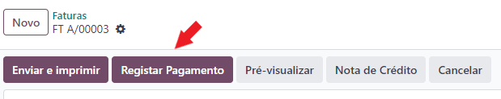
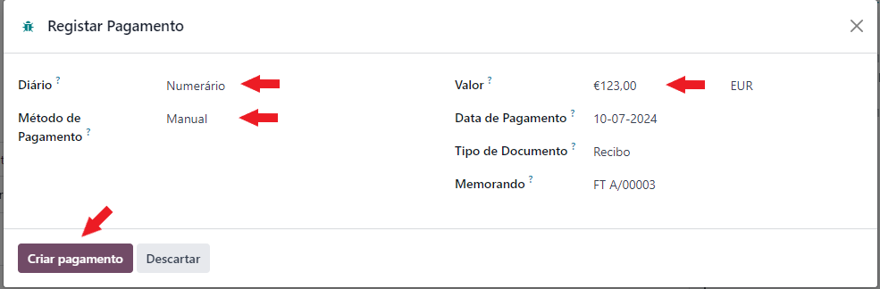
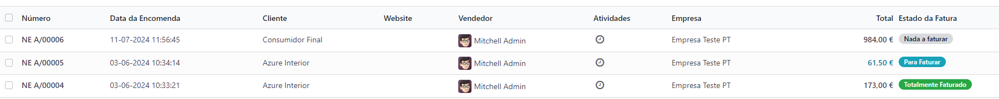
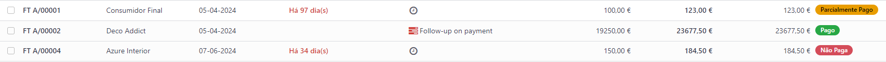
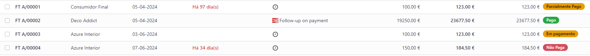

:show-content:

=================================
Processo de Pagamento/Recebimento
=================================

Em Odoo
=======

O processo de faturação em Odoo foi pensado para seguir sempre a mesma sequência:

    - Orçamentação
    - Emissão de Fatura
    - Emissão do Recibo
    - Reconciliação de documentos
    - Correções

        - Nota de Crédito
        - Nota de Débito

Nesta secção vamos abordar os processos de **Pagamentos / Recebimentos** e **Reconciliação de Documentos**

.. _payment_process_create_recipt:

Emissão de Recibos
------------------
.. important::
    Existem 2 processos para se emitir um recibo.

    O **processo recomendado** é emitir sempre o recibo a partir da Fatura. Que vai gerar um novo documento de recibo e publicar o mesmo.

    No entanto pode ser feita um recibo sem esta ligação se realmente for necessário.

O processo de emissão do recibo deve então ser iniciado na **Fatura** e carregar no botão **Registar Pagamento**

Em seguida deve estolher as seguintes opções:

- Em que Diário vai registar o pagamento
- O método de pagamento utilizado
- O valor do pagamento

Os restantes campos normalmente já estão preenchidos se seguir este processo. Carregue no botão **Criar pagamento**

.. note::
    No caso de o valor a receber ser diferente do valor total da fatura, vai ter uma vista diferente onde pode escolher o que fazer com a diferença

    .. image:: payment_process/v17_createRecipt3.png
        :align: center

.. tip::
    O processo de criação de recibos sem ligação a faturas é parecido, exceto em 2 pontos:

        - Onde se inicia o processo
        - A necessidade de preencher quase todos os campos de raíz

    Para iniciar o processo aceda à app **Faturação / Contabilidade** (dependendo respetivamente se tem versão Community ou Enterprise do Odoo), vá ao menu :menuselection:`Clientes --> Pagamentos` ou :menuselection:`Fornecedores --> Pagamentos`

    Clique na opção **Novo**

    .. image:: payment_process/v17_newRecipt.png
        :align: center

    Como os campos não são herdados da fatura terão de ser preenchidos manualmente.

.. seealso::
   :ref:`O que é um recibo <fiscal_documents_receipt>`

Reconciliação de documentos
---------------------------
A reconciliação de documentos é feita de forma automática, desde que siga os processos indicados.

.. note::
    Em Odoo o controlo e rastreabilidade entre documentos é feito linha a linha para cada documento

Essa ligação tem diferentes estados dependendo da fase em que se encontra:

    - :menuselection:`Nota de encomenda --> Fatura`
    - :menuselection:`Fatura --> Notas de crédito / Notas de débito / Recibos`

No Processo :menuselection:`Nota de encomenda --> Fatura` pode ver 3 tipos de estados:

    - **Nada a faturar** - dos diversos artigos que possam existir na nota de encomenda, ainda faltam cumprir requisitos para poder faturar alguns ou a totalidade dos artigos
    - **Para faturar** - dos diversos artigos que possam existir na nota de encomenda, alguns ou a totalidade já cumprem os requisitos para poderem ser faturados

    .. note::
        Se faturar artigos que estavam com os requisitos cumpridos, mas os restantes artigos não cumprirem ainda os seus requisitos, o estado volta de **Para faturar** para **Nada a faturar**

    - **Totalmente Faturado** - todos os artigos da nota de encomenda cumpriram os seus requisitos e estão faturados

No processo :menuselection:`Fatura --> Notas de crédito / Notas de débito / Recibos`, dependendo da sua versão do Odoo (Community ou Enterprise), pode ter 3 ou 4 tipos de estado respetivamente.

Community
^^^^^^^^^
Na versão Community terá 3 tipos de estado nas faturas:

    - **Não Paga** - Ainda não existe qualquer documento a liquidar o valor da fatura
    - **Parcialmente Pago** - Já existe(m) algum(uns) documento(s) a liquidar a fatura, mas o(s) seu(s) valor(es) é(são) inferior(s) ao total da fatura
    - **Pago** - O(s) documento(s) associado(s) à fatura liquidam a totalidade do valor da fatura

Os tipos de documento que podem servir para liquidar valores da fatura são as notas de crédito e os recibos

Enterprise
^^^^^^^^^^
Na versão Enterprise terá 4 tipos de estado nas faturas:

    - **Não Paga** - Ainda não existe qualquer documento a liquidar o valor da fatura
    - **Parcialmente Pago** - Já existe(m) algum(uns) documento(s) a liquidar a fatura, mas o(s) seu(s) valor(es) é(são) inferior(s) ao total da fatura
    - **Em pagamento** - O(s) documento(s) associado(s) à fatura liquidam total ou parcialmente o valor da fatura, mas ainda carecem de reconciliação com diário de pagamentos, pelo que o seu valor se encontra em contas transitórias
    - **Pago** - O(s) documento(s) associado(s) à fatura liquidam a totalidade do valor da fatura

Os tipos de documento que podem servir para liquidar valores da fatura são as notas de crédito e os recibos

Mais informação
---------------
.. seealso::
    Se pretender formação mais detalhada sobre o processo Oddo contacte a `Exo Software <https://exosoftware.pt/appointment/2>`_.

Por API
=======
É possível fazer a comunicação de documentos através de API em vez de serem gerados pelo utilizador no Odoo.

Para essa finalidade são instalados módulos ou apps específicos que lhe permitirão continuar a usar o seu sistema atual, mas ter o Odoo como a ferramenta de backend.

Estes módulos ou apps podem já existir ou ser personalizados às necessidades do utilizador pela nossa equipa técnica.

As configurações de API são feitas numa fase inicial, entre os departamentos técnicos da Exo Software e da sua entidade, para que tudo fique a funcionar corretamente e o utilizador não tenha de se preocupar com o processo.

.. toctree::
    :hidden:

    fiscal_documents
