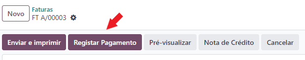
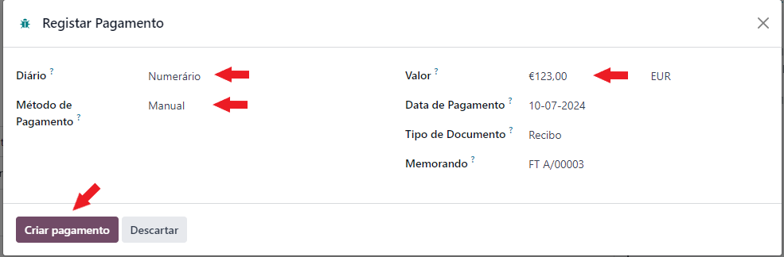

:show-content:

=================================
Processo de Pagamento/Recebimento
=================================

Em Odoo
=======

O processo de faturação em Odoo foi pensado para seguir sempre a mesma sequência:

    - Orçamentação
    - Emissão de Fatura
    - Emissão do Recibo
    - Reconciliação de documentos
    - Correções

        - Nota de Crédito
        - Nota de Débito

Nesta secção vamos abordar os processos de **Pagamentos / Recebimentos** e **Reconciliação de Documentos**

.. _payment_process_create_recipt:

Emissão de Recibos
------------------
.. important::
    Existem 2 processos para se emitir um recibo.

    O **processo recomendado** é emitir sempre o recibo a partir da Fatura. Que vai gerar um novo documento de recibo e publicar o mesmo.

    No entanto pode ser feita um recibo sem esta ligação se realmente for necessário.

O processo de emissão do recibo deve então ser iniciado na **Fatura** e carregar no botão **Registar Pagamento**

Em seguida deve estolher as seguintes opções:

- Em que Diário vai registar o pagamento
- O método de pagamento utilizado
- O valor do pagamento

Os restantes campos normalmente já estão preenchidos se seguir este processo. Carregue no botão **Criar pagamento**

.. note::
    No caso de o valor a receber ser diferente do valor total da fatura, vai ter uma vista diferente onde pode escolher o que fazer com a diferença

    .. image:: invoicing_process/v17_createRecipt3.png
        :align: center

.. tip::
    O processo de criação de recibos sem ligação a faturas é parecido, exceto em 2 pontos:

        - Onde se inicia o processo
        - A necessidade de preencher quase todos os campos de raíz

    Para iniciar o processo aceda à app **Faturação / Contabilidade** (dependendo respetivamente se tem versão Community ou Enterprise do Odoo), vá ao menu :menuselection:`Clientes --> Pagamentos` ou :menuselection:`Fornecedores --> Pagamentos`

    Clique na opção **Novo**

    .. image:: invoicing_process/v17_newRecipt.png
        :align: center

    Como os campos não são herdados da fatura terão de ser preenchidos manualmente.

.. seealso::
   :ref:`O que é um recibo <fiscal_documents_receipt>`

Reconciliação de documentos
---------------------------

Documentação em breve

Mais informação
---------------
.. seealso::
    Se pretender formação mais detalhada sobre o processo Oddo contacte a `Exo Software <https://exosoftware.pt/appointment/2>`_.

Por API
=======
É possível fazer a comunicação de documentos através de API em vez de serem gerados pelo utilizador no Odoo.

Para essa finalidade são instalados módulos ou apps específicos que lhe permitirão continuar a usar o seu sistema atual, mas ter o Odoo como a ferramenta de backend.

Estes módulos ou apps podem já existir ou ser personalizados às necessidades do utilizador pela nossa equipa técnica.

As configurações de API são feitas numa fase inicial, entre os departamentos técnicos da Exo Software e da sua entidade, para que tudo fique a funcionar corretamente e o utilizador não tenha de se preocupar com o processo.

.. toctree::
    :hidden:

    fiscal_documents
