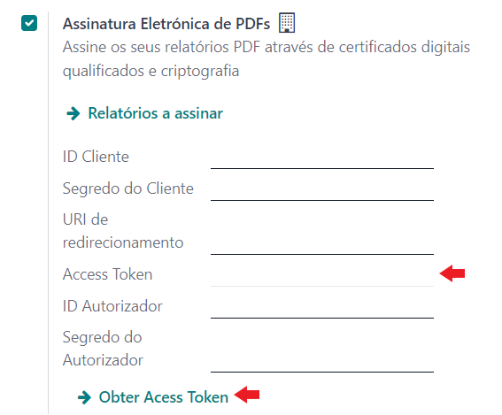

:show-content:

=========================
Assinatura Digital de PDF
=========================
A assinatura digital qualificada de PDFs é uma requisito legal que visa garantir a autenticidade e inalterabilidade
dos documentos, de forma a promover a transição digital no envio e arquivo de documentos. Embora seja obrigatória
há vários anos, a aplicação do diploma legal tem vindo a ser sucessivamente adiada.

Posto de forma simples, a lei exige que documentos transmitidos digitalmente, por e-mail, download ou outra qualquer
via, sejam previamente assinados, de acordo com um conjunto de especificações técnicas. As faturas impressas e o
respetivo envio por serviço postal mantêm a sua validade.

Para adicionar assinaturas digitais de forma gratuita, os utilizadores podem descarregar os ficheiros PDF, um a um,
para o seu computador e usar um dos vários métodos disponíveis para os assinar (p. ex. a aplicação Autenticação.gov).
Ou podem, através da app da Exo, configurar o seu Odoo para assinar, enviar e arquivar, **de forma automática**, os seus
documentos digitais. É deste último processo que trata esta documentação.

.. important::
    **Ainda não é obrigatório**.

    A **data prevista** para entrada em vigor desta obrigatoriedade é **1 janeiro 2025**.

.. danger::
    Apesar de bastante útil e legal em vários países, a app **Sign** do Odoo não cumpre os requisitos legais impostos
    pela legislação portuguesa. Pelo que **assinaturas usando a app Sign não são válidas em território nacional**

    Por esse motivo, a Exo Software, para garantir a conformidade com as normas nacionais, desenvolveu a sua própria
    solução de assinatura digital de PDFs recorrendo aos serviços da `DigitalSign <https://www.digitalsign.pt/ds>`_

.. raw:: html

    

        ─── ✦ ───
    

.. TODO : questão do preçário, forma de disponibilização e configuração do certificado

.. important::
    Esta app não está disponível na loja Odoo. Para ter acesso à mesma, terá que solicitar a sua
    instalação e ativação na sua base de dados

Aquisição dos certificados
==========================

A maneira mais fácil e recomendada de adquirir os certificados digitais necessários é através da
nossa `loja online <https://exosoftware.pt/shop>`_ ou contactando os nossos serviços de vendas. Em
alternativa, poderá fazê-lo diretamente junto da `DigitalSign <https://www.digitalsign.pt/ds>`_,
procurando por Selos Qualificados de Documentos e Faturação Eletrónica.

Em qualquer dos casos, há 3 packs iniciais, válidos por 3 anos, que diferem apenas no preço e no
número de assinaturas anuais incluídas. Posteriormente, caso esgote o plafond anual, poderá adquirir
extensões que lhe permitirão assinar a quantidade necessária de documentos, qualquer que esta seja.

Após a aquisição dos certificados, ser-lhe-á solicitado um conjunto de dados que permitirão à entidade
certificadora identificar a empresa detentora do certificado, bem como atestar a legitimidade do seu
representante. Poderá consultar mais detalhes sobre este processo na nossa página de
:doc:`FAQ para Assinatura Digital de PDFs <../faq/pdf_digital_signature>`.

Concluído este processo, poderá avançar para a configuração da app no Odoo ou pedir-nos para que a
façamos por si.

Configuração
============
.. TODO : como criar conta com a DigitalSign

Aceda à app **Faturação / Contabilidade** (dependendo respetivamente se tem versão Community ou Enterprise do Odoo), vá
ao menu :menuselection:`Configuração --> Configurações`

.. image:: fiscal_documents/v17_appInvoicingAccounting.png
   :align: center

.. image:: ../accounting/efatura/v17_efaturaConfig01.png
   :align: center

Procure a secção **Portugal**, ative a **Assinatura Eletrónica de PDFs** e preencha os campos:

.. image:: pdf_signing/v17_pdfSignConfiguration01.png
   :align: center

.. TODO : verificar ordem de preenchimento dos campos e como ter a informação disponível

- **ID Cliente** e **Segredo do Cliente**, são facultados pela DigitalSign na aquisição do certificado

- **URI de Redirecionamento**, é o seu **endereço do servidor** acrescido de **/digitalsign** por exemplo *https://exosoftware.pt/digitalsign*

.. important::
    Este URI tem de ser comunicado à DigitalSign para que seja devidamente registado nos servidores deles

- **Access Token**, com os dados anteriores preenchidos carregue no botão **Obter Access Token** para o receber, vai precisar de fazer login para confirmar a sua identidade

- **ID Autorizador** e **Segredo do Autorizador**, estes dados podem ser obtidos no `seu backend DigitalSign <https://gapi.digitalsign.pt/login>`_

.. note::
    Aceda ao menu **Certificates** e carregue no botão **Edit** da sua conta

    .. image:: pdf_signing/v17_pdfSignConfiguration05.png
       :align: center

    Clique em **Register new Authorizer** e dê um nome ao mesmo (pode ainda decidir pela renovação automática do
    certificado para aquele autorizador), em seguida clique em **Register**

    .. image:: pdf_signing/v17_pdfSignConfiguration06.png
       :align: center

    .. image:: pdf_signing/v17_pdfSignConfiguration07.png
       :align: center

    Em seguida, vai ver uma janela com a informação do Autorizador e a validade do certificado para o mesmo. Receberá
    também um código para inserir, validando novamente a sua identidade. Clique em **Registar**

    .. image:: pdf_signing/v17_pdfSignConfiguration08.png
       :align: center

    Depois de registar, vai poder visualizar os dados a inserir no Odoo relativamente ao Autorizador

    .. image:: pdf_signing/v17_pdfSignConfiguration09.png
       :align: center

    .. image:: pdf_signing/v17_pdfSignConfiguration10.png
       :align: center

Concluído este processo, siga a opção **Relatórios a assinar** onde vai poder definir que documentos serão
automaticamente assinados no momento de criação do PDF.

Na configuração padrão, os documentos já configurados são as **Faturas** e **Recibos de Pagamento**

.. important::
    Se pretender mais documentos, poderá adicioná-los à lista, desde que esteja familiarizado com a
    legislação relativa a arquivos digitais e domínios de filtragem Odoo. Se não for o caso,
    recomendamos vivamente que nos peça ajuda. O importante é garantir que assina todos os documentos
    relevantes para a sua organização sem gastar selos com os que não justificam tal prática.

.. image:: pdf_signing/v17_pdfSignConfiguration12.png
   :align: center

.. seealso::
    :doc:`Consulte o nosso FAQ para Assinatura Digital de PDFs <../faq/pdf_digital_signature>`

Utilização
==========

Uma vez terminada a configuração, o processo é automático: sempre que mandar imprimir ou enviar por
e-mail um documento do tipo dos que estiverem configurados para serem assinados, obterá um PDF assinado.

Caso o documento esteja configurado para ser adicionado aos anexos Odoo, este não mais será assinado,
apresentando sempre a assinatura original. Se pretender nova assinatura, porque houve alterações no
documento ou qualquer outro motivo, basta eliminar o respetivo anexo. Na impressão seguinte, será feita
nova assinatura.

.. tip::
    Uma forma fácil e gratuita, embora muito fastidiosa, de cumprir o requisito legal, é descarregar os
    documentos que quiser enviar por email, assiná-los individualmente com **Chave Móvel Digital** ou com
    **Cartão do Cidadão** através da aplicação **Autenticação.gov** e, em seguida, enviá-los manualmente por
    e-mail.
