:nosearch:

===
POS
===
A ferramenta de POS agiliza a venda em loja ou restaurante e permite uma utilização mais intuitiva através de um
interface mais gráfico para o operador, permitindo interagir de forma mais simples com as ferramentas existentes no
backend

.. raw:: html

    

        ─── ✦ ───
    

Configuração
============

.. important::
    Garanta que na configuração da empresa o NIF está devidamente preenchido no formato PT123456789

    .. image:: pos/v17_companyConfiguration01.png
       :align: center

Na app de POS aceda ao menu de Configurações e crie uma nova loja

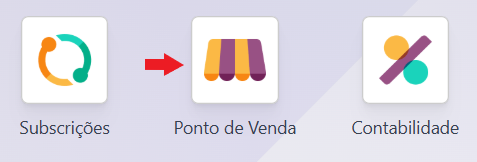

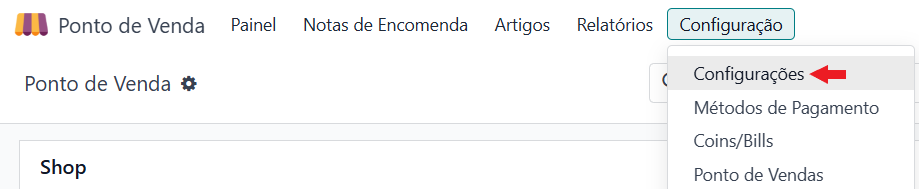

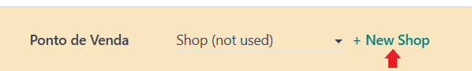

Dê um nome à loja e decida qual dos 2 tipos de lojas POS pretende:

- Venda de artigos em loja
- Bar ou Restaurante

Por defeito, é assumido que são do tipo **Venda de artigos em loja**, para mudar para o tipo **Bar ou Restaurante**
ative a opção respetiva

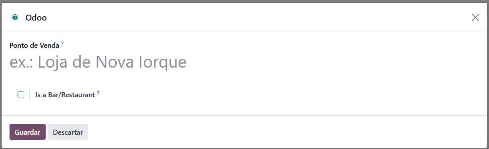

Caso pretenda mudar o estilo posteriormente, pode fazê-lo nas configurações do POS

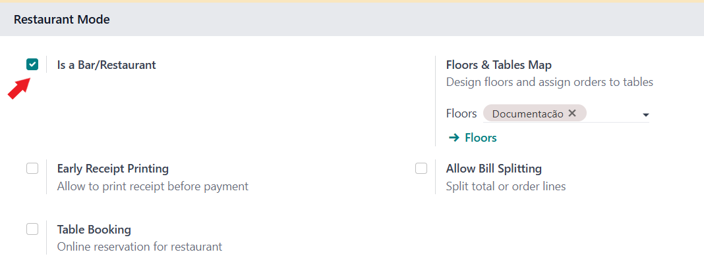

.. important::
    Se escolher um POS do tipo **Bar ou Restaurante** deve ter ativa a opção de imprimir Recibo antes do pagamento

    .. image:: pos/v17_posConfiguration06.png
       :align: center

    Terá também de configurar a Série Documental para as Consultas de Mesa

    .. image:: pos/v17_posConfiguration10.png
       :align: center

Na secção de **Contabilidade** deve fazer o correto preenchimento das respetivas configurações

- **Imposto de Vendas Predefinido**, só é aplicado a novos produtos inseridos no catálogo, normalmente aplica o imposto já definido no produto
- **Conta Temporária Padrão**, conta do Plano de Contas para documentos de clientes não definidos
- **Diários Padrão**, onde serão registados os movimentos do POS

    - **Notas Encomenda**, diário do tipo **Diversos**
    - **Faturas**, diário do tipo **Vendas**
- **Tipo Doc. para Faturas**, Série Documental utilizada para emissão das faturas da loja
- **Tipo Doc. Para Notas de Crédito**, Série Documental utilizada para emissão de notas de crédito da loja
- **Norma Regularização IVA Predefinida**, defina que norma de regularização de IVA é usada nas notas de crédito, pode depois alterar no backend
- **Cliente Predefinido**, no caso de não existir um contacto associado este será usado, sugerimos ter Consumidor Final

.. TODO: Alterar imagem abaixo quando estiver implementado a norma de regularização do IVA

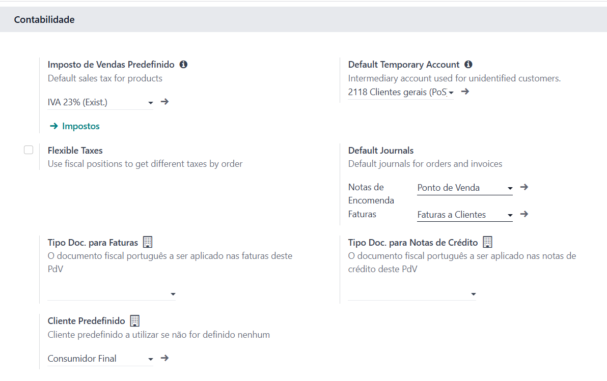

Para finalizar garanta que tem a opção de **Gestão de Inventário** correta:

- **No final da sessão**, quando fechar a sessão vai ser feito um movimento agregado de todos os movimentos
- **Em tempo real**, a cada operação que faz é feito o respetivo movimento de inventário

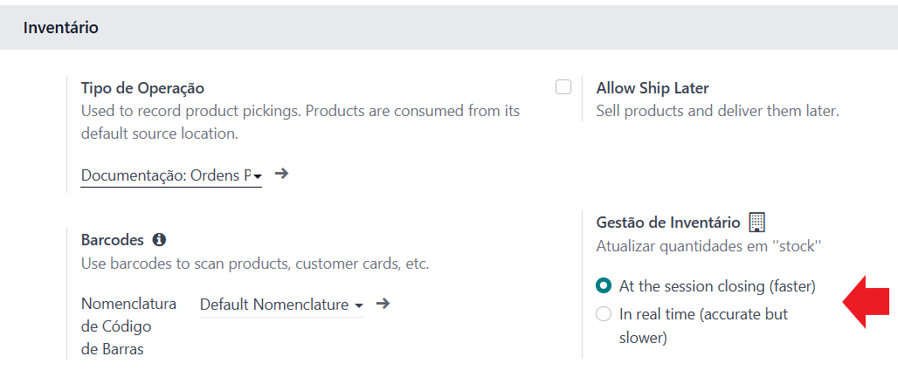

Siga a opção selecionada no **Tipo de Operação** e garanta que a opção **Desativar Auto-emissão de Guias** está ativa,
isto vai fazer com que os movimentos de inventário sejam finalizados e não fiquem pendentes de validação e respetiva
comunicação à AT, visto ser entrega em loja e não envio para o cliente

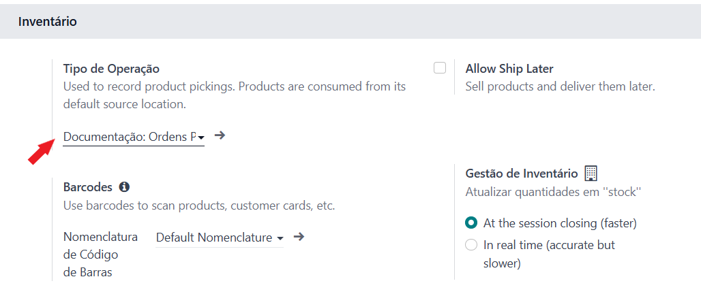

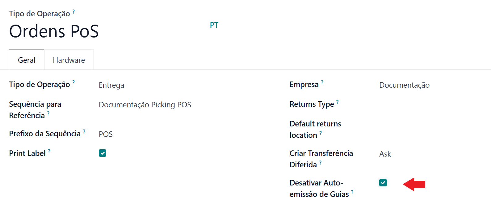

É também importante garantir o correto preenchimento dos artigos a ser vendidos em POS

- **Tipo de Artigo**
- **Unidade de medida**
- **Preço de Venda**
- **Imposto a Clientes**

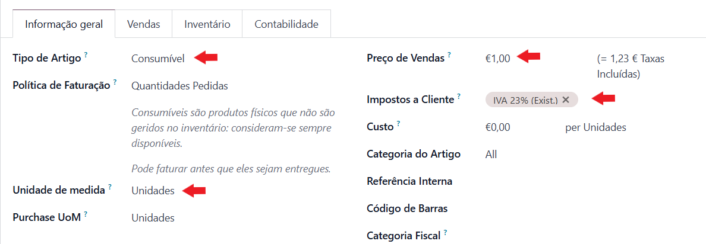

- Secção de Ponto de Venda na aba **Vendas** da folha do Produto, incluindo se está disponível e uma categoria de organização se o pretender

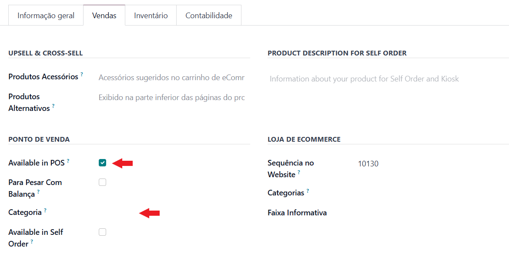

- Contas da aba **Contabilidade**, a última coisa que quer é que os seus operadores não possam emitir documentos por informação em falta

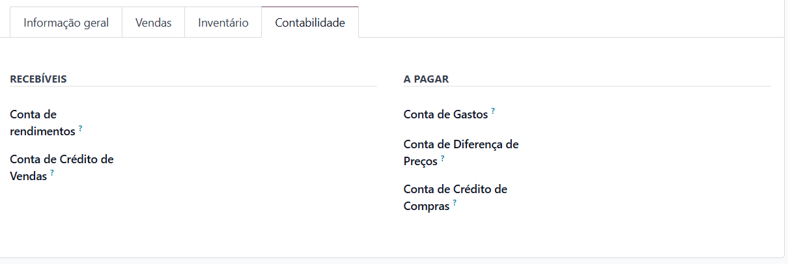

Utilização
==========

Abrir sessão do POS
-------------------
Abra a sessão da loja e caso tenha um diário do tipo **Numerário** será pedido que indique o saldo de abertura, pode
optar por escolher o botão de contagem de dinheiro para depois ser feito o total automático

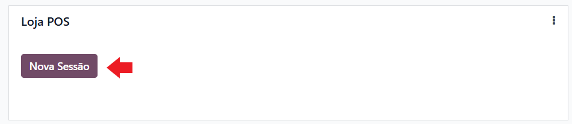

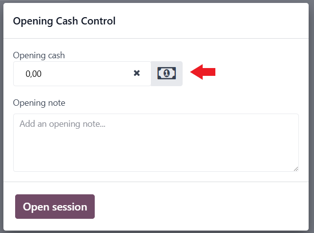

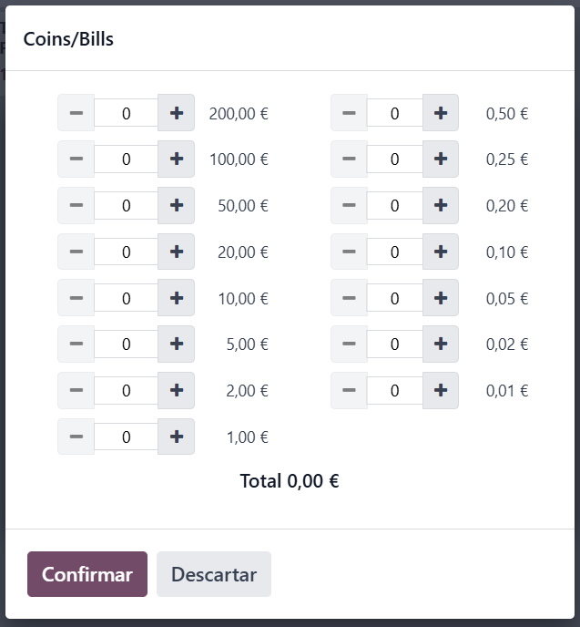

Faturas em POS
--------------
Selecione os artigos a vender e carregue no botão **Pagamento** quando estiver pronto para encerrar a venda

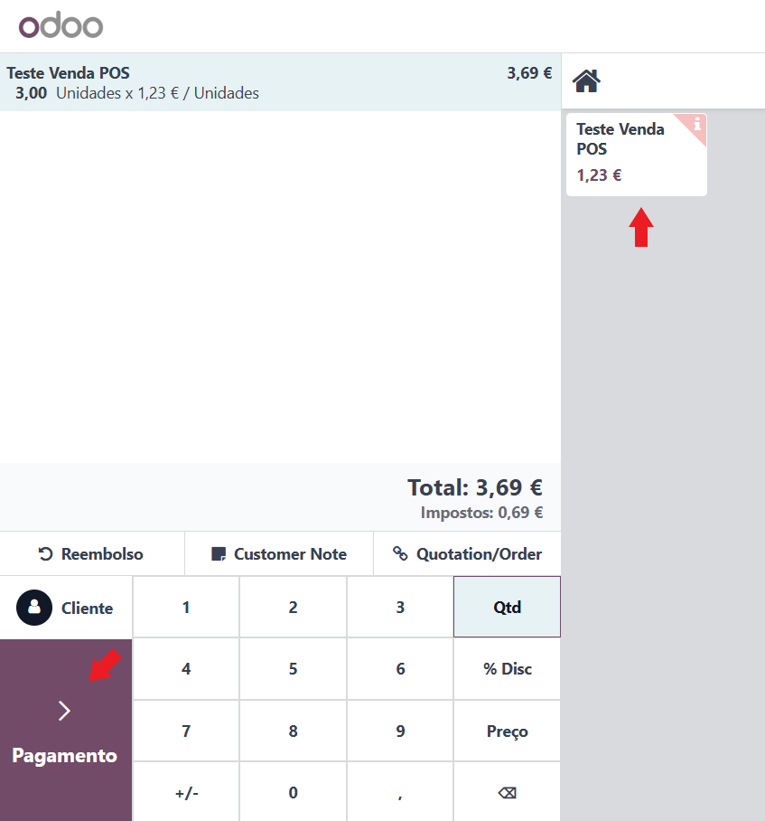

Selecione o **Cliente** (caso não selecione um será usado o que foi definido nas configurações) e os métodos de pagamento

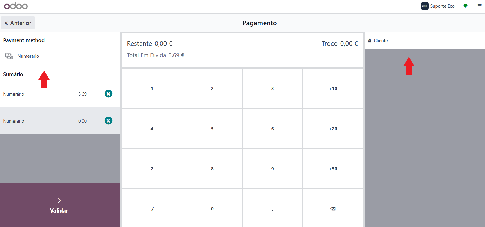

Depois de **Validar** é gerada a fatura e pode imprimir o recibo, ou enviar por email

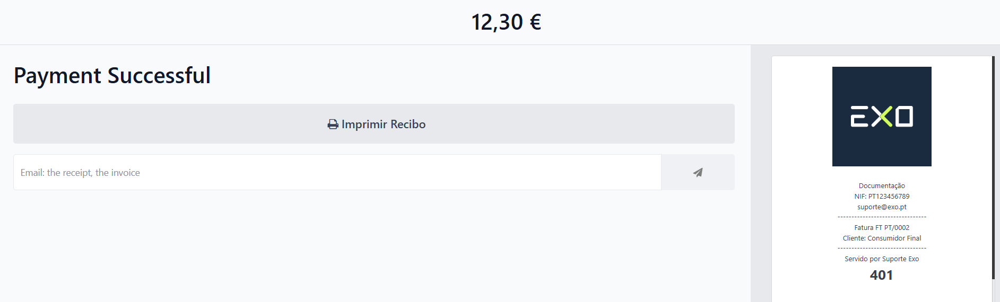

Notas de Crédito em POS
-----------------------

.. important::
    Para fazer uma nota de crédito de uma fatura do POS, tem de fazer a mesma dentro da app POS enquanto que a sessão
    está aberta, caso contrário não conseguirá fechar a sessão

    Depois da sessão fechada, então sim já poderá fazer notas de crédito no backend do Odoo

Para fazer uma nota de crédito em POS deve selecionar o botão para tal, selecionar a fatura em questão e a quantidade a
reduzir

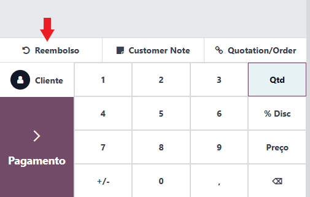

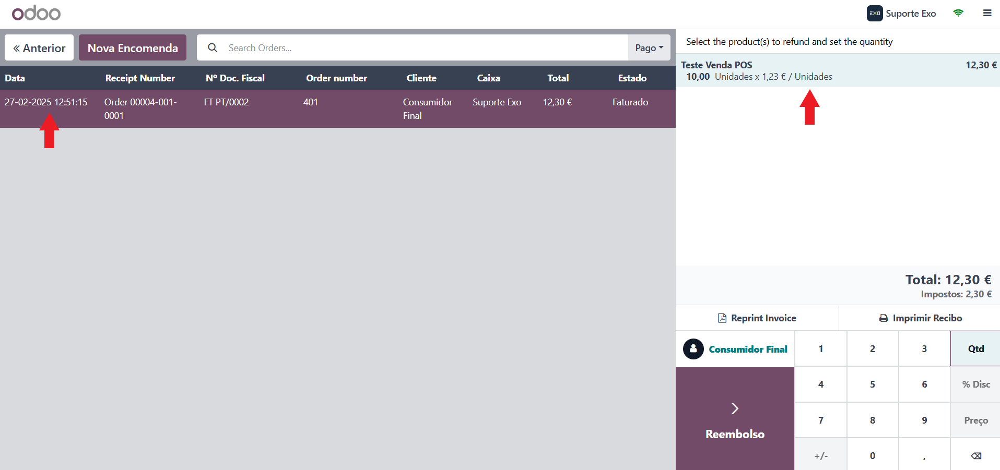

Quando estiver satisfeito carregue no botão Reembolso

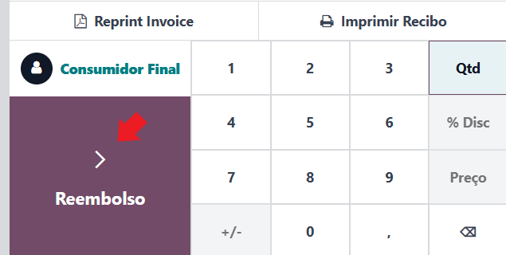

Este passo vai concluir a Nota de Crédito e fazer a sua emissão

.. important::
    A norma de regularização predefinida vai ser usada, mas pode, após encerrar a sessão, fazer correções desta norma no
    próprio documento se achar que no caso específico outra deveria ser utilizada

    Esta decisão foi tomada por 2 motivos:

    - simplificar a utilização do operador e o mesmo não ter de conhecer todas as normas existentes
    - apesar de ser um campo de preenchimento obrigatório o mesmo não é exibido no documento e é usado para motivos contabilísticos

Em seguida deve voltar a carregar no botão pagamento para efetuar a devolução do dinheiro ao cliente, se for caso disso

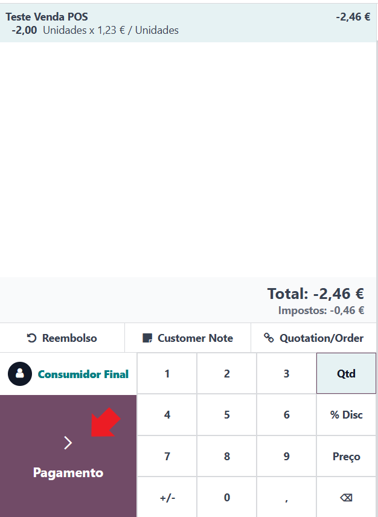

Fechar sessão no POS
--------------------
Para fechar a sessão do POS basta ir ao menu geral no canto superior direito e selecionar a opção para o fazer

.. important::
    Não pode abrir nova sessão do POS sem concluir a sessão anterior

No caso de ter diários do tipo Numerário associados à loja, será pedido que indique o saldo. Tal como na abertura pode
optar por escolher o botão de contagem de dinheiro para depois ser feito o total automático

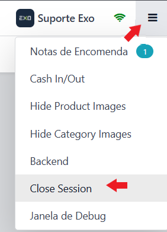

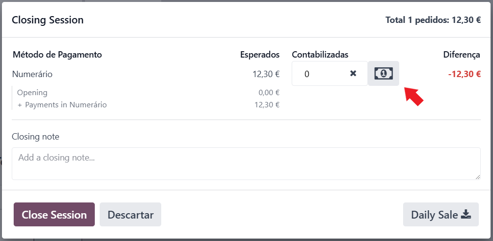

POS Bar/Restaurante
-------------------
O funcionamento é muito similar ao de uma loja, mas com alguns acrescentos:

- Botão **Ordem** para fazer o pedido para a cozinha
- Botão **Consulta de Mesa** para gerar um resumo da mesa antes da emissão da fatura
- Notão **Pagamento** está mais pequeno

.. seealso::
    :ref:`O que é uma Consulta de mesa <fiscal_documents_POSbill>`

    `Consulte a documentação Odoo sobre POS <https://www.odoo.com/documentation/17.0/pt_BR/applications/sales/point_of_sale.html>`_

    `Se pretender formação adicional sobre POS faça a sua marcação <https://exosoftware.pt/appointment>`_
