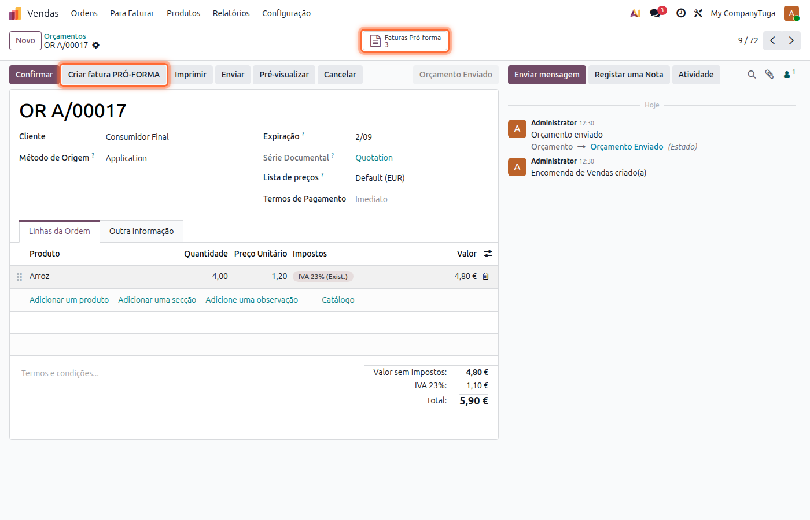
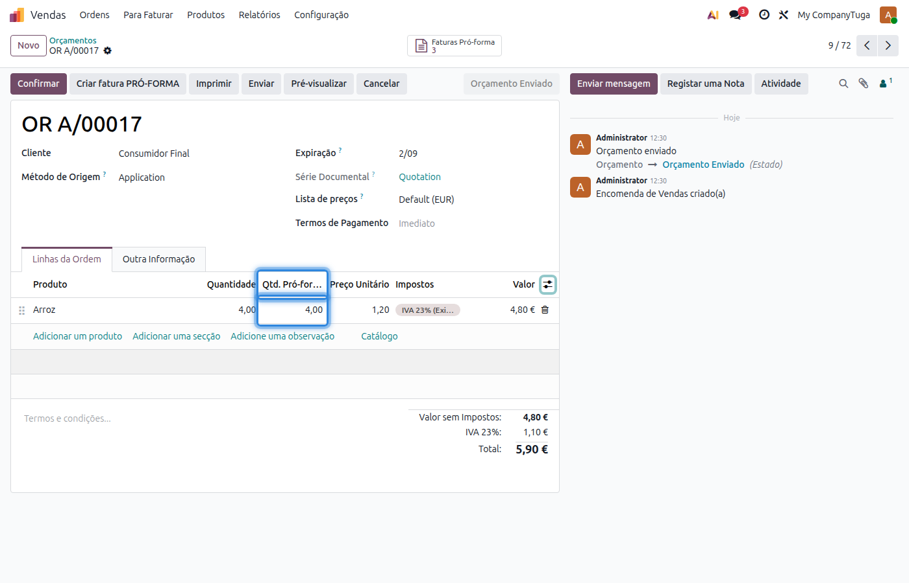
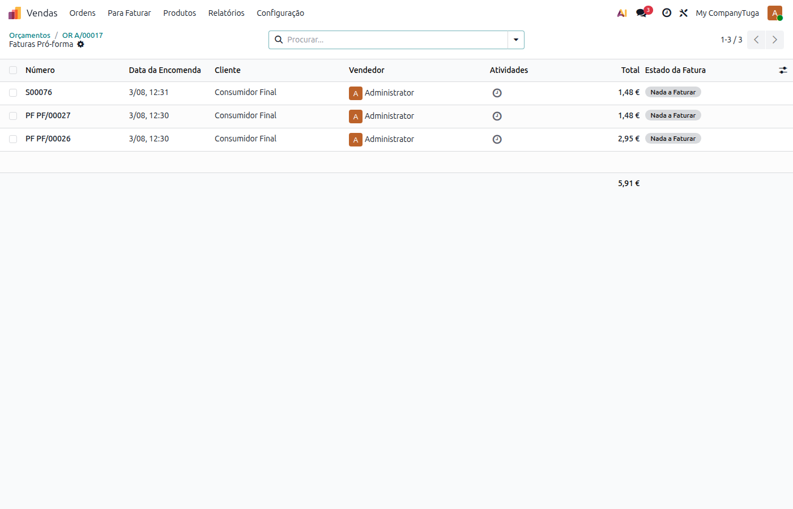
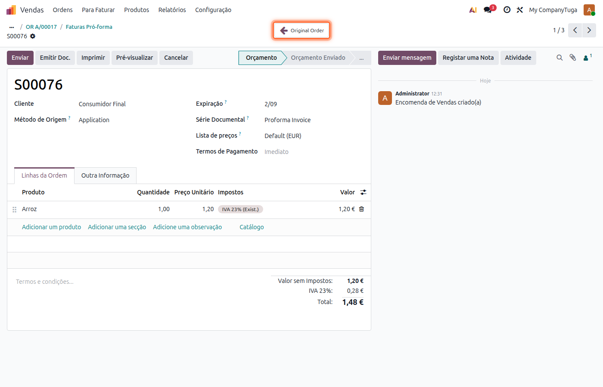
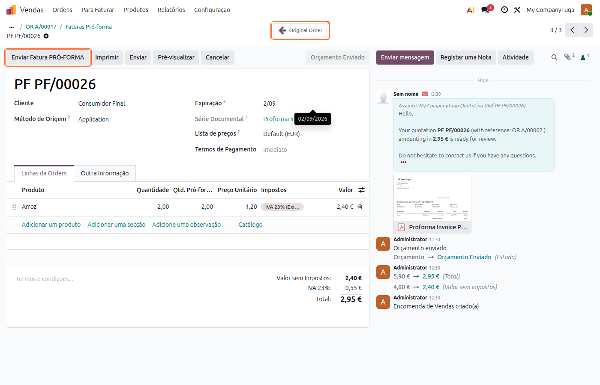
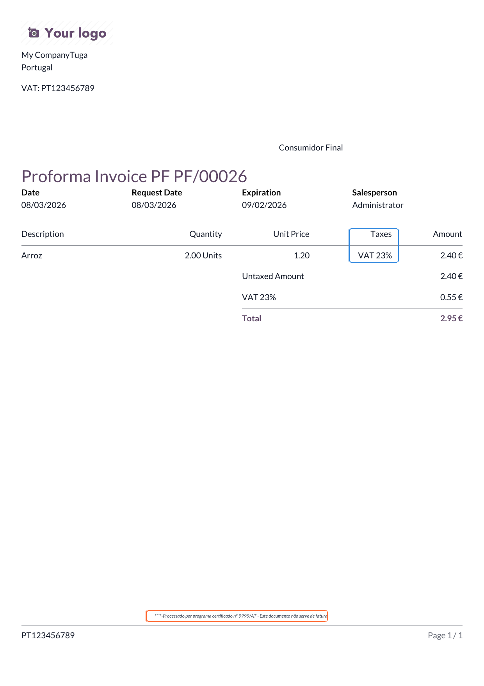

:nosearch:

=================
Fatura Pró-Forma
=================
A fatura pró-forma é um documento informativo, sem valor fiscal, frequentemente utilizado para apresentar
ao cliente uma proposta detalhada de produtos/serviços ou para justificar o valor de bens numa transação
internacional. A localização Exo permite emitir uma ou várias faturas pró-forma a partir da mesma
Ordem/Orçamento de Venda, controlando automaticamente as quantidades já enviadas para que nunca sejam
excedidas as quantidades encomendadas.

.. raw:: html

    

        ─── ✦ ───
    

.. seealso::
    :ref:`Consulte a informação geral sobre a Fatura pró-forma <fiscal_documents_quote>`

Configuração
============
A série documental do tipo **Proforma Invoice** já é criada automaticamente pela localização, mas fica
**inativa** por defeito.

Para a poder utilizar, aceda à app **Faturação / Contabilidade** (dependendo respetivamente se tem versão
Community ou Enterprise do Odoo), vá ao menu de **Configuração** e selecione a opção **Séries Documentais**,
localize a série do tipo **Proforma Invoice**, ative-a e proceda ao registo da mesma junto da AT, tal como
faria para qualquer outra série documental.

.. seealso::
    :doc:`Consulte o processo geral de registo de séries documentais <series_registration>`

Utilização
==========

Criar uma fatura pró-forma
---------------------------
Numa Ordem ou Orçamento de Venda que já não esteja em rascunho nem cancelado, carregue no botão
**Criar fatura PRÓ-FORMA**. O Odoo duplica o documento atribuindo-lhe o tipo de documento fiscal
**Proforma Invoice**.

.. important::
    Só é copiada, para cada linha, a quantidade que **ainda não tenha sido incluída** em nenhuma pró-forma
    criada anteriormente a partir do mesmo documento. Isto permite emitir várias faturas pró-forma parciais
    referentes à mesma Ordem/Orçamento, cada uma cobrindo uma fração da quantidade total, sem nunca
    conseguir reservar mais do que aquilo que foi encomendado.

    Se todas as quantidades já estiverem reservadas nas pró-formas emitidas anteriormente, o botão informa
    que não há nada disponível para enviar e impede a criação de uma nova pró-forma.

No documento original é possível acompanhar, através da coluna opcional **Qtd. Pró-forma Enviada** nas
linhas da ordem, a quantidade já reservada em pró-formas por cada linha.

.. tip::
    Para mostrar esta coluna, na lista de linhas carregue no ícone de configuração de colunas, no canto
    superior direito da tabela, e selecione **Qtd. Pró-forma Enviada**.

Navegação entre a Ordem original e as suas pró-formas
--------------------------------------------------------
No documento original surge o botão inteligente **Faturas Pró-forma** com a contagem de pró-formas já
criadas, dando acesso à sua listagem.

Em cada fatura pró-forma surge, por sua vez, o botão **Original Order** que permite voltar rapidamente ao
documento de origem.

Enquanto a pró-forma ainda não tiver sido emitida (estado **Orçamento**), o único botão de ação disponível
é **Enviar**, para a emitir.

Emitir e enviar a fatura pró-forma
------------------------------------
Depois de criada, a fatura pró-forma tem de ser emitida, tal como qualquer outro documento fiscal. Para
tal, carregue no botão **Enviar Fatura PRÓ-FORMA**, o que atribui o número de série ao documento (ex.
``PF/00026``) e possibilita o seu envio ao cliente por email, com o respetivo PDF em anexo.

O PDF gerado segue a estrutura habitual do :ref:`Orçamento/Encomenda <fiscal_documents_quote>`, mas
evidencia o detalhe do IVA e o respetivo motivo de isenção por linha, incluindo sempre a nota **"Este
documento não serve de fatura"**.

.. note::
    Assim como nos restantes documentos fiscais, o idioma do PDF corresponde ao idioma configurado na
    ficha do cliente, e não ao do utilizador que o está a emitir/consultar.

.. important::
    A fatura pró-forma é apenas um documento informativo. Depois de aprovada pelo cliente, a faturação
    efetiva continua a ser feita a partir da Ordem de Venda original, seguindo o :ref:`processo normal de
    faturação <odoo_process_creat_invoice>`.
