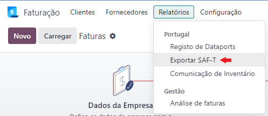
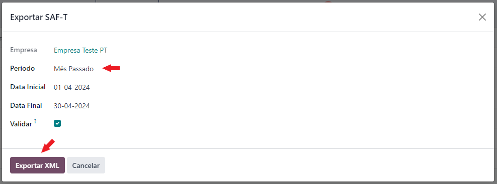
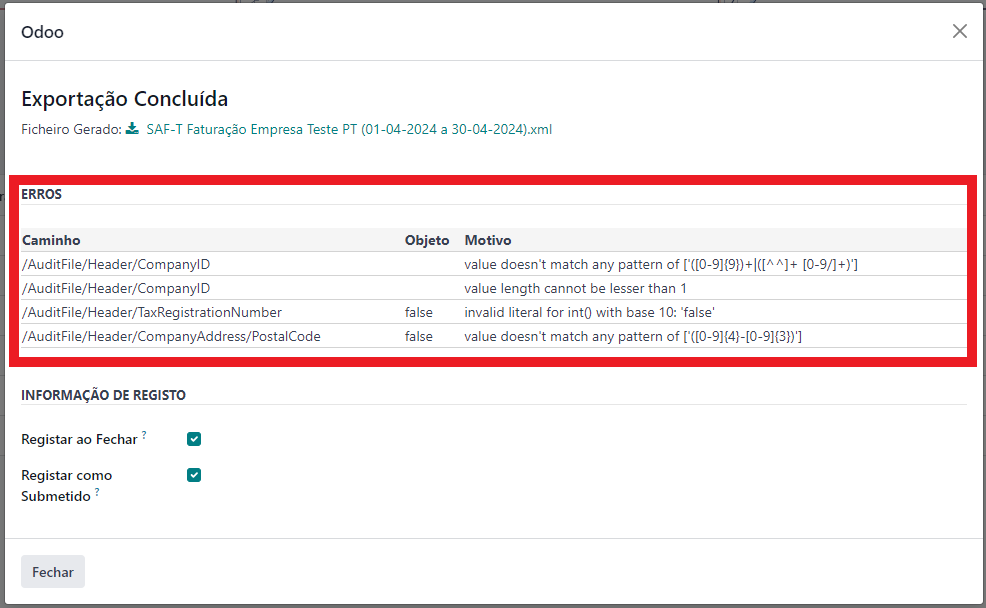
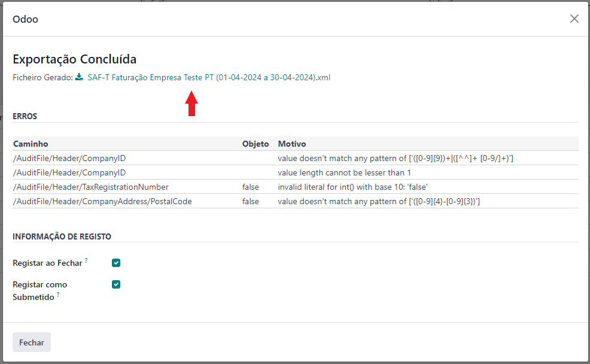
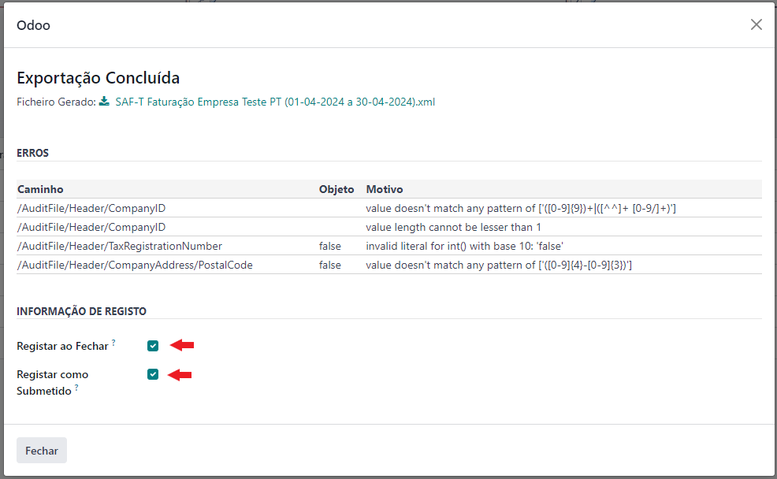

:show-content:

===============
SAF-T Faturação
===============
O SAF-T de faturação é uma obrigação legal que tem de ser cumprida junto da AT

Aprenda como o gerar e lidar com alguns erros de validação que possam surgir durante a sua criação

.. raw:: html

    

        ─── ✦ ───
    

Exportação
==========
Para poder exportar o ficheiro SAF-T de Faturação que tem de submeter à Autoridade Tributária, aceda à app
**Faturação / Contabilidade** (dependendo respetivamente se tem versão Community ou Enterprise do Odoo), vá ao menu
**Relatórios** e no separador **Portugal** selecione a opção **Exportar SAF-T**.

.. image:: fiscal_documents/v17_appInvoicingAccounting.png
   :align: center

Vai abrir uma janela que predefine o **Período** como Mês Passado, mas pode selecionar o período como lhe for mais
conveniente, mudando o **Período** ou alterando a **Data Inicial** e/ou **Data Final**.

É recomendadoque mantenha o visto na opção **Validar** para fazer uma verificação do ficheiro, no entanto se espera que
o ficheiro seja muito grande pode optar por não fazer esta verificação.

Carregue em **Exportar XML**.

Vai ser gerada uma nova janela com um resumo de possíveis erros que existam nos documentos para que seja mais fácil ver
necesidade de correção de erros

No campo **Motivo** pode encontrar uma descrição do que está a causar o erro

Depois de não ter erros, faça download do ficheiro gerado para inserir no site da Autoridade Tributária.

Esta janela tem ainda duas opções:

   - **Registar ao Fechar**, Vai criar uma entrada junto com uma cópia do ficheiro gerado para que possa consultar posteriormente
   - **Registar como Submetido**, se o visto estiver ativo o registo gerado vai ser considerado como submetido sem problemas à AT

Submeta o ficheiro à AT, depois de submeter o ficheiro pode fechar esta janela.

.. seealso::
    :doc:`Consulte as nossas FAQs sobre SAF-T de Faturação <../faq/saft_errors>`

.. _invoice_saft_invoice_cron:

Automatismo (Cron)
==================
A nossa **Localização PT+** possuí uma ferramenta excessional para emissão automática dos ficheiros SAFT

Esse automatismo carece de configuração específica às suas necessidades, pelo que pode solicitar os nossos serviços
para o ajudar com as configurações. No entanto uma vez configurado não terá de se preocupar mais.

.. seealso::
    Saiba mais sobre o nosso automatismo de criação de SAF-T marcando uma `Formação <https://exosoftware.pt/en/appointment>`_

Importação
==========
.. FIXME : Parece que ainda não existe nada mas está no roadmap

Documentação em breve
