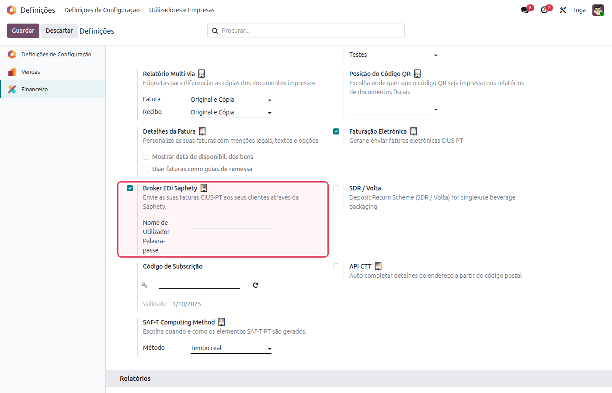
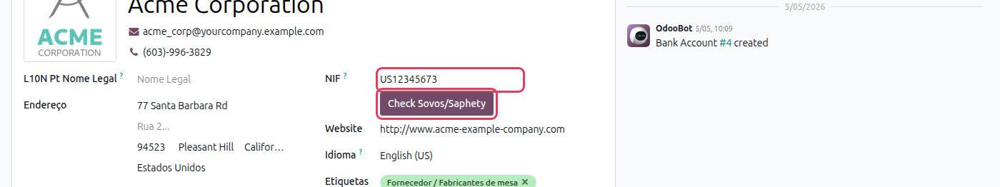
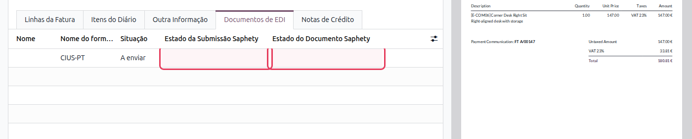

:nosearch:

================================
Broker EDI Saphety (CIUS-PT)
================================
O módulo **Broker EDI Saphety** complementa a faturação eletrónica CIUS-PT com a
entrega automática das faturas XML ao destinatário através da plataforma `Saphety
<https://www.saphety.com/>`_ (Sovos). Após a publicação e envio da fatura, o Odoo
submete o ficheiro CIUS-PT à plataforma e acompanha o estado de processamento sem
qualquer intervenção manual.

.. raw:: html

    

        ─── ✦ ───
    

.. important::
    Esta funcionalidade não está disponível na loja Odoo. Para ter acesso à mesma,
    terá de solicitar a sua instalação e ativação à **Exo Software**.

.. note::
    Este módulo requer a instalação prévia do módulo
    :doc:`Faturação Eletrónica (CIUS-PT) <e-invoicing>`.

Configuração
============

Ativar o Broker e Configurar Credenciais
-----------------------------------------

Aceda à app **Faturação / Contabilidade**, vá ao menu
:menuselection:`Configuração --> Configurações` e clique em **Financeiro** no menu
lateral. Localize a opção **Broker EDI Saphety** na secção Portugal.

Ative a opção **Broker EDI Saphety** e, após a ativação, preencha o
**Nome de Utilizador** e a **Palavra-passe** da conta Saphety da sua empresa.
Guarde as definições.

Verificar a Conectividade com a Plataforma Saphety
----------------------------------------------------

Antes de enviar faturas, confirme que o NIF do parceiro cliente está corretamente
registado na plataforma Saphety. Na ficha do parceiro, o botão
:guilabel:`Check Sovos/Saphety` (visível ao lado do campo **NIF**) permite verificar
esse estado de forma imediata.

Após carregar no botão, o Odoo contacta a plataforma Saphety e apresenta o resultado:

- **Works with Sovos/Saphety** (verde) — o parceiro está apto a receber faturas via Saphety.
- **Doesn't work with Sovos/Saphety** (vermelho) — verifique os dados do parceiro junto da Saphety.

Utilização
==========

Após a configuração, o processo de envio é totalmente automático. Basta publicar e
enviar a fatura de cliente como habitualmente (botão :guilabel:`Enviar`):

1. O Odoo gera o ficheiro XML CIUS-PT e submete-o à plataforma Saphety.
2. Um processo automático (cron) monitoriza periodicamente o estado da submissão e
   atualiza o separador **Documentos de EDI** da fatura.

O separador **Documentos de EDI** apresenta duas colunas adicionais relativas à
integração Saphety:

.. list-table::
   :header-rows: 1
   :widths: 30 70

   * - Coluna
     - Descrição
   * - **Estado da Submissão Saphety**
     - Estado do pedido de entrega: *Em Espera*, *Em Execução*, *Erro* ou *Terminado*.
   * - **Estado do Documento Saphety**
     - Estado de entrega ao destinatário: *Recebido* (verde) ou *Erro* (vermelho).

.. tip::
    Se a coluna **Estado da Submissão Saphety** indicar *Erro*, verifique os dados do
    parceiro (NIF) e as credenciais Saphety nas definições, e reenvie a fatura.
