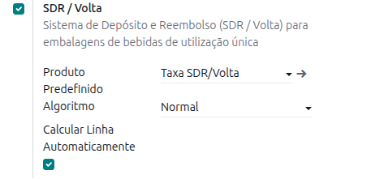
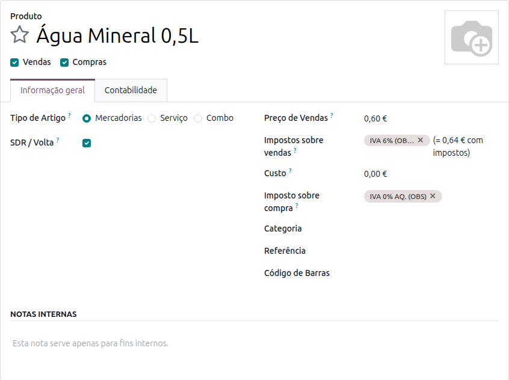
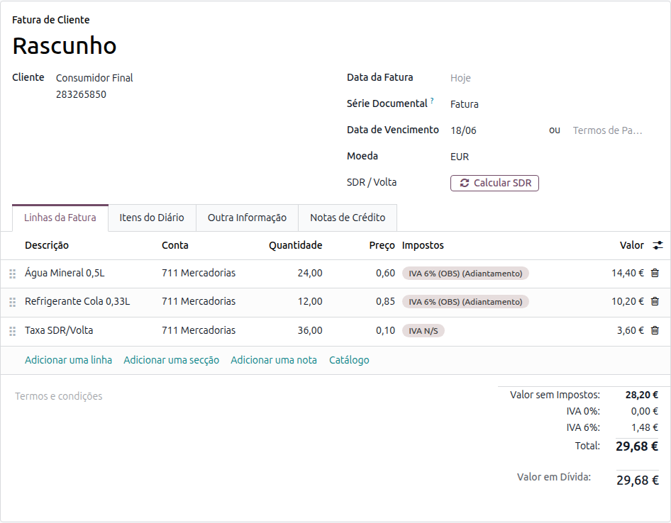
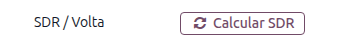

:nosearch:

===========
SDR / Volta
===========
O **Sistema de Depósito e Reembolso** (SDR), comummente designado por *Volta*, é um regime que aplica
um valor de depósito reembolsável às embalagens de bebidas de utilização única. Esse depósito é
cobrado ao cliente no momento da venda e devolvido aquando da entrega da embalagem para reciclagem.

O módulo **Portugal - SDR / Volta** da **Localização PT+** adiciona automaticamente uma linha de
depósito autónoma, isenta de IVA (*Embalagens SDR / Volta*), às faturas de compra e de venda,
agregando as quantidades dos produtos assinalados como sujeitos ao regime.

.. raw:: html

    

        ─── ✦ ───
    

.. important::
    Esta funcionalidade não está disponível na loja Odoo. Para ter acesso à mesma, terá de solicitar
    a sua instalação e ativação à **Exo Software**.

.. note::
    O regime SDR / Volta entrou em vigor a **10 de abril de 2026**.

Configuração
============
Após a instalação do módulo, aceda a :menuselection:`Definições --> Faturação` e desça até à
secção **Portugal**, onde encontra o bloco :guilabel:`SDR / Volta`.

Estão disponíveis as seguintes opções:

.. list-table::
   :header-rows: 1
   :widths: 30 70

   * - Campo
     - Descrição
   * - :guilabel:`Produto Predefinido`
     - Produto utilizado na linha de depósito (SDR / Volta) das faturas. O módulo cria e
       pré-configura o produto **Taxa SDR/Volta**, mas pode indicar outro produto já existente.
   * - :guilabel:`Algoritmo`
     - Algoritmo de cálculo da quantidade da linha de depósito. O algoritmo **Normal** soma as
       quantidades dos produtos assinalados como sujeitos a SDR.
   * - :guilabel:`Calcular Linha Automaticamente`
     - Quando ativo, a linha de depósito é mantida sincronizada com os produtos assinalados.
       Quando desativado, a linha só é recalculada com o botão **Calcular SDR**.

.. tip::
    O produto **Taxa SDR/Volta** é configurado automaticamente na instalação com os impostos de
    isenção adequados (não sujeito a IVA). As empresas criadas *após* a instalação não ficam
    abrangidas — nesses casos, configure manualmente o produto de depósito.

Marcação dos produtos
---------------------
Para que um produto contribua para a linha de depósito, tem de ser assinalado como sujeito ao regime.
Na ficha do produto, no separador :guilabel:`Informação geral`, ative a opção :guilabel:`SDR / Volta`.

Repita este passo para todas as bebidas de utilização única abrangidas pelo regime.

Utilização
==========
Nas faturas de compra e de venda, a linha de depósito **Embalagens SDR / Volta** é calculada
automaticamente a partir das quantidades dos produtos assinalados. Sempre que altera as quantidades
ou os produtos das linhas da fatura, a linha de depósito é recalculada.

No exemplo acima, as 24 unidades de *Água Mineral 0,5L* e as 12 unidades de *Refrigerante Cola 0,33L*
geram uma linha **Taxa SDR/Volta** com 36 unidades de depósito.

Recálculo manual
----------------
A linha de depósito pode também ser recalculada a pedido através do botão :guilabel:`Calcular SDR`,
disponível no cabeçalho da fatura enquanto esta estiver em estado de rascunho.

.. tip::
    O recálculo automático só atua quando o total das quantidades dos produtos assinalados muda. Por
    isso, pode editar manualmente a quantidade da linha de depósito sem que esta seja reposta — exceto
    se carregar no botão :guilabel:`Calcular SDR`, que força o recálculo.

.. note::
    O valor do depósito não está sujeito a IVA. Na exportação do ficheiro SAF-T, a linha é reportada
    com o motivo de isenção **M99**.

.. tip::
    Caso haja interesse em controlar as embalagens do tipo Volta recolhidas, deverá ser solicitado
    apoio à implementação dessa funcionalidade no âmbito de consultoria funcional.
