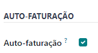
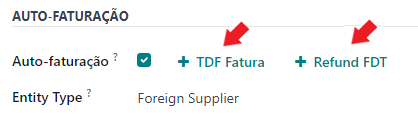
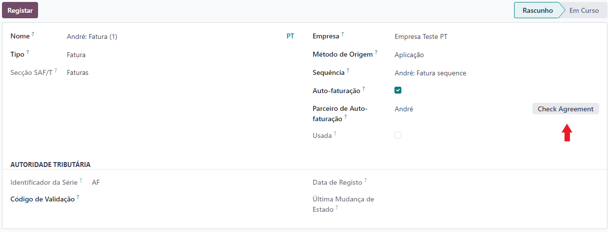
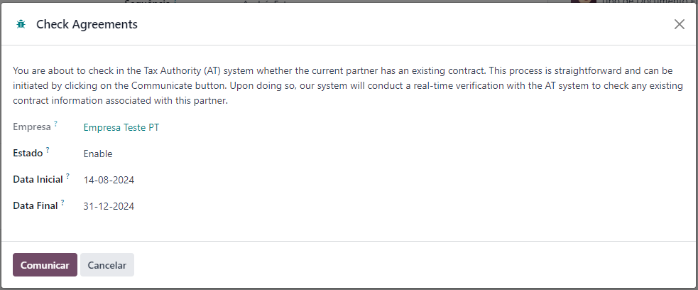
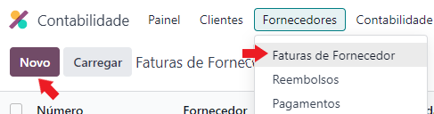
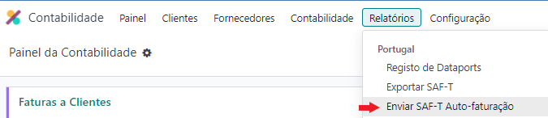
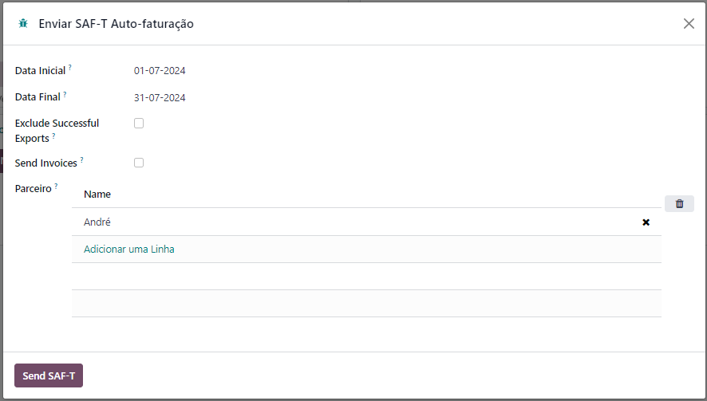
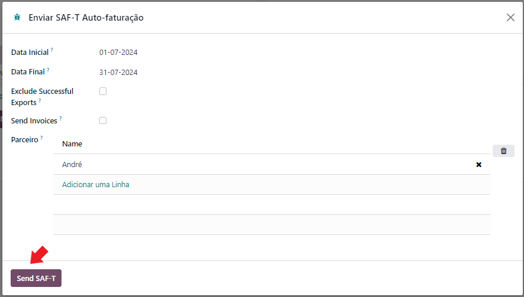
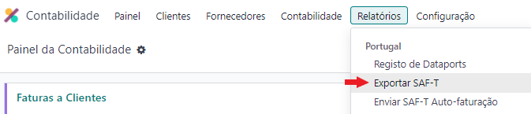
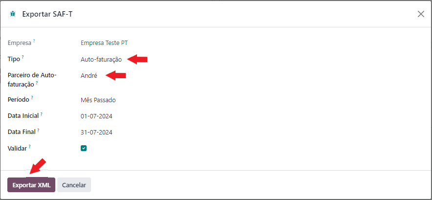

:nosearch:

=============
Autofaturação
=============
Este processo permite que o cliente emita faturas em nome do fornecedor, está obrigado a cumprir diversos critérios
e é útil nos casos em que o fornecedor possa não ter infraestrutura para lidar com a burocracia, enquanto que o cliente
já possui essa infraestrutura.

Veja como operacionalizar este processo em Odoo com a **Localização PT+**

.. raw:: html

    

        ─── ✦ ───
    

Configuração
============
Como para diversas outras situações é preciso primeiro instalar o nosso módulo dedicado, neste caso para autofaturação
chamado Portugal - Self-billing.

.. important::
    :ref:`verifique que cumpre os requisitos obrigatórios para poder usar esta ferramenta <fiscal_documents_self-billing>`

Com o módulo instalado vai passar a ter acesso a novos campos na ficha de contacto do parceiro.

Navegue para a ficha de contacto de um parceiro com o qual pretende iniciar o processo de autofaturação, na aba
**Compras & Vendas** ative a opção de Auto-Faturação

.. tip::
    Deve ter reparado que por baixo da opção de **Auto-faturação** existe uma opção para tipo de entidade. Esta opção só
    existe se o parceiro em questão tiver selecionado um país que não seja Portugal

    .. image:: self-billing/v17_SelfBillingPT.png
       :align: center

    As opções para este campo são:

    - Fornecedor Não-nacional
    - Comprador Não-nacional

Também nesta janela pode criar logo as séries documentais que vai utilizar para faturas (+ TDF Fatura) e notas de
crédito (+ Refund FDT) do parceiro

Em seguida deve seguir o processo normal de criação de uma nova Série Documental, vários campos já vão estar preenchidos
com a informação necessária, pelo que preste atenção ao processo

.. seealso::
    :ref:`criação de Série Documental <invoicing_series_registration_new>`

.. important::
    Quando chegar ao passo de Registar a série documentl, pare, esse passo só deve ser efetuado depois de validar a
    existência de um contrato válido entre as partes

    Mais à frente nesta documentação vai ser dito quando deve completar esse passo

.. tip::
    Sempre que carregue neste botão vai ser criada uma nova série documental para o parceiro.

    Se predenter editar uma já existente, deve aceder às Séries Documentais na à app **Faturação / Contabilidade**
    (dependendo respetivamente se tem versão Community ou Enterprise do Odoo), ir ao menu de **Configuração** e no
    separador Faturação selecione a opção **Séries Documentais**.

    .. image:: fiscal_documents/v17_appInvoicingAccounting.png
       :align: center

    .. image:: fiscal_documents/v17_seriesMenu.png
       :align: center

Em seguida, garanta que tem o parceiro correto e valide junto da AT que o acordo entre as partes está registado, para
tal carregue no botão "Check Agreement"

Abre uma nova janela para validação de dados:

.. FIXME : O que está relacionado ao estado?

- **Estado** do contrato (opções são **Enable** e **Disable**)
- **Data Inicial** do contrato
- **Data Final** do contrato

Seleciono o botão Comunicar e será feita uma verificação em tempo real com os servidores da AT para validar a existência
de um contrato válido entre as duas partes.

.. important::
    Pode agora retomar o registo da série documental junto da AT para que a mesma fique disponível para utilização

Faturação
=========
Concluídas as configurações, está agora em condições de começar a emitir faturas e notas de créditos em regime de
autofaturação

Aceda à app **Faturação / Contabilidade** (dependendo respetivamente se tem versão Community ou Enterprise do Odoo), vá
ao menu :menuselection:`Fornecedores --> Faturas de Fornecedores` e selecione a opção **Novo**.

.. image:: fiscal_documents/v17_appInvoicingAccounting.png
   :align: center

O processo de preenchimento da autofatura é semelhante ao :ref:`processo normal de emissão de fatura <odoo_process_creat_invoice>`

As únicas diferenças estão centradas no facto de ter de escolher um fornecedor que tenha o processo de autofaturação
ativo nas suas definições de contacto, tem de especificar que a fatura é de autofaturação e tem de selecionar a Série
Documental correta para autofaturação a esse fornecedor

.. image:: fiscal_documents/v17_selfBillingInvoice2.png
   :align: center

O processo de criação de nota de crédito também é identico ao :ref:`processo normal de emissão de nota de crédito <odoo_process_create_creditNote>`,
com os mesmos acrescentos mencionados acima para as faturas de autofaturação

Emissão de SAF-T
================
Existem 3 formas de poder fazer este processo de emissão:

- Automatismo
- Manual em lote
- Manual individual

.. tip::
    Para utilizar o nosso automatismo de gerar e enviar o(s) seu(s) SAF-T de autofaturação ao(s) parceiro(s) consulte
    :ref:`o nosso serviço <invoice_saft_invoice_cron>`

Além do nosso automatismo pode optar por periodicamente fazer o processo de forma mais manual, para isso aceda à app
**Faturação / Contabilidade** (dependendo respetivamente se tem versão Community ou Enterprise do Odoo), vá ao menu
:menuselection:`Relatórios --> Portugal` e selecione a opção **Enviar SAF-T Auto-Faturação**

.. image:: fiscal_documents/v17_appInvoicingAccounting.png
   :align: center

Vai abrir uma nova janela onde pode definir a **Data Inicial** e **Data Final** do período a que se refere o SAF-T,
a opção **Enviar Faturas** vai permitir anexar ao email o PDF com as faturas que foram emitidas em nome do parceiro.

A listagem **Parceiro** é dinâmica e vai auto-preencher com os parceiros que tiveram documentos de autofaturação
emitidos no período em questão

.. note::
    Pode alterar manualmente os parceiros que aparecem nesta listagem

.. tip::
    A opção de **Exclude Successful Exports** serve para que possa os casos em que algum dos SAF-T criados ter saído
    com erro e precisar de re-emitir, assim pode excluir os que já foram gerados e enviados sem erros e evitar a
    duplicação do envio

Em seguida carregue na opção **Enviar SAF-T**

A última opção que existe é a mesma que quando gera o seu SAF-T normal, para isso aceda à app
**Faturação / Contabilidade** (dependendo respetivamente se tem versão Community ou Enterprise do Odoo), vá ao menu
:menuselection:`Relatórios --> Portugal` e selecione a opção **Exportar SAF-T**

.. image:: fiscal_documents/v17_appInvoicingAccounting.png
   :align: center

Na janela que se abre, selecione o **Tipo** de SAF-T como Auto-faturação e indique o parceiro para o qual pretende
emitir o SAF-T e em seguida selecione **Exportar XML**

O resto do processo é igual à :doc:`emissão normal de um SAF-T <saft_invoicing>`
