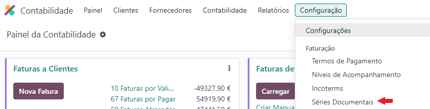

:show-content:

=================
Registo de Séries
=================

Para cada documento fiscal deve existir uma série única, que tem de ser comunicada à Autoridade Tributária e Aduaneira
de forma prévia à sua implementação.

Para poder registar uma série junto da AT precisa de cumprir certos requisitos. Veja aqui como o fazer.

.. raw:: html

    

        ─── ✦ ───
    

Configuração do utilizador
==========================

Para poder comunicar com a AT através de Odoo tem de inserir as credênciais de acesso. Para tal terá de aceder ao seu
utilizador Odoo e inserir os dados na aba **Portugal**

.. image:: series_registration/v17_ATcredentials.png
   :align: center

Deve garantir que em Odoo o utilizador tem permissões para fazer a comunicação de séries, mas também o login de acesso
na AT está atutorizado a fazer essa mesma comunicação.

Séries
======

Pode utilizar as séries que já são inseridas pela localização.

No entanto, se decidir que o prefixo da sua série vai incluir ano e/ou mês, deve ir duplicando a série anterior, para
que possa gerar documentos de correção contabilísticos nos períodos corretos, arquivando as anteriores quando deixarem
de ser necessárias.

Pode no entanto manter a mesma série e mudar só a sequência, arquivando a antiga, no entanto lembre-se que terá de ter
atenção redobrada se quiser efetuar correções no período correto. Pelo que duplicar a série é mais recomendado.

Deve ainda comunicar à AT o encerramento de uma série quando deixar de a utilizar.

Dentro de cada série pode inserir diversas informações, como:

   - **Nome**, que pode ser o que desejar
   - **Tipo**, pode escolher de uma lista de todos os tipos que são disponibilizados pela localização
   - **Empresa** da base de dados a que esse tipo de documentos está associado, esta opção é mais útil nos casos de empresas com ambiente multi empresa para que cada uma das suas empresas tenham séries e sequências diferentes
   - **Método de Origem**, método de comunicação em SAF-T

      - **Aplicação**, significa que vai ser O Odoo a emitir os documentos e o responsável por os comunicar em SAF-T
      - **Integração**, significa que este tipo de documentos foi emitido por outro sistema e só está a ser utilizado para inserir os dados em Odoo (por exemplo sistema POS externo) logo a comunicação em SAF-T é da responsabilidade do sistema emissor
      - **Manual/Reposição**, significa que os documentos já foram emitidos e comunicados anteriormente em SAF-T, mas por algum motivo (por exemplo avaria do servidor externo) não se encontram atualmente inseridos em Odoo, pelo que precisam de ser reinseridos. Não vai existir nova comunicação em SAF-T e os movimentos são só para reproduzir algo que já deveria de existir
   - **Sequência**, nome da sequência que está associada à série, é recomendado que a sequência tenha o mesmo nome da série, podendo acrescer o período para distinção

Outras informações são automaticamente preenchidas com base nas escolhas anteriores

   - **Secção SAF-T**, onde vai ser mencionado qual das secções do SAF-T vai conter os documentos da série específica, esse mapeamento já é feito pela localização Exo
   - **Usada**, mostra se a série já foi usada ou não

Como registar
=============
Para registar uma série válida junto da AT em Odoo, existem 2 processos. Registar uma nova, ou continuar uma série
documental já existente.

.. note::
    Se transitar de outro software o ideal é sempre criar uma nova série.
    A opção de manter séries só deve ser utilizada para os seguintes casos:

     - Transitou entre sistemas Odoo
     - Por dificuldades técnicas teve de registar a série primeiro na AT e só depois a vai usar no Odoo

    Para todos os outros cenários deve sempre usar uma nova série

Para ter acesso às Séries Documentais aceda à app **Faturação / Contabilidade** (dependendo respetivamente se tem versão
Community ou Enterprise do Odoo), vá ao menu de **Configuração** e no separador Faturação selecione a opção
**Séries Documentais**.

.. image:: fiscal_documents/v17_appInvoicingAccounting.png
   :align: center

Selecione o tipo de série que quer criar/importar e siga um dos métodos seguintes.

.. _invoicing_series_registration_new:

Nova Série
----------
Preencha o campo **Sequência** com o nome que quer dar à sequência e selecione **Criar e Editar**.

Vai abrir uma nova janela:

  - Deve ter a **Implementação** como **Sem lacunas**
  - Pode selecionar o **Prefixo** que pretende usar, na legenda pode ver algumas configurações tradicionais para inserir certos dados como ano (2 ou 4 dígitos), mês e dia

    .. tip::
        Não precisa de se preocupar com o Prefixo obrigatório da série que esse já é inserido de forma automática pela
        Localização PT+ Exo

    .. example::
        - Nas faturas é necessário ter FT, a localização já insere 'FT '
        - Nas notas de encomenda é necessário ter NE, a localização já insere 'NE '
        - etc.

  - Pode no **Tamanho da Sequência** inserir o **nº mínimo de dígitos** que pretende que a sequência tenha (se eventualmente tiver mais, aumenta de forma automática)
  - O **Próximo Número** na sequência deve ser 1

Guarde as alterações.

Isto vai configurar a sua sequência no Odoo, mas ainda falta comunicar a séria na AT.

.. important::
    No caso de estar a registar série documental de autofaturação, deve parar o processo neste ponto e concluir outras
    configurações antes de prosseguir

Para isso garanta que o campo **Código de Validação** está vazio e clique no botão **Registar** para iniciar o processo
de comunicação.

Vai aparecer uma nova janela onde deve indicar a **Data de Início Esperada**, tenha em atenção que:

   - Só vai poder emitir documentos com data posterior à constante neste campo
   - A data inserida não pode ser anterior ao dia atual em que está a fazer a comunicação

Clique no botão **Comunicar**.

A partir desde momento a série está comunicada e pode começar a emitir documentos.

.. important::
    No caso das **séries documentais relativas a transporte de bens** existe um passo extra.

    Vai reparar que tem um campo para **Filtro de Operações**, este campo permite configurar que operações vão ter
    acesso à série documental.

    .. seealso::

        :ref:`Saiba mais sobre Operações de inventário <invoicing_stock_operations>`

    Coloque as Operações que mais fizerem sentido para o tipo de documento, caso não o faça não vai coneguir ver a
    série documental quando for tentar gerar o documento.

    .. image:: series_registration/v17_operations.png
        :align: center

Manter Série
------------
Preencha o campo Sequência com o nome que quer dar à sequência e selecione Criar e Editar.

.. image:: series_registration/v17_keepSerie1.png
   :align: center

Vai abrir uma nova janela:

  - Deve ter a **Implementação** como **Sem lacunas**
  - Pode selecionar o **Prefixo** que pretende usar, na legenda pode ver algumas configurações tradicionais para inserir certos dados como ano (2 ou 4 dígitos), mês e dia

    .. tip::
        Não precisa de se preocupar com o Prefixo obrigatório da série que esse já é inserido de forma automática pela
        Localização PT+ Exo

    .. example::
        - Nas faturas é necessário ter FT, a localização já insere 'FT '
        - Nas notas de encomenda é necessário ter NE, a localização já insere 'NE '
        - etc.

  - Pode no **Tamanho da Sequência** inserir o **nº mínimo de dígitos** que pretende que a sequência tenha (se eventualmente tiver mais, aumenta de forma automática)
  - O **Próximo Número** na sequência deve ser 1

Guarde as alterações.

.. image:: series_registration/v17_keepSerie2.png
   :align: center

Isto vai configurar a sua sequência no Odoo, mas ainda não está completo pois falta estabelecer a relação com a séria na AT.

Para isso preencha o campo **Código de Validação** com o código que está disponível na AT, o botão **Registar** muda
para **Sincronizar**, clique nele para poder continuar a utilizar a sua série anterior.

.. important::
    No caso das **séries documentais relativas a transporte de bens** existe um passo extra.

    Vai reparar que tem um campo para **Filtro de Operações**, este campo permite configurar que operações vão ter
    acesso à série documental.

    .. seealso::

        :ref:`Saiba mais sobre Operações de inventário <invoicing_stock_operations>`

    Coloque as Operações que mais fizerem sentido para o tipo de documento, caso não o faça não vai coneguir ver a
    série documental quando for tentar gerar o documento.

    .. image:: series_registration/v17_operations.png
        :align: center

.. seealso::
    :doc:`Consulte as nossas FAQs sobre comunicação de Séries <../faq/series_communication>`
