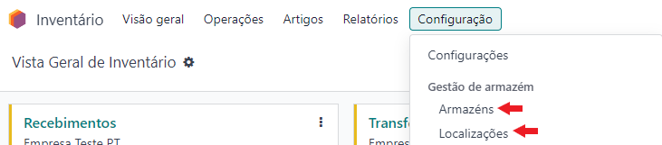
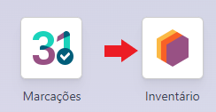
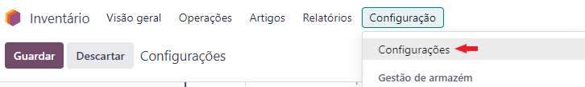
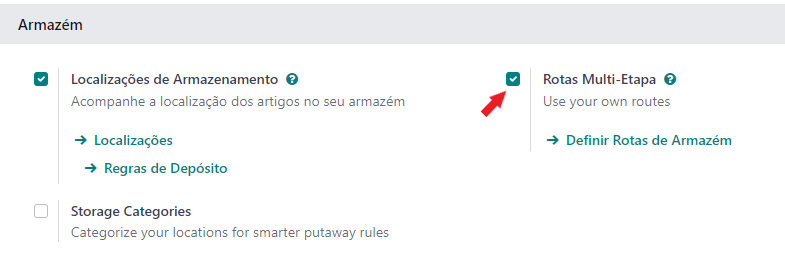
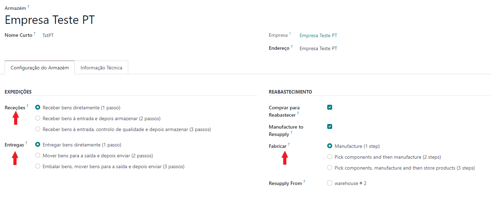
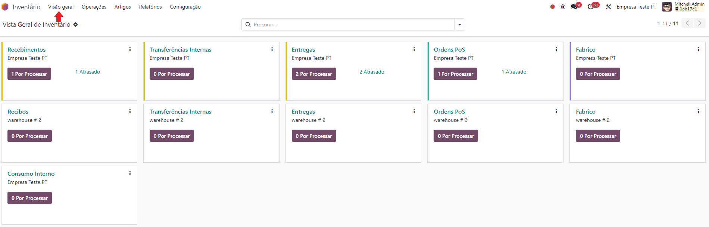
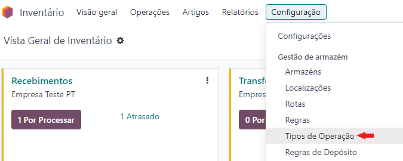
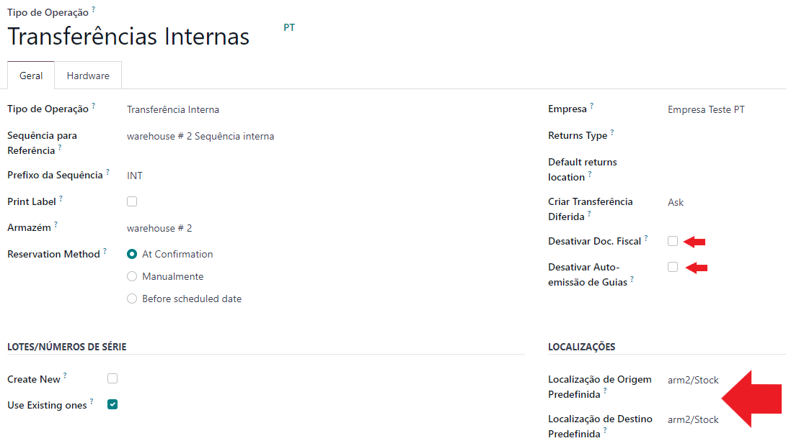

:nosearch:

=====
Stock
=====
A forma como o stock é tratado em Odoo pode variar bastante pelo que é aconselhado estudar o tema antes de o começar a
implementar na sua organização.

A **Localização PT+** adiciona documentação legal e processos exigidos pela AT de forma a facilitar a integração e
operacionalização para organizações a atuar em Portugal.

Vamos começar por ver algumas considerações básicas sobre o Processo em Odoo para depois podermos passar à
operacionalização dos movimentos.

.. raw:: html

    

        ─── ✦ ───
    

Artigos
=======
Em primeiro lugar é preciso perceber como são tratados os artigos em Odoo. Existem algumas informações chave que podem
facilitar imenso a forma como interage com o Odoo e os requisitos necessários, para que o funcionamento decora dentro
da normalidade.

.. tip::
    Logo no topo da página, por baixo do nome pode encontrar a funcionalidade do artigo:

    - **Pode ser Vendido**, vai estar disponível para vender
    - **Pode ser Comprado**, vai estar disponível para compras
    - **Recorrente**, vai estar disponível para subscrições permitindo ter períodos de recorrência
    - **Pode ser Gasto**, vai estar disponível para utilização na app de Despesas

    .. image:: stock/v17_stock_products01.png
        :align: center

.. tip::
    Existem muitos **Tipos de Artigos** disponíveis em Odoo, no entanto só existem 3 principais:

    - **Serviço**
    - **Consumível**, não é feito controlo de stock
    - **Artigo Armazenável**, é feito controlo de stock

    .. image:: stock/v17_stock_products02.png
        :align: center

.. important::
    De notar que existe uma grande diferença entre **Tipo de Artigo** e **Categoria Fiscal**:

    - **Tipo de Artigo**, é a designação que o Odoo usa para saber se vai o não controlar o stock para os artigos
    - **Categoria Fiscal** é a classificação que é atribuída em Portugal aos tipos de bens

    .. image:: stock/v17_stock_products03.png
        :align: center

    .. example::
        Pode ter um artigo onde o Tipo de Artigo seja Consumível, mas a Categoria Fiscal seja Mercadorias, ou seja,
        perante a lógica portuguesa é uma mercadoria, mas perante o Odoo é um consumível porque não quer controlar o
        stock deste artigo.

.. tip::
    Existem 2 tipos de **Política de Faturação** que depois se subdividem mediante o que são:

    - Bens físicos

        - **Quantidades Encomendadas**, assim que exista uma Compra/Venda já pode gerar a fatura
        - **Quantidades Entregues**, só depois de confirmada a receção dos bens pode gerar a fatura (maior controlo)

        .. image:: stock/v17_stock_products04.png
            :align: center

    - Serviços

        - **Pré-pago/Preço Fixo**, assim que exista uma Compra/Venda já pode gerar a fatura
        - **Baseado em Timesheet**, só depois de registar consumo de tempos é que vai poder faturar
        - **Baseado em Milestones**, só depois de cumpridas as metas vai poder faturar
        - **Quantidades Entregues (Manual)**, pode preencher manualmente o consumo e ir faturando

        .. image:: stock/v17_stock_products05.png
            :align: center

    .. important::
        Ao confirmar a Nota de Encomenda (NE), a política de faturação do artigo vai ficar assossiada à linha da NE por
        motivos de rastreabilidade de documentos.

        Por esse motivo, depois de confirmada a NE já não pode mudar a política de faturação do artigo para essa NE, mas
        pode mudar para NEs seguintes.

        No entanto isto pode gerar erros de faturação, pelo que é altamente recomendado classificar muito bem este
        aspeto do artigo antes de prosseguir com a sua utilização.

.. tip::
    A categoria do artigo é uma funcionalidade Odoo que permite que o artigo herde características na eventualidade de
    um determinado campo não estar preenchido, nomeadamente no que diz respeito a questões contabilísticas.

    Também é nestas categorias que vai poder inserir a estratégia de remoção de artigos do inventário, bem como a
    política de valorização do inventário para o artigo

    Pode criar subcategorias que lhe permitam melhor gerir os seus artigos pois as categorias também podem herdar
    características de categorias ascendentes

    .. image:: stock/v17_stock_products06.png
        :align: center

.. tip::
    Se pretender ter rastreabilidade nos seus artigos é fundamental que a mesma esteja devidamente configurada, para tal
    deve ir às configurações de inventário e ativar a funcionalidade

    Para isso aceda à app **Inventário** e em seguida vá ao menu :menuselection:`Configuração --> Configurações` no
    separador de **Rastreabilidade** Selecione a opção **Lotes & Números de Série**

    .. image:: stock/v17_stock_products07.png
        :align: center

    .. image:: stock/v17_stock_products08.png
        :align: center

    .. image:: stock/v17_stock_products09.png
        :align: center

    Em seguida deve ir ao artigo e na aba do **Inventário** escolher qual a política a associar ao produto:

    - **Sem rastreio**
    - **Por lotes**, vai permitir consumos parciais das quantidades
    - **Por número de série único**, vai obrigar a consumo de uma e uma só unidade

    .. image:: stock/v17_stock_products10.png
        :align: center

    .. danger::
        Em Odoo é utilizado o mesmo campo para **Lotes** e **Nº de Série** pelo que só pode ter um ativo por artigo

Armazéns e Localizações
=======================
Em Odoo um **Armazém** é um local físico separado de outros. Uma **Localização** é uma zona dentro de um armazém, pelo
que cada armazém pode ter diversas localizações (e sublocalizações), mas uma localização só pode pertencer a um
armazém.

.. note::
    Pode conjugar estes conceitos para melhor reproduzir o seu fluxo em Odoo

.. danger::
    Para que seja considerado stock, um artigo tem de estar numa localização que esteja associada ao stock do armazém.
    No caso de estar na raíz do armazém ou noutra localização não dependente de stock, não vai ser considerado.

Para aceder às configurações de ambos deve na app de **Inventário** aceder ao menu :menuselection:`Configuração --> Armazéns`
e ao menu :menuselection:`Configuração --> Localizações`

Pode optar por utilizar as rotas pré-definidas do Odoo. Estas rotas podem ser **Simples** ou **Multi-Etapa**. Caso
pretenda usar as rotas multi-etapa, deve ativar a opção correspondente.

Para isso, aceda à app **Inventário** e em seguida vá ao menu :menuselection:`Configuração --> Configurações` no
separador de **Armazém** Selecione a opção **Rotas Multi-Etapa**

Em seguida, pode ir à configuração do armazém e decidir em quantos passos quer fazer as seguintes rotas:

- Receção
- Produção
- Entrega

Operações
=========
As **Rotas** são compostas por **Operações**, ou seja, cada etapa de uma rota vai ser operação, estas Operações vão
estar visíveis no menu **Visão Geral** da app **Inventário**

.. tip::
    As **Operações** principais vão ser repetidas para cada armazém, mas depois pode criar operações específicas para
    cada armazém conforme as necessidades.

    Se existir alguma Operação que não vá utilizar, pode arquivar a mesma para que não esteja disponível aos
    utilizadores

Pode configurar as Operações para que se adquem ao seu fluxo e âs suas necessidades, para isso aceda à app de
**Inventário** e vá ao menu :menuselection:`Configuração --> Gestão de armazém --> Tipos de Operações` e selecione a
operação a modificar

Dependendo do tipo de operação, as informações que pode alterar são ligeiramente diferentes, no entanto chamamos a
atenção para:

- **Desativar Doc. Fiscal**, para as operações que não o exijam, pode desativar a obrigatoriedade de associar uma série documental a esta operação
- **Desativar Auto-emissão de Guias** não sendo obrigatório pode cancelar a emissão automática de guias para certas operações, no entanto mantém a possibilidade de fazer a emissão manual das mesmas em qualquer momento
- **Localizações**, nestes campos pode estipular as localizações poe defeito a usar quando esta operação é selecionada, no entanto pode movimento a movimento alterar as mesmas

Consumo Interno em Odoo
-----------------------
**É suportado nativamente pelo Odoo**, no entanto o consumo interno de artigos que foram comprados para stock, não é
intuitivo de se reproduzir, por esse motivo a Exo Software desenvolveu uma metodologia para simplificar este processo,
bem como a possibilidade de reportar esses mesmos custos a projetos específicos.

`Aprenda como e marque uma formação com os nossos consultores <https://exosoftware.pt/en/appointment>`_

Como gerar as guias
===================
.. FIXME : guias - fazer

Documentação em breve

Relatórios de Stock
===================
Documentação em breve
