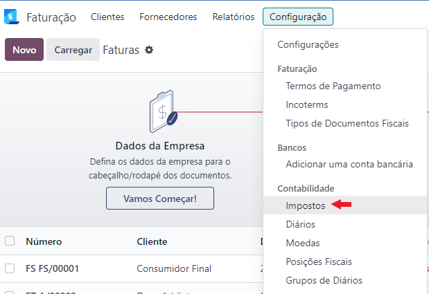
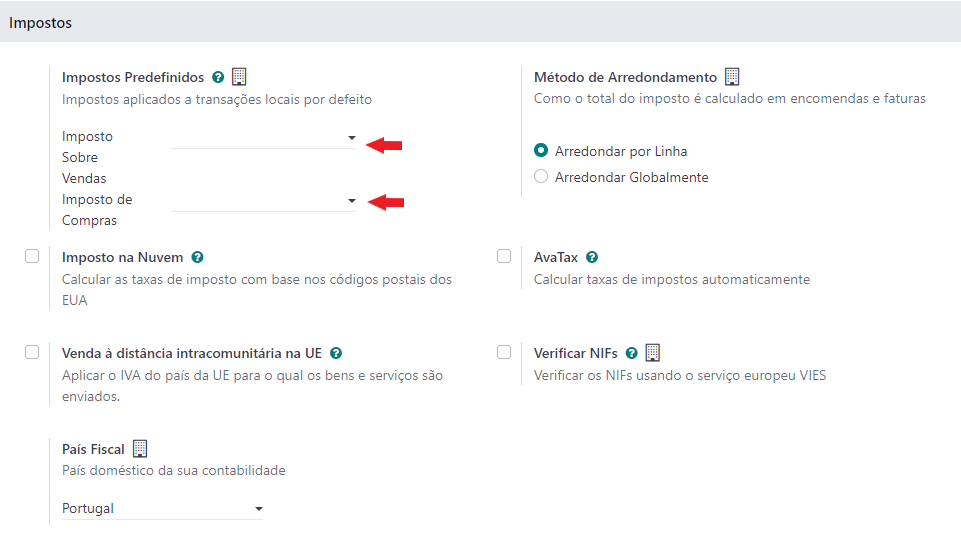
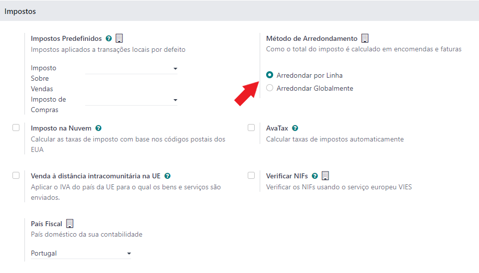
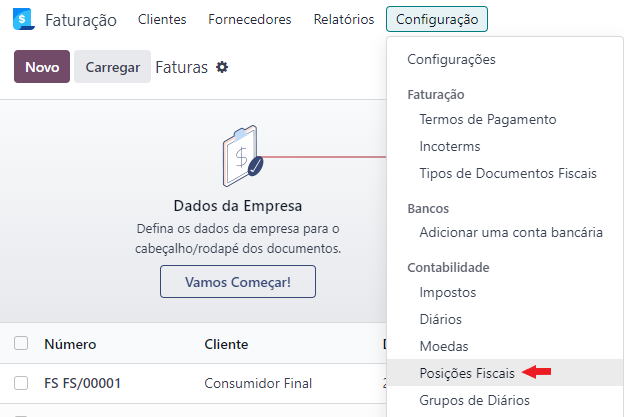

:show-content:

========
Impostos
========

Criar impostos
==============
Ao selecionar o país da empresa em Odoo um plano de impostos base já é instalado. É recomendado instalar uma localização na app **Apps** e procurar módulos de impostos associados ao país.

No caso de se instalar a **Localizção PT+ Exo**, muitos mais impostos e grupos de impostos, são instalados para que se cumpram as regras base da legislação portuguesa e seja feita a devida ligação aos modelos de documentos da localização.

.. note::
   Para muitos impostos existem diversas exceções, algumas empresas preferem ter sempre todas as exceções ativas outras só querem que existam as que estão em uso. Por esse motivo para alguns tipos de impostos só existe a regra e não as exceções, no entanto essas exceções estão previstas.

   Para que fiquem disponíveis:

   - Deve começar por ver se o imposto em causa já existe e apenas está **Inativo/Arquivado**. Neste caso, basta ativar para ficar disponível.
   - Se ainda não existir, basta duplicar o imposto base mais parecido, aplicar a exceção e gravar com um nome mais detalhado para mais fácil procura na utilização.

.. important::
   Fica à responsabilidade do cliente e do seu contabilista fazer este processo

.. important::
   **Criação de impostos diretamente nos formulários**

   Apesar de ser possível criar impostos diretamente em formulários onde são utilizados, **esta prática é altamente desaconselhável**.

   Os impostos devem ser devidamente configurados e mapeados antes da sua utilização, para que cumpram todas as regras exigidas, surjam nos mapas devidos e não deêm origem a multas ou coimas por má utilização.

Onde criar
----------
Para aceder ao menu de impostos instalados basta ir à app **Faturação/Contabilidade** (dependendo respetivamente se tem versão Community ou Enterprise do Odoo), no menu :menuselection:`Configuração --> Contabilidade --> Impostos`

.. image:: taxes/v17_appInvoicingAccounting.png
  :align: center

.. example::
    **IVA N/S:**

    Existem diversos motivos para não se aplicar IVA, para cada motivo, deve ser duplicado o IVA N/S, ir à tab Opções Avançadas e alterar o que precisa. Depois é só gravar com um nome diferente.

.. tip::
   **Grupo de Imposto**

   Porque existem diversas contas contabilísticas no Plano de Contas que registam secções diferentes de impostos, é necessário que existam impostos diferentes para diversas situações com a mesma percentagem de imposto. Por esse motivo utilizam-se os grupos de impostos para agrupar impostos com as mesmas taxas e tipo, logo é importante que o correto grupo de impostos esteja aplicado ao imposto.

   Pode ver-se essa informação na aba **Opções Avançadas** do imposto no campo **Grupo de Imposto**

   O imposto vai herdar o **Género** do **Grupo de Imposto** e em seguida permitir completar o resto dos campo

.. tip::
   **Grelha de Imposto**

   Neste campo são registadas as **etiquetas de impostos** que vão permitir o mapeamento nos diversos modelos de declarações fiscais

.. tip::
   **Opções Avançadas**

   campo **País** - Empresas neste país vão poder ver este imposto para utilização

   campo **País/Região** - Local onde vai ser pago o imposto

Impostos predefinidos
=====================
Na app **Faturação/Contabilidade** (dependendo respetivamente se tem versão Community ou Enterprise do Odoo), no menu :menuselection:`Configuração --> Configurações` pode ser escolhido qual é o imposto predefinido a aplicar em Vendas e Compras, neste caso se nada for dito no produto ou no parceiro, este será o imposto a ser aplicado.

.. image:: taxes/v17_appInvoicingAccounting.png
  :align: center

No mesmo local também pode logo selecionar se quer que o **arredondamento de impostos** seja aplicado linha a linha ou ao documento todo.

Localização Fiscal
==================
Independentemente do tipo de imposto aplicado a produtos ou serviços, **a Posição Fiscal associada a cada parceiro, sobrepõe-se**. Estas posições fiscais já estão configuradas na Localização PT+ Exo, basta associar ao parceiro que o mapeamento automático trata das conversões.

.. important::
   **Criação de posições fiscais diretamente nos formulários**

   Apesar de ser possível criar posições fiscais diretamente em formulários onde são utilizadas, **esta prática é altamente desaconselhável**. As posições fiscais devem ser devidamente configuradas e mapeadas antes da sua utilização.

Onde criar
----------
Na app Faturação/Contabilidade (dependendo respetivamente se tem versão Community ou Enterprise do Odoo), no menu :menuselection:`Configuração --> Contabilidade --> Posições Fiscais`, pode ver todas as opções disponíveis. **Não deve alterar as que existem** e se tiver necessidade de criar na nova posição, deve duplicar uma das existentes e fazer as devidas alterações. Depois é só gravar com outro nome.

.. image:: taxes/v17_appInvoicingAccounting.png
  :align: center

Motivos de isenção de IVA
=========================

.. seealso::
    Estes são os motivos aceites pela AT para isenção de IVA
        :download:`Motivos de isenção de IVA <taxes/motivos_isencao_iva.pdf>`
