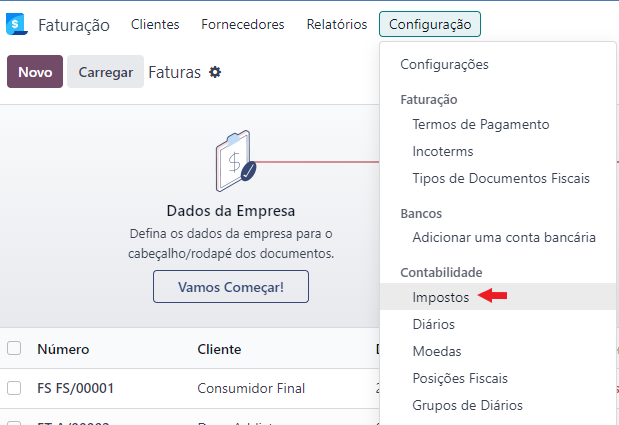
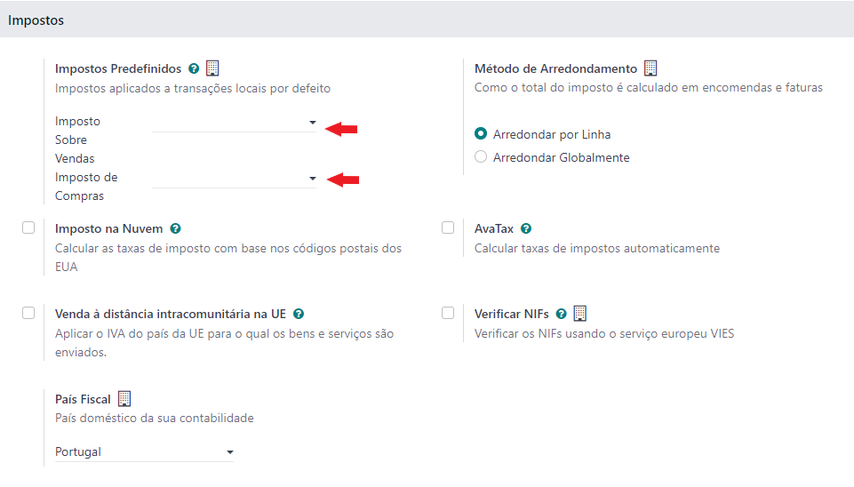
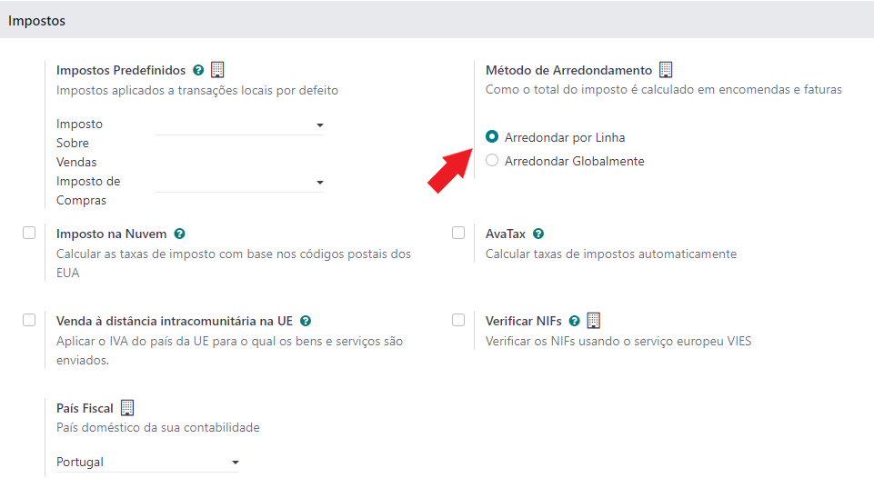
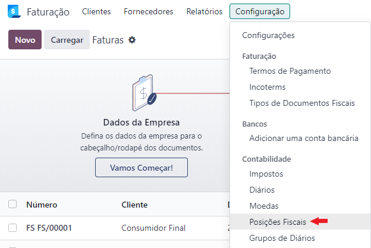

:show-content:

========
Impostos
========
Nesta página vai poder encontrar diversa informação sobre impostos em Odoo, e mais propriamente os impostos da
**Localização PT+**

Ao contrário de outros softwares, a **Localização PT+** tenta dar ao utilizador um conjunto sólido de impostos
pré-configurados, para que seja mais simples de utilizar o seu Odoo e garantir a conformidade com as normas portuguesas.

Também se procura que diversas posições fiscais estejam já incluídas e corretamente mapeadas para agilizar a interação
com parceiros comerciais de outros países

.. raw:: html

    

        ─── ✦ ───
    

Criar impostos
==============
Ao selecionar o país da empresa em Odoo um plano de impostos base já é instalado. É recomendado instalar uma localização
na app **Apps** e procurar módulos de impostos associados ao país.

No caso de se instalar a **Localizção PT+ Exo**, muitos mais impostos e grupos de impostos, são instalados para que se
cumpram as regras base da legislação portuguesa e seja feita a devida ligação aos modelos de documentos da localização.

.. note::
    Para muitos impostos existem diversas exceções, algumas empresas preferem ter sempre todas as exceções ativas outras
    só querem que existam as que estão em uso. Por esse motivo para alguns tipos de impostos só existe a regra e não as
    exceções, no entanto essas exceções estão previstas.

    Para que fiquem disponíveis:

    - Deve começar por ver se o imposto em causa já existe e apenas está **Inativo/Arquivado**. Neste caso, basta ativar para ficar disponível.
    - Se ainda não existir, basta duplicar o imposto base mais parecido, aplicar a exceção e gravar com um nome mais detalhado para mais fácil procura na utilização.

    .. example::
        **IVA N/S:**

        Existem diversos motivos para não se aplicar IVA, para cada motivo, deve ser duplicado o IVA N/S, ir à tab
        Opções Avançadas e alterar o que precisa. Depois é só gravar com um nome diferente.

.. important::
    Fica à responsabilidade do cliente e do seu contabilista fazer este processo

.. important::
    **Criação de impostos diretamente nos formulários**

    Apesar de ser possível criar impostos diretamente em formulários onde são utilizados, **esta prática é altamente desaconselhável**.

    Os impostos devem ser devidamente configurados e mapeados antes da sua utilização, para que cumpram todas as regras
    exigidas, surjam nos mapas devidos e não deêm origem a multas ou coimas por má utilização.

Onde criar
----------
Para aceder ao menu de impostos instalados basta ir à app **Faturação/Contabilidade** (dependendo respetivamente se tem
versão Community ou Enterprise do Odoo), no menu :menuselection:`Configuração --> Contabilidade --> Impostos`

.. tip::
    **Conta**

    Neste campo definimos a conta do SNC onde vai ser registado o movimento

    Se ficar vazio vai ser aplicada a conta definida no artigo ou na sua caregoria

.. tip::
    **Grelha de Imposto**

    Neste campo são registadas as **etiquetas de impostos** que vão permitir o mapeamento nos diversos modelos de
    declarações fiscais

    Saiba mais sobre  :ref: `etiquetas de impostos <taxes_tags>`

.. tip::
    **Grupo de Imposto**

    Porque existem diversas contas contabilísticas no Plano de Contas que registam secções diferentes de impostos, é
    necessário que existam impostos diferentes para diversas situações com a mesma percentagem de imposto. Por esse
    motivo utilizam-se os grupos de impostos para agrupar impostos com as mesmas taxas e tipo, logo é importante que o
    correto grupo de impostos esteja aplicado ao imposto.

    Pode ver-se essa informação na aba **Opções Avançadas** do imposto no campo **Grupo de Imposto**

    O imposto vai herdar o **Género** do **Grupo de Imposto** e em seguida permitir completar o resto dos campos

.. tip::
    **Opções Avançadas**

    campo **País** - Empresas neste país vão poder ver este imposto para utilização

    campo **País/Região** - Local onde vai ser pago o imposto

Impostos predefinidos
=====================
Na app **Faturação/Contabilidade** (dependendo respetivamente se tem versão Community ou Enterprise do Odoo), no menu
:menuselection:`Configuração --> Configurações` pode ser escolhido qual é o imposto predefinido a aplicar em Vendas e
Compras, neste caso se nada for dito no produto ou no parceiro, este será o imposto a ser aplicado.

No mesmo local também pode logo selecionar se quer que o **arredondamento de impostos** seja aplicado linha a linha ou
ao documento todo.

Posição Fiscal
==============
Independentemente do tipo de imposto aplicado a produtos ou serviços, **a Posição Fiscal associada a cada parceiro, sobrepõe-se**.
Estas posições fiscais já estão configuradas na Localização PT+ Exo, basta associar ao parceiro que o mapeamento
automático trata das conversões.

.. important::
    **Criação de posições fiscais diretamente nos formulários**

    Apesar de ser possível criar posições fiscais diretamente em formulários onde são utilizadas, **esta prática é altamente desaconselhável**.
    As posições fiscais devem ser devidamente configuradas e mapeadas antes da sua utilização.

Onde criar
----------
Na app Faturação/Contabilidade (dependendo respetivamente se tem versão Community ou Enterprise do Odoo), no menu
:menuselection:`Configuração --> Contabilidade --> Posições Fiscais`, pode ver todas as opções disponíveis. **Não deve alterar as que existem**
e se tiver necessidade de criar uma nova posição, deve duplicar uma das existentes e fazer as devidas alterações.
Depois é só gravar com outro nome.

Motivos de isenção de IVA
=========================

.. seealso::
    Estes são os motivos aceites pela AT para isenção de IVA
        :download:`Motivos de isenção de IVA <taxes/motivos_isencao_iva.pdf>`

.. _taxes_tags:

Etiquetas de Impostos
=====================

A **Exo Software** disponibiliza muitos impostos pré-configurados, no entanto, cada cliente é um caso particular e como
tal deve juntamente com o seu contabilista garantir o correto preenchimento das etiquetas de impostos para a sua
realidade

Para facilitar esse objetivo, explicamos a nossa nomenclaruta de etiquetas de impostos para que fique mais tranquilo no
manusamento do seu Odoo e garanta que todas as suas declarações saiam com os valores corretos

.. important::
    Apesar de poder criar as suas próprias etiquetas, as mesmas não vão ser utilizadas pelas nossas metodologias de
    preenchimento de declarações pelo que não explicaremos o processo

    Apenas sugerimos que utilize as que já estão disponíveis, e se precisar de mais faça um pedido aos nossos serviços

    Também informamos que só deve ter uma linha para a base, mas pode ter várias linhas para impostos desde que a soma
    das percentagens não ultrapasse os 100%

As nossas etiquetas seguem sempre a seguinte nomenclatura

**Texto 1 [Texto 2] Texto 3**, onde cada um dos textos tem a seguinte informação

- **Texto 1** identifica a declaração a que diz respeito a etiqueta
- **Texto 2** encontra-se sempre dentro dos parênteses retos e mostra as coordenadas específicas dentro da declaração para o qual o valor vai ser utilizado

    - Para ajudar na identificação utilizados algumas letras e simbolos
    - **Q** significa que é um **quadro**
    - **L** significa que é uma **linha**
    - **C** significa que é um **campo**
    - Por vezes pode existir um **CMP** ou **VND** após o número de um campo, isto significa que o mesmo é usado em cálculos intermédios de **Compras** e **Vendas** respetivamente
    - Um **-** representa que estamos a seguir um caminho entre coordenadas, por exemplo, Q03-L01 seria quadro 3 > linha 1
    - Um **|** representa que o valor usado para 2 campos, por exemplo, Q08-C35|C37 seria quadro 8 > campo 35 e também quadro 8 > campo 37
- **Texto 3** nem sempre existe, mas quando existe representa um código (**CD**) do campo relativo à coordenada a ser preenchido
