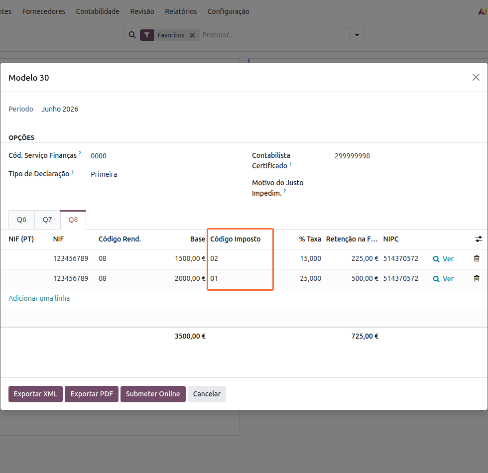
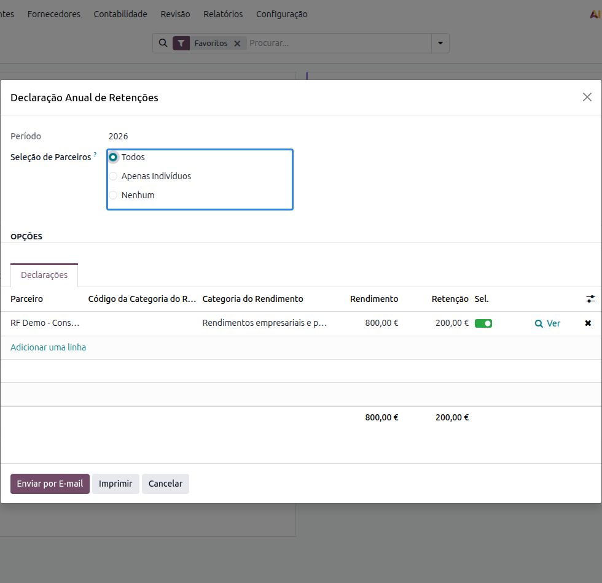

:nosearch:

=================================
Declarações de Retenções na Fonte
=================================
As retenções na fonte que efetua aos seus fornecedores e prestadores de serviços têm de ser
entregues à Autoridade Tributária e declaradas em vários momentos do ano. A **Localização PT+**
gera as quatro declarações a partir dos lançamentos contabilísticos, sem que tenha de recolher
valores à mão.

.. raw:: html

    

        ─── ✦ ───
    

.. list-table::
   :header-rows: 1

   * - Declaração
     - Diz respeito a
     - Quando se entrega
   * - Declaração Mensal de Retenções
     - Todas as retenções efetuadas no mês, separadas entre residentes e não residentes
     - Até ao dia 20 do mês seguinte
   * - Modelo 10
     - Rendimentos e retenções de **residentes**
     - Até ao final de janeiro do ano seguinte
   * - Modelo 30
     - Rendimentos pagos a **não residentes**
     - Até ao final do segundo mês seguinte ao pagamento
   * - Declaração de rendimentos ao titular
     - Comprovativo entregue a cada titular dos rendimentos
     - Até ao dia 20 de janeiro do ano seguinte

.. important::
    Estas declarações fazem parte da oferta de **faturação**: não é necessário ter a
    contabilidade PT+ instalada para as emitir.

Todas se encontram em :menuselection:`Faturação / Contabilidade --> Relatórios`, no bloco
**Rendimentos e Retenções**.

.. image:: withholding_statements/v19_wht_stat_menu.png
   :align: center

Configuração dos impostos de retenção
=====================================
As declarações não inventam informação: cada valor que aparece num quadro é lido dos
**impostos de retenção** usados nos documentos. Se um campo do imposto estiver por preencher, a
declaração ou não consegue classificar o rendimento, ou classifica-o mal.

Abra cada imposto de retenção em :menuselection:`Configuração --> Impostos`, no separador
:guilabel:`Opções Avançadas`, e confirme os campos abaixo.

.. image:: withholding_statements/v19_wht_stat_tax_config.png
   :align: center

.. list-table::
   :header-rows: 1

   * - Campo no imposto
     - Onde é usado
   * - :guilabel:`Tipo de Retenção`
     - Distingue IRS, IRC e Imposto do Selo em todas as declarações
   * - :guilabel:`Código da RF`
     - Rubrica da **Declaração Mensal**
   * - :guilabel:`Tipo de Rendimento da RF`
     - **Modelo 10**, Quadro 05, campo 04
   * - :guilabel:`Tipo de Rendimento da RF (OCDE)`
     - **Modelo 30**, Quadro 08, campo 35
   * - :guilabel:`Regime de Tributação da RF`
     - **Modelo 30**, Quadro 08, campo 36

.. warning::
    Sempre que um destes campos estiver em falta, a declaração avisa-o e indica a linha, o
    documento e o imposto em causa, para que possa corrigir a configuração antes de entregar.

O :guilabel:`Regime de Tributação da RF` merece atenção especial nos pagamentos a não
residentes: é ele que distingue uma retenção às taxas internas (código 01) de uma retenção ao
abrigo de uma convenção para evitar a dupla tributação (código 02), entre outros regimes.

.. note::
    Cada parceiro tem de ter o **país** preenchido na ficha. É o país que separa residentes de
    não residentes e, portanto, o que decide se um rendimento entra no Modelo 10 ou no Modelo 30.

Declaração Mensal de Retenções
==============================
Reúne as retenções a entregar num mês e serve de base à guia de pagamento.

Abra :menuselection:`Relatórios --> Declaração Mensal`, escolha o :guilabel:`Período` e o
:guilabel:`Tipo de Retenção`.

.. image:: withholding_statements/v19_wht_stat_monthly_options.png
   :align: center

O :guilabel:`Tipo de Retenção` determina o tipo de declaração e permite emitir as duas a partir
da mesma origem:

- **Retenção de Residentes**: parceiros com NIF português
- **Retenção de Não Residentes**: os restantes

Ao carregar em :guilabel:`Calcular`, obtém as linhas agrupadas por zona (Continente, Açores ou
Madeira, conforme a morada do parceiro) e por rubrica. Pode exportar o **PDF** para arquivo e o
**XML** para submissão.

Notas de crédito lançadas noutro período
----------------------------------------
A retenção é devida no período da fatura que lhe deu origem. Quando uma nota de crédito é
lançada num mês diferente do da fatura que corrige, o valor deixa de estar no período certo: a
declaração do mês da fatura ficou por corrigir e a do mês da nota de crédito fica com um valor
que não lhe pertence, podendo até ficar negativa.

A declaração deteta essas situações e avisa-o, indicando cada nota de crédito e a fatura
correspondente, com as respetivas datas.

.. image:: withholding_statements/v19_wht_stat_monthly_warning.png
   :align: center

O aviso aparece nos dois sentidos:

- **Lançadas num período posterior, mas devidas neste**: notas de crédito de meses seguintes que
  pertencem ao período que está a preparar, e que deve acrescentar;
- **Incluídas aqui, mas devidas no período da respetiva fatura**: notas de crédito que a
  declaração apanhou, mas que pertencem a um período anterior, e que deve retirar.

.. important::
    Nestes casos, o período da fatura tem de ser entregue de novo como **declaração de
    substituição**. As linhas da declaração são editáveis, para que possa fazer o acerto antes
    de exportar.

.. seealso::
    Esta situação só se coloca quando a retenção é calculada na **fatura**. Com a
    :doc:`retenção no pagamento <withholding_tax>`, o valor só é contabilizado quando é
    efetivamente retido, e por isso entra sempre no período correto.

Modelo 10
=========
Declara os rendimentos sujeitos a IRS pagos a residentes, bem como os rendimentos sujeitos a
retenção de IRC, e as respetivas retenções, com exceção dos que são declarados na declaração
mensal de remunerações.

Abra :menuselection:`Relatórios --> Modelo 10` e escolha o ano. Os valores aparecem organizados
pelos quadros do modelo oficial: o **Q4** com o resumo e o **Q5** com o detalhe por titular.

.. image:: withholding_statements/v19_wht_stat_mod10.png
   :align: center

Além do PDF e do ficheiro para submissão, esta declaração pode ser entregue diretamente a partir
do Odoo (ver `Submissão à AT`_).

Modelo 30
=========
Declara os rendimentos considerados obtidos em território português que foram pagos ou colocados
à disposição de entidades **não residentes**. É uma obrigação declarativa: não gera valor a
pagar, e existe para evitar a dupla tributação.

Abra :menuselection:`Relatórios --> Modelo 30` e escolha o período. O **Q8** contém uma linha
por titular e tipo de rendimento.

Cada linha traz o NIF do beneficiário, o :guilabel:`Código Rend.` (campo 35), a base, o
:guilabel:`Código Imposto` (campo 36), a taxa aplicada e o valor retido. O
:guilabel:`Código Imposto` vem do :guilabel:`Regime de Tributação da RF` do imposto usado em
cada documento, pelo que dois documentos do mesmo titular com regimes diferentes produzem duas
linhas distintas, como no exemplo acima: 15% ao abrigo de uma convenção (02) e 25% às taxas
internas (01).

.. note::
    O campo :guilabel:`Tipo de Declaração` permite indicar se está a entregar a primeira
    declaração do período ou uma declaração de substituição.

Declaração de rendimentos ao titular
====================================
No início de cada ano tem de entregar a cada titular um comprovativo dos rendimentos que lhe
pagou e das retenções que lhe fez. Esta declaração produz esse documento a partir dos mesmos
lançamentos que alimentam o Modelo 10.

Abra :menuselection:`Relatórios --> Declaração Anual` e escolha o ano.

Obtém uma linha por titular e categoria de rendimento. A partir daqui pode:

- **imprimir** as declarações, para entrega em papel;
- **enviar por email** a cada titular, usando o endereço da respetiva ficha.

O campo :guilabel:`Seleção de Parceiros` permite restringir o envio, com as opções
:guilabel:`Todos`, :guilabel:`Apenas Indivíduos` e :guilabel:`Nenhum`. Como estas declarações se
destinam a pessoas singulares, o habitual é escolher :guilabel:`Apenas Indivíduos` e afinar
depois a seleção linha a linha, na coluna :guilabel:`Sel.`.

Submissão à AT
==============
O **Modelo 10** e o **Modelo 30** podem ser submetidos diretamente do Odoo, através do
webservice das **Obrigações Acessórias** da Autoridade Tributária, sem passar pelo Portal das
Finanças. Depois de calcular a declaração, tem disponíveis as operações de **validação**,
**submissão**, **consulta** e obtenção do **comprovativo** e da **referência de pagamento**.

Para isso são necessárias as credenciais do **contabilista certificado** com poderes
declarativos para o contribuinte. O comprovativo e a referência de pagamento podem ser enviados
por email para os destinatários que indicar.

.. note::
    A **Declaração Mensal** e a **Declaração de rendimentos ao titular** não têm submissão por
    webservice: a primeira é exportada em XML para entrega no Portal das Finanças, a segunda
    destina-se ao titular e não à Autoridade Tributária.
