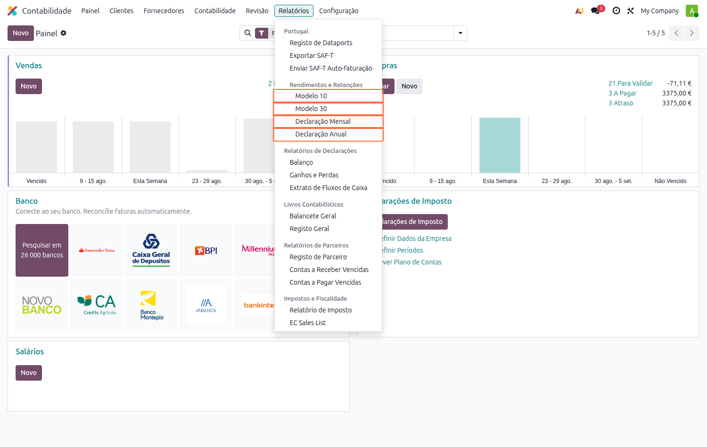
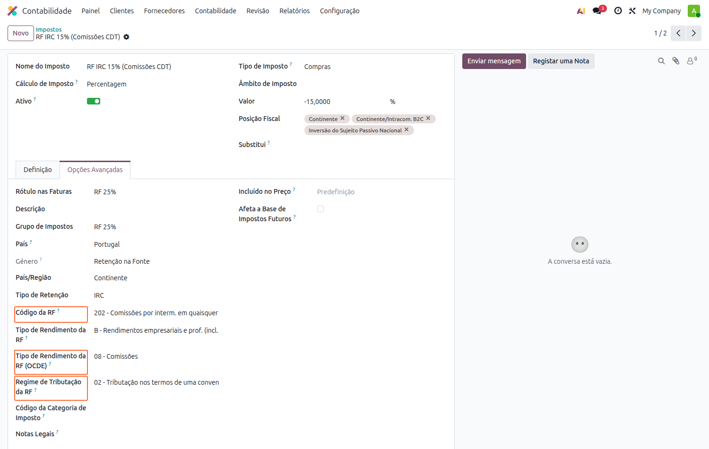
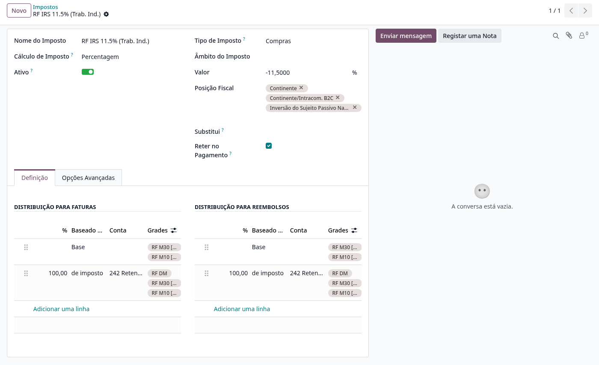
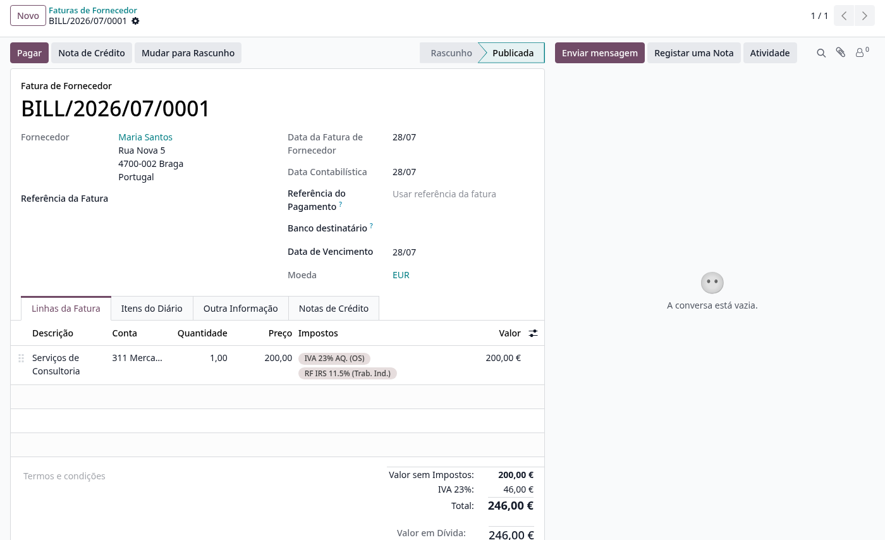
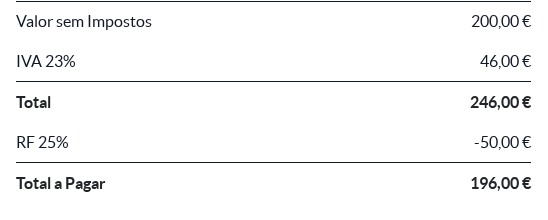
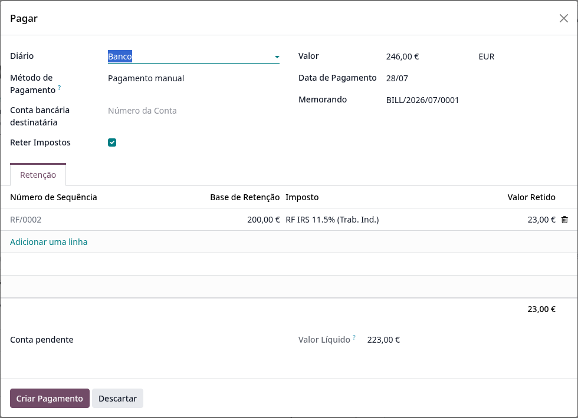
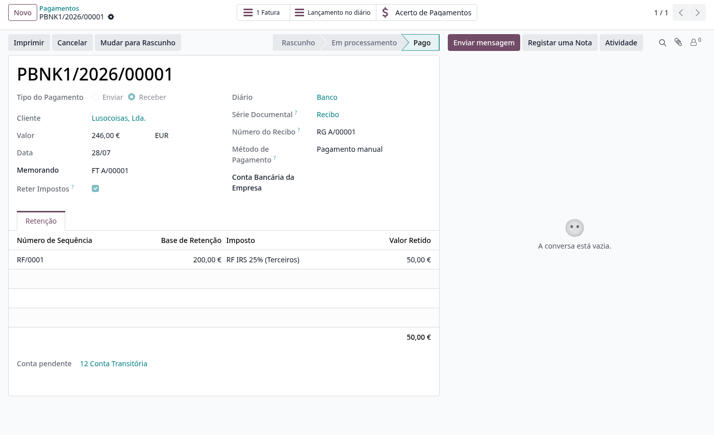
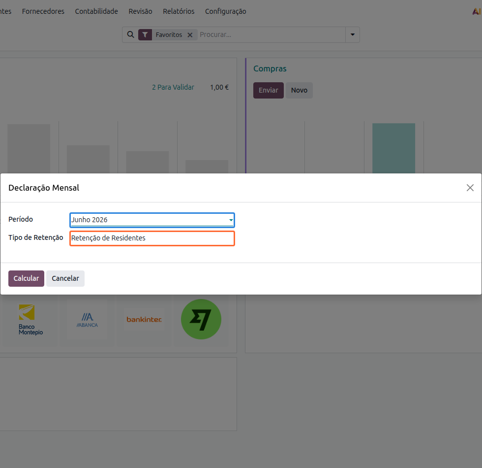
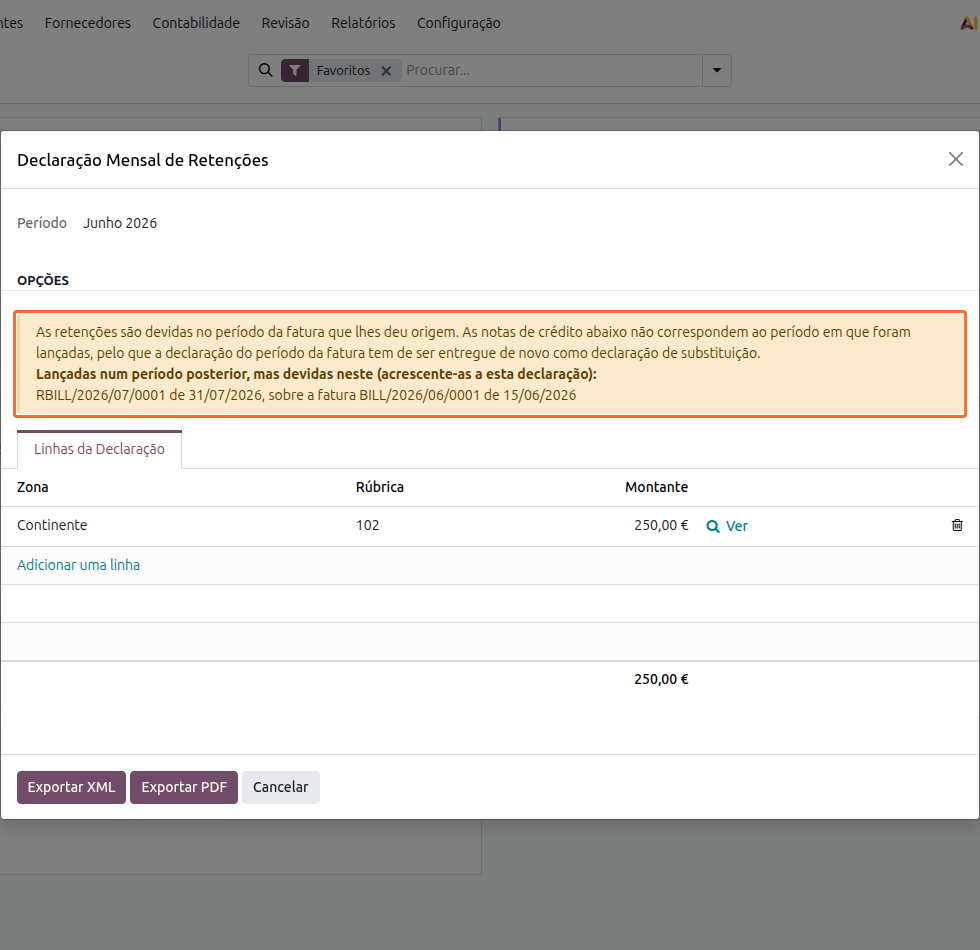
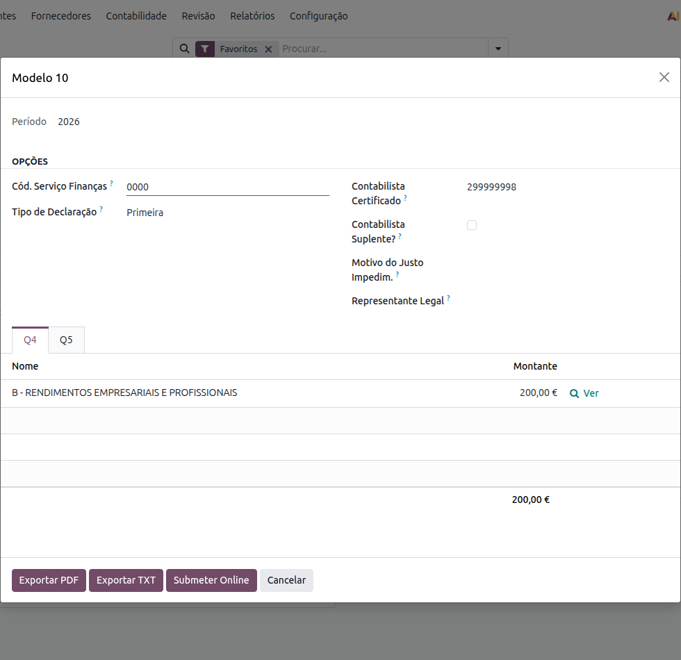

:nosearch:

==================
Retenções na Fonte
==================
As retenções na fonte que efetua aos seus fornecedores e prestadores de serviços têm de ser
entregues à Autoridade Tributária e declaradas em vários momentos do ano. A **Localização PT+**
trata das duas pontas: calcula a retenção, na fatura ou no momento do pagamento, e gera as quatro
declarações a partir dos lançamentos contabilísticos, sem que tenha de recolher valores à mão.

.. raw:: html

    

        ─── ✦ ───
    

.. list-table::
   :header-rows: 1

   * - Declaração
     - Diz respeito a
     - Quando se entrega
   * - Declaração Mensal de Retenções
     - Todas as retenções efetuadas no mês, separadas entre residentes e não residentes
     - Até ao dia 20 do mês seguinte
   * - Modelo 10
     - Rendimentos e retenções de **residentes**
     - Até ao final de janeiro do ano seguinte
   * - Modelo 30
     - Rendimentos pagos a **não residentes**
     - Até ao final do segundo mês seguinte ao pagamento
   * - Declaração de rendimentos ao titular
     - Comprovativo entregue a cada titular dos rendimentos
     - Até ao dia 20 de janeiro do ano seguinte

.. important::
    Estas declarações fazem parte da oferta de **faturação**: não é necessário ter a
    contabilidade PT+ instalada para as emitir.

Todas se encontram em :menuselection:`Faturação / Contabilidade --> Relatórios`, no bloco
**Rendimentos e Retenções**.

Configuração dos impostos de retenção
=====================================
As declarações não inventam informação: cada valor que aparece num quadro é lido dos
**impostos de retenção** usados nos documentos. Se um campo do imposto estiver por preencher, a
declaração ou não consegue classificar o rendimento, ou classifica-o mal.

Abra cada imposto de retenção em :menuselection:`Configuração --> Impostos`, no separador
:guilabel:`Opções Avançadas`, e confirme os campos abaixo.

.. list-table::
   :header-rows: 1

   * - Campo no imposto
     - Onde é usado
   * - :guilabel:`Tipo de Retenção`
     - Distingue IRS, IRC e Imposto do Selo em todas as declarações
   * - :guilabel:`Código da RF`
     - Rubrica da **Declaração Mensal**
   * - :guilabel:`Tipo de Rendimento da RF`
     - **Modelo 10**, Quadro 05, campo 04
   * - :guilabel:`Tipo de Rendimento da RF (OCDE)`
     - **Modelo 30**, Quadro 08, campo 35
   * - :guilabel:`Regime de Tributação da RF`
     - **Modelo 30**, Quadro 08, campo 36

.. warning::
    Sempre que um destes campos estiver em falta, a declaração avisa-o e indica a linha, o
    documento e o imposto em causa, para que possa corrigir a configuração antes de entregar.

O :guilabel:`Regime de Tributação da RF` merece atenção especial nos pagamentos a não
residentes: é ele que distingue uma retenção às taxas internas (código 01) de uma retenção ao
abrigo de uma convenção para evitar a dupla tributação (código 02), entre outros regimes.

.. note::
    Cada parceiro tem de ter o **país** preenchido na ficha. É o país que separa residentes de
    não residentes e, portanto, o que decide se um rendimento entra no Modelo 10 ou no Modelo 30.

Retenção no pagamento
=====================
A **Localização PT+** suporta a retenção na fonte efetuada no momento do **pagamento** do documento,
em alternativa à retenção calculada na própria fatura. Desta forma o valor retido só é contabilizado
e declarado quando é efetivamente retido — no pagamento — tal como previsto no `Art. 98º do CIRS <https://info.portaldasfinancas.gov.pt/pt/informacao_fiscal/codigos_tributarios/cirs_rep/Pages/irs98.aspx>`_
(a obrigação de retenção nasce no momento do pagamento ou colocação à disposição dos rendimentos).

Ativar a retenção no pagamento
------------------------------

Este processo assenta em dois módulos: o módulo nativo do Odoo **Withholding Tax on Payment**
e o módulo dedicado da Localização PT+ **Portugal - Withholding Tax on Payment**, que é
instalado automaticamente assim que o módulo do Odoo é instalado numa base de dados com a
Localização PT+.

Com os módulos instalados, deve ser feita a seguinte configuração manual:

- Definir a conta **242 — Retenção de impostos sobre rendimentos** como conta base de retenção
  da empresa nas definições de contabilidade;
- Criar uma sequência **RF/** por empresa, usada para numerar as retenções efetuadas nos
  pagamentos.

.. note::
    No caso de criação de bases de dados novas, esta configuração (conta e sequência) é automática
    após a instalação dos módulos.

Para que um imposto de retenção (RF) passe a ser retido no pagamento, abra a ficha do imposto em
:menuselection:`Faturação / Contabilidade --> Configuração --> Impostos` e ative a opção
:guilabel:`Reter no Pagamento`. Associe também a sequência de retenção da empresa no campo
:guilabel:`Sequência de Retenção`, para que cada retenção receba um número ``RF/xxxx``.

.. warning::
    **Nunca ative esta opção num imposto que tenha faturas publicadas por liquidar.** Essas faturas
    já contabilizaram a retenção na emissão; ao pagá-las, a retenção seria efetuada (e declarada)
    uma segunda vez. Para adotar a retenção no pagamento crie um **imposto novo** com a opção ativa
    e arquive o imposto antigo — os documentos antigos liquidam no regime antigo, os novos no novo.

    A Localização PT+ inclui uma proteção: ao pagar uma fatura que já reteve na emissão, a retenção
    **não** é proposta novamente no pagamento.

Utilização
----------

Emissão do documento
~~~~~~~~~~~~~~~~~~~~

Adicione o imposto de retenção às linhas da fatura (ou fatura de fornecedor), juntamente com o IVA.
Com a retenção no pagamento, o imposto RF **não afeta o total do documento** — numa fatura de
200,00 € + IVA 23%, o total é 246,00 € e não é deduzida qualquer retenção na emissão:

No PDF do documento, a retenção é apresentada a título **informativo** depois do total, juntamente
com o valor líquido a pagar (*Total a Pagar*), para que o pagador saiba quanto deve reter:

Pagamento com retenção
~~~~~~~~~~~~~~~~~~~~~~

Ao carregar em :guilabel:`Pagar` num documento cujas linhas têm um imposto de retenção no pagamento,
o separador :guilabel:`Retenção` surge preenchido automaticamente: a base, o valor retido, o
número de sequência (``RF/xxxx``) e o valor líquido a pagar (:guilabel:`Valor Líquido`).

.. note::
    O campo :guilabel:`Conta pendente` é obrigatório quando o método de pagamento não tem conta
    de pagamentos pendentes configurada: com retenção, o lançamento contabilístico é criado no
    momento do pagamento e precisa dessa conta de contrapartida (tipicamente a conta de pagamentos
    pendentes). Para evitar preencher este campo em cada pagamento, configure a conta de pagamentos
    pendentes no método de pagamento do diário de banco.

.. tip::
    Também é possível adicionar uma linha de retenção manualmente no separador
    :guilabel:`Retenção`. Nesse caso a **base de incidência** tem de ser preenchida à mão — o
    valor retido é calculado a partir dela.

Nos pagamentos parciais, a retenção é proposta proporcionalmente ao valor pago.

Depois de criado, o pagamento (recibo) guarda as linhas de retenção efetuadas, com o respetivo
número de sequência:

Impacto declarativo
-------------------

Com a retenção no pagamento, o valor retido é contabilizado (conta 242) e declarado **uma única
vez, na data do pagamento**:

.. list-table::
   :header-rows: 1

   * - Declaração / ficheiro
     - Comportamento
   * - SAF-T (PT)
     - O elemento ``WithholdingTax`` é incluído no **recibo** (secção 4.4 — Pagamentos). A fatura
       não menciona a retenção no SAF-T nem no código QR — a menção no PDF é meramente comercial.
   * - Modelo 10 / Modelo 30
     - Os valores retidos são reportados com **data do pagamento** (e não da fatura), através dos
       lançamentos contabilísticos do pagamento.
   * - Declaração Mensal de Retenções
     - O valor retido entra na declaração do **mês do pagamento**, que é o período legalmente
       correto para a entrega da retenção.

.. important::
    O método de retenções na fonte no pagamento, aqui descrito, garante a conformidade com a regras do CIRS. O uso do
    método de retenções na fatura continua a ser possível mas deixa à responsabilidade do cliente a mitigação dos
    potenciais problemas das datas nos relatórios fiscais através de procedimentos de correção

Declaração Mensal de Retenções
==============================
Reúne as retenções a entregar num mês e serve de base à guia de pagamento.

Abra :menuselection:`Relatórios --> Declaração Mensal`, escolha o :guilabel:`Período` e o
:guilabel:`Tipo de Retenção`.

O :guilabel:`Tipo de Retenção` determina o tipo de declaração e permite emitir as duas a partir
da mesma origem:

- **Retenção de Residentes**: parceiros com NIF português
- **Retenção de Não Residentes**: os restantes

Ao carregar em :guilabel:`Calcular`, obtém as linhas agrupadas por zona (Continente, Açores ou
Madeira, conforme a morada do parceiro) e por rubrica. Pode exportar o **PDF** para arquivo e o
**XML** para submissão.

Notas de crédito lançadas noutro período
----------------------------------------
A retenção é devida no período da fatura que lhe deu origem. Quando uma nota de crédito é
lançada num mês diferente do da fatura que corrige, o valor deixa de estar no período certo: a
declaração do mês da fatura ficou por corrigir e a do mês da nota de crédito fica com um valor
que não lhe pertence, podendo até ficar negativa.

A declaração deteta essas situações e avisa-o, indicando cada nota de crédito e a fatura
correspondente, com as respetivas datas.

O aviso aparece nos dois sentidos:

- **Lançadas num período posterior, mas devidas neste**: notas de crédito de meses seguintes que
  pertencem ao período que está a preparar, e que deve acrescentar;
- **Incluídas aqui, mas devidas no período da respetiva fatura**: notas de crédito que a
  declaração apanhou, mas que pertencem a um período anterior, e que deve retirar.

.. important::
    Nestes casos, o período da fatura tem de ser entregue de novo como **declaração de
    substituição**. As linhas da declaração são editáveis, para que possa fazer o acerto antes
    de exportar.

.. seealso::
    Esta situação só se coloca quando a retenção é calculada na **fatura**. Com a
    `Retenção no pagamento`_, o valor só é contabilizado quando é efetivamente retido, e por
    isso entra sempre no período correto.

Modelo 10
=========
Declara os rendimentos sujeitos a IRS pagos a residentes, bem como os rendimentos sujeitos a
retenção de IRC, e as respetivas retenções, com exceção dos que são declarados na declaração
mensal de remunerações.

Abra :menuselection:`Relatórios --> Modelo 10` e escolha o ano. Os valores aparecem organizados
pelos quadros do modelo oficial: o **Q4** com o resumo e o **Q5** com o detalhe por titular.

Além do PDF e do ficheiro para submissão, esta declaração pode ser entregue diretamente a partir
do Odoo (ver `Submissão à AT`_).

Modelo 30
=========
Declara os rendimentos considerados obtidos em território português que foram pagos ou colocados
à disposição de entidades **não residentes**. É uma obrigação declarativa: não gera valor a
pagar, e existe para evitar a dupla tributação.

Abra :menuselection:`Relatórios --> Modelo 30` e escolha o período. O **Q8** contém uma linha
por titular e tipo de rendimento.

.. image:: withholding_tax/v19_wht_stat_mod30_q8.png
   :align: center

Cada linha traz o NIF do beneficiário, o :guilabel:`Código Rend.` (campo 35), a base, o
:guilabel:`Código Imposto` (campo 36), a taxa aplicada e o valor retido. O
:guilabel:`Código Imposto` vem do :guilabel:`Regime de Tributação da RF` do imposto usado em
cada documento, pelo que dois documentos do mesmo titular com regimes diferentes produzem duas
linhas distintas, como no exemplo acima: 15% ao abrigo de uma convenção (02) e 25% às taxas
internas (01).

.. note::
    O campo :guilabel:`Tipo de Declaração` permite indicar se está a entregar a primeira
    declaração do período ou uma declaração de substituição.

Declaração de rendimentos ao titular
====================================
No início de cada ano tem de entregar a cada titular um comprovativo dos rendimentos que lhe
pagou e das retenções que lhe fez. Esta declaração produz esse documento a partir dos mesmos
lançamentos que alimentam o Modelo 10.

Abra :menuselection:`Relatórios --> Declaração Anual` e escolha o ano.

.. image:: withholding_tax/v19_wht_stat_annual.png
   :align: center

Obtém uma linha por titular e categoria de rendimento. A partir daqui pode:

- **imprimir** as declarações, para entrega em papel;
- **enviar por email** a cada titular, usando o endereço da respetiva ficha.

O campo :guilabel:`Seleção de Parceiros` permite restringir o envio, com as opções
:guilabel:`Todos`, :guilabel:`Apenas Indivíduos` e :guilabel:`Nenhum`. Como estas declarações se
destinam a pessoas singulares, o habitual é escolher :guilabel:`Apenas Indivíduos` e afinar
depois a seleção linha a linha, na coluna :guilabel:`Sel.`.

Submissão à AT
==============
O **Modelo 10** e o **Modelo 30** podem ser entregues diretamente do Odoo, através do
webservice das **Obrigações Acessórias** da Autoridade Tributária, sem passar pelo Portal das
Finanças. O Odoo constrói o ficheiro da declaração, envia-o, e guarda a resposta da AT, o
comprovativo e a referência de pagamento.

.. note::
    A **Declaração Mensal** e a **Declaração de rendimentos ao titular** não têm submissão por
    webservice: a primeira é exportada em XML para entrega no Portal das Finanças, a segunda
    destina-se ao titular e não à Autoridade Tributária.

Credenciais
-----------
A entrega é feita com as credenciais do **contabilista certificado** com poderes declarativos
para o contribuinte. São dois conjuntos de credenciais, ambos guardados na ficha do utilizador,
no separador :guilabel:`Portugal` (em :menuselection:`Configurações --> Utilizadores` ou nas
próprias :menuselection:`Preferências`):

.. list-table::
   :header-rows: 1

   * - Campo
     - O que preencher
   * - :guilabel:`Nome de utilizador` e :guilabel:`Senha`
     - Credenciais do **contribuinte** no Portal das Finanças. O nome de utilizador tem o
       formato ``NIF/UserId``
   * - :guilabel:`Contabilista Certificado`
     - Ative na ficha do utilizador que é contabilista certificado e pode entregar declarações
       em nome de contribuintes
   * - :guilabel:`Utilizador TOC` e :guilabel:`Senha TOC`
     - Credenciais do **contabilista certificado** no Portal das Finanças, pedidas apenas
       quando o campo anterior está ativo

.. important::
    Sem o nome de utilizador do contribuinte, ou sem as credenciais do contabilista
    certificado, a submissão para. O Odoo indica qual dos dois falta e onde o preencher.

Campos obrigatórios da declaração
---------------------------------
O ficheiro da declaração leva a identificação de quem a entrega, que preenche nas opções da
declaração antes de calcular:

- :guilabel:`Cód. Serviço Finanças`: o código de quatro dígitos do serviço de finanças, vindo
  da ficha da empresa-mãe (as declarações são entregues pela empresa-mãe, mesmo quando está a
  trabalhar numa sucursal);
- :guilabel:`Contabilista Certificado`: o NIF do contabilista certificado, vindo da ficha da
  empresa;
- :guilabel:`Representante Legal`: o NIF do sujeito passivo ou do seu representante legal.

.. note::
    Estes dois primeiros campos são exigidos para exportar o ficheiro e para submeter, mas não
    para imprimir: o PDF continua disponível como rascunho de trabalho, mesmo com a
    identificação incompleta.

Quando não está a entregar a primeira declaração do período, o :guilabel:`Tipo de Declaração`
passa a :guilabel:`Substituição` e são pedidas a :guilabel:`Data do Facto Orig. Subst.` e, se
for o caso, a indicação :guilabel:`Ao abrigo Art. 119º - 1ºd?`. Se estiver a entregar fora de
prazo com justo impedimento, indique o :guilabel:`Motivo do Justo Impedim.` e as datas de
ocorrência e de cessação do facto, nos termos do art.º 12.º-A do Decreto-Lei n.º 452/99, de 5
de novembro.

Validar, submeter e acompanhar
------------------------------
Depois de calcular a declaração, o botão :guilabel:`Submeter Online` abre o passo
:guilabel:`Submissão Online (AT)`, com as credenciais, as opções e as operações disponíveis.

A opção :guilabel:`Poderes Declarativos Plenos` vem ativa: significa que o contabilista
certificado tem poderes declarativos plenos para o contribuinte, e por isso basta o seu
utilizador para entregar. Se os não tiver, desative-a, escolha o :guilabel:`Utilizador
Contabilista Certificado` e preencha a :guilabel:`Senha do Contribuinte`.

O trabalho faz-se por esta ordem:

#. :guilabel:`Validar online`: a AT verifica a declaração e devolve os erros e alertas que
   encontrar, **sem a entregar**. É o momento de corrigir a configuração ou os valores.
#. :guilabel:`Submeter Online`: entrega oficial da declaração, pedindo confirmação antes de
   enviar. Se a AT devolver apenas alertas não bloqueantes, a submissão só passa com a opção
   :guilabel:`Aceitar Alertas` ativa.
#. Concluída a submissão, o :guilabel:`Id da Declaração na AT` fica preenchido, e com a opção
   :guilabel:`Obter Comprovativo` (ativa por defeito) o comprovativo é descarregado logo a
   seguir.

A partir daí, e sempre a partir desse id, tem disponíveis:

.. list-table::
   :header-rows: 1

   * - Operação
     - O que devolve
   * - :guilabel:`Consultar`
     - As declarações deste modelo já entregues, com o id, a situação e a data de submissão
   * - :guilabel:`Obter comprovativo`
     - O comprovativo da submissão, em PDF
   * - :guilabel:`Obter erros`
     - Os erros que a AT encontrou na validação central da declaração entregue
   * - :guilabel:`Obter referência de pagamento`
     - A referência de pagamento (DUC), em PDF

Os ficheiros ficam no próprio passo, para descarregar: a :guilabel:`Declaração` que foi
enviada, o :guilabel:`Comprovativo da submissão` e a :guilabel:`Referência de pagamento`. O
bloco :guilabel:`Resposta` mostra o que a AT devolveu, incluindo o código, a mensagem e o
detalhe do erro quando a operação não corre bem.

.. tip::
    A consulta não precisa de id: use-a para confirmar, do lado da AT, se a declaração do
    período já foi entregue, antes de submeter outra vez.

Enviar o comprovativo por e-mail
--------------------------------
Obtido o comprovativo ou a referência de pagamento, o bloco :guilabel:`Enviar por e-mail`
permite fazê-los seguir sem sair da declaração: indique os :guilabel:`Destinatários do E-mail`
e carregue em :guilabel:`Enviar e-mail`. Os documentos vão em anexo, com uma mensagem que
identifica a empresa e o período da declaração.

.. note::
    Cada destinatário tem de ter endereço de e-mail na ficha. O Odoo avisa qual deles não tem,
    para que o preencha ou o retire da seleção.
