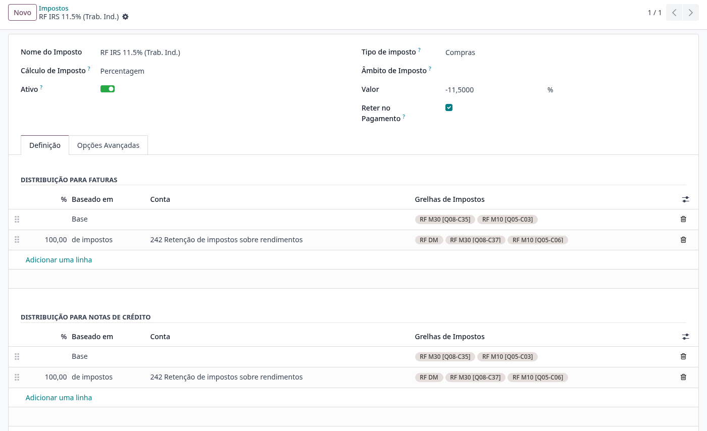
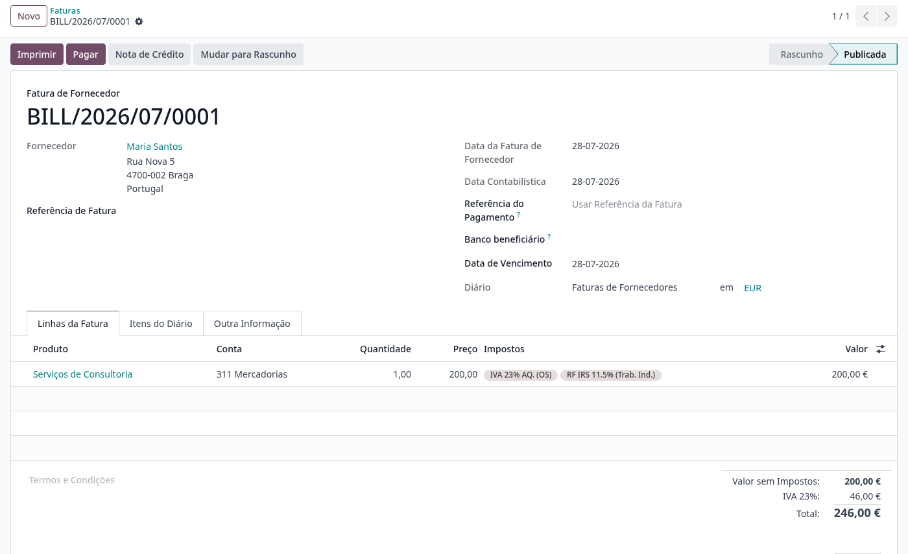
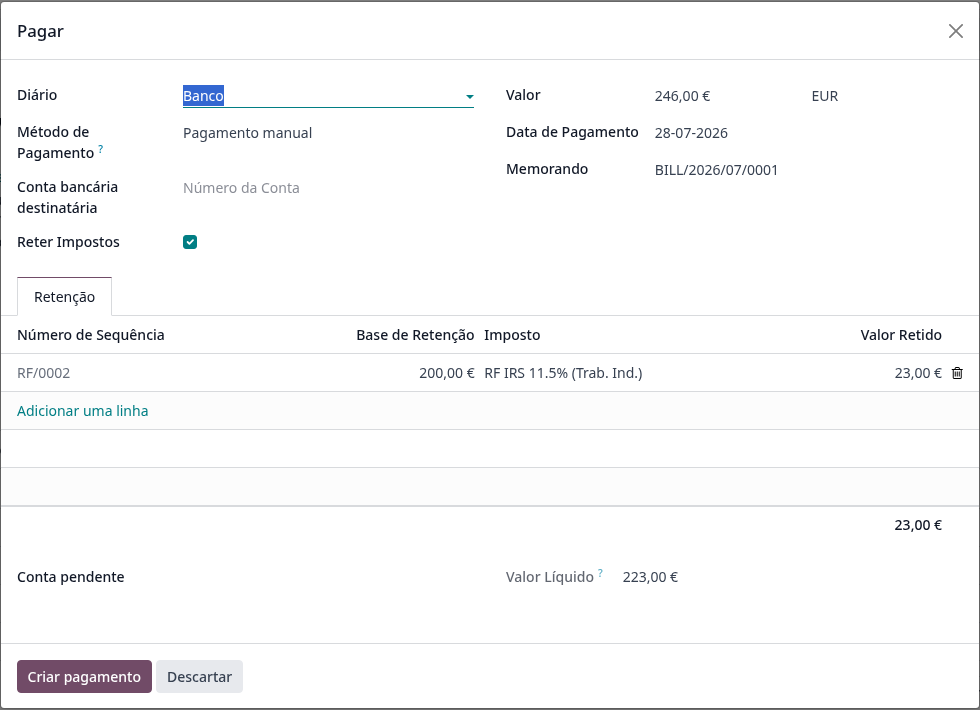
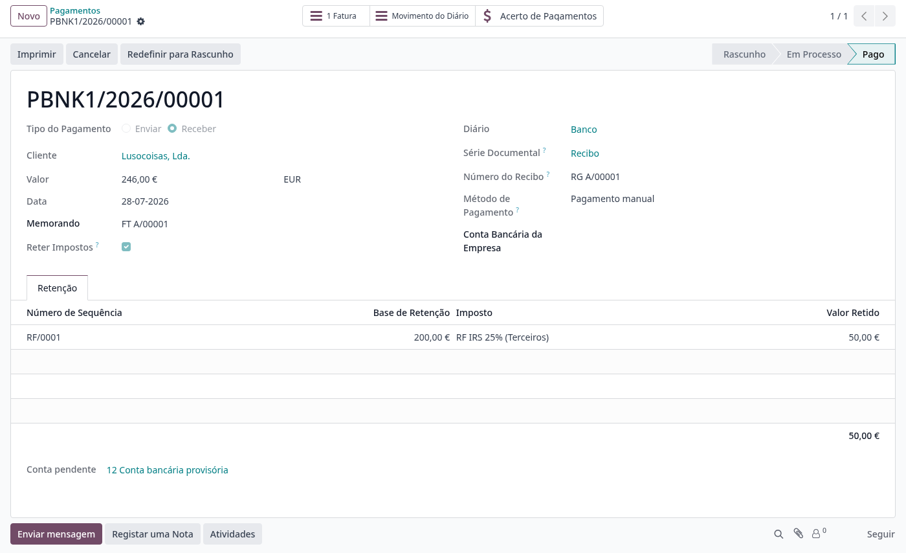

:nosearch:

==================
Retenções na Fonte
==================
A **Localização PT+** suporta a retenção na fonte efetuada no momento do **pagamento** do documento,
em alternativa à retenção calculada na própria fatura. Desta forma o valor retido só é contabilizado
e declarado quando é efetivamente retido — no pagamento — tal como previsto no `Art. 98º do CIRS <https://info.portaldasfinancas.gov.pt/pt/informacao_fiscal/codigos_tributarios/cirs_rep/Pages/irs98.aspx>`_
(a obrigação de retenção nasce no momento do pagamento ou colocação à disposição dos rendimentos).

.. raw:: html

    

        ─── ✦ ───
    

.. important::
    Esta funcionalidade não está disponível na loja Odoo. Para ter acesso à mesma, terá de solicitar
    a sua instalação e ativação à **Exo Software**.

Configuração
============

Este processo assenta em dois módulos: o módulo nativo do Odoo **Withholding Tax on Payment**
e o módulo dedicado da Localização PT+ **Portugal - Withholding Tax on Payment**, que é
instalado automaticamente assim que o módulo do Odoo é instalado numa base de dados com a
Localização PT+.

Com os módulos instalados, deve ser feita a seguinte configuração manual:

- Definir a conta **242 — Retenção de impostos sobre rendimentos** como conta base de retenção
  da empresa nas definições de contabilidade;
- Criar uma sequência **RF/** por empresa, usada para numerar as retenções efetuadas nos
  pagamentos.

.. note::
    No caso de criação de bases de dados novas, esta configuração (conta e sequência) é automática
    após a instalação dos módulos.

Para que um imposto de retenção (RF) passe a ser retido no pagamento, abra a ficha do imposto em
:menuselection:`Faturação / Contabilidade --> Configuração --> Impostos` e ative a opção
:guilabel:`Reter no Pagamento`. Associe também a sequência de retenção da empresa no campo
:guilabel:`Sequência de Retenção`, para que cada retenção receba um número ``RF/xxxx``.

.. warning::
    **Nunca ative esta opção num imposto que tenha faturas publicadas por liquidar.** Essas faturas
    já contabilizaram a retenção na emissão; ao pagá-las, a retenção seria efetuada (e declarada)
    uma segunda vez. Para adotar a retenção no pagamento crie um **imposto novo** com a opção ativa
    e arquive o imposto antigo — os documentos antigos liquidam no regime antigo, os novos no novo.

    A Localização PT+ inclui uma proteção: ao pagar uma fatura que já reteve na emissão, a retenção
    **não** é proposta novamente no pagamento.

Utilização
==========

Emissão do documento
--------------------

Adicione o imposto de retenção às linhas da fatura (ou fatura de fornecedor), juntamente com o IVA.
Com a retenção no pagamento, o imposto RF **não afeta o total do documento** — numa fatura de
200,00 € + IVA 23%, o total é 246,00 € e não é deduzida qualquer retenção na emissão:

No PDF do documento, a retenção é apresentada a título **informativo** depois do total, juntamente
com o valor líquido a pagar (*Total a Pagar*), para que o pagador saiba quanto deve reter:

.. image:: withholding_tax/v18_withholding_invoice_pdf_totals.png
   :align: center

Pagamento com retenção
----------------------

Ao carregar em :guilabel:`Pagar` num documento cujas linhas têm um imposto de retenção no pagamento,
o separador :guilabel:`Retenção` surge preenchido automaticamente: a base, o valor retido, o
número de sequência (``RF/xxxx``) e o valor líquido a pagar (:guilabel:`Valor Líquido`).

.. note::
    O campo :guilabel:`Conta pendente` é obrigatório quando o método de pagamento não tem conta
    de pagamentos pendentes configurada: com retenção, o lançamento contabilístico é criado no
    momento do pagamento e precisa dessa conta de contrapartida (tipicamente a conta de pagamentos
    pendentes). Para evitar preencher este campo em cada pagamento, configure a conta de pagamentos
    pendentes no método de pagamento do diário de banco.

.. tip::
    Também é possível adicionar uma linha de retenção manualmente no separador
    :guilabel:`Retenção`. Nesse caso a **base de incidência** tem de ser preenchida à mão — o
    valor retido é calculado a partir dela.

Nos pagamentos parciais, a retenção é proposta proporcionalmente ao valor pago.

Depois de criado, o pagamento (recibo) guarda as linhas de retenção efetuadas, com o respetivo
número de sequência:

Impacto declarativo
===================

Com a retenção no pagamento, o valor retido é contabilizado (conta 242) e declarado **uma única
vez, na data do pagamento**:

.. list-table::
   :header-rows: 1

   * - Declaração / ficheiro
     - Comportamento
   * - SAF-T (PT)
     - O elemento ``WithholdingTax`` é incluído no **recibo** (secção 4.4 — Pagamentos). A fatura
       não menciona a retenção no SAF-T nem no código QR — a menção no PDF é meramente comercial.
   * - Modelo 10 / Modelo 30
     - Os valores retidos são reportados com **data do pagamento** (e não da fatura), através dos
       lançamentos contabilísticos do pagamento.
   * - Declaração Mensal de Retenções
     - O valor retido entra na declaração do **mês do pagamento**, que é o período legalmente
       correto para a entrega da retenção.

.. note::
    Nos impostos de retenção usados no Modelo 30 (não residentes), preencha o campo
    :guilabel:`Tipo de Rendimento da RF (OCDE)` do imposto; para o Modelo 10 e Declaração Mensal,
    os campos :guilabel:`Código da RF` e :guilabel:`Tipo de Rendimento da RF`. Sem estes campos
    as declarações não conseguem classificar os rendimentos.

.. important::
    O método de retenções na fonte no pagamento, aqui descrito, garante a conformidade com a regras do CIRS. O uso do
    método de retenções na fatura continua a ser possível mas deixa à responsabilidade do cliente a mitigação dos
    potenciais problemas das datas nos relatórios fiscais através de procedimentos de correção
