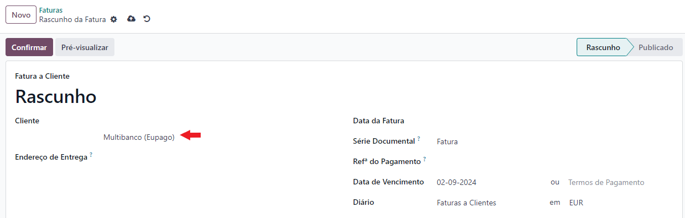
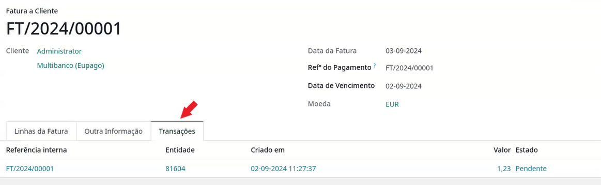
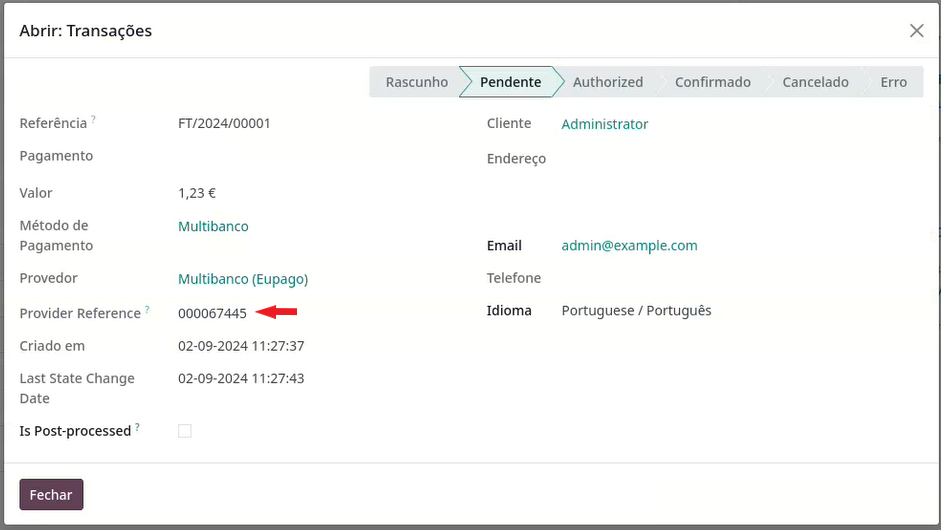

:show-content:

======
eupago
======
Fique a saber como configurar e utilizar a o nosso conector `eupago <https://www.eupago.pt/>`_

.. raw:: html

    

        ─── ✦ ───
    

.. important::
    O conector **eupago** não está disponível na loja Odoo, para ter acesso ao mesmo terá de pedir aos nossos serviços
    que façam a sua instalação e ativação na sua base de dados

    Depois pode começar a seguir os passos que se seguem para proceder à configuração e utilização

Configuração
============
1. Comece por `criar uma conta <https://www.eupago.com/registo>`_ na plataforma **eupago**

2. Faça `login <https://clientes.eupago.pt/backoffice/login.html>`_ no backoffice da **eupago**

3. Recolha as suas credenciais para registo no Odoo

.. note::
    No canto superior direito da página aceda à sua conta

    .. image:: eupago/eupago_myAccount.png
        :align: center

    Em seguida, vá à aba de **Credenciais**, vai precisar tanto do **Cliente ID** como do **Client Secret**

    .. image:: eupago/eupago_credentials.png
        :align: center

    Vai também precisar de um canal de comunicação, por definição todas as contas têm um canal mas pode criar mais
    acedendo ao menu de navegação do lado esquerdo da página :menuselection:`Gestão --> Canais --> Adicionar Canal`

    .. image:: eupago/eupago_newChannel.png
        :align: center

    Esse canal, vai ter a sua chave de comunicação por API com o serviço da **eupago**. Para aceder à listagem vá ao
    menu de navegação do lado esquerdo da página a :menuselection:`Gestão --> Canais --> Listagem de Canais`

    .. image:: eupago/eupago_channels.png
        :align: center

    Revele a sua chave de API para poder copiar

    .. image:: eupago/eupago_APIkey.png
        :align: center

4. Aceda ao Provedor de Pagamento em Odoo

.. note::
    Depois de instalado e ativo o conector eupago, aceda à app **Faturação / Contabilidade** (dependendo respetivamente
    se tem versão Community ou Enterprise do Odoo), vá ao menu de **Configuração** e no separador Pagamentos Online
    selecione a opção **Provedores de Pagamento**.

    .. image:: ../invoicing/fiscal_documents/v17_appInvoicingAccounting.png
        :align: center

    .. image:: eupago/v17_paymentProviders01.png
        :align: center

    .. important::
        Não pode criar novos provedores de pagamentos, no entanto caso precise (por exemplo estando a operar em
        ambiente multi-empresa ou ter multiplos canais para a mesma empresa) pode duplicar um dos existentes e mudar o
        nome e/ou empresa associada

    Vai poder ver 2 novos provedores de pagamento associados ao eupago, pode ativar apenas um deles, ou ambos

    .. image:: eupago/v17_paymentProviders02.png
        :align: center

    Independentemente do método vai poder escolher o **Estado**

    - **Desativado**, não vai estar disponível para utilização
    - **Ativado**, vai estar disponível para utilização
    - **Modo de Teste**, vai apenas usar um backend de testes sem fazer envios para os clientes

    Também pode escolher a que **Empresa** e **Website** está associado

    .. image:: eupago/v17_paymentProviders03.png
        :align: center

    Na aba **Configurações** pode definir qual o diário onde quer que os movimentos fiquem registados e algumas
    modalidades de restrições como:

    - **Valor Máximo** da transação
    - **Moeda** para que está disponível
    - **Países** onde vai estar disponível o método de pagamento

4.1. Configuração MB Way

.. note::
    Na aba **Credenciais** é onde vai poder introduzir a informação que consta do backoffice da eupago

    - ID Cliente
    - Segredo Cliente
    - Chave API

    .. image:: eupago/v17_paymentProviders04.png
        :align: center

    O Callback URL é usado para a eupago comunicar ao Odoo o estado do pagamento, precisa de copiar este valor do seu
    Odoo para o backoffice da eupago.

    Para isso na listagem de canais carregue na opção **Editar** do canal com a mesma **Chave API**, selecione a opção
    **Receber notificações para um URL** e cole no campo **URL** (Consultar lista de tipos de Callback) e carregue em
    **Guardar**

    .. image:: eupago/v17_paymentProviders05.png
        :align: center

    .. image:: eupago/v17_paymentProviders06.png
        :align: center

    .. danger::
        Não altere os valores restantes relativos a variáveis do tipo **GET**, se o fizer a funcionalidade de callback
        deixa de funcionar, e perde o feedback sobre o estado dos pagamentos

    Na aba **Mensagens** pode configurar diversos tipos de informação como:

    - **Mensagem de Ajuda**, que informa o utilizador na utilização da forma de pagamento
    - **Mensagem Pendente**, é a mensagem que o utilizador vai ver quando é gerado o pagamento, note que esta mensagem tem um valor dinâmico que tem de ficar **{time_limit}**, no entanto pode alterar o resto da mensagem
    - **Mensagem de Conclusão**, esta mensagem aparece quando o utilizador concluí o pagamento
    - **Mensagem de Cancelamento**, esta mensagem é exibida se o pagamento for cancelado

    .. image:: eupago/v17_paymentProviders07.png
        :align: center

    .. important::
        O método de MB Way apenas pode ser usado no website para que o cliente possa inserir o nº de telefone associado
        ao pagamento

4.2. Configuração Multibanco

.. note::
    Na aba **Credenciais** é onde vai poder introduzir a informação que consta do backoffice da eupago

    - ID Cliente
    - Segredo Cliente
    - Chave API
    - Validade (Dias), este campo permite escolher quantos dias a referência vai ficar ativa (se o valor for zero, fica ativa indefinidamente)

    .. image:: eupago/v17_paymentProviders08.png
        :align: center

    O Callback URL é usado para a eupago comunicar ao Odoo o estado do pagamento, precisa de copiar este valor do seu
    Odoo para o backoffice da eupago.

    Para isso na listagem de canais carregue na opção **Editar** do canal com a mesma **Chave API**, selecione a opção
    **Receber notificações para um URL** e cole no campo **URL** (Consultar lista de tipos de Callback) e carregue em
    **Guardar**

    .. image:: eupago/v17_paymentProviders05.png
        :align: center

    .. image:: eupago/v17_paymentProviders06.png
        :align: center

    .. danger::
        Não altere os valores restantes relativos a variáveis do tipo **GET**, se o fizer a funcionalidade de callback
        deixa de funcionar, e perde o feedback sobre o estado dos pagamentos

    Na aba **Mensagens** pode configurar diversos tipos de informação como:

    - **Mensagem de Ajuda**, que informa o utilizador na utilização da forma de pagamento
    - **Mensagem Pendente**, é a mensagem que o utilizador vai ver quando é gerado o pagamento, note que esta mensagem tem três valores dinâmicos que têm de ficar **{entity}**, **{reference}**, **{amount}**, no entanto pode alterar o resto da mensagem
    - **Mensagem de Conclusão**, esta mensagem aparece quando o utilizador conclui o pagamento
    - **Mensagem de Cancelamento**, esta mensagem é exibida se o pagamento for cancelado

    .. image:: eupago/v17_paymentProviders09.png
        :align: center

.. important::
    Na app **Configurações** do Odoo, no separador **Faturação / Contabilidade** (dependendo respetivamente se tem
    versão Community ou Enterprise do Odoo), tem uma nova opção com valor multi-empresa na secção **Pagamentos de Clientes**,
    onde pode definir qual é o Provedor de Pagamento MB padrão.

    .. image:: ../../administration/install/initial_configuration/v17_appSettings.png
        :align: center

    .. image:: eupago/v17_defaultMBprovider.png
        :align: center

    Além de poder escolher o provedor padrão, também pode escolher qual o seu comportamento padrão:

    - **All Customers**, ao criar uma fatura, o campo respetivo vai ser pré-preenchido e ao confirmar a fatura, vai ser gerada de imediato uma referência para pagamento

        - No caso de o cliente ser uma exceção, não vai pré-preencher o campo na fatura nem gerar a referência ao confirmar a mesma
    - **No Customers**, ao criar uma fatura, o campo respetivo não é pre-preenchido e ao confirmar a fatura, não vai acontecer nada a não ser que o cliente seja uma exceção

        - No caso de o cliente ser uma exceção, vai usar o provedor padrão para pré-preencher o campo na fatura e gerar uma referência ao confirmar a mesma

Utilização
==========
.. tip::
    Decida qual é o comportamento mais benéfico para si em termos de casos gerais e exceções

.. tip::
    Pode tratar as exceções mencionadas no final das configurações na aba **Faturação / Contabilidade** do **Contacto**

    .. image:: eupago/v17_paymentProviders10.png
        :align: center

Sempre que faça uma fatura a regra que se aplica vai preencher ou não o campo respetivo, no entanto pode documento a
documento mudar o valor lá inserido

Independentemente do método escolhido, pode sempre emitir uma referência de pagamento manual no menu **Ação** do
documento.

Se optar pela opção de **Gerar Link para Pagamento** vai poder enviar o link, para o cliente escolher a modalidade que
prefere

Se optar pela opção de **Gear Referências Multibanco** vai poder escolher quantos dias essa referência vai ficar ativa.
No entanto deve ter em conta que vai ser utilizado o provedor escolhido na fatura.

.. image:: eupago/v17_paymentProviders12.png
    :align: center

Depois de emitida uma referência para pagamento, pode consultar o estado de cada transação na aba **Transações**

Se carregar numa das transações, vai poder ver um resumo da mesma nomeadamente a referência

Depois de o cliente efetuar o pagamento e este for validado pelo **eupago** e comunicado por Callback de novo ao Odoo,
vai acontecer uma das seguintes situações:

- Se apenas tiver a app de **Faturação** instalada, a fatura passa logo ao estado de **Pago** como se o recibo tivesse sido emitido
- Se tiver instalada a app de **Contabilidade**, a fatura passa ao estado de **Em pagamento** como se o recibo tivesse sido emitido, no entanto, com a app de **Contabilidade** ainda falta fazer a `reconciliação bancária <https://www.odoo.com/documentation/17.0/pt_BR/applications/finance/accounting/bank/reconciliation.html>`_

Esta alteração acontece pela forma como ambas as apps lidam com a reconciliação de documentos

.. seealso::
    :ref:`Entenda o significado do estados dos documentos em Odoo <odoo_process_documents_states>`

..
    Sincronização manual

    .. TODO : Ver com o João sincronização manual
