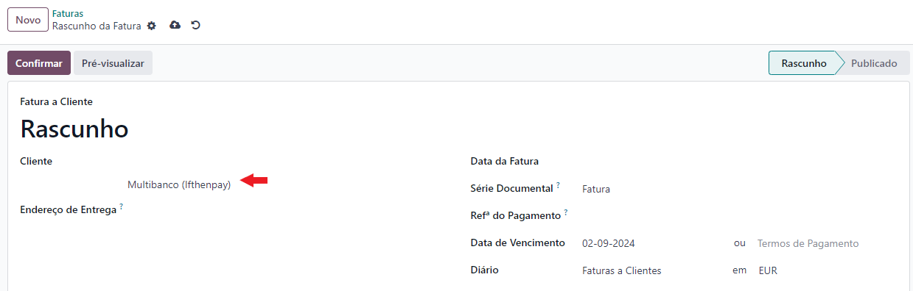
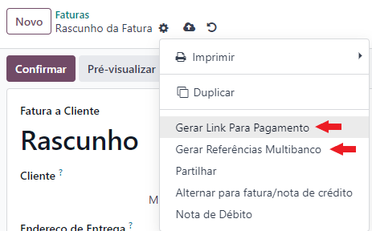
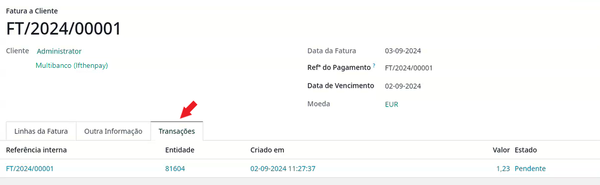
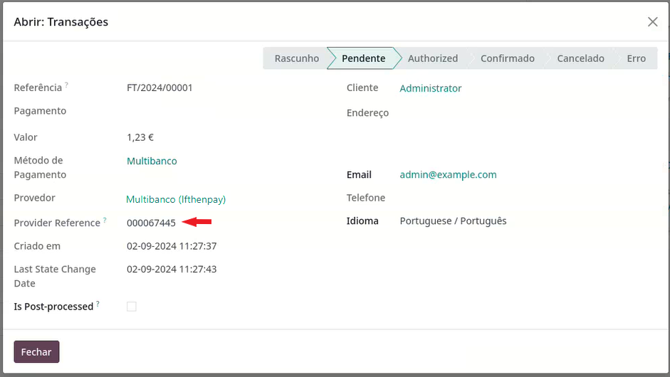

:show-content:

=====================
ifthenpay
=====================
Fique a saber como configurar e utilizar a o nosso conector `ifthenpay <https://ifthenpay.com/?lang=pt>`_

.. raw:: html

    

        ─── ✦ ───
    

.. important::
    O conector **ifthenpay** não está disponível na loja Odoo, para ter acesso ao mesmo terá de pedir aos nossos
    serviços que façam a sua instalação e ativação na sua base de dados

    Depois pode começar a seguir os passos que se seguem para proceder à configuração e utilização

Configuração
============
1. Comece por `criar uma conta <https://www.ifthenpay.com/aderir/?lang=pt>`_ na plataforma **ifthenpay**

2. Se não foi criado um utilizador de backoffice na adesão, pode criar um `aqui <https://backoffice.ifthenpay.com/Account/Register?l=pt-PT>`_

3. Faça `login <https://backoffice.ifthenpay.com/Account/Login?l=pt-PT>`_ no backoffice do **ifthenpay**

4. Recolha as suas credenciais para registo no Odoo

.. note::
    Na comunicação que recebeu da **ifthenpay** aquando da criação da conta, deve ter recebido um ficheiro .pdf que
    continha informação dos campos **Entidade**, **Subentidade** e **Chave de Backoffice**

    Caso já não tenha acesso a esse documento, no menu de navegação do lado esquerdo da página aceda a :menuselection:`Administração --> Contrato`

    .. image:: ifthenpay/ifthenpay_credentials1.png
        :align: center

    No topo da página, selecione a conta de **Multibanco**, no campo **Conta** os dígitos associados costumam seguir o
    padrão **Entidade | Subentidade**

    .. image:: ifthenpay/ifthenpay_credentials2.png
        :align: center

    .. image:: ifthenpay/ifthenpay_credentials3.png
        :align: center

    Para reaver a sua **Chave de Backoffice** terá de enviar um email para o `email de suporte do ifthenpay <mailto:suporte@ifthenpay.com>`_
    com o NIF da empresa à qual pertence a conta.

5. Aceda ao Provedor de Pagamento em Odoo

.. note::
    Depois de instalado e ativo o conector ifthenpay, aceda à app **Faturação / Contabilidade** (dependendo
    respetivamente se tem versão Community ou Enterprise do Odoo), vá ao menu de **Configuração** e no separador
    Pagamentos Online selecione a opção **Provedores de Pagamento**.

    .. image:: ../invoicing/fiscal_documents/v17_appInvoicingAccounting.png
        :align: center

    .. image:: eupago/v17_paymentProviders01.png
        :align: center

    .. important::
        Não pode criar novos provedores de pagamentos, no entanto caso precise (por exemplo estando a operar em
        ambiente multi-empresa ou ter multiplas contas para a mesma empresa) pode duplicar um dos existentes e mudar o
        nome e/ou empresa associada

    Vai poder ver 2 novos provedores de pagamento associados ao ifthenpay, pode ativar apenas um deles, ou ambos

    .. image:: ifthenpay/v17_paymentProviders01.png
        :align: center

    Independentemente do método vai poder escolher o **Estado**

    - **Desativado**, não vai estar disponível para utilização
    - **Ativado**, vai estar disponível para utilização

    .. danger::
        Não utilize o **Modo de Teste**, devido a limitações do sistema ifthenpay, o modo de teste funciona como se o
        conector estivesse ativo.

        Faz comunicação de mensasgens e permite que sejam recebidos valores com as referências criadas

    Também pode escolher a que **Empresa** e **Website** está associado

    .. image:: eupago/v17_paymentProviders03.png
        :align: center

    Na aba **Configuração** pode definir qual o diário onde quer que os movimentos fiquem registados e algumas
    modalidades de restrições como:

    - **Valor Máximo** da transação
    - **Moeda** para que está disponível
    - **Países** onde vai estar disponível o método de pagamento

5.1. Configuração MB Way

.. note::
    Além dos dados anteriores ainda vai preciar de mais dados do backoffice do ifthenpay, volte à página com a
    informação do contrato e selecione a conta MB Way

    .. image:: ifthenpay/ifthenpay_credentials2.png
        :align: center

    No campo **Conta** os dígitos associados costumam seguir o padrão **MBWAY | Chave MBWAY**, só precisa da Chave MBWAY

    .. image:: ifthenpay/ifthenpay_credentials4.png
        :align: center

    Na aba **Credenciais** é onde vai poder introduzir a informação que consta do backoffice do ifthenpay

    - Entidade MB
    - Subentidade MB
    - Chave de Backoffice
    - Chave MBWAY

    .. image:: ifthenpay/v17_paymentProviders02.png
        :align: center

    Deve ainda preencher o campo **Descrição MBWAY**, com o nome curto da sua empresa para que os seus clientes o
    consigam identificar na plataforma quando for pedido o pagamento.

    Em seguida deve gerar uma **Chave Anti-phishing** para isso vai ter de escrever uma chave à sua escolha no campo
    reservado para o efeito e depois carregar no botão próprio para a converter

    .. image:: ifthenpay/v17_paymentProviders03.png
        :align: center

    Insira o valor no respetivo campo dentro do backoffice do ifthenpay

    .. image:: ifthenpay/antiPhishing1.png
        :align: center

    O Callback URL é usado para o ifthenpay comunicar ao Odoo o estado do pagamento, precisa de copiar este valor do seu
    Odoo para o backoffice do ifthenpay e carregar em **ATIVAR**.

    .. image:: ifthenpay/callbackURL1.png
        :align: center

    .. image:: ifthenpay/callbackURL2.png
        :align: center

    Quando solicitado, volte a inserir a **Chave de Backoffice** e depois **Confirmar**

    .. image:: ifthenpay/callbackURL3.png
        :align: center

    Na aba **Mensagens** pode configurar diversos tipos de informação como:

    - **Mensagem de Ajuda**, que informa o utilizador na utilização da forma de pagamento
    - **Mensagem Pendente**, é a mensagem que o utilizador vai ver quando é gerado o pagamento, note que esta mensagem tem um valor dinâmico que tem de ficar **{time_limit}**, no entanto pode alterar o resto da mensagem
    - **Mensagem de Conclusão**, esta mensagem aparece quando o utilizador concluí o pagamento
    - **Mensagem de Cancelamento**, esta mensagem é exibida se o pagamento for cancelado

    .. image:: eupago/v17_paymentProviders07.png
        :align: center

    .. important::
        O método de MB Way apenas pode ser usado no website para que o cliente possa inserir o nº de telefone associado
        ao pagamento

5.2. Configuração Multibanco

.. note::
    Na aba **Credenciais** é onde vai poder introduzir a informação que consta do backoffice do ifthenpay

    - Entidade MB
    - Subentidade MB
    - Chave de Backoffice

    .. image:: ifthenpay/v17_paymentProviders04.png
        :align: center

    Em seguida deve gerar uma **Chave Anti-phishing** para isso vai ter de escrever uma chave à sua escolha no campo
    reservado para o efeito e depois carregar no botão próprio para a converter

    .. image:: ifthenpay/v17_paymentProviders03.png
        :align: center

    Insira o valor no respetivo campo dentro do backoffice do ifthenpay

    .. image:: ifthenpay/antiPhishing2.png
        :align: center

    O Callback URL é usado para o ifthenpay comunicar ao Odoo o estado do pagamento, precisa de copiar este valor do seu
    Odoo para o backoffice do ifthenpay e carregar em **ATIVAR**.

    .. image:: ifthenpay/callbackURL4.png
        :align: center

    .. image:: ifthenpay/callbackURL5.png
        :align: center

    Quando solicitado, volte a inserir a **Chave de Backoffice** e depois **Confirmar**

    .. image:: ifthenpay/callbackURL6.png
        :align: center

    Na aba **Mensagens** pode configurar diversos tipos de informação como:

    - **Mensagem de Ajuda**, que informa o utilizador na utilização da forma de pagamento
    - **Mensagem Pendente**, é a mensagem que o utilizador vai ver quando é gerado o pagamento, note que esta mensagem tem três valores dinâmicos que têm de ficar **{entity}**, **{reference}**, **{amount}**, no entanto pode alterar o resto da mensagem
    - **Mensagem de Conclusão**, esta mensagem aparece quando o utilizador conclui o pagamento
    - **Mensagem de Cancelamento**, esta mensagem é exibida se o pagamento for cancelado

    .. image:: eupago/v17_paymentProviders09.png
        :align: center

.. important::
    Na app **Configurações** do Odoo, no separador **Faturação / Contabilidade** (dependendo respetivamente se tem
    versão Community ou Enterprise do Odoo), tem uma nova opção com valor multi-empresa na secção **Pagamentos de Clientes**,
    onde pode definir qual é o Provedor de Pagamento MB padrão.

    .. image:: ../../administration/install/initial_configuration/v17_appSettings.png
        :align: center

    .. image:: ifthenpay/v17_defaultMBprovider.png
        :align: center

    Além de poder escolher o provedor padrão, também pode escolher qual o seu comportamento padrão:

    - **All Customers**, ao criar uma fatura, o campo respetivo vai ser pré-preenchido e ao confirmar a fatura, vai ser gerada de imediato uma referência para pagamento

        - No caso de o cliente ser uma exceção, não vai pré-preencher o campo na fatura nem gerar a referência ao confirmar a mesma
    - **No Customers**, ao criar uma fatura, o campo respetivo não é pre-preenchido e ao confirmar a fatura, não vai acontecer nada a não ser que o cliente seja uma exceção

        - No caso de o cliente ser uma exceção, vai usar o provedor padrão para pré-preencher o campo na fatura e gerar uma referência ao confirmar a mesma

Utilização
==========
.. tip::
    Decida qual é o comportamento mais benéfico para si em termos de casos gerais e exceções

.. tip::
    Pode tratar as exceções mencionadas no final das configurações na aba **Faturação / Contabilidade** do **Contacto**

    .. image:: eupago/v17_paymentProviders10.png
        :align: center

Sempre que faça uma fatura a regra que se aplica vai preencher ou não o campo respetivo, no entanto pode documento a
documento mudar o valor lá inserido

Independentemente do método escolhido, pode sempre emitir uma referência de pagamento manual no menu **Ação** do
documento.

Se optar pela opção de **Gerar Link para Pagamento** vai poder enviar o link, para o cliente escolher a modalidade que
prefere

Se optar pela opção de **Gear Referências Multibanco** vai poder escolher quantos dias essa referência vai ficar ativa.
No entanto deve ter em conta que vai ser utilizado o provedor escolhido na fatura.

Depois de emitida uma referência para pagamento, pode consultar o estado de cada transação na aba **Transações**

Se carregar numa das transações, vai poder ver um resumo da mesma nomeadamente a referência

Depois de o cliente efetuar o pagamento e este for validado pelo **ifthenpay** e comunicado por Callback de novo ao Odoo,
vai acontecer uma das seguintes situações:

- Se apenas tiver a app de **Faturação** instalada, a fatura passa logo ao estado de **Pago** como se o recibo tivesse sido emitido
- Se tiver instalada a app de **Contabilidade**, a fatura passa ao estado de **Em pagamento** como se o recibo tivesse sido emitido, no entanto, com a app de **Contabilidade** ainda falta fazer a `reconciliação bancária <https://www.odoo.com/documentation/17.0/pt_BR/applications/finance/accounting/bank/reconciliation.html>`_

Esta alteração acontece pela forma como ambas as apps lidam com a reconciliação de documentos

.. seealso::
    :ref:`Entenda o significado do estados dos documentos em Odoo <odoo_process_documents_states>`

..
    Sincronização manual

    .. TODO : Ver com o João sincronização manual
