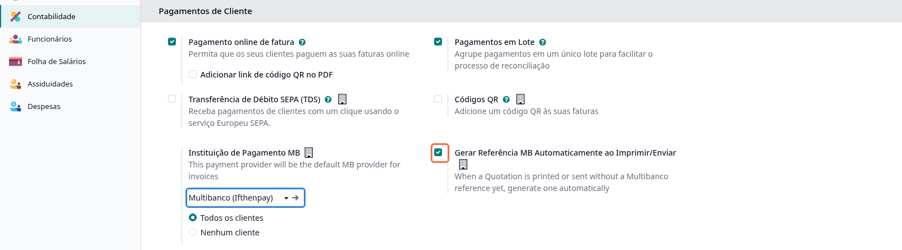
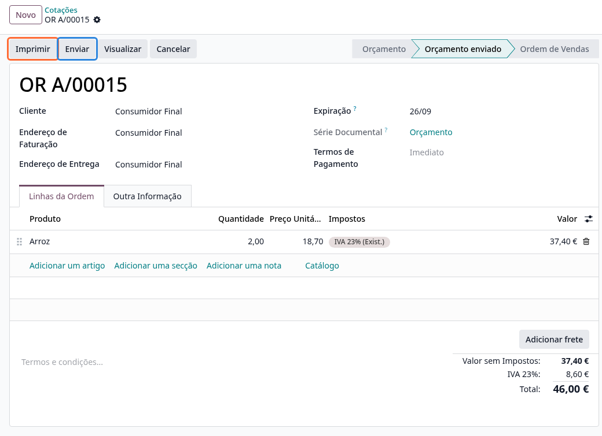
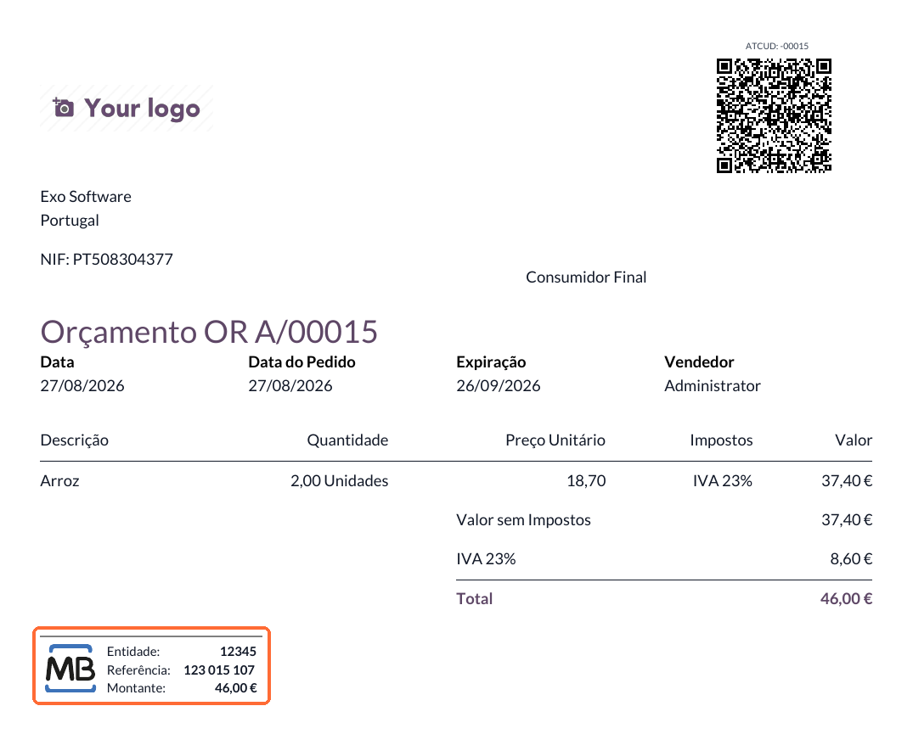

:show-content:

====================================
Referências Multibanco em Orçamentos
====================================
Saiba como fazer com que os seus orçamentos sejam impressos e enviados já com uma referência
Multibanco, sem ter de a gerar documento a documento

.. raw:: html

    

        ─── ✦ ───
    

.. important::
    Esta funcionalidade faz parte dos conectores de Multibanco da **Exo Software**, que não estão
    disponíveis na loja Odoo. Para ter acesso à mesma terá de pedir aos nossos serviços que façam
    a sua instalação e ativação na sua base de dados

    Funciona com qualquer um dos provedores suportados, :doc:`eupago <eupago>` ou
    :doc:`ifthenpay <ifthenpay>`

Por norma, a referência Multibanco de um orçamento só passa a existir depois de alguém a pedir,
seja pelo menu **Ação** do documento, seja porque o cliente escolheu Multibanco ao pagar no
website. Até lá, o orçamento que envia ao cliente sai sem qualquer informação de pagamento, e o
cliente tem de pedir os dados por outra via

Com esta opção ativa, o Odoo trata disso sozinho, no momento em que o orçamento é impresso ou
enviado

Configuração
============

1. Configure o seu provedor de Multibanco

.. note::
    Se ainda não o fez, siga primeiro os passos de configuração do provedor que utiliza,
    :doc:`eupago <eupago>` ou :doc:`ifthenpay <ifthenpay>`

    O provedor tem de ficar no estado **Ativado** ou **Modo de Teste**

2. Aceda à app **Definições**, ao separador **Faturação / Contabilidade** (dependendo
   respetivamente se tem versão Community ou Enterprise do Odoo) e localize a secção
   **Pagamentos de Cliente**

3. Confirme a **Instituição de Pagamento MB** que quer usar por omissão

4. Ative a opção **Gerar Referência MB Automaticamente ao Imprimir/Enviar**

.. important::
    A opção tem valor por empresa. Num ambiente multi-empresa terá de a ativar em cada uma das
    empresas onde a quiser usar, e cada uma tem a sua própria instituição por omissão

.. warning::
    A opção depende da **Instituição de Pagamento MB** definida logo ao lado. Se a ativar sem ter
    uma instituição escolhida, ou se a instituição escolhida estiver **Desativada**, a impressão
    do orçamento é interrompida com uma mensagem a dizer que não é possível gerar referências
    Multibanco

    Confirme sempre os dois campos em conjunto

Utilização
==========

Depois de configurada, a geração é automática e não tem passos adicionais: sempre que **Imprimir**
ou **Enviar** um orçamento que ainda não tenha referência, o Odoo cria uma antes de produzir o PDF

O documento sai com o bloco de pagamento Multibanco, com a **Entidade**, a **Referência** e o
**Montante** correspondente ao total do orçamento

.. note::
    O bloco só sai em orçamentos que já estejam no estado **Orçamento enviado**. Um orçamento
    ainda em **Orçamento** (rascunho) é impresso sem informação de pagamento, mesmo com a opção
    ativa

    Se imprimir um orçamento e o bloco não aparecer, confirme primeiro o estado do documento

.. tip::
    A referência gerada é uma transação como qualquer outra e pode ser consultada na aba
    **Transações** do orçamento, onde acompanha o respetivo estado

Se o orçamento já tiver uma referência Multibanco associada, o Odoo reutiliza-a em vez de criar
uma nova. Assim, reimprimir ou reenviar o mesmo orçamento mostra sempre a mesma referência ao
cliente, e o valor a receber não se dispersa por várias referências em aberto

.. seealso::
    :doc:`eupago <eupago>`

    :doc:`ifthenpay <ifthenpay>`
